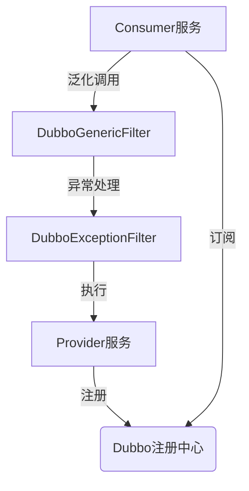

<!-- p -->
gruul-common-addon-model

插件模型定义模块

- 支持 Dubbo 和 HTTP 两种通讯方式
- 提供插件生命周期管理（安装、卸载、初始化、销毁）
- 支持异步执行和条件过滤
- 灵活的插件注册机制

<!-- c -->
AddonDefinition 插件定义类

- **完整类名**: com.medusa.gruul.common.addon.model.bean.AddonDefinition
- **文件路径**: model\bean\AddonDefinition.java
- **作者**: 张治保
- **日期**: 2022/9/14

**主要属性**:

- `async`: 是否是异步
- `funcType`: 通讯类型
- `beanName`: bean 名称
- `interfaceName`: dubbo接口全类名
- `methodName`: 方法名
- `parameterTypes`: 参数类型
- `filter`: 条件满足时才会调用插件
- `order`: 执行顺序

**完整代码**:

```java
package com.medusa.gruul.common.addon.model.bean;

import com.medusa.gruul.common.addon.model.enums.AddonFuncType;
import lombok.Getter;
import lombok.Setter;
import lombok.ToString;
import lombok.experimental.Accessors;

import java.io.Serializable;

/**
 * @author 张治保
 * date 2022/9/14
 */
@Getter
@Setter
@ToString
@Accessors(chain = true)
public class AddonDefinition implements Serializable {


    /**
     * 是否是异步
     **/
    private boolean async;

    /**
     * 通讯类型
     */
    private AddonFuncType funcType;

    /**
     * bean 名称
     */
    private String beanName;

    /**
     * dubbo接口全类名
     */
    private String interfaceName;

    /**
     * 方法名
     */
    private String methodName;

    /**
     * 参数类型
     */
    private String[] parameterTypes;

    /**
     * 条件满足时才会调用插件
     */
    private String filter;

    /**
     * 执行顺序
     */
    private int order;
}
```

<!-- c -->
AddonConst 插件常量类

- **完整类名**: com.medusa.gruul.common.addon.model.constant.AddonConst
- **文件路径**: model\constant\AddonConst.java
- **作者**: 张治保
- **日期**: 2022/2/21

**主要常量**:

- `ADDON_LOG_TEMPLATE`: 插件日志模板
- `ADDON_PROVIDER_REGISTER`: 插件provider 注册次数前缀 后面会拼上服务名
- `REDIS_ADDON_SUPPORTER`: 插件支持器前缀
- `REDIS_ADDON_PROVIDER`: 插件 提供器前缀
- `REDIS_ADDON_VIEW`: 插件 试图前缀

**完整代码**:

```java
package com.medusa.gruul.common.addon.model.constant;

/**
 * @author 张治保
 * date 2022/2/21
 */
public interface AddonConst {

    /**
     * 插件日志模板
     */
    String ADDON_LOG_TEMPLATE = "<<{}>>> ：「「{}」」";

    /**
     * 插件provider 注册次数前缀 后面会拼上服务名
     */
    String ADDON_PROVIDER_REGISTER = "addon:register:provider";

    /**
     * 插件支持器前缀
     */
    String REDIS_ADDON_SUPPORTER = "addon:supporter";

    /**
     * 插件 提供器前缀
     */
    String REDIS_ADDON_PROVIDER = "addon:provider";

    /**
     * 插件 试图前缀
     */
    String REDIS_ADDON_VIEW = "addon:view";
}
```

<!-- c -->
AddonFuncType 插件通讯类型枚举

- **完整类名**: com.medusa.gruul.common.addon.model.enums.AddonFuncType
- **文件路径**: model\enums\AddonFuncType.java
- **作者**: 张治保
- **日期**: 2022/9/14

**枚举值**:

- `DUBBO`: dubbo通讯方式
- `HTTP`: http通讯方式

**完整代码**:

```java
package com.medusa.gruul.common.addon.model.enums;

/**
 * 插件通讯类型
 *
 * @author 张治保
 * date 2022/9/14
 */
public enum AddonFuncType {
    /**
     * dubbo
     */
    DUBBO,
    /**
     * http
     */
    HTTP
}
```

<!-- c -->
AddonHook 插件生命周期接口

- **完整类名**: com.medusa.gruul.common.addon.model.handler.AddonHook
- **文件路径**: model\handler\AddonHook.java
- **作者**: 张治保
- **日期**: 2022/3/2

**主要方法**:

- `install()`: 插件安装
- `uninstall()`: 插件卸载
- `afterPropertiesSet()`: 初始化
- `destroy()`: 容器销毁

**完整代码**:

```java
package com.medusa.gruul.common.addon.model.handler;


import org.springframework.beans.factory.DisposableBean;
import org.springframework.beans.factory.InitializingBean;

/**
 * 视图处理器抽象
 * 插件声明周期
 *
 * @author 张治保
 * date 2022/3/2
 */
public interface AddonHook extends InitializingBean, DisposableBean {
    /**
     * 插件安装
     */
    void install();

    /**
     * 插件卸载
     */
    void uninstall();


    /**
     * 初始化
     */
    @Override
    default void afterPropertiesSet() {
        this.install();
    }

    /**
     * 容器销毁
     */
    @Override
    default void destroy() {
        this.uninstall();
    }
}
```

<!-- p -->
gruul-common-addon-provider

- 插件提供者
- 相当于dubbo的provider

<!-- c -->
AddonProvider 插件提供者注解

- **完整类名**: com.medusa.gruul.common.addon.provider.AddonProvider
- **文件路径**: addon\provider\AddonProvider.java
- **作者**: 张治保
- **日期**: 2022/2/21

**主要属性**:

- `service()`: 服务名
- `supporterId()`: 插件支持器id
- `methodName()`: 方法名
- `order()`: 插件执行顺序
- `async()`: 是否是异步调用
- `interfaceName()`: 接口类全名
- `interfaceClass()`: 接口类class
- `filter()`: 条件字段路径

**完整代码**:

```java
package com.medusa.gruul.common.addon.provider;


import java.lang.annotation.*;

/**
 * 插件对外提供的远程调用接口
 * 服务名 驱动id 方法名 拼接成 redis key （service:driverId:methodName）
 *
 * @author 张治保
 * date 2022/2/21
 */
@Target({ElementType.METHOD})
@Retention(RetentionPolicy.RUNTIME)
@Documented
@Inherited
public @interface AddonProvider {
    /**
     * 服务名
     */
    String service();

    /**
     * 插件支持器id
     */
    String supporterId();

    /**
     * 方法名
     */
    String methodName();

    /**
     * 插件执行顺序
     */
    int order() default 0;

    /**
     * 是否是异步调用
     */
    boolean async() default false;

    /**
     * 接口类全名
     */
    String interfaceName() default "";

    /**
     * 接口类class
     */
    Class<?> interfaceClass() default Exception.class;


    /**
     * 条件字段路径 满足条件：当该路径的值不为空时 才会调用插件
     */
    String filter() default "";
}
```

<!-- c -->
AddonProviderI18NLoader 国际化加载器

- **完整类名**: com.medusa.gruul.common.addon.provider.AddonProviderI18NLoader
- **文件路径**: addon\provider\AddonProviderI18NLoader.java
- **作者**: 张治保
- **日期**: 2023/6/16

**完整代码**:

```java
package com.medusa.gruul.common.addon.provider;

import com.medusa.gruul.global.i18n.I18NPropertiesLoader;
import org.springframework.lang.NonNull;

import java.util.Set;

/**
 * @author 张治保
 * date 2023/6/16
 */
public class AddonProviderI18NLoader implements I18NPropertiesLoader {
    @Override
    @NonNull
    public Set<String> paths() {
        return Set.of("i18n/addonProvider");
    }
}
```

<!-- c -->
AddonProviders 插件Bean注解

- **完整类名**: com.medusa.gruul.common.addon.provider.AddonProviders
- **文件路径**: addon\provider\AddonProviders.java
- **作者**: 张治保
- **日期**: 2022/2/21

**完整代码**:

```java
package com.medusa.gruul.common.addon.provider;


import org.springframework.stereotype.Component;

import java.lang.annotation.*;

/**
 * 声明为插件Bean 扫描所有使用注解 @AddonProvider 的方法
 *
 * @author 张治保
 * date 2022/2/21
 */
@Target({ElementType.TYPE})
@Retention(RetentionPolicy.RUNTIME)
@Documented
@Component
@Inherited
public @interface AddonProviders {
}
```

<!-- c -->
AddonSupportHook 插件支持钩子

- **完整类名**: com.medusa.gruul.common.addon.provider.AddonSupportHook
- **文件路径**: addon\provider\AddonSupportHook.java
- **作者**: 张治保
- **日期**: 2022/9/14

**主要方法**:

- `supportKeyGenerator()`: 分布式环境下的键生成器
- `supportKeyGeneratorSingle()`: 单体环境下的键生成器
- `addonHook()`: 插件钩子函数

**完整代码**:

```java
package com.medusa.gruul.common.addon.provider;

import cn.hutool.core.collection.CollUtil;
import cn.hutool.core.util.StrUtil;
import com.medusa.gruul.common.addon.model.bean.AddonDefinition;
import com.medusa.gruul.common.addon.model.constant.AddonConst;
import com.medusa.gruul.common.addon.model.handler.AddonHook;
import com.medusa.gruul.common.redis.util.RedisUtil;
import com.medusa.gruul.global.config.GlobalAppProperties;
import com.medusa.gruul.global.i18n.I18N;
import lombok.extern.slf4j.Slf4j;
import org.springframework.beans.BeansException;
import org.springframework.boot.autoconfigure.condition.ConditionalOnProperty;
import org.springframework.context.ApplicationContext;
import org.springframework.context.ApplicationContextAware;
import org.springframework.context.annotation.Bean;
import org.springframework.lang.NonNull;

import java.util.List;
import java.util.Map;

/**
 * @author 张治保
 * date 2022/9/14
 */
@Slf4j
public class AddonSupportHook implements ApplicationContextAware {

    private final String addonRecordKey;
    private final String addonServiceName;
    private ApplicationContext applicationContext;

    public AddonSupportHook(GlobalAppProperties globalAppProperties) {
        this.addonServiceName = globalAppProperties.getName();
        this.addonRecordKey = RedisUtil.key(AddonConst.REDIS_ADDON_PROVIDER, this.addonServiceName);
    }

    @Override
    public void setApplicationContext(@NonNull ApplicationContext applicationContext) throws BeansException {
        this.applicationContext = applicationContext;
    }

    /**
     * 分布式
     */
    @Bean(name = "supportKeyGenerator")
    @ConditionalOnProperty(prefix = "gruul", name = "single", havingValue = "false", matchIfMissing = true)
    public ISupportKeyGenerator supportKeyGenerator() {
        return annotation -> StrUtil.isEmpty(annotation.filter()) ?
                RedisUtil.key(AddonConst.REDIS_ADDON_SUPPORTER, annotation.service(), annotation.supporterId(), annotation.methodName()) :
                RedisUtil.key(AddonConst.REDIS_ADDON_SUPPORTER, annotation.service(), annotation.supporterId(), annotation.methodName(), annotation.filter());
    }

    /**
     * 单体
     */
    @Bean(name = "supportKeyGenerator")
    @ConditionalOnProperty(prefix = "gruul", name = "single", havingValue = "true")
    public ISupportKeyGenerator supportKeyGeneratorSingle() {
        return annotation -> StrUtil.isEmpty(annotation.filter()) ?
                RedisUtil.key(AddonConst.REDIS_ADDON_SUPPORTER, addonServiceName, annotation.supporterId(), annotation.methodName()) :
                RedisUtil.key(AddonConst.REDIS_ADDON_SUPPORTER, addonServiceName, annotation.supporterId(), annotation.methodName(), annotation.filter());
    }

    /**
     * 插件钩子函数
     */
    @Bean
    public AddonHook addonHook(ISupportKeyGenerator supportKeyGenerator) {
        return new AddonHook() {
            @Override
            public void install() {
                RedisUtil.getRedisTemplate().opsForSet().add(AddonConst.ADDON_PROVIDER_REGISTER, addonServiceName);
                log.debug(AddonConst.ADDON_LOG_TEMPLATE, I18N.msg("addon.provider.scanning"), addonServiceName);
                Map<String, List<AddonDefinition>> addonDefinitionsMap = AddonSupportScanner.scan(applicationContext, supportKeyGenerator);
                if (CollUtil.isEmpty(addonDefinitionsMap)) {
                    log.debug(AddonConst.ADDON_LOG_TEMPLATE, I18N.msg("addon.provider.scan.empty"), addonServiceName);
                    return;
                }
                addonDefinitionsMap.forEach(
                        (cacheKey, addonDefinitions) -> {
                            RedisUtil.setCacheMapValue(cacheKey, addonServiceName, addonDefinitions);
                            log.debug(AddonConst.ADDON_LOG_TEMPLATE, I18N.msg("addon.provider.working"), addonServiceName);
                        }
                );
                RedisUtil.setCacheSet(addonRecordKey, addonDefinitionsMap.keySet());
            }

            @Override
            public void uninstall() {
            }
        };
    }
}
```

<!-- c -->
AddonSupportScanner 插件支持扫描器

- **完整类名**: com.medusa.gruul.common.addon.provider.AddonSupportScanner
- **文件路径**: addon\provider\AddonSupportScanner.java
- **作者**: 张治保
- **日期**: 2022/9/14

**主要方法**:

- `scan()`: 扫描并获取所有的插件注册信息
- `definition()`: 获取插件定义信息
- `getParameterTypes()`: 方法参数类型列表转换
- `getInterfaceClassFullName()`: 获取插件接口全类名

**完整代码**:

```java
package com.medusa.gruul.common.addon.provider;

import cn.hutool.core.collection.CollUtil;
import cn.hutool.core.util.ArrayUtil;
import cn.hutool.core.util.StrUtil;
import com.medusa.gruul.common.addon.model.bean.AddonDefinition;
import com.medusa.gruul.common.addon.model.enums.AddonFuncType;
import com.medusa.gruul.common.model.constant.CommonPool;
import com.medusa.gruul.global.i18n.I18N;
import io.vavr.control.Option;
import org.springframework.aop.support.AopUtils;
import org.springframework.context.ApplicationContext;
import org.springframework.core.annotation.AnnotationUtils;

import java.lang.annotation.Annotation;
import java.lang.reflect.Method;
import java.util.*;

/**
 * 扫描所有带 AddonSupport注解的方法 获取插件定义信息
 * 扫描
 *
 * @author 张治保
 * date 2022/9/14
 */
public interface AddonSupportScanner {

    Class<AddonProvider> ANNOTATION_CLASS = AddonProvider.class;
    Class<? extends Annotation> ADDON_BEAN_CLASS = AddonProviders.class;

    /**
     * 扫描并获取所有的插件注册信息
     *
     * @param applicationContext spring应用程序上下文
     * @return 所有的插件注册信息 key ->  驱动目标 最终的缓存key   value插件定义信息列表
     */
    static Map<String, List<AddonDefinition>> scan(ApplicationContext applicationContext, ISupportKeyGenerator supportKeyGenerator) {
        Map<String, Object> addonSupportBeanMap = applicationContext.getBeansWithAnnotation(ADDON_BEAN_CLASS);
        if (CollUtil.isEmpty(addonSupportBeanMap)) {
            return Collections.emptyMap();
        }
        Map<String, List<AddonDefinition>> allAddonDefinitionMap = new HashMap<>(CommonPool.NUMBER_FIFTEEN);
        addonSupportBeanMap.forEach(
                (beanName, beanInstance) -> {
                    //获取bean原生类
                    Class<?> beanTargetClass = AopUtils.getTargetClass(beanInstance);
                    Method[] methods = ReflectionUtils.getDeclaredMethods(beanTargetClass);
                    for (Method method : methods) {
                        Option.of(AnnotationUtils.getAnnotation(method, ANNOTATION_CLASS))
                                .peek(
                                        annotation -> allAddonDefinitionMap.computeIfAbsent(
                                                supportKeyGenerator.key(annotation),
                                                key -> new ArrayList<>(CommonPool.NUMBER_FIFTEEN)
                                        ).add(AddonSupportScanner.definition(beanName, beanTargetClass, method, annotation))
                                );
                    }
                }
        );
        return allAddonDefinitionMap;
    }

    /**
     * 获取插件定义信息
     *
     * @param beanName        ，bean名称
     * @param beanTargetClass bean的目标类
     * @param method          插件生效的方法
     * @param annotation      插件注解信息
     * @return 插件定义信息
     */
    static AddonDefinition definition(String beanName, Class<?> beanTargetClass, Method method, AddonProvider annotation) {
        return new AddonDefinition()
                .setFuncType(AddonFuncType.DUBBO)
                .setBeanName(beanName)
                .setInterfaceName(getInterfaceClassFullName(annotation, beanTargetClass))
                .setMethodName(method.getName())
                .setParameterTypes(getParameterTypes(method.getParameterTypes()))
                .setFilter(annotation.filter())
                .setOrder(annotation.order())
                .setAsync(annotation.async());
    }

    /**
     * 方法参数类型列表转  String 全类名参数类型列表
     *
     * @param methodParameterTypes 方法参数列表
     * @return String 全类名参数类型列表
     */
    static String[] getParameterTypes(Class<?>[] methodParameterTypes) {
        if (methodParameterTypes == null) {
            return null;
        }
        int length = methodParameterTypes.length;
        if (length == 0) {
            return new String[0];
        }
        String[] parameterTypes = new String[length];
        for (int index = 0; index < length; index++) {
            parameterTypes[index] = methodParameterTypes[index].getCanonicalName();
        }
        return parameterTypes;
    }

    /**
     * 获取插件接口全类名
     *
     * @param annotation      插件注解
     * @param beanTargetClass bean目标类型
     * @return 插件接口全类名
     */
    static String getInterfaceClassFullName(AddonProvider annotation, Class<?> beanTargetClass) {
        String interfaceFullName = annotation.interfaceName();
        if (StrUtil.isNotBlank(interfaceFullName)) {
            return interfaceFullName;
        }
        Class<?> interfaceClass = annotation.interfaceClass();
        if (interfaceClass != Exception.class) {
            return interfaceClass.getCanonicalName();
        }
        Class<?>[] interfaces = beanTargetClass.getInterfaces();
        if (ArrayUtil.isEmpty(interfaces)) {
            throw new RuntimeException(I18N.msg("addon.provider.interface.missed"));
        }
        return interfaces[0].getCanonicalName();
    }
}
```

<!-- c -->
ISupportKeyGenerator 支持键生成器接口

- **完整类名**: com.medusa.gruul.common.addon.provider.ISupportKeyGenerator
- **文件路径**: addon\provider\ISupportKeyGenerator.java
- **作者**: 张治保
- **日期**: 2023/1/31

**主要方法**:

- `key()`: 获取支持的support完整key

**完整代码**:

```java
package com.medusa.gruul.common.addon.provider;

/**
 * @author 张治保
 * date 2023/1/31
 */
@FunctionalInterface
public interface ISupportKeyGenerator {
    /**
     * 获取支持的support完整key
     *
     * @param addonProvider 提供者注解
     * @return 完整key
     */
    String key(AddonProvider addonProvider);
}
```

<!-- p -->
gruul-common-addon-supporter

插件支持者模块

- 提供插件执行器动态代理功能
- 支持分布式和单体两种运行模式
- 自动扫描插件接口并生成代理
- 支持方法级插件注册和执行
- 相当于dubbo的consumer，通过dubbo的泛化调用实现

<!-- c -->
AddonSupporterAutoconfigure 自动配置类

- **完整类名**: com.medusa.gruul.common.addon.supporter.AddonSupporterAutoconfigure
- **文件路径**: addon\supporter\AddonSupporterAutoconfigure.java
- **作者**: 张治保
- **日期**: 2022/2/18

**完整代码**:

```java
package com.medusa.gruul.common.addon.supporter;

import com.medusa.gruul.common.addon.supporter.sacnner.AddonSupporterRegistrar;
import org.springframework.context.annotation.Import;

/**
 * @author 张治保
 * date 2022/2/18
 */
@Import({
        AddonSupporterRegistrar.class
})
public class AddonSupporterAutoconfigure {
}
```

<!-- c -->
AddonSupporterI18NLoader 国际化加载器

- **完整类名**: com.medusa.gruul.common.addon.supporter.AddonSupporterI18NLoader
- **文件路径**: addon\supporter\AddonSupporterI18NLoader.java
- **作者**: 张治保
- **日期**: 2023/6/16

**完整代码**:

```java
package com.medusa.gruul.common.addon.supporter;

import com.medusa.gruul.global.i18n.I18NPropertiesLoader;
import org.springframework.lang.NonNull;

import java.util.Set;

/**
 * @author 张治保
 * date 2023/6/16
 */
public class AddonSupporterI18NLoader implements I18NPropertiesLoader {
    @Override
    @NonNull
    public Set<String> paths() {
        return Set.of("i18n/addonSupporter");
    }
}
```

<!-- c -->
AddonMethod 方法注解

- **完整类名**: com.medusa.gruul.common.addon.supporter.annotation.AddonMethod
- **文件路径**: supporter\annotation\AddonMethod.java
- **作者**: 张治保
- **日期**: 2022/02/19

**主要属性**:

- `returnType()`: 执行器返回类型
- `arg1Filter()`: 第一个参数是否作为调用过滤条件

**完整代码**:

```java
package com.medusa.gruul.common.addon.supporter.annotation;

import org.springframework.stereotype.Component;
import org.springframework.stereotype.Indexed;

import java.lang.annotation.*;

/**
 * 执行链检查器 注册注解
 * 方法增强
 *
 * @author 张治保
 * 2022/02/19
 */
@Target({ElementType.METHOD})
@Retention(RetentionPolicy.RUNTIME)
@Component
@Indexed
@Documented
@Inherited
public @interface AddonMethod {
    /**
     * 执行器返回类型
     *
     * @return 执行器返回类型
     */
    Class<?> returnType();

    /**
     * 第一个参数是否作为调用过滤条件 会调用arg1的toString方法 作为查找key的后缀
     */
    boolean arg1Filter() default false;
}
```

<!-- c -->
AddonSupporter 支持者注解

- **完整类名**: com.medusa.gruul.common.addon.supporter.annotation.AddonSupporter
- **文件路径**: supporter\annotation\AddonSupporter.java
- **作者**: 张治保
- **日期**: 2022/02/19

**主要属性**:

- `id()`: 插件驱动id 全局唯一
- `service()`: 服务名 为空则直接取当前服务服务名

**完整代码**:

```java
package com.medusa.gruul.common.addon.supporter.annotation;

import org.springframework.stereotype.Component;
import org.springframework.stereotype.Indexed;

import java.lang.annotation.*;

/**
 * 执行链检查器 注册注解
 * 方法增强
 *
 * @author 张治保
 * 2022/02/19
 */
@Target({ElementType.TYPE})
@Retention(RetentionPolicy.RUNTIME)
@Component
@Indexed
@Documented
@Inherited
public @interface AddonSupporter {
    /**
     * 插件驱动id 全局唯一
     *
     * @return 驱动id
     */
    String id();

    /**
     * 服务名 为空则直接取当前服务服务名
     */
    String service() default "";
}
```

<!-- c -->
AddonSupporterHelper 支持者工具类

- **完整类名**: com.medusa.gruul.common.addon.supporter.helper.AddonSupporterHelper
- **文件路径**: supporter\helper\AddonSupporterHelper.java
- **作者**: 张治保
- **日期**: 2022/9/15

**主要方法**:

- `existed()`: 检查该方法是否存在插件
- `getMethodName()`: 获取该方法的方法名
- `getSerializedLambda()`: 获取lambda表达式的序列化对象
- `getAddonSupporter()`: 根据class获取AddonSupporter缓存
- `getCacheKey()`: 获取对应方法的插件缓存的完整key
- `getBean()`: 尝试从spring容器中获取插件实现对象
- `addonsInvokedResult()`: 执行所有插件并获取执行结果

**完整代码**:

```java
package com.medusa.gruul.common.addon.supporter.helper;

import cn.hutool.core.collection.CollUtil;
import cn.hutool.core.text.StrPool;
import cn.hutool.core.util.ObjectUtil;
import cn.hutool.core.util.StrUtil;
import cn.hutool.json.JSONObject;
import com.alibaba.fastjson2.TypeReference;
import com.medusa.gruul.common.addon.model.bean.AddonDefinition;
import com.medusa.gruul.common.addon.model.constant.AddonConst;
import com.medusa.gruul.common.addon.supporter.annotation.AddonSupporter;
import com.medusa.gruul.common.addon.supporter.sacnner.ScannerContext;
import com.medusa.gruul.common.dubbo.rpc.IDynamicDubbo;
import com.medusa.gruul.common.model.constant.CommonPool;
import com.medusa.gruul.common.redis.util.RedisUtil;
import io.vavr.control.Option;
import lombok.extern.slf4j.Slf4j;
import org.apache.dubbo.common.utils.PojoUtils;
import org.springframework.beans.factory.BeanFactory;
import org.springframework.beans.factory.NoSuchBeanDefinitionException;
import org.springframework.core.annotation.AnnotationUtils;

import java.lang.invoke.MethodHandle;
import java.lang.invoke.MethodHandles;
import java.lang.invoke.MethodType;
import java.lang.invoke.SerializedLambda;
import java.lang.reflect.InvocationTargetException;
import java.lang.reflect.Method;
import java.util.List;
import java.util.Map;

/**
 * 插件执行器 工具
 *
 * @author 张治保
 * date 2022/9/15
 */
@Slf4j
public class AddonSupporterHelper {

    private static ScannerContext scannerContext;

    /**
     * 检查该方法是否存在插件
     */
    public static boolean existed(Class<?> clazz, Object func, String filter) {
        AddonSupporter addonSupporter = AddonSupporterHelper.getAddonSupporter(clazz);
        if (addonSupporter == null) {
            throw new NullPointerException("Class Not annotated by @AddonSupporter");
        }
        return AddonSupporterHelper.existed(addonSupporter, AddonSupporterHelper.getMethodName(func), filter);
    }

    /**
     * 获取该方法的方法名
     */
    private static String getMethodName(Object func) {
        SerializedLambda serializedLambda = AddonSupporterHelper.getSerializedLambda(func);
        return serializedLambda.getImplMethodName();
    }

    /**
     * 从缓存中获取该方法的lambda表达式的序列化对象
     */
    public static SerializedLambda getSerializedLambda(Object func) {
        return LazyCache.SerializedLambdaCache.MAP.computeIfAbsent(func.getClass().getName(), key -> AddonSupporterHelper.serializedLambda(func));
    }

    /**
     * 反射获取该方法的lambda表达式的序列化对象
     */
    private static SerializedLambda serializedLambda(Object func) {
        Method writeReplace;
        try {
            writeReplace = func.getClass().getDeclaredMethod("writeReplace");
        } catch (NoSuchMethodException e) {
            throw new RuntimeException(e);
        }
        writeReplace.setAccessible(true);
        try {
            return (SerializedLambda) writeReplace.invoke(func);
        } catch (IllegalAccessException | InvocationTargetException e) {
            throw new RuntimeException(e);
        }
    }

    /**
     * 根据class获取AddonSupporter缓存
     */
    public static AddonSupporter getAddonSupporter(Class<?> clazz) {
        return LazyCache.AddonSupporterCache.MAP.computeIfAbsent(
                clazz,
                (c) -> AnnotationUtils.findAnnotation(clazz, AddonSupporter.class)
        );
    }

    /**
     * 获取对应插件支持器方法是否 有插件存在
     */
    public static boolean existed(AddonSupporter addonSupporter, String methodName, String filter) {
        Boolean hasKey = RedisUtil.getRedisTemplate().hasKey(AddonSupporterHelper.getCacheKey(addonSupporter, methodName, filter));
        return hasKey != null && hasKey;
    }

    /**
     * 获取对应方法的插件缓存的完整key
     */
    public static String getCacheKey(AddonSupporter addonSupporter, String methodName, String filter) {
        String service = scannerContext.isSingleApplication() ?
                scannerContext.getServiceName() :
                StrUtil.emptyToDefault(addonSupporter.service(), scannerContext.getServiceName());
        String supporterId = addonSupporter.id();
        return StrUtil.isEmpty(filter) ?
                RedisUtil.key(AddonConst.REDIS_ADDON_SUPPORTER, service, supporterId, methodName) :
                RedisUtil.key(AddonConst.REDIS_ADDON_SUPPORTER, service, supporterId, methodName, filter);
    }

    /**
     * 尝试从spring容器中获取插件实现对象
     */
    public static Option<Object> getBean(BeanFactory beanFactory, String beanName) {
        try {
            return Option.of(beanFactory.getBean(beanName));
        } catch (NoSuchBeanDefinitionException exception) {
            return Option.none();
        }
    }

    /**
     * 获取插件定义信息
     */
    public static Option<AddonDefinition> getAddonDefinition(String cacheKey) {
        //先读取内存缓存
        AddonDefinition definition = LazyCache.AddonSupporterDefineCache.MAP.get(cacheKey);
        //如果内存缓存存在 则直接返回
        if (definition != null) {
            return Option.of(definition);
        }
        //如果内存缓存不存在 则读取redis缓存
        Map<String, List<AddonDefinition>> addonDefinitionsMap = RedisUtil.getCacheMap(cacheKey, new TypeReference<>() {
        });
        //如果缓存不存在则直接返回 null
        if (CollUtil.isEmpty(addonDefinitionsMap)) {
            return Option.none();
        }
        //如果redis缓存存在 则取第一个
        for (List<AddonDefinition> definitions : addonDefinitionsMap.values()) {
            if (CollUtil.isEmpty(definitions)) {
                continue;
            }
            definition = definitions.get(CommonPool.NUMBER_ZERO);
            LazyCache.AddonSupporterDefineCache.MAP.put(cacheKey, definition);
        }
        return Option.of(definition);
    }

    /**
     * 执行所有插件 并获取执行结果
     */
    public static Object addonsInvokedResult(ScannerContext scannerContext, String cacheKey, Class<?> returnType, Object[] arguments) {
        return getAddonDefinition(cacheKey)
                .map(addonDefinition -> AddonSupporterHelper.getAddonInvokeResult(scannerContext, addonDefinition, returnType, arguments))
                .getOrElse(() -> null);
    }

    /**
     * 获取单个插件执行结果
     */
    public static Object getAddonInvokeResult(ScannerContext scannerContext, AddonDefinition addonDefinition, Class<?> returnType, Object[] arguments) {
        /*
         * 参数类型
         */
        String[] paramTypes = addonDefinition.getParameterTypes();
        //单体应用
        if (scannerContext.isSingleApplication()) {
            return AddonSupporterHelper.getBean(scannerContext.getBeanFactory(), addonDefinition.getBeanName())
                    .map(
                            bean -> {
                                String methodName = addonDefinition.getMethodName();
                                String key = bean.getClass().getName() + StrPool.AT
                                        + methodName
                                        + (paramTypes == null ? StrUtil.EMPTY : String.join(StrPool.COMMA, paramTypes));
                                log.debug("尝试获取插件 \n{}", key);
                                MethodHandle methodHandle = LazyCache.SingleCache.MAP.computeIfAbsent(
                                        key,
                                        (k) -> {
                                            //支持方法重载
                                            Class<?>[] pTypes = paramTypes(paramTypes);
                                            try {
                                                //找出public方法
                                                return MethodHandles.publicLookup()
                                                        .findVirtual(
                                                                bean.getClass(),
                                                                methodName,
                                                                MethodType.methodType(returnType, pTypes)
                                                        );
                                            } catch (NoSuchMethodException | IllegalAccessException e) {
                                                throw new RuntimeException(e);
                                            }
                                        }
                                );
                                if (log.isDebugEnabled()) {
                                    log.debug("执行插件 \n{}", methodHandle);
                                }
                                try {
                                    return methodHandle.invoke(arguments);
                                } catch (Throwable e) {
                                    throw new RuntimeException(e);
                                }
                            }
                    ).getOrElse(() -> null);
        }
        //分布式应用
        Object value = IDynamicDubbo.genericService(addonDefinition.getInterfaceName())
                .$invoke(addonDefinition.getMethodName(), paramTypes, arguments);
        if (returnType == void.class || value == null || returnType.isAssignableFrom(value.getClass())) {
            return value;
        }
        return PojoUtils.realize(value, returnType);
    }

    /**
     * 字符串参数类型转Class[]
     */
    public static Class<?>[] paramTypes(String[] strParamTypes) {
        //无参方法
        if (strParamTypes == null) {
            return new Class[0];
        }
        //有参方法
        Class<?>[] pTypes = new Class[strParamTypes.length];
        for (int i = 0; i < strParamTypes.length; i++) {
            try {
                pTypes[i] = Class.forName(strParamTypes[i]);
            } catch (ClassNotFoundException e) {
                throw new RuntimeException(e);
            }
        }
        return pTypes;
    }

    /**
     * 判断是否 不需要执行插件 不需要则直接跳过
     * @deprecated
     */
    @Deprecated
    public static boolean dontNeedInvokeAddon(Option<JSONObject> paramOption, String conditionPath) {
        if (StrUtil.isEmpty(conditionPath)) {
            return false;
        }
        return paramOption.map(
                param -> ObjectUtil.isEmpty(param.getByPath(conditionPath))
        ).getOrElse(true);
    }

    /**
     * 上下文初始化
     */
    public static void setContext(ScannerContext scannerContext) {
        AddonSupporterHelper.scannerContext = scannerContext;
    }
}
```

<!-- c -->
IAddon 插件接口

- **完整类名**: com.medusa.gruul.common.addon.supporter.helper.IAddon
- **文件路径**: supporter\helper\IAddon.java
- **作者**: 张治保
- **日期**: 2023/2/2

**主要方法**:

- `existed()`: 检查该方法是否存在插件(多个重载方法)
- 支持无参、单参数、多参数的函数检查

**完整代码**:

```java
package com.medusa.gruul.common.addon.supporter.helper;

import io.vavr.*;

/**
 * @author 张治保
 * date 2023/2/2
 */
public interface IAddon {

    /**
     * 检查该方法是否存在插件
     */
    default boolean existed(Runnable func) {
        return this.existed(func, null);
    }

    /**
     * 检查该方法是否存在插件
     */
    default boolean existed(Runnable func, String filter) {
        return AddonSupporterHelper.existed(this.getClass(), func, filter);
    }

    /**
     * 检查该方法是否存在插件
     */
    default <R> boolean existed(Function0<R> func) {
        return this.existed(func, null);
    }

    /**
     * 检查该方法是否存在插件
     */
    default <R> boolean existed(Function0<R> func, String filter) {
        return AddonSupporterHelper.existed(this.getClass(), func, filter);
    }

    /**
     * 检查该方法是否存在插件
     */
    default <T1, R> boolean existed(Function1<T1, R> func) {
        return this.existed(func, null);
    }

    /**
     * 检查该方法是否存在插件
     */
    default <T1, R> boolean existed(Function1<T1, R> func, String filter) {
        return AddonSupporterHelper.existed(this.getClass(), func, filter);
    }

    /**
     * 检查该方法是否存在插件
     */
    default <T1, T2, R> boolean existed(Function2<T1, T2, R> func) {
        return this.existed(func, null);
    }

    /**
     * 检查该方法是否存在插件
     */
    default <T1, T2, R> boolean existed(Function2<T1, T2, R> func, String filter) {
        return AddonSupporterHelper.existed(this.getClass(), func, filter);
    }

    /**
     * 检查该方法是否存在插件
     */
    default <T1, T2, T3, R> boolean existed(Function3<T1, T2, T3, R> func) {
        return this.existed(func, null);
    }

    /**
     * 检查该方法是否存在插件
     */
    default <T1, T2, T3, R> boolean existed(Function3<T1, T2, T3, R> func, String filter) {
        return AddonSupporterHelper.existed(this.getClass(), func, filter);
    }

    /**
     * 检查该方法是否存在插件
     */
    default <T1, T2, T3, T4, R> boolean existed(Function4<T1, T2, T3, T4, R> func) {
        return this.existed(func, null);
    }

    /**
     * 检查该方法是否存在插件
     */
    default <T1, T2, T3, T4, R> boolean existed(Function4<T1, T2, T3, T4, R> func, String filter) {
        return AddonSupporterHelper.existed(this.getClass(), func, filter);
    }

    /**
     * 检查该方法是否存在插件
     */
    default <T1, T2, T3, T4, T5, R> boolean existed(Function5<T1, T2, T3, T4, T5, R> func) {
        return this.existed(func, null);
    }

    /**
     * 检查该方法是否存在插件
     */
    default <T1, T2, T3, T4, T5, R> boolean existed(Function5<T1, T2, T3, T4, T5, R> func, String filter) {
        return AddonSupporterHelper.existed(this.getClass(), func, filter);
    }
}
```

<!-- c -->
LazyCache 懒加载缓存

- **完整类名**: com.medusa.gruul.common.addon.supporter.helper.LazyCache
- **文件路径**: supporter\helper\LazyCache.java
- **作者**: 张治保

**主要缓存**:

- `AddonSupporterDefineCache`: 插件接口定义信息缓存
- `SingleCache`: 单体方法缓存
- `AddonSupporterCache`: supporter注解缓存
- `SerializedLambdaCache`: 序列化lambda函数缓存

**完整代码**:

```java
package com.medusa.gruul.common.addon.supporter.helper;

import cn.hutool.core.map.WeakConcurrentMap;
import com.medusa.gruul.common.addon.model.bean.AddonDefinition;
import com.medusa.gruul.common.addon.supporter.annotation.AddonSupporter;

import java.lang.invoke.MethodHandle;
import java.lang.invoke.SerializedLambda;
import java.util.Map;

/**
 * 懒加载缓存
 *
 * @author 张治保
 */
public class LazyCache {

    /**
     * 插件接口定义信息缓存
     */
    static class AddonSupporterDefineCache {
        static final Map<String, AddonDefinition> MAP = new WeakConcurrentMap<>();
    }

    /**
     * 单体方法缓存
     */
    static class SingleCache {
        static final Map<String, MethodHandle> MAP = new WeakConcurrentMap<>();
    }

    /**
     * supporter注解缓存
     */
    static class AddonSupporterCache {
        static final Map<Class<?>, AddonSupporter> MAP = new WeakConcurrentMap<>();
    }

    /**
     * 序列化lambda函数缓存
     */
    static class SerializedLambdaCache {
        static final Map<String, SerializedLambda> MAP = new WeakConcurrentMap<>();
    }
}
```

<!-- c -->
DefaultAddonSupporterMethodInvoker 默认方法调用器

- **完整类名**: com.medusa.gruul.common.addon.supporter.invoker.DefaultAddonSupporterMethodInvoker
- **文件路径**: supporter\invoker\DefaultAddonSupporterMethodInvoker.java
- **作者**: 张治保
- **日期**: 2022/9/16

**主要方法**:

- `invoke()`: 执行方法调用
- `addonSupporterMethodInvoke()`: 调用支持者方法
- `getMethodName()`: 获取方法名

**完整代码**:

```java
package com.medusa.gruul.common.addon.supporter.invoker;

import cn.hutool.core.util.ArrayUtil;
import cn.hutool.core.util.StrUtil;
import com.medusa.gruul.common.addon.supporter.annotation.AddonMethod;
import com.medusa.gruul.common.addon.supporter.annotation.AddonSupporter;
import com.medusa.gruul.common.addon.supporter.helper.AddonSupporterHelper;
import com.medusa.gruul.common.addon.supporter.sacnner.ScannerContext;
import org.springframework.core.annotation.AnnotationUtils;

import java.lang.reflect.Method;

/**
 * @author 张治保
 * date 2022/9/16
 */
public class DefaultAddonSupporterMethodInvoker implements IAddonSupporterMethodInvoker {

    private final ScannerContext scannerContext;

    public DefaultAddonSupporterMethodInvoker(ScannerContext scannerContext) {
        this.scannerContext = scannerContext;
    }

    @Override
    public Object invoke(Object proxy, Method method, Object[] args) {
        AddonMethod addonMethod = AnnotationUtils.getAnnotation(method, AddonMethod.class);
        if (addonMethod == null) {
            return null;
        }
        return this.addonSupporterMethodInvoke(method, addonMethod, args);
    }

    /**
     * 调用支持者方法
     */
    private Object addonSupporterMethodInvoke(Method method, AddonMethod addonMethod, Object[] args) {
        Class<?> declaringClass = method.getDeclaringClass();
        AddonSupporter addonSupporter = AddonSupporterHelper.getAddonSupporter(declaringClass);
        if (addonSupporter == null) {
            return null;
        }
        String filter = null;
        if (addonMethod.arg1Filter() && ArrayUtil.isNotEmpty(args)) {
            filter = args[0].toString();
        }
        String cacheKey = AddonSupporterHelper.getCacheKey(addonSupporter, this.getMethodName(method), filter);
        return AddonSupporterHelper.addonsInvokedResult(this.scannerContext, cacheKey, addonMethod.returnType(), args);
    }

    /**
     * 获取方法名
     */
    private String getMethodName(Method method) {
        String methodName = method.getName();
        if (methodName.startsWith("lambda$")) {
            methodName = StrUtil.subAfter(methodName, "$", true);
        }
        return methodName;
    }
}
```

<!-- c -->
IAddonSupporterMethodInvoker 方法调用器接口

- **完整类名**: com.medusa.gruul.common.addon.supporter.invoker.IAddonSupporterMethodInvoker
- **文件路径**: supporter\invoker\IAddonSupporterMethodInvoker.java
- **作者**: 张治保
- **日期**: 2022/9/16

**主要方法**:

- `invoke()`: 执行方法调用

**完整代码**:

```java
package com.medusa.gruul.common.addon.supporter.invoker;

import java.lang.reflect.Method;

/**
 * @author 张治保
 * date 2022/9/16
 */
public interface IAddonSupporterMethodInvoker {
    /**
     * 执行方法调用
     *
     * @param proxy  代理对象
     * @param method 方法
     * @param args   参数
     * @return 执行结果
     */
    Object invoke(Object proxy, Method method, Object[] args);
}
```

<!-- c -->
AddonSupporterFactoryBean 工厂Bean

- **完整类名**: com.medusa.gruul.common.addon.supporter.proxy.AddonSupporterFactoryBean
- **文件路径**: supporter\proxy\AddonSupporterFactoryBean.java
- **作者**: 张治保
- **日期**: 2022/9/14

**主要方法**:

- `getObject()`: 获取代理对象
- `getObjectType()`: 获取对象类型
- `isSingleton()`: 是否单例

**完整代码**:

```java
package com.medusa.gruul.common.addon.supporter.proxy;

import com.medusa.gruul.common.addon.supporter.sacnner.ScannerContext;
import lombok.Getter;
import lombok.Setter;
import org.springframework.beans.BeansException;
import org.springframework.beans.factory.FactoryBean;
import org.springframework.context.ApplicationContext;
import org.springframework.context.ApplicationContextAware;

/**
 * @author 张治保
 * date 2022/9/14
 */
@Getter
@Setter
public class AddonSupporterFactoryBean<T> implements FactoryBean<T>, ApplicationContextAware {

    private Class<T> addonSupporterInterface;

    private ApplicationContext applicationContext;

    public AddonSupporterFactoryBean() {
    }

    public AddonSupporterFactoryBean(Class<T> addonSupporterInterface) {
        this.addonSupporterInterface = addonSupporterInterface;
    }

    @Override
    public T getObject() {
        ScannerContext scannerContext = new ScannerContext();
        scannerContext.setBeanFactory(this.applicationContext);
        return AddonSupporterProxyFactory.newInstance(scannerContext, this.addonSupporterInterface);
    }

    @Override
    public Class<?> getObjectType() {
        return this.addonSupporterInterface;
    }

    @Override
    public boolean isSingleton() {
        return true;
    }

    @Override
    public void setApplicationContext(ApplicationContext applicationContext) throws BeansException {
        this.applicationContext = applicationContext;
    }
}
```

<!-- c -->
AddonSupporterProxy 代理类

- **完整类名**: com.medusa.gruul.common.addon.supporter.proxy.AddonSupporterProxy
- **文件路径**: supporter\proxy\AddonSupporterProxy.java
- **作者**: 张治保
- **日期**: 2022/9/14

**主要方法**:

- `invoke()`: 代理方法调用
- `getMethodInvoker()`: 获取方法调用器

**完整代码**:

```java
package com.medusa.gruul.common.addon.supporter.proxy;

import com.medusa.gruul.common.addon.supporter.invoker.DefaultAddonSupporterMethodInvoker;
import com.medusa.gruul.common.addon.supporter.invoker.IAddonSupporterMethodInvoker;
import com.medusa.gruul.common.addon.supporter.sacnner.ScannerContext;
import lombok.Getter;

import java.lang.reflect.InvocationHandler;
import java.lang.reflect.Method;

/**
 * @author 张治保
 * date 2022/9/14
 */
@Getter
public class AddonSupporterProxy<T> implements InvocationHandler {

    private final ScannerContext scannerContext;

    private final Class<T> addonSupporterInterface;

    private final IAddonSupporterMethodInvoker methodInvoker;

    public AddonSupporterProxy(ScannerContext scannerContext, Class<T> addonSupporterInterface) {
        this.scannerContext = scannerContext;
        this.addonSupporterInterface = addonSupporterInterface;
        this.methodInvoker = new DefaultAddonSupporterMethodInvoker(scannerContext);
    }

    @Override
    public Object invoke(Object proxy, Method method, Object[] args) {
        return this.methodInvoker.invoke(proxy, method, args);
    }
}
```

<!-- c -->
AddonSupporterProxyFactory 代理工厂

- **完整类名**: com.medusa.gruul.common.addon.supporter.proxy.AddonSupporterProxyFactory
- **文件路径**: supporter\proxy\AddonSupporterProxyFactory.java
- **作者**: 张治保
- **日期**: 2022/9/14

**主要方法**:

- `newInstance()`: 创建代理实例
- `getProxy()`: 获取代理对象

**完整代码**:

```java
package com.medusa.gruul.common.addon.supporter.proxy;

import com.medusa.gruul.common.addon.supporter.sacnner.ScannerContext;

import java.lang.reflect.Proxy;

/**
 * @author 张治保
 * date 2022/9/14
 */
public class AddonSupporterProxyFactory {

    /**
     * 实例化代理对象
     *
     * @param addonSupporterProxy 代理对象
     * @param <T>                 类型泛型
     * @return 代理对象实例
     */
    @SuppressWarnings("unchecked")
    static <T> T newInstance(AddonSupporterProxy<T> addonSupporterProxy) {
        Class<T> addonSupporterInterface = addonSupporterProxy.getAddonSupporterInterface();
        return (T) Proxy.newProxyInstance(addonSupporterInterface.getClassLoader(), new Class[]{addonSupporterInterface}, addonSupporterProxy);
    }

    /**
     * 实例化代理对象
     *
     * @param scannerContext          插件扫描程序应用上下文
     * @param addonSupporterInterface 代理对象接口类
     * @param <T>                     类型泛型
     * @return 代理对象实例
     */
    static <T> T newInstance(ScannerContext scannerContext, Class<T> addonSupporterInterface) {
        return AddonSupporterProxyFactory.newInstance(new AddonSupporterProxy<>(scannerContext, addonSupporterInterface));
    }
}
```

<!-- c -->
AddonSupporterRegistrar 注册器

- **完整类名**: com.medusa.gruul.common.addon.supporter.sacnner.AddonSupporterRegistrar
- **文件路径**: supporter\sacnner\AddonSupporterRegistrar.java
- **作者**: 张治保
- **日期**: 2022/9/14

**主要方法**:

- `registerBeanDefinitions()`: 注册Bean定义
- `doScan()`: 执行扫描
- `registerAddonSupporter()`: 注册插件支持者

**完整代码**:

```java
package com.medusa.gruul.common.addon.supporter.sacnner;

import cn.hutool.core.util.StrUtil;
import com.medusa.gruul.common.addon.supporter.annotation.AddonSupporter;
import com.medusa.gruul.common.addon.supporter.helper.AddonSupporterHelper;
import com.medusa.gruul.common.addon.supporter.proxy.AddonSupporterFactoryBean;
import com.medusa.gruul.global.config.GlobalAppProperties;
import org.springframework.beans.factory.support.BeanDefinitionRegistry;
import org.springframework.context.EnvironmentAware;
import org.springframework.context.ResourceLoaderAware;
import org.springframework.context.annotation.ImportBeanDefinitionRegistrar;
import org.springframework.core.env.Environment;
import org.springframework.core.io.ResourceLoader;
import org.springframework.core.type.AnnotationMetadata;
import org.springframework.lang.NonNull;

/**
 * 扫描插件接口 并注册未动态代理对象  参考 mybatis AutoConfiguredMapperScannerRegistrar
 *
 * @author 张治保
 * date 2022/9/14
 */
public class AddonSupporterRegistrar implements ImportBeanDefinitionRegistrar, ResourceLoaderAware, EnvironmentAware {

    private ResourceLoader resourceLoader;

    private Environment environment;

    @Override
    public void setEnvironment(@NonNull Environment environment) {
        this.environment = environment;
    }

    @Override
    public void setResourceLoader(@NonNull ResourceLoader resourceLoader) {
        this.resourceLoader = resourceLoader;
    }

    @Override
    public void registerBeanDefinitions(@NonNull AnnotationMetadata importingClassMetadata, @NonNull BeanDefinitionRegistry registry) {
        ClassPathAddonSupporterScanner scanner = new ClassPathAddonSupporterScanner(registry);
        if (this.resourceLoader != null) {
            scanner.setResourceLoader(this.resourceLoader);
        }
        //初始化上下文
        ScannerContext scannerContext = new ScannerContext();
        scannerContext.setEnvironment(this.environment);
        scannerContext.setResourceLoader(this.resourceLoader);
        scannerContext.setServiceName(new GlobalAppProperties(this.environment).getName());
        scannerContext.setSingleApplication(this.environment.getProperty("gruul.single", Boolean.class, false));
        AddonSupporterHelper.setContext(scannerContext);
        //扫描所有带 AddonSupporter 注解的接口
        scanner.doScan(StrUtil.EMPTY);
    }
}
```

<!-- c -->
ClassPathAddonSupporterScanner 扫描器

- **完整类名**: com.medusa.gruul.common.addon.supporter.sacnner.ClassPathAddonSupporterScanner
- **文件路径**: supporter\sacnner\ClassPathAddonSupporterScanner.java
- **作者**: 张治保
- **日期**: 2022/9/14

**主要方法**:

- `doScan()`: 执行扫描
- `processBeanDefinitions()`: 处理Bean定义
- `checkCandidate()`: 检查候选Bean

**完整代码**:

```java
package com.medusa.gruul.common.addon.supporter.sacnner;

import com.medusa.gruul.common.addon.supporter.annotation.AddonSupporter;
import com.medusa.gruul.common.addon.supporter.proxy.AddonSupporterFactoryBean;
import org.springframework.beans.factory.annotation.AnnotatedBeanDefinition;
import org.springframework.beans.factory.config.BeanDefinition;
import org.springframework.beans.factory.config.BeanDefinitionHolder;
import org.springframework.beans.factory.support.AbstractBeanDefinition;
import org.springframework.beans.factory.support.BeanDefinitionRegistry;
import org.springframework.beans.factory.support.GenericBeanDefinition;
import org.springframework.context.annotation.ClassPathBeanDefinitionScanner;
import org.springframework.core.type.filter.AnnotationTypeFilter;
import org.springframework.lang.NonNull;

import java.util.Arrays;
import java.util.Set;

/**
 * 扫描所有带 AddonSupporter 注解的接口
 *
 * @author 张治保
 * date 2022/9/14
 */
public class ClassPathAddonSupporterScanner extends ClassPathBeanDefinitionScanner {

    public ClassPathAddonSupporterScanner(BeanDefinitionRegistry registry) {
        super(registry, false);
        //添加过滤器 只扫描带 AddonSupporter 注解的接口
        this.addIncludeFilter(new AnnotationTypeFilter(AddonSupporter.class));
    }

    @Override
    protected boolean isCandidateComponent(@NonNull AnnotatedBeanDefinition beanDefinition) {
        return beanDefinition.getMetadata().isInterface() && beanDefinition.getMetadata().isIndependent();
    }

    @Override
    @NonNull
    protected Set<BeanDefinitionHolder> doScan(@NonNull String... basePackages) {
        Set<BeanDefinitionHolder> beanDefinitions = super.doScan(basePackages);
        if (beanDefinitions.isEmpty()) {
            logger.warn("No AddonSupporter was found in '" + Arrays.toString(basePackages) + "' package. Please check your configuration.");
            return beanDefinitions;
        }
        this.processBeanDefinitions(beanDefinitions);
        return beanDefinitions;
    }

    private void processBeanDefinitions(Set<BeanDefinitionHolder> beanDefinitions) {
        GenericBeanDefinition definition;
        for (BeanDefinitionHolder holder : beanDefinitions) {
            definition = (GenericBeanDefinition) holder.getBeanDefinition();
            String beanClassName = definition.getBeanClassName();
            logger.debug("Creating AddonSupporterFactoryBean with name '" + holder.getBeanName()
                    + "' and '" + beanClassName + "' addonSupporterInterface");
            definition.getConstructorArgumentValues().addGenericArgumentValue(beanClassName);
            definition.setBeanClass(AddonSupporterFactoryBean.class);
            definition.setAutowireMode(AbstractBeanDefinition.AUTOWIRE_BY_TYPE);
        }
    }

    @Override
    protected boolean checkCandidate(@NonNull String beanName, @NonNull BeanDefinition beanDefinition) throws IllegalStateException {
        if (super.checkCandidate(beanName, beanDefinition)) {
            return true;
        }
        logger.warn("Skipping AddonSupporterFactoryBean with name '" + beanName
                + "' and '" + beanDefinition.getBeanClassName() + "' addonSupporterInterface"
                + ". Bean already defined with the same name!");
        return false;
    }
}
```

<!-- c -->
ScannerContext 扫描上下文

- **完整类名**: com.medusa.gruul.common.addon.supporter.scanner.ScannerContext
- **文件路径**: supporter\scanner\ScannerContext.java
- **作者**: 张治保
- **日期**: 2022/9/14

**主要属性**:

- `applicationContext`: Spring应用上下文
- `environment`: Spring环境配置
- `resourceLoader`: 资源加载器

**完整代码**:

```java
package com.medusa.gruul.common.addon.supporter.scanner;

import org.springframework.context.ApplicationContext;
import org.springframework.core.env.Environment;
import org.springframework.core.io.ResourceLoader;

/**
 * @author 张治保
 * date 2022/9/14
 */
public class ScannerContext {

    private ApplicationContext applicationContext;

    private Environment environment;

    private ResourceLoader resourceLoader;

    public ApplicationContext getApplicationContext() {
        return applicationContext;
    }

    public void setApplicationContext(ApplicationContext applicationContext) {
        this.applicationContext = applicationContext;
    }

    public Environment getEnvironment() {
        return environment;
    }

    public void setEnvironment(Environment environment) {
        this.environment = environment;
    }

    public ResourceLoader getResourceLoader() {
        return resourceLoader;
    }

    public void setResourceLoader(ResourceLoader resourceLoader) {
        this.resourceLoader = resourceLoader;
    }
}
```

<!-- c -->
模块关系图




