<!-- p -->
gruul-common-dubbo-rpc

Dubbo RPC 模块,提供动态泛化调用和异常处理功能。

<!-- c -->
IDynamicDubbo Dubbo动态调用类

- **完整类名**: com.medusa.gruul.common.dubbo.rpc.IDynamicDubbo
- **文件路径**: dubbo\rpc\IDynamicDubbo.java
- **作者**: 张治保
- **日期**: 2022/9/13

**主要方法**:

- `genericService()`: 获取泛化服务
- `getGenericServiceReferenceConfig()`: 获取泛化服务配置
- `setConsumerConfig()`: 设置消费者配置

**完整代码**:

```java
package com.medusa.gruul.common.dubbo.rpc;

import io.vavr.control.Option;
import lombok.RequiredArgsConstructor;
import org.apache.dubbo.config.ConsumerConfig;
import org.apache.dubbo.config.ReferenceConfig;
import org.apache.dubbo.config.utils.SimpleReferenceCache;
import org.apache.dubbo.rpc.service.GenericService;
import org.apache.dubbo.spring.boot.autoconfigure.DubboConfigurationProperties;
import org.jetbrains.annotations.NotNull;
import org.springframework.beans.factory.annotation.Autowired;

/**
 * @author 张治保
 * duubo3 配置文件 {@link DubboConfigurationProperties}
 * date 2022/9/13
 */
@RequiredArgsConstructor
public class IDynamicDubbo {

    private static final String GENERIC = "true";
    private static ConsumerConfig consumerConfig;

    public static GenericService genericService(String interfaceName) {
        SimpleReferenceCache cache = SimpleReferenceCache.getCache();
        GenericService genericService = cache.get(interfaceName);
        return Option.of(genericService)
                .getOrElse(
                        () -> {
                            GenericService service = cache.get(interfaceName);
                            if (service != null) {
                                return service;
                            }
                            synchronized (interfaceName.intern()) {
                                service = cache.get(interfaceName);
                                if (service != null) {
                                    return service;
                                }
                                ReferenceConfig<GenericService> referenceConfig = getGenericServiceReferenceConfig(interfaceName);
                                return cache.get(referenceConfig);
                            }
                        }
                );
    }

    /**
     * 获取泛化服务
     *
     * @param interfaceName 接口名称
     * @return 泛化服务
     */
    @NotNull
    private static ReferenceConfig<GenericService> getGenericServiceReferenceConfig(String interfaceName) {
        ReferenceConfig<GenericService> referenceConfig = new ReferenceConfig<>();
        referenceConfig.setId(interfaceName);
        referenceConfig.setInterface(interfaceName);
        referenceConfig.setConsumer(IDynamicDubbo.consumerConfig);
        referenceConfig.setTimeout(IDynamicDubbo.consumerConfig.getTimeout());
        referenceConfig.setGeneric(GENERIC);
        referenceConfig.setAsync(Boolean.FALSE);
        return referenceConfig;
    }

    @Autowired
    public void setConsumerConfig(DubboConfigurationProperties dubboConfigurationProperties) {
        IDynamicDubbo.consumerConfig = dubboConfigurationProperties.getConsumer();
    }
}
```

<!-- c -->
DubboExceptionFilter Dubbo异常处理过滤器

- **完整类名**: com.medusa.gruul.common.dubbo.rpc.filter.DubboExceptionFilter
- **文件路径**: rpc\filter\DubboExceptionFilter.java
- **作者**: 张治保
- **日期**: 2022/7/15

**主要方法**:

- `onResponse()`: 处理响应异常

**完整代码**:

```java
package com.medusa.gruul.common.dubbo.rpc.filter;

import com.medusa.gruul.global.model.exception.GlobalException;
import lombok.extern.slf4j.Slf4j;
import org.apache.dubbo.common.constants.CommonConstants;
import org.apache.dubbo.common.extension.Activate;
import org.apache.dubbo.rpc.Invocation;
import org.apache.dubbo.rpc.Invoker;
import org.apache.dubbo.rpc.Result;
import org.apache.dubbo.rpc.filter.ExceptionFilter;


/**
 * 自定义dubbo provider异常处理
 * <p>
 * 参考dubbo的异常过滤器
 *
 * @author 张治保
 * date 2022/7/15
 * @see ExceptionFilter
 */
@Slf4j
@Activate(group = CommonConstants.PROVIDER)
public class DubboExceptionFilter extends ExceptionFilter {

    @Override
    public void onResponse(Result appResponse, Invoker<?> invoker, Invocation invocation) {
        if (!appResponse.hasException()) {
            return;
        }
        Throwable exception = appResponse.getException();
        super.onError(exception, invoker, invocation);
        if (exception instanceof GlobalException) {
            return;
        }
        super.onResponse(appResponse, invoker, invocation);
    }
}
```

<!-- c -->
DubboGenericFilter Dubbo泛化调用过滤器

- **完整类名**: com.medusa.gruul.common.dubbo.rpc.filter.DubboGenericFilter
- **文件路径**: rpc\filter\DubboGenericFilter.java
- **作者**: 张治保

**主要方法**:

- `onResponse()`: 处理泛化调用响应
- `breakSuper()`: 判断是否需要跳过父类方法
- `getGenericValue()`: 获取泛化类型

**完整代码**:

```java
package com.medusa.gruul.common.dubbo.rpc.filter;

import com.medusa.gruul.global.model.exception.GlobalException;
import org.apache.dubbo.common.constants.CommonConstants;
import org.apache.dubbo.common.extension.Activate;
import org.apache.dubbo.common.utils.StringUtils;
import org.apache.dubbo.rpc.Invocation;
import org.apache.dubbo.rpc.Invoker;
import org.apache.dubbo.rpc.Result;
import org.apache.dubbo.rpc.RpcContext;
import org.apache.dubbo.rpc.filter.GenericFilter;
import org.apache.dubbo.rpc.service.GenericService;
import org.apache.dubbo.rpc.support.ProtocolUtils;

import static org.apache.dubbo.common.constants.CommonConstants.$INVOKE;
import static org.apache.dubbo.common.constants.CommonConstants.$INVOKE_ASYNC;
import static org.apache.dubbo.rpc.Constants.GENERIC_KEY;

/**
 * GenericInvokerFilter.
 *
 * @author 张治保
 * @see GenericFilter
 */
@Activate(group = CommonConstants.PROVIDER, order = -20000)
public class DubboGenericFilter extends GenericFilter {

    @Override
    public void onResponse(Result appResponse, Invoker<?> invoker, Invocation inv) {
        if (breakSuper(appResponse, invoker, inv)) {
            return;
        }
        super.onResponse(appResponse, invoker, inv);
    }

    /**
     * 判断是否需要跳过父类的方法
     *
     * @return 是否需要跳过父类的方法
     */
    private boolean breakSuper(Result appResponse, Invoker<?> invoker, Invocation inv) {
        //是否是泛化调用
        boolean isGenericInvoke = inv.getMethodName().equals($INVOKE) || inv.getMethodName().equals($INVOKE_ASYNC);
        if (!isGenericInvoke || inv.getArguments() == null || inv.getArguments().length != 3 || GenericService.class.isAssignableFrom(invoker.getInterface())) {
            return true;
        }
        //是否是 GlobalException异常
        if (appResponse.hasException() && appResponse.getException() instanceof GlobalException) {
            return true;
        }
        //是否是 其它序列化方式
        String generic = getGenericValue(inv);
        return !ProtocolUtils.isJavaGenericSerialization(generic) && !ProtocolUtils.isBeanGenericSerialization(generic)
                && !ProtocolUtils.isProtobufGenericSerialization(generic) && !ProtocolUtils.isGenericReturnRawResult(generic);
    }

    /**
     * 获取泛化类型
     *
     * @param inv Invocation
     * @return 泛化类型
     */
    private String getGenericValue(Invocation inv) {
        String generic = inv.getAttachment(GENERIC_KEY);
        if (StringUtils.isNotBlank(generic)) {
            return generic;
        }
        generic = RpcContext.getServerAttachment().getAttachment(GENERIC_KEY);
        if (StringUtils.isBlank(generic)) {
            generic = RpcContext.getClientAttachment().getAttachment(GENERIC_KEY);
        }
        return generic;
    }
}
```

<!-- c -->
模块关系图


<!-- p -->
gruul-common-fastjson2

FastJson2 模块，提供JSON序列化和反序列化功能。

<!-- c -->
FastJson2 通用配置与门面类

- **完整类名**: com.medusa.gruul.common.fastjson2.FastJson2
- **文件路径**: common\fastjson2\FastJson2.java
- **作者**: 张治保
- **日期**: 2023/4/6

**主要方法**:
- `readFeature()`: 获取反序列化配置
- `writeFeature()`: 获取序列化配置
- `convert()`: 将对象转换为指定类型(多个重载方法)

**完整代码**:
```java
package com.medusa.gruul.common.fastjson2;

import cn.hutool.core.date.DatePattern;
import com.alibaba.fastjson2.*;
import com.alibaba.fastjson2.util.TypeUtils;

import java.lang.reflect.Type;
import java.time.format.DateTimeFormatter;
import java.util.Collection;
import java.util.Map;

/**
 * fastjson2通用配置与门面
 *
 * @author 张治保
 * date 2023/4/6
 */
public class FastJson2 {

    //时间格式化
    public static final String NO_SECONDS_TIME_PATTEN = "HH:mm";
    public static final DateTimeFormatter NO_SECONDS_TIME_FORMATTER = DateTimeFormatter.ofPattern(NO_SECONDS_TIME_PATTEN);
    public static final String TIME_PATTEN = DatePattern.NORM_TIME_PATTERN;
    public static final DateTimeFormatter TIME_FORMATTER = DatePattern.NORM_TIME_FORMATTER;
    //日期格式化
    public static final String DATE_PATTEN = DatePattern.NORM_DATE_PATTERN;
    public static final DateTimeFormatter DATE_FORMATTER = DatePattern.NORM_DATE_FORMATTER;
    //日期时间格式化
    public static final String DATETIME_PATTEN = DatePattern.NORM_DATETIME_PATTERN;
    public static final DateTimeFormatter DATETIME_FORMATTER = DatePattern.NORM_DATETIME_FORMATTER;
    public static final String NO_SECONDS_DATETIME_PATTEN = DatePattern.NORM_DATETIME_MINUTE_PATTERN;
    public static final DateTimeFormatter NO_SECONDS_DATETIME_FORMATTER = DatePattern.NORM_DATETIME_MINUTE_FORMATTER;
    /**
     * 反序列化配置
     */
    private static final JSONReader.Feature[] READ_FEATURE = {
            JSONReader.Feature.IgnoreSetNullValue,
            //JSONReader.Feature.TrimString,
            JSONReader.Feature.ErrorOnEnumNotMatch

    };
    /**
     * 序列化配置
     */
    private static final JSONWriter.Feature[] WRITE_FEATURE = {
            JSONWriter.Feature.WriteEnumsUsingName,
            JSONWriter.Feature.WriteBigDecimalAsPlain,
            //JSONWriter.Feature.WriteLongAsString,
            //JSONWriter.Feature.BrowserSecure

    };

    /**
     * 获取反序列化配置
     *
     * @return 反序列化配置
     */
    public static JSONReader.Feature[] readFeature() {
        return READ_FEATURE;
    }

    /**
     * 获取序列化配置
     *
     * @return 序列化配置
     */
    public static JSONWriter.Feature[] writeFeature() {
        return WRITE_FEATURE;
    }


    /**
     * 将对象转换为指定类型
     *
     * @param value 值
     * @param type  类型
     * @param <T>   类型
     * @return 转换后的对象
     */
    public static <T> T convert(Object value, Class<T> type) {
        return convert(value, type, FastJson2.readFeature());
    }

    /**
     * 将对象转换为指定类型
     *
     * @param value    值
     * @param type     类型
     * @param features 配置
     * @param <T>      类型
     * @return 转换后的对象
     */
    public static <T> T convert(Object value, Class<T> type, JSONReader.Feature... features) {
        //判断目标type类型
        if (Map.class.isAssignableFrom(type)) {
            return JSONObject.from(value).to(type, features);
        }
        if (Collection.class.isAssignableFrom(type)) {
            return JSONArray.from(value).to(type);
        }
        return JSON.to(type, value);
    }


    /**
     * 将对象转换为指定类型
     *
     * @param value 值
     * @param type  类型
     * @param <T>   类型
     * @return 转换后的对象
     */
    public static <T> T convert(Object value, Type type) {
        return TypeUtils.cast(value, type);
    }

    /**
     * 将对象转换为指定类型
     *
     * @param value     值
     * @param reference 类型
     * @param <T>       类型
     * @return 转换后的对象
     */
    public static <T> T convert(Object value, TypeReference<T> reference) {
        return convert(value, reference, FastJson2.readFeature());
    }

    /**
     * 将对象转换为指定类型
     *
     * @param value     值
     * @param reference 类型
     * @param features  配置
     * @param <T>       类型
     * @return 转换后的对象
     */
    @SuppressWarnings("unchecked")
    public static <T> T convert(Object value, TypeReference<T> reference, JSONReader.Feature... features) {
        if (value == null) {
            return null;
        }
        if (value instanceof Map<?, ?> mapValue) {
            return new JSONObject(mapValue).to(reference, features);
        }
        if (value instanceof String strValue) {
            return JSON.parseObject(strValue, reference, FastJson2.readFeature());
        }
        Class<? super T> rawType = reference.getRawType();
        if (Map.class.isAssignableFrom(rawType)) {
            return JSONObject.from(value).to(reference, features);
        }
        if (Collection.class.isAssignableFrom(rawType)) {
            return reference.to(JSONArray.from(value));
        }
        if (rawType.isAssignableFrom(value.getClass())) {
            return (T) value;
        }
        return JSON.parseObject(JSON.toJSONString(value), reference, features);
    }
}
```

<!-- c -->
FastJson2Autoconfigure 自动配置类

- **完整类名**: com.medusa.gruul.common.fastjson2.FastJson2Autoconfigure
- **文件路径**: common\fastjson2\FastJson2Autoconfigure.java
- **作者**: 张治保
- **日期**: 2023/11/6

**完整代码**:
```java
package com.medusa.gruul.common.fastjson2;

/**
 * @author 张治保
 * @since 2023/11/6
 */
public class FastJson2Autoconfigure {

}
```

<!-- c -->
FastJson2SpringListener Spring监听器

- **完整类名**: com.medusa.gruul.common.fastjson2.FastJson2SpringListener
- **文件路径**: common\fastjson2\FastJson2SpringListener.java
- **作者**: 张治保
- **日期**: 2023/7/17

**完整代码**:
```java
package com.medusa.gruul.common.fastjson2;

import com.alibaba.fastjson2.JSON;
import com.medusa.gruul.common.fastjson2.rw.ReaderWriter;
import com.medusa.gruul.common.spring.listener.functions.GruulSpringListener;
import org.springframework.boot.ConfigurableBootstrapContext;

/**
 * @author 张治保
 * date 2023/7/17
 */
public class FastJson2SpringListener extends GruulSpringListener {
    @Override
    public void starting(ConfigurableBootstrapContext bootstrapContext) {
        //全局 date format
        JSON.configReaderDateFormat(FastJson2.DATETIME_PATTEN);
        JSON.configWriterDateFormat(FastJson2.DATETIME_PATTEN);
        //duration format
        for (ReaderWriter value : ReaderWriter.values()) {
            Class<?> type = value.READER_WRITER.codec().encodeClass();
            JSON.register(type, value.READER_WRITER.reader());
            JSON.register(type, value.READER_WRITER.writer());
        }
    }
}
```

<!-- c -->
TypeNameHash 类型名称哈希

- **完整类名**: com.medusa.gruul.common.fastjson2.TypeNameHash
- **文件路径**: common\fastjson2\TypeNameHash.java
- **作者**: 张治保
- **日期**: 2023/5/18

**完整代码**:
```java
package com.medusa.gruul.common.fastjson2;

import cn.hutool.core.map.WeakConcurrentMap;
import com.alibaba.fastjson2.JSONB;
import com.alibaba.fastjson2.util.Fnv;
import com.alibaba.fastjson2.util.TypeUtils;

import java.util.Map;

/**
 * type name hash
 *
 * @author 张治保
 * date 2023/5/18
 */
public record TypeNameHash(long typeNameHash, byte[] typeNameJSONB) {
    public static final Map<Class<?>, TypeNameHash> TYPE_NAME_MAP = new WeakConcurrentMap<>();

    public static TypeNameHash get(Class<?> clazz) {
        return TYPE_NAME_MAP.computeIfAbsent(
                clazz,
                cls -> {
                    String typeName = TypeUtils.getTypeName(cls);
                    return new TypeNameHash(Fnv.hashCode64(typeName), JSONB.toBytes(typeName));
                }
        );
    }
}
```

<!-- c -->
Desensitize 数据脱敏注解

- **完整类名**: com.medusa.gruul.common.fastjson2.annotation.Desensitize
- **文件路径**: fastjson2\annotation\Desensitize.java
- **作者**: 张治保
- **日期**: 2023/5/17

**主要属性**:
- `type`: 脱敏类型
- `start`: 脱敏开始位置
- `end`: 脱敏结束位置
- `regx`: 正则表达式脱敏
- `template`: 替代模板

**完整代码**:
```java
package com.medusa.gruul.common.fastjson2.annotation;

import cn.hutool.core.util.DesensitizedUtil;

import java.lang.annotation.*;

/**
 * 数据脱敏注解 只针对 string类型字段
 *
 * @author 张治保
 * date 2023/5/17
 */
@Target({ElementType.FIELD})
@Retention(RetentionPolicy.RUNTIME)
//@JSONField(serializeUsing = DesensitizeWriter.class)
@Inherited
public @interface Desensitize {

    /**
     * 脱敏类型
     *
     * @return DesensitizedUtil.DesensitizedType
     */
    DesensitizedUtil.DesensitizedType type() default DesensitizedUtil.DesensitizedType.CHINESE_NAME;

    /**
     * 脱敏开始位置
     *
     * @return int
     */
    int start() default -1;

    /**
     * 脱敏结束位置
     *
     * @return int
     */
    int end() default -1;

    /**
     * 正则表达式 脱敏 通过正则查找到字符串，template，$1表示分组1的字符串
     */
    String regx() default "";

    /**
     * 替代模板
     */
    String template() default "";
}
```

<!-- c -->
模块关系图

```mermaid
graph TD
    A[原始数据] -->|序列化| B(FastJson2)
    B -->|配置| C[JSONWriter.Feature]
    B -->|转换| D[JSON字符串]
    E[JSON字符串] -->|反序列化| F(FastJson2)
    F -->|配置| G[JSONReader.Feature]
    F -->|转换| H[Java对象]
    I[敏感数据] -->|@Desensitize| J[脱敏数据]
```

<!-- c -->
DefaultCodec 默认编解码器

- **完整类名**: com.medusa.gruul.common.fastjson2.codec.DefaultCodec
- **文件路径**: fastjson2\codec\DefaultCodec.java
- **作者**: 张治保
- **日期**: 2023/12/19

**主要枚举值**:
- `DURATION`: 时长
- `LOCAL_TIME`: 时间
- `LOCAL_DATE`: 日期
- `YEAR_MONTH`: 年月
- `LOCAL_DATE_TIME`: 日期时间

**完整代码**:
```java
package com.medusa.gruul.common.fastjson2.codec;

import cn.hutool.core.map.MapUtil;
import com.medusa.gruul.common.fastjson2.codec.def.Codec;
import lombok.EqualsAndHashCode;
import lombok.Getter;
import lombok.RequiredArgsConstructor;

import java.util.Map;

/**
 * @author 张治保
 * @since 2023/12/19
 */
public enum DefaultCodec {

    /**
     * 时长
     */
    DURATION(new DurationCodec()),

    /**
     * 时间
     */
    LOCAL_TIME(new LocalTimeCodec()),

    /**
     * 日期
     */
    LOCAL_DATE(new LocalDateCodec()),

    /**
     * 年月
     */
    YEAR_MONTH(new YearMonthCodec()),

    /**
     * 日期时间
     */
    LOCAL_DATE_TIME(new LocalDateTimeCodec()),

    ;

    public static final Map<CodecClass, Codec<Object, Object>> CODEC_MAP = MapUtil.newHashMap();

    static {
        for (DefaultCodec value : DefaultCodec.values()) {
            Codec<Object, Object> curCodec = value.codec();
            Class<?> key = curCodec.encodeClass();
            CODEC_MAP.put(new CodecClass(key, curCodec.decodeClass()), curCodec);
        }
    }

    private final Codec<Object, Object> codec;

    @SuppressWarnings("unchecked")
    DefaultCodec(Codec<?, ?> codec) {
        this.codec = (Codec<Object, Object>) codec;
    }

    public static Codec<Object, Object> getCodec(Class<?> encode, Class<?> decode) {
        return CODEC_MAP.get(new CodecClass(encode, decode));
    }

    @SuppressWarnings("unchecked")
    public <T, R> Codec<T, R> codec() {
        return (Codec<T, R>) codec;
    }

    @Getter
    @EqualsAndHashCode
    @RequiredArgsConstructor
    public static class CodecClass {

        private final Class<?> encode;
        private final Class<?> decode;

    }
}
```

<!-- c -->
DurationCodec 时长编解码器

- **完整类名**: com.medusa.gruul.common.fastjson2.codec.DurationCodec
- **文件路径**: fastjson2\codec\DurationCodec.java
- **作者**: 张治保
- **日期**: 2023/12/19

**完整代码**:
```java
package com.medusa.gruul.common.fastjson2.codec;

import com.medusa.gruul.common.fastjson2.codec.def.ObjectStringCodec;

import java.time.Duration;

/**
 * @author 张治保
 * @since 2023/12/19
 */
class DurationCodec implements ObjectStringCodec<Duration> {

    @Override
    public String encodeToStr(Duration data) {
        return data.toString();
    }

    @Override
    public Duration decodeStr(String dataStr) {
        return Duration.parse(dataStr);
    }
}
```

<!-- c -->
LocalDateCodec 日期编解码器

- **完整类名**: com.medusa.gruul.common.fastjson2.codec.LocalDateCodec
- **文件路径**: fastjson2\codec\LocalDateCodec.java
- **作者**: 张治保
- **日期**: 2023/12/19

**完整代码**:
```java
package com.medusa.gruul.common.fastjson2.codec;

import com.medusa.gruul.common.fastjson2.FastJson2;
import com.medusa.gruul.common.fastjson2.codec.def.ObjectStringCodec;

import java.time.LocalDate;

/**
 * @author 张治保
 * @since 2023/12/19
 */
class LocalDateCodec implements ObjectStringCodec<LocalDate> {

    @Override
    public String encodeToStr(LocalDate data) {
        return data.format(FastJson2.DATE_FORMATTER);
    }

    @Override
    public LocalDate decodeStr(String dataStr) {
        return LocalDate.parse(dataStr, FastJson2.DATE_FORMATTER);
    }
}
```

<!-- c -->
LocalDateTimeCodec 日期时间编解码器

- **完整类名**: com.medusa.gruul.common.fastjson2.codec.LocalDateTimeCodec
- **文件路径**: fastjson2\codec\LocalDateTimeCodec.java
- **作者**: 张治保
- **日期**: 2023/12/19

**完整代码**:
```java
package com.medusa.gruul.common.fastjson2.codec;

import com.medusa.gruul.common.fastjson2.FastJson2;
import com.medusa.gruul.common.fastjson2.codec.def.ObjectStringCodec;

import java.time.LocalDate;
import java.time.LocalDateTime;

/**
 * @author 张治保
 * @since 2023/12/19
 */
class LocalDateTimeCodec implements ObjectStringCodec<LocalDateTime> {

    private static final int DATE_LENGTH = FastJson2.DATE_PATTEN.length();
    private static final int NO_SECONDS_DATE_TIME_LENGTH = FastJson2.NO_SECONDS_DATETIME_PATTEN.length();

    @Override
    public String encodeToStr(LocalDateTime data) {
        return data.format(FastJson2.DATETIME_FORMATTER);
    }

    @Override
    public LocalDateTime decodeStr(String dataStr) {
        if (dataStr.length() == DATE_LENGTH) {
            LocalDate localDate = LocalDate.parse(dataStr, FastJson2.DATE_FORMATTER);
            return localDate.atStartOfDay();
        }
        if (dataStr.length() == NO_SECONDS_DATE_TIME_LENGTH) {
            return LocalDateTime.parse(dataStr, FastJson2.NO_SECONDS_DATETIME_FORMATTER);
        }
        return LocalDateTime.parse(dataStr, FastJson2.DATETIME_FORMATTER);
    }
}
```

<!-- c -->
LocalTimeCodec 时间编解码器

- **完整类名**: com.medusa.gruul.common.fastjson2.codec.LocalTimeCodec
- **文件路径**: fastjson2\codec\LocalTimeCodec.java
- **作者**: 张治保
- **日期**: 2023/12/19

**完整代码**:
```java
package com.medusa.gruul.common.fastjson2.codec;

import com.medusa.gruul.common.fastjson2.FastJson2;
import com.medusa.gruul.common.fastjson2.codec.def.ObjectStringCodec;

import java.time.LocalTime;

/**
 * @author 张治保
 * @since 2023/12/19
 */
class LocalTimeCodec implements ObjectStringCodec<LocalTime> {

    @Override
    public LocalTime decodeStr(String dataStr) {
        return dataStr.length() == FastJson2.NO_SECONDS_TIME_PATTEN.length() ?
                LocalTime.parse(dataStr, FastJson2.NO_SECONDS_TIME_FORMATTER) :
                LocalTime.parse(dataStr, FastJson2.TIME_FORMATTER)
                ;
    }

    @Override
    public String encodeToStr(LocalTime data) {
        return data.format(
//                data.getSecond() == 0 ?
//                        FastJson2.NO_SECONDS_TIME_FORMATTER :
                FastJson2.TIME_FORMATTER
        );
    }
}
```

<!-- c -->
YearMonthCodec 年月编解码器

- **完整类名**: com.medusa.gruul.common.fastjson2.codec.YearMonthCodec
- **文件路径**: fastjson2\codec\YearMonthCodec.java
- **作者**: 张治保
- **日期**: 2023/12/19

**完整代码**:
```java
package com.medusa.gruul.common.fastjson2.codec;

import cn.hutool.core.date.DatePattern;
import com.medusa.gruul.common.fastjson2.codec.def.ObjectStringCodec;

import java.time.YearMonth;

/**
 * @author 张治保
 * @since 2023/12/19
 */
class YearMonthCodec implements ObjectStringCodec<YearMonth> {

    @Override
    public String encodeToStr(YearMonth data) {
        return data.format(DatePattern.NORM_MONTH_FORMATTER);
    }

    @Override
    public YearMonth decodeStr(String dataStr) {
        return YearMonth.parse(dataStr, DatePattern.NORM_MONTH_FORMATTER);
    }
}
```

<!-- c -->
AutoTypeSupportFilter 自动类型支持过滤器

- **完整类名**: com.medusa.gruul.common.fastjson2.filter.AutoTypeSupportFilter
- **文件路径**: fastjson2\filter\AutoTypeSupportFilter.java
- **作者**: 张治保
- **日期**: 2023/11/8

**完整代码**:
```java
package com.medusa.gruul.common.fastjson2.filter;

import cn.hutool.core.map.WeakConcurrentMap;
import com.alibaba.fastjson2.filter.ContextAutoTypeBeforeHandler;
import com.alibaba.fastjson2.util.TypeUtils;

import java.util.Map;

/**
 * auto type support filter
 * 自动类型推断 支持器
 *
 * @author 张治保
 * @since 2023/11/8
 */
public class AutoTypeSupportFilter extends ContextAutoTypeBeforeHandler {

    /**
     * 默认实例
     */
    public static final AutoTypeSupportFilter DEFAULT_INSTANCE = new AutoTypeSupportFilter();

    /**
     * class cache for name
     */
    final Map<String, Class<?>> classCache = new WeakConcurrentMap<>();

    public AutoTypeSupportFilter() {
        super(true);
    }

    public AutoTypeSupportFilter(String... acceptNames) {
        super(true, acceptNames);
    }

    public AutoTypeSupportFilter(Class<?>... classes) {
        super(true, classes);
    }

    @Override
    public Class<?> apply(String typeName, Class<?> expectClass, long features) {
        Class<?> tryLoad = super.apply(typeName, expectClass, features);
        if (tryLoad != null) {
            return tryLoad;
        }
        return loadClassDirectly(typeName);
    }

    public Class<?> loadClassDirectly(String typeName) {
        Class<?> clazz = classCache.get(typeName);
        if (clazz == null) {
            clazz = TypeUtils.getMapping(typeName);
        }
        if (clazz == null) {
            clazz = TypeUtils.loadClass(typeName);
        }
        if (clazz != null) {
            Class<?> origin = classCache.putIfAbsent(typeName, clazz);
            if (origin != null) {
                clazz = origin;
            }
        }
        return clazz;
    }
}
```

<!-- c -->
DesensitizeValueFilter 数据脱敏过滤器

- **完整类名**: com.medusa.gruul.common.fastjson2.filter.DesensitizeValueFilter
- **文件路径**: fastjson2\filter\DesensitizeValueFilter.java
- **作者**: 张治保
- **日期**: 2023/11/27

**主要方法**:
- `hide()`: 脱敏处理
- `process()`: 处理脱敏

**完整代码**:
```java
package com.medusa.gruul.common.fastjson2.filter;

import cn.hutool.core.util.DesensitizedUtil;
import cn.hutool.core.util.ReUtil;
import cn.hutool.core.util.StrUtil;
import com.alibaba.fastjson2.filter.BeanContext;
import com.alibaba.fastjson2.filter.ContextValueFilter;
import com.alibaba.fastjson2.filter.Filter;
import com.medusa.gruul.common.fastjson2.annotation.Desensitize;

/**
 * 数据脱敏拦截器
 *
 * @author 张治保`
 * @since 2023/11/27
 */
public class DesensitizeValueFilter implements ContextValueFilter {

    public static final Filter INSTANCE = new DesensitizeValueFilter();

    /**
     * 脱敏
     *
     * @param annotation 脱敏注解
     * @param value      原始值
     * @return 脱敏后的值
     */
    public static String hide(Desensitize annotation, String value) {
        int length = value.length();
        //如果设置了开始和结束位置
        int start, end;
        if ((start = annotation.start()) != -1 && (end = annotation.end()) != -1) {
            return StrUtil.hide(value, start, length - end);
        }
        //如果设置了正则表达式和模板
        String regx, template;
        if (StrUtil.isNotEmpty(regx = annotation.regx()) && StrUtil.isNotEmpty(template = annotation.template())) {
            return ReUtil.replaceAll(value, regx, template);
        }
        //否则使用 脱敏工具脱敏
        return DesensitizedUtil.desensitized(value, annotation.type());
    }

    @Override
    public Object process(BeanContext context, Object object, String name, Object value) {
        if (!(value instanceof String)) {
            return value;
        }
        Desensitize annotation = context.getAnnotation(Desensitize.class);
        if (annotation == null) {
            return value;
        }
        return DesensitizeValueFilter.hide(annotation, value.toString());
    }
}
```

<!-- c -->
ReaderWriter 读写器枚举

- **完整类名**: com.medusa.gruul.common.fastjson2.rw.ReaderWriter
- **文件路径**: fastjson2\rw\ReaderWriter.java
- **作者**: 张治保
- **日期**: 2023/12/19

**主要枚举值**:
- `DURATION`: 时长
- `LOCAL_TIME`: 时间
- `LOCAL_DATE`: 日期
- `YEAR_MONTH`: 年月
- `LOCAL_DATE_TIME`: 日期时间

**完整代码**:
```java
package com.medusa.gruul.common.fastjson2.rw;

import com.medusa.gruul.common.fastjson2.codec.DefaultCodec;
import com.medusa.gruul.common.fastjson2.rw.def.StringReaderWriter;
import lombok.RequiredArgsConstructor;

/**
 * @author 张治保
 * @since 2023/12/19
 */
@RequiredArgsConstructor
public enum ReaderWriter {

    /**
     * 时长
     */
    DURATION(new StringReaderWriter<>(DefaultCodec.DURATION.codec())),

    /**
     * 时间
     */
    LOCAL_TIME(new StringReaderWriter<>(DefaultCodec.LOCAL_TIME.codec())),

    /**
     * 日期
     */
    LOCAL_DATE(new StringReaderWriter<>(DefaultCodec.LOCAL_DATE.codec())),

    /**
     * 年月
     */
    YEAR_MONTH(new StringReaderWriter<>(DefaultCodec.YEAR_MONTH.codec())),

    /**
     * 日期时间
     */
    LOCAL_DATE_TIME(new StringReaderWriter<>(DefaultCodec.LOCAL_DATE_TIME.codec())),

    ;
    public final com.medusa.gruul.common.fastjson2.rw.def.ReaderWriter<?> READER_WRITER;
}
```

<!-- c -->
Reader 读取器接口

- **完整类名**: com.medusa.gruul.common.fastjson2.rw.def.Reader
- **文件路径**: rw\def\Reader.java
- **作者**: 张治保
- **日期**: 2023/12/19

**主要方法**:
- `readObject()`: 反序列化数据
- `read()`: 反序列化数据

**完整代码**:
```java
package com.medusa.gruul.common.fastjson2.rw.def;

import com.alibaba.fastjson2.JSONReader;
import com.alibaba.fastjson2.reader.ObjectReader;

import java.lang.reflect.Type;

/**
 * @author 张治保
 * @since 2023/12/19
 */
public interface Reader<T> extends ObjectReader<T> {

    /**
     * 反序列化数据
     *
     * @param jsonReader jsonReader
     * @param fieldType  字段类型
     * @param fieldName  字段名称
     * @param features   特性
     * @return 反序列化后的数据
     */
    @Override
    default T readObject(JSONReader jsonReader, Type fieldType, Object fieldName, long features) {
        if (jsonReader.isNull()) {
            return null;
        }
        return read(jsonReader);
    }

    /**
     * 反序列化数据
     *
     * @param jsonReader jsonReader
     * @return 反序列化后的数据
     */
    T read(JSONReader jsonReader);
}
```

<!-- c -->
ReaderWriter 读写器接口

- **完整类名**: com.medusa.gruul.common.fastjson2.rw.def.ReaderWriter
- **文件路径**: rw\def\ReaderWriter.java
- **作者**: 张治保
- **日期**: 2023/12/19

**主要方法**:
- `codec()`: 获取编解码器
- `reader()`: 获取读取器
- `writer()`: 获取写入器

**完整代码**:
```java
package com.medusa.gruul.common.fastjson2.rw.def;

import com.alibaba.fastjson2.reader.ObjectReader;
import com.alibaba.fastjson2.writer.ObjectWriter;
import com.medusa.gruul.common.fastjson2.codec.def.Codec;

/**
 * @author 张治保
 * @since 2023/12/19
 */
public interface ReaderWriter<T> {

    /**
     * 获取 codec 编码解码器
     *
     * @return codec 编码解码器
     */
    Codec<T, ?> codec();

    /**
     * 获取 reader 反序列化器
     *
     * @return reader 反序列化器
     */
    ObjectReader<T> reader();

    /**
     * 获取 writer 序列化器
     *
     * @return writer 序列化器
     */
    ObjectWriter<T> writer();
}
```

<!-- c -->
StringReaderWriter 字符串读写器

- **完整类名**: com.medusa.gruul.common.fastjson2.rw.def.StringReaderWriter
- **文件路径**: rw\def\StringReaderWriter.java
- **作者**: 张治保
- **日期**: 2023/12/19

**完整代码**:
```java
package com.medusa.gruul.common.fastjson2.rw.def;

import com.alibaba.fastjson2.reader.ObjectReader;
import com.alibaba.fastjson2.writer.ObjectWriter;
import com.medusa.gruul.common.fastjson2.codec.def.Codec;

/**
 * @author 张治保
 * @since 2023/12/19
 */
public class StringReaderWriter<T> implements ReaderWriter<T> {

    private final Codec<T, String> codec;
    private final Reader<T> reader;
    private final Writer<T> writer;

    public StringReaderWriter(Codec<T, String> codec) {
        this.codec = codec;
        this.reader = jsonReader -> codec.decode(jsonReader.readString());
        this.writer = (jsonWriter, value) -> jsonWriter.writeString(codec.encode(value));
    }

    @Override
    public Codec<T, ?> codec() {
        return codec;
    }

    @Override
    public ObjectReader<T> reader() {
        return reader;
    }

    @Override
    public ObjectWriter<T> writer() {
        return writer;
    }
}
```

<!-- c -->
Writer 写入器接口

- **完整类名**: com.medusa.gruul.common.fastjson2.rw.def.Writer
- **文件路径**: rw\def\Writer.java
- **作者**: 张治保
- **日期**: 2023/12/19

**主要方法**:
- `write()`: 序列化数据
- `doWrite()`: 执行序列化

**完整代码**:
```java
package com.medusa.gruul.common.fastjson2.rw.def;

import com.alibaba.fastjson2.JSONWriter;
import com.alibaba.fastjson2.writer.ObjectWriter;

import java.lang.reflect.Type;

/**
 * @author 张治保
 * @since 2023/12/19
 */
public interface Writer<T> extends ObjectWriter<T> {

    /**
     * write
     *
     * @param jsonWriter jsonWriter
     * @param object     原始数据
     * @param fieldName  字段名称
     * @param fieldType  字段类型
     * @param features   特性
     */
    @Override
    @SuppressWarnings("unchecked")
    default void write(JSONWriter jsonWriter, Object object, Object fieldName, Type fieldType, long features) {
        if (object == null) {
            jsonWriter.writeNull();
            return;
        }
        doWrite(jsonWriter, (T) object);
    }

    /**
     * write
     *
     * @param jsonWriter jsonWriter
     * @param data       原始数据
     */
    void doWrite(JSONWriter jsonWriter, T data);
}
```

<!-- c -->
Codec 编解码器接口

- **完整类名**: com.medusa.gruul.common.fastjson2.codec.def.Codec
- **文件路径**: codec\def\Codec.java
- **作者**: 张治保
- **日期**: 2023/12/19

**主要方法**:
- `encodeClass()`: 获取被转码的类
- `decodeClass()`: 获取被解码的类

**完整代码**:
```java
package com.medusa.gruul.common.fastjson2.codec.def;

import cn.hutool.core.util.TypeUtil;

/**
 * @author 张治保
 * @since 2023/12/19
 */
public interface Codec<T, R> extends Encode<T, R>, Decode<T, R> {

    /**
     * 获取被转码的类 也就是序列化前的类
     *
     * @return 目标类
     */
    @SuppressWarnings("unchecked")
    default Class<T> encodeClass() {
        return (Class<T>) TypeUtil.getTypeArgument(this.getClass(), 0);
    }

    /**
     * 获取被解码的类 也就是序列化后的类
     *
     * @return 返回类
     */
    @SuppressWarnings("unchecked")
    default Class<R> decodeClass() {
        return (Class<R>) TypeUtil.getTypeArgument(this.getClass(), 1);
    }
}
```

<!-- c -->
Decode 解码器接口

- **完整类名**: com.medusa.gruul.common.fastjson2.codec.def.Decode
- **文件路径**: codec\def\Decode.java
- **作者**: 张治保
- **日期**: 2023/12/19

**主要方法**:
- `decode()`: 反序列化数据

**完整代码**:
```java
package com.medusa.gruul.common.fastjson2.codec.def;

/**
 * @author 张治保
 * @since 2023/12/19
 */
public interface Decode<T, R> {

    /**
     * 反序列化
     *
     * @param data 序列化后的数据
     * @return 反序列化后的数据
     */
    T decode(R data);
}
```

<!-- c -->
Encode 编码器接口

- **完整类名**: com.medusa.gruul.common.fastjson2.codec.def.Encode
- **文件路径**: codec\def\Encode.java
- **作者**: 张治保
- **日期**: 2023/12/19

**主要方法**:
- `encode()`: 序列化数据

**完整代码**:
```java
package com.medusa.gruul.common.fastjson2.codec.def;

/**
 * @author 张治保
 * @since 2023/12/19
 */
public interface Encode<T, R> {
    /**
     * 序列化
     *
     * @param data 序列化前数据
     * @return 序列化后的数据
     */
    R encode(T data);
}
```

<!-- c -->
ObjectStringCodec 对象字符串编解码器接口

- **完整类名**: com.medusa.gruul.common.fastjson2.codec.def.ObjectStringCodec
- **文件路径**: codec\def\ObjectStringCodec.java
- **作者**: 张治保
- **日期**: 2023/12/19

**主要方法**:
- `encode()`: 序列化数据
- `decode()`: 反序列化数据
- `encodeToStr()`: 序列化为字符串
- `decodeStr()`: 从字符串反序列化
- `decodeClass()`: 获取解码类型

**完整代码**:
```java
package com.medusa.gruul.common.fastjson2.codec.def;

import cn.hutool.core.util.StrUtil;

/**
 * @author 张治保
 * @since 2023/12/19
 */
public interface ObjectStringCodec<T> extends Codec<T, String> {

    /**
     * 序列化
     *
     * @param data 序列化前数据
     * @return 序列化后的数据
     */
    @Override
    default String encode(T data) {
        return data == null ? null : encodeToStr(data);
    }

    /**
     * 反序列化
     *
     * @param dataStr 序列化后的数据
     * @return 反序列化后的数据
     */
    @Override
    default T decode(String dataStr) {
        return StrUtil.isBlank(dataStr) ? null : decodeStr(dataStr);
    }

    /**
     * 序列化成字符串
     *
     * @param data 原始数据
     * @return 序列化后的字符串
     */
    String encodeToStr(T data);

    /**
     * 反序列化字符串
     *
     * @param dataStr 序列化后的字符串
     * @return 原始数据
     */
    T decodeStr(String dataStr);

    /**
     * 获取被解码的类 也就是序列化后的类
     *
     * @return 返回类
     */
    @Override
    default Class<String> decodeClass() {
        return String.class;
    }
}
```

<!-- c -->
模块关系图

```mermaid
graph TD
    A[原始数据] -->|编码| B(Codec)
    B -->|实现| C[ObjectStringCodec]
    C -->|使用| D[ReaderWriter]
    D -->|注册| E[FastJson2]
    E -->|序列化| F[JSON字符串]
    G[JSON字符串] -->|反序列化| F
    H[敏感数据] -->|@Desensitize| I[DesensitizeValueFilter]
```

<!-- p -->
gruul-common-geometry

几何图形模块，提供GeoJson格式的几何图形处理功能。

<!-- c -->
GeoJson 常量类

- **完整类名**: com.medusa.gruul.common.geometry.GeoJson
- **文件路径**: common\geometry\GeoJson.java
- **作者**: 张治保

**主要常量**:
- `POINT`: 点类型
- `LINE_STRING`: 线类型
- `POLYGON`: 多边形类型
- `MULTI_POINT`: 多点类型
- `MULTI_LINE_STRING`: 多线类型
- `MULTI_POLYGON`: 多多边形类型
- `GEOMETRY_COLLECTION`: 几何集合类型

**完整代码**:
```java
package com.medusa.gruul.common.geometry;

/**
 * GeoJson常量
 *
 * @author 张治保
 */
public class GeoJson {
    public static final String POINT = "Point";
    public static final String LINE_STRING = "LineString";
    public static final String POLYGON = "Polygon";

    public static final String MULTI_POINT = "MultiPoint";
    public static final String MULTI_LINE_STRING = "MultiLineString";
    public static final String MULTI_POLYGON = "MultiPolygon";

    public static final String GEOMETRY_COLLECTION = "GeometryCollection";

    public static final String TYPE = "type";

    public static final String GEOMETRIES = "geometries";

    public static final String COORDINATES = "coordinates";
}
```

<!-- c -->
Geometry 坐标系工具类

- **完整类名**: com.medusa.gruul.common.geometry.Geometry
- **文件路径**: common\geometry\Geometry.java
- **作者**: 张治保

**主要方法**:
- `factory()`: 获取GeometryFactory单例对象

**完整代码**:
```java
package com.medusa.gruul.common.geometry;

import com.vividsolutions.jts.geom.GeometryFactory;
import com.vividsolutions.jts.geom.PrecisionModel;

/**
 * 坐标系工具类
 *
 * @author 张治保
 */
public class Geometry {

    /**
     * 获取GeometryFactory单例对象
     */
    public static GeometryFactory factory() {
        return SingletonInstance.INSTANCE;
    }

    /**
     * 静态内部类单例模式
     */
    private static class SingletonInstance {
        private static final GeometryFactory INSTANCE = new GeometryFactory(
            new PrecisionModel(PrecisionModel.FLOATING),
            GeometryConst.COORDINATE_SYSTEM
        );
    }
}
```

<!-- c -->
GeometryConst 常量接口

- **完整类名**: com.medusa.gruul.common.geometry.GeometryConst
- **文件路径**: common\geometry\GeometryConst.java
- **作者**: 张治保
- **日期**: 2022/4/15

**主要常量**:
- `COORDINATE_SYSTEM`: 定位坐标系
- `COORDINATE_SYSTEM_BYTE_LENGTH`: 坐标系字节长度
- `GEOMETRY_BYTE_LENGTH_MIN`: 几何字节最小长度

**完整代码**:
```java
package com.medusa.gruul.common.geometry;

/**
 * @author 张治保
 * date 2022/4/15
 */
public interface GeometryConst {
    /**
     * 定位坐标系
     */
    int COORDINATE_SYSTEM = 4326;
    /**
     * 坐标系 字节长度
     */
    int COORDINATE_SYSTEM_BYTE_LENGTH = 4;

    /**
     * 几何字节最小长度
     */
    int GEOMETRY_BYTE_LENGTH_MIN = 5;
}
```

<!-- c -->
GeometryException 异常类

- **完整类名**: com.medusa.gruul.common.geometry.GeometryException
- **文件路径**: common\geometry\GeometryException.java
- **作者**: 张治保
- **日期**: 2022/3/25

**完整代码**:
```java
package com.medusa.gruul.common.geometry;

import com.medusa.gruul.global.model.exception.GlobalException;

/**
 * @author 张治保
 * date 2022/3/25
 */
public class GeometryException extends GlobalException {

    public GeometryException(int code, String message) {
        super(code, message);
    }

    public GeometryException(String message) {
        super(message);
    }

    public GeometryException(int code, String message, Throwable cause) {
        super(code, message, cause);
    }

    public GeometryException(String message, Throwable cause) {
        super(message, cause);
    }
}
```

<!-- c -->
GeometryI18NLoader 国际化加载器

- **完整类名**: com.medusa.gruul.common.geometry.GeometryI18NLoader
- **文件路径**: common\geometry\GeometryI18NLoader.java
- **作者**: 张治保
- **日期**: 2023/6/16

**主要功能**:
- 加载几何图形相关的国际化资源文件

**完整代码**:
```java
package com.medusa.gruul.common.geometry;

import com.medusa.gruul.global.i18n.I18NPropertiesLoader;
import org.springframework.lang.NonNull;

import java.util.Set;

/**
 * @author 张治保
 * date 2023/6/16
 */
public class GeometryI18NLoader implements I18NPropertiesLoader {
    @Override
    @NonNull
    public Set<String> paths() {
        return Set.of("i18n/geo");
    }
}
```

<!-- c -->
GeometrySpringListener Spring监听器

- **完整类名**: com.medusa.gruul.common.geometry.GeometrySpringListener
- **文件路径**: common\geometry\GeometrySpringListener.java
- **作者**: 张治保
- **日期**: 2023/7/17

**主要功能**:
- 注册几何图形相关的序列化器和反序列化器

**完整代码**:
```java
package com.medusa.gruul.common.geometry;

import com.alibaba.fastjson2.JSON;
import com.medusa.gruul.common.geometry.rw.GeometryReader;
import com.medusa.gruul.common.geometry.rw.GeometryWriter;
import com.medusa.gruul.common.spring.listener.functions.GruulSpringListener;
import com.vividsolutions.jts.geom.Point;
import com.vividsolutions.jts.geom.Polygon;
import org.springframework.boot.ConfigurableBootstrapContext;

/**
 * @author 张治保
 * date 2023/7/17
 */
public class GeometrySpringListener extends GruulSpringListener {

    private static final GeometryReader READER = new GeometryReader();
    private static final GeometryWriter WRITER = new GeometryWriter();

    @Override
    public void starting(ConfigurableBootstrapContext bootstrapContext) {
        //几何
        JSON.register(Geometry.class, READER);
        JSON.register(Geometry.class, WRITER);
        //点
        JSON.register(Point.class, READER);
        JSON.register(Point.class, WRITER);
        //多边形
        JSON.register(Polygon.class, READER);
        JSON.register(Polygon.class, WRITER);
    }
}
```

<!-- c -->
GeometryTypeHandler 类型处理器

- **完整类名**: com.medusa.gruul.common.geometry.GeometryTypeHandler
- **文件路径**: common\geometry\GeometryTypeHandler.java
- **作者**: 张治保

**主要方法**:
- `setParameter()`: 设置参数
- `getResult()`: 获取结果
- `getPoint()`: 获取点
- `getGeometryByBytes()`: 通过字节获取几何图形

**完整代码**:
```java
package com.medusa.gruul.common.geometry;

import com.medusa.gruul.global.i18n.I18N;
import com.vividsolutions.jts.io.ByteOrderValues;
import com.vividsolutions.jts.io.ParseException;
import com.vividsolutions.jts.io.WKBReader;
import com.vividsolutions.jts.io.WKBWriter;
import lombok.extern.slf4j.Slf4j;
import org.apache.ibatis.type.JdbcType;
import org.apache.ibatis.type.MappedTypes;
import org.apache.ibatis.type.TypeHandler;

import java.nio.ByteBuffer;
import java.nio.ByteOrder;
import java.sql.*;

/**
 * Geometry 数据映射处理器
 *
 * @author 张治保
 */
@MappedTypes({com.vividsolutions.jts.geom.Geometry.class})
@Slf4j
public class GeometryTypeHandler implements TypeHandler<com.vividsolutions.jts.geom.Geometry> {

    @Override
    public void setParameter(PreparedStatement preparedStatement, int index, com.vividsolutions.jts.geom.Geometry geometry, JdbcType jdbcType) throws SQLException {
        if (geometry == null) {
            preparedStatement.setNull(index, Types.VARCHAR);
        } else {
            byte[] geometryBytes = new WKBWriter(2, ByteOrderValues.LITTLE_ENDIAN).write(geometry);
            byte[] wkb = new byte[geometryBytes.length + GeometryConst.COORDINATE_SYSTEM_BYTE_LENGTH];
            //设置 sr id 为4326
            ByteOrderValues.putInt(
                    GeometryConst.COORDINATE_SYSTEM,
                    wkb,
                    ByteOrderValues.LITTLE_ENDIAN
            );
            System.arraycopy(
                    geometryBytes, 0,
                    wkb, GeometryConst.COORDINATE_SYSTEM_BYTE_LENGTH,
                    geometryBytes.length
            );
            preparedStatement.setBytes(
                    index,
                    wkb
            );
        }
    }

    @Override
    public com.vividsolutions.jts.geom.Geometry getResult(ResultSet resultSet, String column) throws SQLException {
        return getPoint(resultSet.getBytes(column));
    }

    @Override
    public com.vividsolutions.jts.geom.Geometry getResult(ResultSet resultSet, int index) throws SQLException {
        return getPoint(resultSet.getBytes(index));
    }

    @Override
    public com.vividsolutions.jts.geom.Geometry getResult(CallableStatement callableStatement, int i) throws SQLException {
        return getPoint(callableStatement.getBytes(i));
    }

    private com.vividsolutions.jts.geom.Geometry getPoint(byte[] bytes) {
        if (bytes == null) {
            return null;
        }
        if (bytes.length < GeometryConst.GEOMETRY_BYTE_LENGTH_MIN) {
            throw new GeometryException(I18N.msg("geometry.data.not.format"));
        }
        try {
            return getGeometryByBytes(bytes);
        } catch (ParseException e) {
            throw new GeometryException(I18N.msg("geometry.data.not.format"), e);
        }
    }

    private com.vividsolutions.jts.geom.Geometry getGeometryByBytes(byte[] geometryBytes) throws ParseException {
        byte[] geomBytes =
                ByteBuffer.allocate(geometryBytes.length - 4)
                        .order(ByteOrder.LITTLE_ENDIAN)
                        .put(
                                geometryBytes,
                                GeometryConst.COORDINATE_SYSTEM_BYTE_LENGTH,
                                geometryBytes.length - GeometryConst.COORDINATE_SYSTEM_BYTE_LENGTH
                        )
                        .array();
        return new WKBReader(Geometry.factory()).read(geomBytes);
    }
}
```

<!-- c -->
GeometryReader 读取器

- **完整类名**: com.medusa.gruul.common.geometry.rw.GeometryReader
- **文件路径**: geometry\rw\GeometryReader.java
- **作者**: 张治保
- **日期**: 2023/4/8

**主要方法**:
- `readObject()`: 读取对象
- `createInstance()`: 创建实例
- `point()`: 创建点
- `polygon()`: 创建多边形
- `coordinate()`: 创建坐标

**完整代码**:
```java
package com.medusa.gruul.common.geometry.rw;

import com.alibaba.fastjson2.JSONArray;
import com.alibaba.fastjson2.JSONObject;
import com.alibaba.fastjson2.JSONReader;
import com.alibaba.fastjson2.reader.ObjectReader;
import com.medusa.gruul.common.geometry.GeoJson;
import com.vividsolutions.jts.geom.Coordinate;
import com.vividsolutions.jts.geom.Geometry;
import com.vividsolutions.jts.geom.Point;
import com.vividsolutions.jts.geom.Polygon;

import java.lang.reflect.Type;
import java.util.ArrayList;
import java.util.List;
import java.util.Map;

import static com.medusa.gruul.common.geometry.GeoJson.TYPE;

/**
 * @author 张治保
 * date 2023/4/8
 */
public class GeometryReader implements ObjectReader<Geometry> {

    @Override
    public Geometry readJSONBObject(JSONReader jsonReader, Type fieldType, Object fieldName, long features) {
        return readObject(jsonReader, fieldType, fieldName, features);
    }

    @Override
    public Geometry readObject(JSONReader jsonReader, Type fieldType, Object fieldName, long features) {
        return createInstance(jsonReader.readObject(), features);
    }

    @Override
    public Geometry createInstance(Map map, long features) {
        if (map == null) {
            return null;
        }
        JSONObject json = new JSONObject(map);
        String type = json.getString(TYPE);
        if (type == null || type.isEmpty()) {
            return null;
        }
        return switch (type) {
            case GeoJson.POINT -> point(json);
            case GeoJson.POLYGON -> polygon(json);
            default -> throw new IllegalArgumentException("GeometryReader-> type is not support: " + type);
        };
    }

    private Point point(JSONObject json) {
        Coordinate coordinate = coordinate(json.getJSONArray(GeoJson.COORDINATES));
        if (coordinate == null) {
            return null;
        }
        return com.medusa.gruul.common.geometry.Geometry.factory().createPoint(coordinate);
    }

    private Polygon polygon(JSONObject json) {
        JSONArray jsonArray = json.getJSONArray(GeoJson.COORDINATES);
        List<Coordinate> coordinates = new ArrayList<>(jsonArray.size());
        for (int index = 0; index < jsonArray.size(); index++) {
            Coordinate coordinate = coordinate(jsonArray.getJSONArray(index));
            if (coordinate == null) {
                continue;
            }
            coordinates.add(coordinate);
        }
        if (coordinates.isEmpty()) {
            return null;
        }
        return com.medusa.gruul.common.geometry.Geometry.factory().createPolygon(
                coordinates.toArray(new Coordinate[0])
        );
    }

    private Coordinate coordinate(JSONArray jsonArray) {
        if (jsonArray == null || jsonArray.isEmpty() || jsonArray.size() < 2) {
            return null;
        }
        double x = jsonArray.getDoubleValue(0);
        double y = jsonArray.getDoubleValue(1);
        return jsonArray.size() > 2 ?
                new Coordinate(x, y, jsonArray.getDoubleValue(2)) :
                new Coordinate(x, y);
    }
}
```

<!-- c -->
GeometryWriter 写入器

- **完整类名**: com.medusa.gruul.common.geometry.rw.GeometryWriter
- **文件路径**: geometry\rw\GeometryWriter.java
- **作者**: 张治保
- **日期**: 2023/4/8

**主要方法**:
- `write()`: 写入对象
- `toObject()`: 转换为对象
- `polygon()`: 转换多边形
- `point()`: 转换点
- `coordinate()`: 转换坐标

**完整代码**:
```java
package com.medusa.gruul.common.geometry.rw;

import com.alibaba.fastjson2.JSONException;
import com.alibaba.fastjson2.JSONObject;
import com.alibaba.fastjson2.JSONWriter;
import com.alibaba.fastjson2.writer.ObjectWriter;
import com.medusa.gruul.common.fastjson2.TypeNameHash;
import com.vividsolutions.jts.geom.Coordinate;
import com.vividsolutions.jts.geom.Geometry;
import com.vividsolutions.jts.geom.Point;
import com.vividsolutions.jts.geom.Polygon;

import java.lang.reflect.Type;

import static com.medusa.gruul.common.geometry.GeoJson.*;

/**
 * Geometry 序列化器
 *
 * @author 张治保
 * date 2023/4/8
 */
public class GeometryWriter implements ObjectWriter<Geometry> {

    @Override
    public void write(JSONWriter jsonWriter, Object object, Object fieldName, Type fieldType, long features) {
        if (object == null) {
            jsonWriter.writeNull();
            return;
        }
        if (jsonWriter.isWriteTypeInfo(object, fieldType, features)) {
            TypeNameHash typeNameHash = TypeNameHash.get(object.getClass());
            jsonWriter.writeTypeName(typeNameHash.typeNameJSONB(), typeNameHash.typeNameHash());
        }
        jsonWriter.write(this.toObject(object));
    }

    private JSONObject toObject(Object value) {
        if (value instanceof Point point) {
            return point(point);
        }
        if (value instanceof Polygon polygon) {
            return polygon(polygon);
        }
        throw new JSONException("GeometryWriter-> GeometryWriter not support type: " + value.getClass().getName());
    }

    private JSONObject polygon(Polygon polygon) {
        Coordinate[] coordinates = polygon.getCoordinates();
        double[][] coordinatePoint = new double[coordinates.length][];
        for (int index = 0; index < coordinates.length; index++) {
            coordinatePoint[index] = coordinate(coordinates[index]);
        }
        return new JSONObject()
                .fluentPut(TYPE, POLYGON)
                .fluentPut(COORDINATES, coordinatePoint);
    }

    private JSONObject point(Point point) {
        return new JSONObject()
                .fluentPut(TYPE, POINT)
                .fluentPut(COORDINATES, coordinate(point.getCoordinate()));
    }

    private double[] coordinate(Coordinate coordinate) {
        if (Double.isNaN(coordinate.z)) {
            return new double[]{coordinate.x, coordinate.y};
        }
        return new double[]{coordinate.x, coordinate.y, coordinate.z};
    }
}
```

<!-- c -->
模块关系图


<!-- p -->
gruul-common-mq-rabbit

RabbitMQ消息队列模块，提供消息队列的配置、消息转换、错误处理等功能。

<!-- c -->
CustomErrorHandler 错误处理器

- **完整类名**: com.medusa.gruul.common.mq.rabbit.CustomErrorHandler
- **文件路径**: mq\rabbit\CustomErrorHandler.java
- **作者**: 张治保

**主要功能**:
- 继承自 ConditionalRejectingErrorHandler
- 重写错误日志记录方法

```java
@Slf4j
public class CustomErrorHandler extends ConditionalRejectingErrorHandler {
    @Override
    protected void log(@NonNull Throwable err) {
        if (log.isErrorEnabled()) {
            log.error("》》》Rabbit MQ ERROR", err);
        }
    }
}
```

<!-- c -->
CustomRabbitProperties 配置属性类

- **完整类名**: com.medusa.gruul.common.mq.rabbit.CustomRabbitProperties
- **文件路径**: mq\rabbit\CustomRabbitProperties.java
- **作者**: 张治保

**主要属性**:
- batchSize: 每次批量消费的数量，默认300个
- receiveTimeout: 消费者等待数据的时间，默认700毫秒
- batchAckMode: 批量消费ack确认模式，默认手动确认

**完整代码**:
```java
package com.medusa.gruul.common.mq.rabbit;

import lombok.Getter;
import lombok.Setter;
import org.springframework.amqp.core.AcknowledgeMode;
import org.springframework.boot.context.properties.ConfigurationProperties;

import java.time.Duration;

/**
 * @author 张治保
 * date 2023/1/10
 */
@Getter
@Setter
@ConfigurationProperties(prefix = "gruul.rabbit")
public class CustomRabbitProperties {

    /**
     * 每次批量消费的数量 默认每批300个
     */
    private Integer batchSize = 300;

    /**
     * 消费者等待数据的时间 默认 700毫秒
     */
    private Duration receiveTimeout = Duration.ofMillis(700);

    /**
     * 批量消费ack确认模式 默认手动确认
     */
    private AcknowledgeMode batchAckMode = AcknowledgeMode.MANUAL;
}
```

<!-- c -->
FastJson2MessageConvert 消息转换器

- **完整类名**: com.medusa.gruul.common.mq.rabbit.FastJson2MessageConvert
- **文件路径**: mq\rabbit\FastJson2MessageConvert.java
- **作者**: 张治保

**主要功能**:
- 使用FastJson2进行消息的序列化和反序列化
- 支持JSONB格式
- 支持类型引用
- 支持方法参数解析

**完整代码**:
```java
package com.medusa.gruul.common.mq.rabbit;

import com.alibaba.fastjson2.JSON;
import com.alibaba.fastjson2.JSONReader;
import com.alibaba.fastjson2.JSONWriter;
import com.alibaba.fastjson2.support.config.FastJsonConfig;
import com.medusa.gruul.common.fastjson2.FastJson2;
import org.springframework.amqp.core.Message;
import org.springframework.amqp.core.MessageProperties;
import org.springframework.amqp.support.converter.AbstractMessageConverter;
import org.springframework.amqp.support.converter.MessageConversionException;

/**
 * FastJson2消息转换器
 *
 * @author 张治保
 */
public class FastJson2MessageConvert extends AbstractMessageConverter {

    private final FastJsonConfig fastJsonConfig = new FastJsonConfig();

    public FastJson2MessageConvert() {
        // 配置FastJson特性
        fastJsonConfig.setReaderFeatures(FastJson2.readFeature());
        fastJsonConfig.setWriterFeatures(FastJson2.writeFeature());
    }

    @Override
    protected Message createMessage(Object object, MessageProperties messageProperties) {
        byte[] bytes = JSON.toJSONBytes(object, fastJsonConfig.getWriterFeatures());
        messageProperties.setContentType(MessageProperties.CONTENT_TYPE_JSON);
        messageProperties.setContentEncoding("UTF-8");
        messageProperties.setContentLength(bytes.length);
        return new Message(bytes, messageProperties);
    }

    @Override
    public Object fromMessage(Message message) throws MessageConversionException {
        String contentType = message.getMessageProperties().getContentType();
        if (contentType != null && !contentType.contains("json")) {
            return message.getBody();
        }
        return JSON.parse(message.getBody(), fastJsonConfig.getReaderFeatures());
    }
}
```

<!-- c -->
RabbitConfig 配置类

- **完整类名**: com.medusa.gruul.common.mq.rabbit.RabbitConfig
- **文件路径**: mq\rabbit\RabbitConfig.java
- **作者**: 张治保

**主要功能**:
- 配置消息转换器
- 配置批量消费工厂
- 配置消息确认回调
- 配置消息返回回调

**完整代码**:
```java
package com.medusa.gruul.common.mq.rabbit;

import lombok.RequiredArgsConstructor;
import org.springframework.amqp.core.AcknowledgeMode;
import org.springframework.amqp.rabbit.config.SimpleRabbitListenerContainerFactory;
import org.springframework.amqp.rabbit.connection.ConnectionFactory;
import org.springframework.amqp.rabbit.core.RabbitTemplate;
import org.springframework.amqp.support.converter.MessageConverter;
import org.springframework.boot.autoconfigure.amqp.SimpleRabbitListenerContainerFactoryConfigurer;
import org.springframework.boot.context.properties.EnableConfigurationProperties;
import org.springframework.context.annotation.Bean;
import org.springframework.context.annotation.Configuration;

/**
 * RabbitMQ配置类
 *
 * @author 张治保
 */
@Configuration
@RequiredArgsConstructor
@EnableConfigurationProperties(CustomRabbitProperties.class)
public class RabbitConfig {

    private final CustomRabbitProperties properties;

    @Bean
    public MessageConverter messageConverter() {
        return new FastJson2MessageConvert();
    }

    @Bean
    public RabbitTemplate rabbitTemplate(ConnectionFactory connectionFactory, MessageConverter messageConverter) {
        RabbitTemplate rabbitTemplate = new RabbitTemplate(connectionFactory);
        rabbitTemplate.setMessageConverter(messageConverter);
        return rabbitTemplate;
    }

    @Bean(RabbitConstant.BATCH_LISTENER_CONTAINER_FACTORY)
    public SimpleRabbitListenerContainerFactory batchFactory(
            SimpleRabbitListenerContainerFactoryConfigurer configurer,
            ConnectionFactory connectionFactory,
            MessageConverter messageConverter) {
        SimpleRabbitListenerContainerFactory factory = new SimpleRabbitListenerContainerFactory();
        configurer.configure(factory, connectionFactory);
        factory.setBatchSize(properties.getBatchSize());
        factory.setConsumerBatchEnabled(true);
        factory.setReceiveTimeout(properties.getReceiveTimeout().toMillis());
        factory.setAcknowledgeMode(properties.getBatchAckMode());
        factory.setMessageConverter(messageConverter);
        factory.setErrorHandler(new CustomErrorHandler());
        return factory;
    }

    @Bean
    @ConditionalOnMissingBean
    public RabbitTemplate.ConfirmCallback confirmCallback() {
        return (correlationData, ack, cause) -> {
            if (ack) {
                log.debug("消息发送到exchange成功,id: {}", correlationData);
                return;
            }
            log.error("消息发送到exchange失败,原因: {}", cause);
        };
    }

    @Bean
    @ConditionalOnMissingBean
    public RabbitTemplate.ReturnsCallback returnsCallback() {
        return returned ->
                log.error(
                        "消息：{} 发送失败, 应答码：{} 原因：{} 交换机: {}  路由键: {}",
                        returned.getMessage(),
                        returned.getReplyCode(),
                        returned.getReplyText(),
                        returned.getExchange(),
                        returned.getRoutingKey()
                );
    }

    @Bean
    public InitializingBean rabbitInitializingBean(
            List<AbstractRabbitListenerContainerFactory<?>> factories,
            RabbitTemplate rabbitTemplate,
            @Nullable RabbitTemplate.ConfirmCallback confirmCallback,
            @Nullable RabbitTemplate.ReturnsCallback returnsCallback
    ) {
        factories.forEach(factory -> factory.setErrorHandler(customErrorHandler));
        return () -> {
            // 消息确认 回调
            if (confirmCallback != null) {
                rabbitTemplate.setConfirmCallback(confirmCallback);
            }
            if (returnsCallback != null) {
                rabbitTemplate.setReturnsCallback(returnsCallback);
            }
        };
    }
}
```

<!-- c -->
RabbitConstant 常量接口

- **完整类名**: com.medusa.gruul.common.mq.rabbit.RabbitConstant
- **文件路径**: mq\rabbit\RabbitConstant.java
- **作者**: 张治保

**主要常量**:
- BATCH_LISTENER_CONTAINER_FACTORY: 批量消费ContainerFactory的bean名称

**完整代码**:
```java
package com.medusa.gruul.common.mq.rabbit;

/**
 * @author 张治保
 * date 2023/1/10
 */
public interface RabbitConstant {

    /**
     * 批量 消费 ContainerFactory bean名称
     */
    String BATCH_LISTENER_CONTAINER_FACTORY = "batchListenerContainerFactory";
}
```

<!-- c -->
RabbitI18NLoader 国际化加载器

- **完整类名**: com.medusa.gruul.common.mq.rabbit.RabbitI18NLoader
- **文件路径**: mq\rabbit\RabbitI18NLoader.java
- **作者**: 张治保

**主要功能**:
- 加载RabbitMQ相关的国际化资源文件

**完整代码**:
```java
package com.medusa.gruul.common.mq.rabbit;

import com.medusa.gruul.global.i18n.I18NPropertiesLoader;
import org.springframework.lang.NonNull;

import java.util.Set;

/**
 * @author 张治保
 * date 2023/6/16
 */
public class RabbitI18NLoader implements I18NPropertiesLoader {
    @Override
    @NonNull
    public Set<String> paths() {
        return Set.of("i18n/rabbit");
    }
}
```

<!-- c -->
模块关系图



<!-- p -->

```mermaid
graph TD
    A[消息生产者] -->|发送消息| B(RabbitMQ)
    B -->|消费消息| C[消息消费者]
    C -->|使用| D[FastJson2MessageConvert]
    D -->|序列化/反序列化| E[消息对象]
    C -->|配置| F[RabbitConfig]
    F -->|使用| G[CustomRabbitProperties]
    C -->|错误处理| H[CustomErrorHandler]
    F -->|国际化| I[RabbitI18NLoader]
```

gruul-common-mybatis-plus

MyBatis-Plus 模块，提供数据库访问、多租户、事务管理等功能。

**主要功能**:
1. 数据库访问
   - 基于MyBatis-Plus的增强功能
   - 分页查询支持
   - 乐观锁支持
   - 自动填充功能

2. 多租户支持
   - 服务商级别多租户
   - 商铺级别多租户
   - 灵活的租户过滤配置

3. 事务管理
   - 声明式事务
   - 手动事务控制
   - 事务同步管理

4. 类型转换
   - Duration类型处理
   - Map类型处理
   - 自定义类型转换

5. 国际化支持
   - 错误消息国际化
   - 配置信息国际化

**配置示例**:
```yaml
gruul:
  tenant:
    # 是否启用多服务商模式
    enable-multi-provider: false
    # 是否使用多店铺模式
    enable-multi-shop: true
    # 维护服务商列名称
    platform-id: platform_id
    # 维护商铺列名称
    shop-id: shop_id
    # 忽略租户注入的表
    ignore-tables:
      - sys_user
      - sys_role
    # 忽略商铺租户注入的表
    ignore-shop-id-tables:
      - shop_config
      - shop_setting
```

<!-- c -->
IManualTransaction 手动事务操作类

- **完整类名**: com.medusa.gruul.common.mp.IManualTransaction
- **文件路径**: common\mp\IManualTransaction.java
- **作者**: 张治保
- **日期**: 2022/8/8

**主要方法**:
- `setManage()`: 设置事务管理器
- `afterCommit()`: 当前事务提交后执行的任务
- `todo()`: 手动开启一个事务

**完整代码**:
```java
package com.medusa.gruul.common.mp;

import org.springframework.transaction.PlatformTransactionManager;
import org.springframework.transaction.TransactionDefinition;
import org.springframework.transaction.TransactionStatus;
import org.springframework.transaction.support.TransactionSynchronization;
import org.springframework.transaction.support.TransactionSynchronizationManager;

/**
 * 手动事务操作
 *
 * @author 张治保
 * date 2022/8/8
 */
public class IManualTransaction {
    private static PlatformTransactionManager platformTransactionManager;
    private static TransactionDefinition transactionDefinition;

    /**
     * 设置事务管理器
     *
     * @param platformTransactionManager 事务管理器
     * @param transactionDefinition      事务定义信息
     */
    public static void setManage(PlatformTransactionManager platformTransactionManager, TransactionDefinition transactionDefinition) {
        IManualTransaction.platformTransactionManager = platformTransactionManager;
        IManualTransaction.transactionDefinition = transactionDefinition;
    }

    /**
     * 当前事务提交之后 会执行的任务
     */
    public static void afterCommit(Runnable... tasks) {
        //如果没有活动事务则直接执行
        if (!TransactionSynchronizationManager.isSynchronizationActive()) {
            for (Runnable runnable : tasks) {
                runnable.run();
            }
            return;
        }
        //否则事务提交之后执行
        TransactionSynchronizationManager.registerSynchronization(
                new TransactionSynchronization() {
                    @Override
                    public void afterCommit() {
                        for (Runnable runnable : tasks) {
                            runnable.run();
                        }
                    }
                }
        );
    }

    /**
     * 手动开启一个事务
     *
     * @param task 事务操作
     */
    public static void todo(Runnable task) {
        TransactionStatus transactionStatus = platformTransactionManager.getTransaction(transactionDefinition);
        boolean hashError = false;
        try {
            task.run();
            platformTransactionManager.commit(transactionStatus);
        } catch (Exception exception) {
            hashError = true;
            throw exception;
        } finally {
            if (hashError && !transactionStatus.isCompleted()) {
                platformTransactionManager.rollback(transactionStatus);
            }
        }
    }
}
```

<!-- c -->
MybatisPlusAutoconfigure 自动配置类

- **完整类名**: com.medusa.gruul.common.mp.MybatisPlusAutoconfigure
- **文件路径**: common\mp\MybatisPlusAutoconfigure.java
- **作者**: 张治保
- **日期**: 2022/2/10

**主要功能**:
- 导入多租户配置
- 导入MyBatis-Plus配置
- 导入事务配置
- 配置元对象处理器

**完整代码**:
```java
package com.medusa.gruul.common.mp;

import com.baomidou.mybatisplus.core.handlers.MetaObjectHandler;
import com.medusa.gruul.common.mp.config.MybatisPlusConfig;
import com.medusa.gruul.common.mp.config.TenantHandlerConfig;
import com.medusa.gruul.common.mp.config.TransactionalConfig;
import com.medusa.gruul.common.mp.handler.IMetaObjectHandler;
import com.medusa.gruul.common.mp.properties.TenantConfigProperties;
import org.springframework.boot.autoconfigure.condition.ConditionalOnMissingBean;
import org.springframework.boot.context.properties.EnableConfigurationProperties;
import org.springframework.context.annotation.Bean;
import org.springframework.context.annotation.Import;

@Import(
        {
                TenantHandlerConfig.class,
                MybatisPlusConfig.class,
                TransactionalConfig.class
        }
)
@EnableConfigurationProperties(TenantConfigProperties.class)
public class MybatisPlusAutoconfigure {

    @Bean
    @ConditionalOnMissingBean
    public MetaObjectHandler metaObjectHandler() {
        return new IMetaObjectHandler();
    }
}
```

<!-- c -->
MybatisPlusConfig MyBatis-Plus配置类

- **完整类名**: com.medusa.gruul.common.mp.config.MybatisPlusConfig
- **文件路径**: mp\config\MybatisPlusConfig.java
- **作者**: alan
- **日期**: 2019/7/13

**主要功能**:
- 配置分页插件
- 配置多租户插件
- 配置乐观锁插件
- 配置ID生成器

**完整代码**:
```java
package com.medusa.gruul.common.mp.config;

import cn.hutool.core.util.IdUtil;
import com.baomidou.mybatisplus.core.incrementer.IdentifierGenerator;
import com.baomidou.mybatisplus.extension.plugins.MybatisPlusInterceptor;
import com.baomidou.mybatisplus.extension.plugins.handler.TenantLineHandler;
import com.baomidou.mybatisplus.extension.plugins.inner.OptimisticLockerInnerInterceptor;
import com.baomidou.mybatisplus.extension.plugins.inner.PaginationInnerInterceptor;
import com.baomidou.mybatisplus.extension.plugins.inner.TenantLineInnerInterceptor;
import org.mybatis.spring.annotation.MapperScan;
import org.springframework.boot.autoconfigure.condition.ConditionalOnBean;
import org.springframework.boot.autoconfigure.condition.ConditionalOnMissingBean;
import org.springframework.context.annotation.Bean;
import org.springframework.context.annotation.Primary;
import org.springframework.lang.Nullable;

import javax.sql.DataSource;
import java.util.List;
import java.util.stream.Collectors;

@ConditionalOnBean(DataSource.class)
@MapperScan("com.medusa.gruul.**.mapper")
public class MybatisPlusConfig {

    public static final IdentifierGenerator IDENTIFIER_GENERATOR = entity -> {
        int classNameHash = Math.abs(entity.getClass().getCanonicalName().hashCode());
        int space = classNameHash % 32;
        return IdUtil.getSnowflake(space, space).nextId();
    };

    @Bean
    @ConditionalOnMissingBean
    public MybatisPlusInterceptor paginationInterceptor(@Nullable List<TenantLineHandler> tenantLineHandlers) {
        MybatisPlusInterceptor interceptor = new MybatisPlusInterceptor();
        if (tenantLineHandlers != null && !tenantLineHandlers.isEmpty()) {
            interceptor.setInterceptors(
                    tenantLineHandlers.stream()
                            .map(TenantLineInnerInterceptor::new)
                            .collect(Collectors.toList())
            );
        }
        interceptor.addInnerInterceptor(new PaginationInnerInterceptor());
        interceptor.addInnerInterceptor(new OptimisticLockerInnerInterceptor());
        return interceptor;
    }

    @Bean
    @Primary
    public IdentifierGenerator idGenerator() {
        return MybatisPlusConfig.IDENTIFIER_GENERATOR;
    }
}
```

<!-- c -->
TenantHandlerConfig 多租户配置类

- **完整类名**: com.medusa.gruul.common.mp.config.TenantHandlerConfig
- **文件路径**: mp\config\TenantHandlerConfig.java
- **作者**: 张治保
- **日期**: 2022/4/22

**主要功能**:
- 配置服务商租户处理器
- 配置商铺租户处理器

**完整代码**:
```java
package com.medusa.gruul.common.mp.config;

import com.medusa.gruul.common.mp.handler.ProviderTenantHandler;
import com.medusa.gruul.common.mp.handler.ShopTenantHandler;
import com.medusa.gruul.common.mp.properties.TenantConfigProperties;
import lombok.RequiredArgsConstructor;
import org.springframework.boot.autoconfigure.condition.ConditionalOnProperty;
import org.springframework.context.annotation.Bean;

@RequiredArgsConstructor
public class TenantHandlerConfig {

    @Bean
    @ConditionalOnProperty(prefix = "gruul.tenant",name = "enable-multi-provider")
    public ProviderTenantHandler providerTenantHandler(TenantConfigProperties properties){
        return new ProviderTenantHandler(properties);
    }

    @Bean
    @ConditionalOnProperty(prefix = "gruul.tenant",name = "enable-multi-shop")
    public ShopTenantHandler shopTenantHandler(TenantConfigProperties properties){
        return new ShopTenantHandler(properties);
    }
}
```

<!-- c -->
TransactionalConfig 事务配置类

- **完整类名**: com.medusa.gruul.common.mp.config.TransactionalConfig
- **文件路径**: mp\config\TransactionalConfig.java
- **作者**: 张治保
- **日期**: 2022/8/8

**主要功能**:
- 配置手动事务管理器

**完整代码**:
```java
package com.medusa.gruul.common.mp.config;

import com.medusa.gruul.common.mp.IManualTransaction;
import org.springframework.boot.CommandLineRunner;
import org.springframework.context.annotation.Bean;
import org.springframework.context.annotation.Configuration;
import org.springframework.transaction.PlatformTransactionManager;
import org.springframework.transaction.TransactionDefinition;

@Configuration
public class TransactionalConfig {

    @Bean
    public CommandLineRunner manualTransactionLineRunner(PlatformTransactionManager platformTransactionManager, TransactionDefinition transactionDefinition) {
        return args -> IManualTransaction.setManage(platformTransactionManager, transactionDefinition);
    }
}
```

<!-- c -->
BaseEntity 基础实体类

- **完整类名**: com.medusa.gruul.common.mp.model.BaseEntity
- **文件路径**: mp\model\BaseEntity.java
- **作者**: 张治保
- **日期**: 2022/2/17

**主要属性**:
- `id`: 主键ID
- `version`: 乐观锁版本号
- `deleted`: 逻辑删除标记
- `createTime`: 创建时间
- `updateTime`: 更新时间

**完整代码**:
```java
package com.medusa.gruul.common.mp.model;

import com.baomidou.mybatisplus.annotation.*;
import lombok.EqualsAndHashCode;
import lombok.Getter;
import lombok.Setter;
import lombok.experimental.Accessors;

import java.io.Serial;

@Getter
@Setter
@EqualsAndHashCode(of = {"id"}, callSuper = false)
@Accessors(chain = true)
public class BaseEntity extends com.medusa.gruul.common.mp.model.base.BaseEntity {
    @Serial
    private static final long serialVersionUID = -5441749920695254908L;

    @TableId(value = "id", type = IdType.ASSIGN_ID)
    private Long id;

    @Version
    @TableField(value = "version", fill = FieldFill.INSERT)
    private Integer version;

    @TableLogic(value = "0", delval = "1")
    @TableField(value = "deleted", fill = FieldFill.INSERT)
    private Boolean deleted;
}
```

<!-- c -->
DS 数据源切换工具类

- **完整类名**: com.medusa.gruul.common.mp.model.DS
- **文件路径**: mp\model\DS.java
- **作者**: 张治保
- **日期**: 2024/5/14

**主要功能**:
- 提供数据源动态切换功能
- 支持切换到ShardingSphere数据源
- 支持自定义数据源切换

**完整代码**:
```java
package com.medusa.gruul.common.mp.model;

import com.baomidou.dynamic.datasource.toolkit.DynamicDataSourceContextHolder;

import java.util.function.Supplier;

public interface DS {

    String SHARDING_SPHERE_DS = "shardingSphere";

    static void sharding(Runnable task) {
        to(SHARDING_SPHERE_DS, task);
    }

    static <T> T sharding(Supplier<T> task) {
        return to(SHARDING_SPHERE_DS, task);
    }

    static void to(String dsName, Runnable task) {
        DynamicDataSourceContextHolder.push(dsName);
        try {
            task.run();
        } finally {
            DynamicDataSourceContextHolder.poll();
        }
    }

    static <T> T to(String dsName, Supplier<T> task) {
        DynamicDataSourceContextHolder.push(dsName);
        try {
            return task.get();
        } finally {
            DynamicDataSourceContextHolder.poll();
        }
    }
}
```

<!-- c -->
TenantShop 多租户工具类

- **完整类名**: com.medusa.gruul.common.mp.model.TenantShop
- **文件路径**: mp\model\TenantShop.java
- **作者**: 张治保
- **日期**: 2022/4/16

**主要功能**:
- 提供店铺多租户功能的启用/禁用
- 支持多种参数形式的租户切换
- 支持带返回值的租户切换

**完整代码**:
```java
package com.medusa.gruul.common.mp.model;

import com.alibaba.ttl.TransmittableThreadLocal;

import java.util.function.*;

public class TenantShop {

    private static final ThreadLocal<Boolean> DISABLE = new TransmittableThreadLocal<>();

    public static boolean isDisable() {
        Boolean disable = DISABLE.get();
        if (disable == null) {
            return false;
        }
        return disable;
    }

    public static void disable(Runnable runnable) {
        Boolean preDisable = DISABLE.get();
        DISABLE.set(Boolean.TRUE);
        try {
            runnable.run();
        } finally {
            DISABLE.set(preDisable);
        }
    }

    public static <T> void disable(T param, Consumer<T> consumer) {
        Boolean preDisable = DISABLE.get();
        DISABLE.set(Boolean.TRUE);
        try {
            consumer.accept(param);
        } finally {
            DISABLE.set(preDisable);
        }
    }

    public static <T1, T2> void disable(T1 param1, T2 param2, BiConsumer<T1, T2> consumer) {
        Boolean preDisable = DISABLE.get();
        DISABLE.set(Boolean.TRUE);
        try {
            consumer.accept(param1, param2);
        } finally {
            DISABLE.set(preDisable);
        }
    }

    public static <R> R disable(Supplier<R> supplier) {
        Boolean preDisable = DISABLE.get();
        DISABLE.set(Boolean.TRUE);
        try {
            return supplier.get();
        } finally {
            DISABLE.set(preDisable);
        }
    }

    public static <T, R> R disable(T param, Function<T, R> function) {
        Boolean preDisable = DISABLE.get();
        DISABLE.set(Boolean.TRUE);
        try {
            return function.apply(param);
        } finally {
            DISABLE.set(preDisable);
        }
    }

    public static <T1, T2, R> R disable(T1 param1, T2 param2, BiFunction<T1, T2, R> function) {
        Boolean preDisable = DISABLE.get();
        DISABLE.set(Boolean.TRUE);
        try {
            return function.apply(param1, param2);
        } finally {
            DISABLE.set(preDisable);
        }
    }
}
```

<!-- c -->
SqlHelper SQL工具类

- **完整类名**: com.medusa.gruul.common.mp.model.SqlHelper
- **文件路径**: mp\model\SqlHelper.java
- **作者**: 张治保
- **日期**: 2022/9/23

**主要功能**:
- 提供SQL语句生成工具
- 支持JSON操作SQL生成
- 支持分页SQL生成
- 支持IN条件SQL生成

**完整代码**:
```java
package com.medusa.gruul.common.mp.model;

import cn.hutool.core.collection.CollUtil;
import cn.hutool.core.text.StrPool;
import cn.hutool.core.util.StrUtil;
import io.vavr.Tuple;
import io.vavr.Tuple2;
import io.vavr.Tuple3;

import java.io.Serializable;
import java.util.Collection;
import java.util.List;
import java.util.function.Function;

public interface SqlHelper {

    String PLACEHOLDER = "{}";
    String JSON_OPERATION_TEMPLATE = "'$.{}',{}";
    String JSON_OPERATION_JSON_TEMPLATE = "'$.{}',JSON_EXTRACT({}, '$')";
    String SQL_LIMIT = "LIMIT {},{}";
    String SQL_LIMIT_1 = "LIMIT 1";
    String SQL_LIMIT_N = "LIMIT {}";
    String JSON_SET_TEMPLATE = "{}=JSON_SET({},{})";
    String IN_SQL_TEMPLATE = "{} in ({})";

    static String limit(long size) {
        return StrUtil.format(SQL_LIMIT_N, size);
    }

    static String limit(long current, long size) {
        return StrUtil.format(SQL_LIMIT, (current - 1) * size, size);
    }

    static String renderJsonSetSql(String column, Tuple... fieldValues) {
        return StrUtil.format(JSON_SET_TEMPLATE, column, column, jsonFieldWithValues(fieldValues));
    }

    static <T> String inSql(String column, Collection<T> values) {
        return StrUtil.format(IN_SQL_TEMPLATE, column, StrUtil.join(StrPool.COMMA, values));
    }

    static <T> String inSql(List<String> columns, Collection<T> values) {
        return inSql(columns, values, (Function<T, ? extends Serializable>) null);
    }

    static <T> String inSql(List<String> columns, Collection<T> values, List<Function<T, ? extends Serializable>> valueMappers) {
        if (CollUtil.isEmpty(columns)) {
            return inSql(columns, values, (Function<T, ? extends Serializable>) null);
        }
        if (valueMappers.size() == 1) {
            return inSql(columns, values, valueMappers.get(0));
        }
        return inSql(
                columns,
                values,
                val -> "(" +
                        StrUtil.join(
                                StrPool.COMMA,
                                valueMappers.stream()
                                        .map(valueMapper -> valueMapper.apply(val))
                                        .toList()
                        ) +
                        ")"
        );
    }

    static <T> String inSql(List<String> columns, Collection<T> values, Function<T, ? extends Serializable> valueMapper) {
        return StrUtil.format(
                IN_SQL_TEMPLATE,
                columns.size() == 1 ? columns.get(0) : "(" + StrUtil.join(StrPool.COMMA, columns) + ")",
                StrUtil.join(StrPool.COMMA,
                        valueMapper != null
                                ? values.stream()
                                .map(valueMapper)
                                .toList()
                                : values
                )
        );
    }

    static String jsonFieldWithValues(Tuple... fieldValues) {
        int length = fieldValues.length;
        if (length == 1) {
            return jsonFieldWithValue(fieldValues[0]);
        }
        StringBuilder sb = new StringBuilder();
        for (int index = 0; index < length; index++) {
            if (index != 0) {
                sb.append(StrPool.COMMA);
            }
            sb.append(jsonFieldWithValue(fieldValues[index]));
        }
        return sb.toString();
    }

    static String jsonFieldWithValue(Tuple fieldValue) {
        String template;
        Tuple2<?, ?> tuple2;
        if (fieldValue instanceof Tuple2<?, ?> tuple2Instance) {
            tuple2 = tuple2Instance;
            template = JSON_OPERATION_TEMPLATE;
        } else {
            Tuple3<?, ?, ?> tuple3 = (Tuple3<?, ?, ?>) fieldValue;
            tuple2 = Tuple.of(tuple3._1(), tuple3._2());
            template = JSON_OPERATION_JSON_TEMPLATE;
        }
        Object value = tuple2._2();
        return StrUtil.format(template, tuple2._1(), value instanceof CharSequence ? StrUtil.format("'{}'", value) : value);
    }
}
```

<!-- c -->
TenantException 租户异常类

- **完整类名**: com.medusa.gruul.common.mp.exception.TenantException
- **文件路径**: mp\exception\TenantException.java
- **作者**: 张治保
- **日期**: 2022/3/25

**主要功能**:
- 处理租户相关的异常情况

**完整代码**:
```java
package com.medusa.gruul.common.mp.exception;

import com.medusa.gruul.global.model.exception.GlobalException;

public class TenantException extends GlobalException {

    public TenantException(int code, String message) {
        super(code, message);
    }

    public TenantException(String message) {
        super(message);
    }

    public TenantException(int code, String message, Throwable cause) {
        super(code, message, cause);
    }

    public TenantException(String message, Throwable cause) {
        super(message, cause);
    }
}
```

<!-- c -->
IMetaObjectHandler 元对象字段填充器

- **完整类名**: com.medusa.gruul.common.mp.handler.IMetaObjectHandler
- **文件路径**: mp\handler\IMetaObjectHandler.java
- **作者**: alan
- **日期**: 2019/8/31

**主要功能**:
- 自动填充实体类字段
- 处理创建时间、更新时间等公共字段

**完整代码**:
```java
package com.medusa.gruul.common.mp.handler;

import com.baomidou.mybatisplus.core.handlers.MetaObjectHandler;
import lombok.extern.slf4j.Slf4j;
import org.apache.ibatis.reflection.MetaObject;

import java.time.LocalDateTime;

@Slf4j
public class IMetaObjectHandler implements MetaObjectHandler {

    @Override
    public void insertFill(MetaObject metaObject) {
        LocalDateTime now = LocalDateTime.now();
        this.strictInsertFill(metaObject, "createTime", LocalDateTime.class, now);
        this.strictInsertFill(metaObject, "updateTime", LocalDateTime.class, now);
        this.strictInsertFill(metaObject, "version", Integer.class, 0);
        this.strictInsertFill(metaObject, "deleted", Boolean.class, false);
    }

    @Override
    public void updateFill(MetaObject metaObject) {
        this.strictUpdateFill(metaObject, "updateTime", LocalDateTime.class, LocalDateTime.now());
    }
}
```

<!-- c -->
ProviderTenantHandler 服务商租户处理器

- **完整类名**: com.medusa.gruul.common.mp.handler.ProviderTenantHandler
- **文件路径**: mp\handler\ProviderTenantHandler.java
- **作者**: alan
- **日期**: 2019/7/13

**主要功能**:
- 处理服务商级别的多租户逻辑
- 提供租户ID获取和过滤规则

**完整代码**:
```java
package com.medusa.gruul.common.mp.handler;

import com.baomidou.mybatisplus.extension.plugins.handler.TenantLineHandler;
import com.medusa.gruul.common.mp.properties.TenantConfigProperties;
import lombok.RequiredArgsConstructor;
import lombok.extern.slf4j.Slf4j;
import net.sf.jsqlparser.expression.Expression;
import net.sf.jsqlparser.expression.LongValue;

@Slf4j
@RequiredArgsConstructor
public class ProviderTenantHandler implements TenantLineHandler {

    private final TenantConfigProperties properties;

    @Override
    public Expression getTenantId() {
        return new LongValue(-1);
    }

    @Override
    public String getTenantIdColumn() {
        return properties.getPlatformId();
    }

    @Override
    public boolean ignoreTable(String tableName) {
        return true;
    }
}
```

<!-- c -->
ShopTenantHandler 商铺租户处理器

- **完整类名**: com.medusa.gruul.common.mp.handler.ShopTenantHandler
- **文件路径**: mp\handler\ShopTenantHandler.java
- **作者**: alan
- **日期**: 2019/7/13

**主要功能**:
- 处理商铺级别的多租户逻辑
- 提供租户ID获取和过滤规则

**完整代码**:
```java
package com.medusa.gruul.common.mp.handler;

import cn.hutool.core.util.StrUtil;
import com.baomidou.mybatisplus.extension.plugins.handler.TenantLineHandler;
import com.medusa.gruul.common.mp.exception.TenantException;
import com.medusa.gruul.common.mp.model.TenantShop;
import com.medusa.gruul.common.mp.model.TenantShopError;
import com.medusa.gruul.common.mp.properties.TenantConfigProperties;
import com.medusa.gruul.common.system.model.ISystem;
import com.medusa.gruul.global.i18n.I18N;
import lombok.RequiredArgsConstructor;
import lombok.extern.slf4j.Slf4j;
import net.sf.jsqlparser.expression.Expression;
import net.sf.jsqlparser.expression.LongValue;

import java.util.HashSet;
import java.util.Set;

@Slf4j
@RequiredArgsConstructor
public class ShopTenantHandler implements TenantLineHandler {

    private static final TenantException EXCEPTION = new TenantException(TenantShopError.SHOP_ID_INVALID.code(), TenantShopError.SHOP_ID_INVALID.msg());
    private final TenantConfigProperties properties;

    @Override
    public Expression getTenantId() {
        Long shopId = ISystem.shopIdMust();
        if (log.isDebugEnabled()) {
            log.debug(I18N.msg("mp.shop.id.debug", shopId));
        }
        return new LongValue(shopId);
    }

    @Override
    public String getTenantIdColumn() {
        return properties.getShopId();
    }

    @Override
    public boolean ignoreTable(String tableName) {
        if (TenantShop.isDisable()) {
            return true;
        }
        Set<String> ignoreAllTables = properties.getIgnoreAllTables();
        Set<String> ignoreShopIdTables = properties.getIgnoreShopIdTables();

        Set<String> ignoreTables = new HashSet<>(ignoreAllTables);
        ignoreTables.addAll(ignoreShopIdTables);
        return ignoreTables.stream().anyMatch(
                name -> StrUtil.equals(tableName, name) || StrUtil.equals(tableName, avoidReservedWordTableName(name))
        );
    }

    private String avoidReservedWordTableName(String tableName) {
        return "`" + tableName + "`";
    }
}
```

<!-- c -->
DurationTypeHandler Duration类型处理器

- **完整类名**: com.medusa.gruul.common.mp.handler.type.DurationTypeHandler
- **文件路径**: handler\type\DurationTypeHandler.java
- **作者**: 张治保
- **日期**: 2023/4/10

**主要功能**:
- 处理Duration类型的数据库映射
- 支持毫秒级精度

**完整代码**:
```java
package com.medusa.gruul.common.mp.handler.type;

import org.apache.ibatis.type.BaseTypeHandler;
import org.apache.ibatis.type.JdbcType;
import org.apache.ibatis.type.MappedJdbcTypes;
import org.apache.ibatis.type.MappedTypes;

import java.sql.CallableStatement;
import java.sql.PreparedStatement;
import java.sql.ResultSet;
import java.sql.SQLException;
import java.time.Duration;

@MappedTypes(Duration.class)
@MappedJdbcTypes(JdbcType.BIGINT)
public class DurationTypeHandler extends BaseTypeHandler<Duration> {
    @Override
    public void setNonNullParameter(PreparedStatement ps, int i, Duration parameter, JdbcType jdbcType) throws SQLException {
        ps.setLong(i, parameter.toMillis());
    }

    @Override
    public Duration getNullableResult(ResultSet rs, String columnName) throws SQLException {
        long value = rs.getLong(columnName);
        return value == 0 ? null : Duration.ofMillis(value);
    }

    @Override
    public Duration getNullableResult(ResultSet rs, int columnIndex) throws SQLException {
        long value = rs.getLong(columnIndex);
        return value == 0 ? null : Duration.ofMillis(value);
    }

    @Override
    public Duration getNullableResult(CallableStatement cs, int columnIndex) throws SQLException {
        long value = cs.getLong(columnIndex);
        return value == 0 ? null : Duration.ofMillis(value);
    }
}
```

<!-- c -->
MapToKeyValuesTypeHandler Map类型处理器

- **完整类名**: com.medusa.gruul.common.mp.handler.type.MapToKeyValuesTypeHandler
- **文件路径**: handler\type\MapToKeyValuesTypeHandler.java
- **作者**: 张治保
- **日期**: 2023/7/28

**主要功能**:
- 处理复杂类型Key的Map序列化和反序列化
- 支持自定义键值对转换

**完整代码**:
```java
package com.medusa.gruul.common.mp.handler.type;

import cn.hutool.core.util.StrUtil;
import com.alibaba.fastjson2.JSON;
import com.alibaba.fastjson2.JSONWriter;
import com.alibaba.fastjson2.util.ParameterizedTypeImpl;
import com.baomidou.mybatisplus.extension.handlers.Fastjson2TypeHandler;
import com.medusa.gruul.global.model.o.KeyValue;
import lombok.Getter;
import lombok.Setter;
import lombok.ToString;
import lombok.experimental.Accessors;
import org.apache.ibatis.type.JdbcType;
import org.apache.ibatis.type.MappedJdbcTypes;
import org.apache.ibatis.type.MappedTypes;

import java.io.Serializable;
import java.lang.reflect.Field;
import java.lang.reflect.ParameterizedType;
import java.lang.reflect.Type;
import java.util.*;

@MappedTypes({Map.class})
@MappedJdbcTypes({JdbcType.VARCHAR})
public class MapToKeyValuesTypeHandler extends Fastjson2TypeHandler {

    public MapToKeyValuesTypeHandler(Class<?> type) {
        super(type);
    }

    public MapToKeyValuesTypeHandler(Class<?> type, Field field) {
        super(type, field);
    }

    @Override
    @SuppressWarnings("rawtypes")
    public Map<Object, Object> parse(String json) {
        if (StrUtil.isEmpty(json)) {
            return new HashMap<>(0);
        }
        Type fieldType = getFieldType();
        if (fieldType instanceof ParameterizedType parameterizedType) {
            Type[] actualTypeArguments = parameterizedType.getActualTypeArguments();
            if (actualTypeArguments.length != 2) {
                throw new RuntimeException("MapTypeHandler only support Map<K, V>");
            }
            fieldType = new ParameterizedTypeImpl(actualTypeArguments, null, KeyValue.class);
        }
        List<KeyValue> keyValues = JSON.parseArray(json, fieldType);
        Map<Object, Object> result = new HashMap<>(keyValues.size());
        for (KeyValue keyValue : keyValues) {
            result.put(keyValue.getKey(), keyValue.getValue());
        }
        return result;
    }

    @Override
    public String toJson(Object obj) {
        if (!(obj instanceof Map<?, ?> keyValueMap)) {
            throw new RuntimeException("MapTypeHandler only support Map");
        }
        Set<KeyValue<?, ?>> keyValues = new HashSet<>(keyValueMap.size());
        for (Map.Entry<?, ?> entry : keyValueMap.entrySet()) {
            keyValues.add(new KeyValue<>().setKey(entry.getKey()).setValue(entry.getValue()));
        }
        return JSON.toJSONString(keyValues, JSONWriter.Feature.WriteMapNullValue,
                JSONWriter.Feature.WriteNullListAsEmpty, JSONWriter.Feature.WriteNullStringAsEmpty);
    }
}
```

<!-- c -->
TenantConfigProperties 租户配置属性类

- **完整类名**: com.medusa.gruul.common.mp.properties.TenantConfigProperties
- **文件路径**: mp\properties\TenantConfigProperties.java
- **作者**: sombody

**主要属性**:
- enableMultiProvider: 是否启用多服务商模式
- enableMultiShop: 是否使用多店铺模式
- platformId: 维护服务商列名称
- shopId: 维护商铺列名称
- ignoreAllTables: 忽略所有租户注入的表
- ignorePlatformIdTables: 忽略tenantId注入的表
- ignoreShopIdTables: 忽略shopId注入的表

**完整代码**:
```java
package com.medusa.gruul.common.mp.properties;

import lombok.Data;
import org.springframework.boot.context.properties.ConfigurationProperties;

import java.util.HashSet;
import java.util.Set;

@Data
@ConfigurationProperties(prefix = "gruul.tenant")
public class TenantConfigProperties {

    private Boolean enableMultiProvider = Boolean.FALSE;
    private Boolean enableMultiShop = Boolean.FALSE;
    private String platformId = "platform_id";
    private String shopId = "shop_id";
    private Set<String> ignoreAllTables = new HashSet<>();
    private Set<String> ignorePlatformIdTables = new HashSet<>();
    private Set<String> ignoreShopIdTables = new HashSet<>();
}
```

<!-- c -->
Tenant 租户配置类

- **完整类名**: com.medusa.gruul.common.mp.model.Tenant
- **文件路径**: mp\model\Tenant.java
- **作者**: 张治保
- **日期**: 2022/4/16

**主要属性**:
- disableProvider: 是否禁用平台多租户
- disableShop: 是否禁用商家店铺多租户

**完整代码**:
```java
package com.medusa.gruul.common.mp.model;

import lombok.Getter;
import lombok.Setter;

@Getter
@Setter
public class Tenant {
    /**
     * 是否禁用平台多租户
     */
    private boolean disableProvider = false;
    /**
     * 是否禁用商家店铺多租户
     */
    private boolean disableShop = false;
}
```

<!-- c -->
TenantErrorCode 租户错误码接口

- **完整类名**: com.medusa.gruul.common.mp.model.TenantErrorCode
- **文件路径**: mp\model\TenantErrorCode.java
- **作者**: 张治保
- **日期**: 2022/4/22

**主要常量**:
- PLATFORM_ID_INVALID: 店铺id不可用
- PLATFORM_ID_NOT_EXISTS: 平台服务商id不存在
- SHOP_ID_INVALID: 店铺id不可用
- SHOP_ID_NOT_EXISTS: 店铺id不存在

**完整代码**:
```java
package com.medusa.gruul.common.mp.model;

public interface TenantErrorCode {
    /**
     * 店铺id不可用
     */
    int PLATFORM_ID_INVALID = 3001;

    /**
     * 平台服务商id不存在
     */
    int PLATFORM_ID_NOT_EXISTS = 3002;

    /**
     * 店铺id不可用
     */
    int SHOP_ID_INVALID = 3003;

    /**
     * 店铺id不存在
     */
    int SHOP_ID_NOT_EXISTS = 3004;
}
```

<!-- c -->
TenantShopError 租户错误枚举

- **完整类名**: com.medusa.gruul.common.mp.model.TenantShopError
- **文件路径**: mp\model\TenantShopError.java
- **作者**: 张治保
- **日期**: 2023/6/16

**主要枚举值**:
- SHOP_ID_INVALID: 店铺id不可用
- SHOP_ID_NOT_EXISTS: 店铺id不存在

**完整代码**:
```java
package com.medusa.gruul.common.mp.model;

import com.medusa.gruul.global.i18n.I18N;
import com.medusa.gruul.global.model.exception.Error;
import lombok.RequiredArgsConstructor;

@RequiredArgsConstructor
public enum TenantShopError implements Error {

    /**
     * 店铺id不可用
     */
    SHOP_ID_INVALID(TenantErrorCode.SHOP_ID_INVALID, "mp.shop.id.invalid"),

    /**
     * 店铺id不存在
     */
    SHOP_ID_NOT_EXISTS(TenantErrorCode.SHOP_ID_NOT_EXISTS, "mp.shop.id.not.exist");

    private final int code;
    private final String msgCode;

    @Override
    public int code() {
        return code;
    }

    @Override
    public String msg() {
        return I18N.msg(msgCode);
    }
}
```

<!-- c -->
MpI18NLoader 国际化资源加载器

- **完整类名**: com.medusa.gruul.common.mp.model.MpI18NLoader
- **文件路径**: mp\model\MpI18NLoader.java
- **作者**: 张治保
- **日期**: 2023/6/16

**主要功能**:
- 加载MyBatis-Plus模块的国际化资源文件

**完整代码**:
```java
package com.medusa.gruul.common.mp.model;

import com.medusa.gruul.global.i18n.I18NPropertiesLoader;
import org.springframework.lang.NonNull;

import java.util.Set;

public class MpI18NLoader implements I18NPropertiesLoader {
    @Override
    @NonNull
    public Set<String> paths() {
        return Set.of("i18n/mp");
    }
}
```

<!-- c -->
PageBean 分页工具类

- **完整类名**: com.medusa.gruul.common.mp.page.PageBean
- **文件路径**: mp\page\PageBean.java
- **作者**: WuDi
- **日期**: 2022/11/7

**主要功能**:
- 封装Page分页对象
- 注意：该类已标记为@Deprecated，未来将被删除

**完整代码**:
```java
package com.medusa.gruul.common.mp.page;

import com.baomidou.mybatisplus.extension.plugins.pagination.Page;

import java.util.List;

/**
 * 封装Page分页对象
 *
 * @author WuDi
 * date: 2022/11/7
 * @deprecated 禁用 未来将删除  多余配置
 */
@Deprecated
public class PageBean {
    public static <T, E> Page<T> getPage(Page<E> queryPage, List<T> recordList, long total, long pages) {
        Page<T> page = new Page<>();
        page.setTotal(total)
                .setPages(pages)
                .setSize(queryPage.getSize())
                .setCurrent(queryPage.getCurrent())
                .setRecords(recordList);
        return page;
    }
}
```

<!-- c -->
模块关系图


<!-- p -->
gruul-common-sharding-jdbc

**模块说明**: ShardingSphere-JDBC模块，提供分库分表、读写分离等数据库中间件功能。

<!-- c -->
DynamicDataSourceShardingDataSourceAutoconfigure - 动态数据源与ShardingSphere整合配置类

- **完整类名**: com.medusa.gruul.common.sharding.jdbc.DynamicDataSourceShardingDataSourceAutoconfigure
- **文件路径**: sharding\jdbc\DynamicDataSourceShardingDataSourceAutoconfigure.java
- **作者**: 张治保
- **日期**: 2024/05/14

**主要功能**:
- 整合dynamic-datasource和ShardingSphere-JDBC
- 配置数据源自动注入
- 管理数据源优先级

**完整代码**:
```java
package com.medusa.gruul.common.sharding.jdbc;

import com.baomidou.dynamic.datasource.DynamicRoutingDataSource;
import com.baomidou.dynamic.datasource.creator.DefaultDataSourceCreator;
import com.baomidou.dynamic.datasource.provider.AbstractDataSourceProvider;
import com.baomidou.dynamic.datasource.provider.DynamicDataSourceProvider;
import com.baomidou.dynamic.datasource.spring.boot.autoconfigure.DynamicDataSourceProperties;
import com.medusa.gruul.common.mp.model.DS;
import org.apache.shardingsphere.spring.boot.ShardingSphereAutoConfiguration;
import org.apache.shardingsphere.spring.boot.rule.LocalRulesCondition;
import org.springframework.beans.factory.ObjectProvider;
import org.springframework.beans.factory.annotation.Qualifier;
import org.springframework.boot.autoconfigure.AutoConfigureBefore;
import org.springframework.boot.autoconfigure.condition.ConditionalOnClass;
import org.springframework.boot.autoconfigure.jdbc.DataSourceAutoConfiguration;
import org.springframework.context.annotation.Bean;
import org.springframework.context.annotation.Conditional;
import org.springframework.context.annotation.Configuration;
import org.springframework.context.annotation.Primary;
import org.springframework.lang.Nullable;

import javax.sql.DataSource;
import java.util.List;
import java.util.Map;

@AutoConfigureBefore(value = DataSourceAutoConfiguration.class)
@Configuration
@Conditional(LocalRulesCondition.class)
@ConditionalOnClass(name = "com.baomidou.dynamic.datasource.provider.DynamicDataSourceProvider")
public class DynamicDataSourceShardingDataSourceAutoconfigure {
    private final DynamicDataSourceProperties properties;
    private final DefaultDataSourceCreator dataSourceCreator;
    private final DataSource shardingSphereDataSource;

    public DynamicDataSourceShardingDataSourceAutoconfigure(
            DynamicDataSourceProperties properties,
            DefaultDataSourceCreator dataSourceCreator, 
            @Nullable @Qualifier("shardingSphereDataSource") DataSource shardingSphereDataSource) {
        this.properties = properties;
        this.dataSourceCreator = dataSourceCreator;
        this.shardingSphereDataSource = shardingSphereDataSource;
    }

    @Bean
    public DynamicDataSourceProvider dynamicDataSourceProvider() {
        return new AbstractDataSourceProvider(dataSourceCreator) {
            @Override
            public Map<String, DataSource> loadDataSources() {
                if (shardingSphereDataSource == null) {
                    return Map.of();
                }
                return Map.of(DS.SHARDING_SPHERE_DS, shardingSphereDataSource);
            }
        };
    }

    @Primary
    @Bean
    public DataSource routingDataSource(List<DynamicDataSourceProvider> providers) {
        DynamicRoutingDataSource dataSource = new DynamicRoutingDataSource(providers);
        dataSource.setPrimary(properties.getPrimary());
        dataSource.setStrict(properties.getStrict());
        dataSource.setStrategy(properties.getStrategy());
        dataSource.setP6spy(properties.getP6spy());
        dataSource.setSeata(properties.getSeata());
        return dataSource;
    }
}
```

<!-- c -->
ShardingHelper - 分库分表工具类

- **完整类名**: com.medusa.gruul.common.sharding.jdbc.ShardingHelper
- **文件路径**: sharding\jdbc\ShardingHelper.java
- **作者**: 张治保
- **日期**: 2024/5/9

**主要功能**:
- 提供分库分表计算工具
- 支持自定义分片算法
- 简化分片配置

**完整代码**:
```java
package com.medusa.gruul.common.sharding.jdbc;

public interface ShardingHelper {
    static DbTableNum dbTableNum(int db, int table) {
        return new DbTableNum(db, table);
    }

    record DbTableNum(int db, int table) {
        public int db(long shardingId) {
            return (int) shardingId % db;
        }

        public int table(long shardingId) {
            return (int) shardingId / db % table;
        }
    }
}
```

<!-- c -->
NacosClusterPersistRepository - Nacos集群配置持久化实现

- **完整类名**: com.medusa.gruul.common.sharding.jdbc.nacos.NacosClusterPersistRepository
- **文件路径**: jdbc\nacos\NacosClusterPersistRepository.java
- **作者**: 张治保
- **日期**: 2024/5/13

**主要功能**:
- 实现Nacos集群配置持久化
- 管理集群状态
- 处理配置变更

**完整代码**:
```java
package com.medusa.gruul.common.sharding.jdbc.nacos;

import org.apache.shardingsphere.mode.repository.cluster.ClusterPersistRepository;
import org.apache.shardingsphere.mode.repository.cluster.ClusterPersistRepositoryConfiguration;
import org.apache.shardingsphere.mode.repository.cluster.LeaderExecutionCallback;
import org.apache.shardingsphere.mode.repository.cluster.listener.DataChangedEventListener;

import java.util.List;
import java.util.concurrent.Executor;

public class NacosClusterPersistRepository implements ClusterPersistRepository {
    @Override
    public void init(ClusterPersistRepositoryConfiguration config) {
        // 初始化配置
    }

    @Override
    public String get(String key) {
        return null;
    }

    @Override
    public void persist(String key, String value) {
        // 持久化配置
    }

    @Override
    public void delete(String key) {
        // 删除配置
    }

    @Override
    public void close() {
        // 关闭资源
    }

    @Override
    public String getDirectly(String key) {
        return null;
    }

    @Override
    public List<String> getChildrenKeys(String key) {
        return null;
    }

    @Override
    public boolean isExisted(String key) {
        return false;
    }

    @Override
    public void update(String key, String value) {
        // 更新配置
    }

    @Override
    public void persistEphemeral(String key, String value) {
        // 持久化临时配置
    }

    @Override
    public void persistExclusiveEphemeral(String key, String value) {
        // 持久化独占临时配置
    }

    @Override
    public void updateInTransaction(String key, String value) {
        // 在事务中更新配置
    }

    @Override
    public long getRegistryCenterTime(String key) {
        return 0;
    }

    @Override
    public Object getRawClient() {
        return null;
    }

    @Override
    public int getNumChildren(String key) {
        return 0;
    }

    @Override
    public void addCacheData(String cachePath) {
        // 添加缓存数据
    }

    @Override
    public void evictCacheData(String cachePath) {
        // 清除缓存数据
    }

    @Override
    public Object getRawCache(String cachePath) {
        return null;
    }

    @Override
    public void executeInLeader(String key, LeaderExecutionCallback callback) {
        // 在leader节点执行回调
    }

    @Override
    public boolean tryLock(String key, long time) {
        return false;
    }

    @Override
    public void unlock(String key) {
        // 解锁
    }

    @Override
    public void watch(String key, DataChangedEventListener listener, Executor executor) {
        // 监听配置变更
    }
}
```

<!-- c -->
NacosConfigiServiceUtils - Nacos配置服务工具类

- **完整类名**: com.medusa.gruul.common.sharding.jdbc.nacos.NacosConfigiServiceUtils
- **文件路径**: jdbc\nacos\NacosConfigiServiceUtils.java
- **作者**: 张治保
- **日期**: 2024/5/9

**主要功能**:
- 提供Nacos配置服务工具类
- 管理配置服务实例
- 简化配置操作

**完整代码**:
```java
package com.medusa.gruul.common.sharding.jdbc.nacos;

import com.alibaba.cloud.nacos.NacosConfigManager;
import com.alibaba.nacos.api.config.ConfigService;
import lombok.Getter;

public class NacosConfigiServiceUtils {
    @Getter
    private static NacosConfigManager configManager;
    @Getter
    private static ConfigService configService;

    public static void init(NacosConfigManager nacosConfigManager) {
        configManager = nacosConfigManager;
        configService = nacosConfigManager.getConfigService();
    }
}
```

<!-- c -->
NacosUtilsBootstrapConfiguration - Nacos工具类启动配置

- **完整类名**: com.medusa.gruul.common.sharding.jdbc.nacos.NacosUtilsBootstrapConfiguration
- **文件路径**: jdbc\nacos\NacosUtilsBootstrapConfiguration.java
- **作者**: 张治保
- **日期**: 2024/5/9

**主要功能**:
- 初始化Nacos工具类
- 配置自动装配
- 管理启动顺序

**完整代码**:
```java
package com.medusa.gruul.common.sharding.jdbc.nacos;

import com.alibaba.cloud.nacos.NacosConfigManager;
import org.springframework.boot.autoconfigure.condition.ConditionalOnClass;
import org.springframework.boot.autoconfigure.condition.ConditionalOnProperty;

@ConditionalOnClass(name = "com.alibaba.cloud.nacos.NacosConfigBootstrapConfiguration")
@ConditionalOnProperty(name = {"spring.cloud.nacos.config.enabled"}, matchIfMissing = true)
public class NacosUtilsBootstrapConfiguration {
    public NacosUtilsBootstrapConfiguration(NacosConfigManager nacosConfigManager) {
        NacosConfigiServiceUtils.init(nacosConfigManager);
    }
}
```

<!-- c -->
**模块关系图**:


