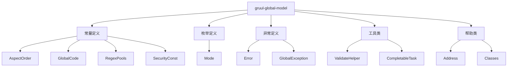
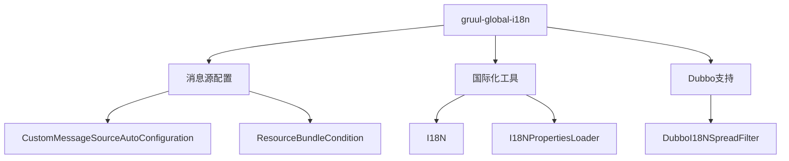
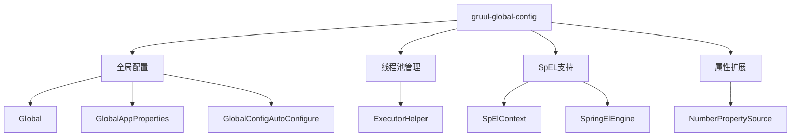

<!-- p -->
gruul-global-model

全局模型定义模块

- 提供全局常量、枚举、异常等基础模型定义
- 支持国际化
- 提供工具类和帮助类
- 支持责任链模式
- 支持策略模式

<!-- c -->
AspectOrder 切面执行顺序定义

- **完整类名**: com.medusa.gruul.global.model.constant.AspectOrder
- **文件路径**: model\constant\AspectOrder.java
- **作者**: 张治保
- **日期**: 2022/3/10

**主要功能**: 定义系统中各个切面的执行顺序常量，通过整数大小控制切面的优先级，数值越小优先级越高。用于协调日志、幂等性校验、事务、数据源切换、缓存、分布式锁等切面的执行顺序。

**主要常量**:

- `LOG_ASPECT`: 日志打印切面
- `IDEM_ASPECT`: 幂等校验切面 
- `TRANSACTIONAL_ASPECT`: 事务切面
- `DATASOURCE_ASPECT`: 数据源切换切面
- `CACHE_ASPECT`: 缓存切面
- `REDISSON_ASPECT`: Redisson分布式锁切面

**完整代码**:
```java
package com.medusa.gruul.global.model.constant;


/**
 * 定义 切面执行顺序
 * 同一切点  越小越先执行 越大越后执行
 *
 * @author 张治保
 * date 2022/3/10
 */
public interface AspectOrder {

    /* 从小到大   */

    /**
     * 日志打印切面
     */
    int LOG_ASPECT = Integer.MIN_VALUE;

    /**
     * idem 幂等校验 切面
     */
    int IDEM_ASPECT = AspectOrder.LOG_ASPECT + 100;


    /* 从大到小   */
    /**
     * transaction @Transactional
     */
    int TRANSACTIONAL_ASPECT = Integer.MAX_VALUE;
    
    /**
     * 数据源切换切面
     */
    int DATASOURCE_ASPECT = AspectOrder.TRANSACTIONAL_ASPECT - 100;

    /**
     * cache 缓存 @Cacheable @CacheEvict ..
     */
    int CACHE_ASPECT = AspectOrder.DATASOURCE_ASPECT - 100;

    /**
     * Redisson分布式锁 切面
     */
    int REDISSON_ASPECT = AspectOrder.CACHE_ASPECT - 100;

}
```

<!-- c -->
GlobalCode 全局错误码

- **完整类名**: com.medusa.gruul.global.model.constant.GlobalCode
- **文件路径**: model\constant\GlobalCode.java
- **作者**: 张治保
- **日期**: 2022/3/25

**主要功能**:
- 定义系统全局统一的错误码常量
- 提供标准化的系统异常和错误状态表示
- 支持统一的错误处理和国际化

**主要常量**:

- `REQUEST_INVALID`: 无效请求

**完整代码**:
```java
package com.medusa.gruul.global.model.constant;

/**
 * @author 张治保
 * date 2022/3/25
 */
public interface GlobalCode {

	/**
	 * 无效请求
	 */
	int REQUEST_INVALID = 12;
}
```

<!-- c -->
RegexPools 正则表达式常量池

- **完整类名**: com.medusa.gruul.global.model.constant.RegexPools
- **文件路径**: model\constant\RegexPools.java
- **作者**: 张治保
- **日期**: 2022/4/15

**主要功能**:
- 提供系统常用的正则表达式常量定义
- 继承并扩展 Hutool 的 RegexPool 工具类
- 支持日期、时间、用户名、密码等多种格式校验
- 提供业务相关的自定义正则表达式规则

**主要常量**:

- `ANY`: 任意字符
- `NOT_BLANK`: 非空字符
- `DATE`: 日期格式
- `TIME`: 时间格式
- `DATETIME`: 日期时间格式
- `NICKNAME`: 用户昵称(只允许中英文与数字)
- `PASSWORD`: 密码规则
- `MOBILE_TEL`: 手机号|座机号
- `NOT_CONTAIN_BLANK`: 不能包含空字符
- `ONLY_CHINESE`: 只能为汉字

**完整代码**:
```java
package com.medusa.gruul.global.model.constant;

import cn.hutool.core.lang.RegexPool;

/**
 * @author 张治保
 * date 2022/4/15
 */
public interface RegexPools extends RegexPool {

    /**
     * 任意字符
     */
    String ANY = "[\\s\\S]*";

    /**
     * 非空字符
     */
    String NOT_BLANK = ANY + "\\S" + ANY;


    /**
     * 日期 -
     */
    String DATE = "((\\d{3}[1-9]|\\d{2}[1-9]\\d{1}|\\d{1}[1-9]\\d{2}|[1-9]\\d{3})-(((0[13578]|1[02])-(0[1-9]|[12]\\d|3[01]))|((0[469]|11)-(0[1-9]|[12]\\d|30))|(02-(0[1-9]|[1]\\d|2[0-8]))))|(((\\d{2})(0[48]|[2468][048]|[13579][26])|((0[48]|[2468][048]|[3579][26])00))-02-29)((\\d{3}[1-9]|\\d{2}[1-9]\\d{1}|\\d{1}[1-9]\\d{2}|[1-9]\\d{3})-(((0[13578]|1[02])-(0[1-9]|[12]\\d|3[01]))|((0[469]|11)-(0[1-9]|[12]\\d|30))|(02-(0[1-9]|[1]\\d|2[0-8]))))|(((\\d{2})(0[48]|[2468][048]|[13579][26])|((0[48]|[2468][048]|[3579][26])00))-02-29)";

    /**
     * 时间：
     */
    String TIME = RegexPool.TIME;

    /**
     * 日期时间
     */
    String DATETIME = "(" + DATE + ")" + "\\s" + "(" + TIME + ")";

    /**
     * 用户昵称 只允许中英文与数字
     */
    String NICKNAME = "^[a-z0-9A-Z\\u4e00-\\u9fa5]+$";
    /**
     * 密码包含数字、小写字母、大写字母 至少两种 6-20位
     */
    String PASSWORD = "^(?![A-Z]+$)(?![a-z]+$)(?!\\d+$)(?![\\W_]+$)\\S{6,20}$";
    /**
     * 跟密码相同
     */
    String USERNAME = RegexPools.PASSWORD;
    /**
     * 手机号|座机号正则
     */
    String MOBILE_TEL = "((?:0|86|\\+86)?1[3-9]\\d{9})|((010|02\\d|0[3-9]\\d{2})-?(\\d{6,8}))";

    /**
     * 不能包含空字符（换行 回车 空格 等）
     */
    String NOT_CONTAIN_BLANK = "^$|^(?!.*\\s).+$";

    /**
     * 只能为汉字
     */
    String ONLY_CHINESE = "^[\\u4e00-\\u9fa5]+$";

}
```

<!-- c -->
SecurityConst 安全相关常量

- **完整类名**: com.medusa.gruul.global.model.constant.SecurityConst
- **文件路径**: model\constant\SecurityConst.java
- **作者**: 张治保
- **日期**: 2022/2/24

**主要功能**:
- 定义系统安全相关的常量值
- 提供用户认证和授权相关的标准字段名称
- 统一管理安全相关的默认值和配置项

**主要常量**:

- `NO_SHOP_ID_CLIENT_DEFAULT_SHOP_ID`: 默认店铺ID
- `CLIENT_ID`: 客户端ID
- `SCOPE`: 作用域
- `USER_ID`: 用户ID
- `EMAIL`: 邮箱
- `MOBILE`: 手机号

**完整代码**:
```java
package com.medusa.gruul.global.model.constant;

/**
 * @author 张治保
 * date 2022/2/24
 */
public interface SecurityConst {

    /**
     * 没有shop id的客户端的shop id
     */
    long NO_SHOP_ID_CLIENT_DEFAULT_SHOP_ID = 0;

    /**
     * 客户端id
     */
    String CLIENT_ID = "clientId";
    /**
     * 作用域scope
     */
    String SCOPE = "scope";
    /**
     * 用户id
     */
    String USER_ID = "userId";
    /**
     * email
     */
    String EMAIL = "email";
    /**
     * mobile
     */
    String MOBILE = "mobile";

}
```

<!-- c -->
Mode 运行业务模式枚举

- **完整类名**: com.medusa.gruul.global.model.enums.Mode
- **文件路径**: model\enums\Mode.java
- **作者**: 张治保
- **日期**: 2022/4/18

**主要功能**:
- 定义系统支持的业务运营模式类型
- 通过枚举值区分不同的商业模式场景
- 为系统提供标准化的业务模式判断依据

**枚举值**:

- `B2C`: 企业对消费者
- `B2B2C`: 企业对企业对消费者
- `B2B`: 企业对企业
- `S2B2C`: 供应商对企业对消费者
- `O2O`: 线上到线下

**完整代码**:
```java
package com.medusa.gruul.global.model.enums;

import lombok.Getter;
import lombok.RequiredArgsConstructor;

/**
 * 运行业务模式
 * @author 张治保
 * date 2022/4/18
 */
@Getter
@RequiredArgsConstructor
public enum  Mode {
    /**
     * B2C
     */
    B2C(0),
    /**
     * B2B2C
     */
    B2B2C(1),
    /**
     * B2B
     */
    B2B(2),
    /**
     * S2B2C
     */
    S2B2C(3),

    /**
     * O2O
     */
    O2O(4);


    private final Integer value;
}
```

<!-- c -->
Error 错误异常抽象类

- **完整类名**: com.medusa.gruul.global.model.exception.Error
- **文件路径**: model\exception\Error.java
- **作者**: 张治保
- **日期**: 2022/4/20

**主要功能**:
- 定义系统异常的标准接口规范
- 提供异常信息的统一获取方式
- 支持条件判断抛出异常的便捷方法
- 实现异常信息的序列化传输

**主要方法**:

- `code()`: 获取错误代码
- `msg()`: 获取错误消息
- `data()`: 获取错误数据
- `exception()`: 获取异常实例
- `falseThrow()`: 条件为false时抛出异常
- `trueThrow()`: 条件为true时抛出异常

**完整代码**:
```java
package com.medusa.gruul.global.model.exception;

import java.io.Serializable;

/**
 * 错误异常抽象类
 *
 * @author 张治保
 * date 2022/4/20
 */
public interface Error extends Serializable {
    /**
     * 错误代码
     *
     * @return 错误代码
     */
    int code();

    /**
     * 错误提示
     *
     * @return 错误提示
     */
    String msg();

    /**
     * 返回的异常数据
     *
     * @return 异常数据
     */
    default Object data() {
        return null;
    }

    /**
     * exception msg with arguments
     *
     * @param args 参数
     * @return 错误提示
     */
    default String msg(Object... args) {
        return msg();
    }

    /**
     * 获取异常
     *
     * @return 渲染异常
     */
    default GlobalException exception() {
        if (this instanceof GlobalException globalException) {
            return globalException;
        }
        return new GlobalException(code(), msg());
    }

    /**
     * 获取异常
     *
     * @param args 模板参数
     * @return 渲染异常
     */
    default GlobalException exception(Object... args) {
        return new GlobalException(code(), msg(args));
    }

    /**
     * 条件为false抛出异常
     *
     * @param success 条件
     */
    default void falseThrow(boolean success) {
        if (success) {
            return;
        }
        throw this.exception();
    }

    /**
     * 条件为true抛出异常
     *
     * @param success 条件
     */
    default void trueThrow(boolean success) {
        if (success) {
            throw this.exception();
        }
    }

    /**
     * 指定使用消息
     *
     * @param msg 替换的消息
     * @return 渲染异常
     */
    default GlobalException msgEx(String msg) {
        return new GlobalException(code(), msg);
    }

    /**
     * 获取异常
     *
     * @param data 异常提示数据
     * @return 渲染异常
     */
    default GlobalException dataEx(Object data) {
        GlobalException globalException = new GlobalException(msg());
        globalException.setCode(code());
        globalException.setData(data);
        return globalException;
    }


    /**
     * 获取异常
     *
     * @param data 异常提示数据
     * @param args 模板参数
     * @return 渲染异常
     */
    default GlobalException dataEx(Object data, Object... args) {
        GlobalException globalException = new GlobalException(msg(args));
        globalException.setCode(code());
        globalException.setData(data);
        return globalException;
    }
}
```

<!-- c -->
GlobalException 全局异常类

- **完整类名**: com.medusa.gruul.global.model.exception.GlobalException
- **文件路径**: model\exception\GlobalException.java
- **作者**: 张治保
- **日期**: 2022/3/25

**主要功能**:
- 实现系统全局统一的异常处理机制
- 支持自定义状态码和异常数据传递
- 继承 RuntimeException 实现运行时异常处理
- 实现 Error 接口提供标准异常行为

**主要属性**:
- `code`: 自定义状态码
- `data`: 异常数据提示

**完整代码**:
```java
package com.medusa.gruul.global.model.exception;

import lombok.Getter;
import lombok.Setter;

/**
 * @author 张治保
 * date 2022/3/25
 */
@Getter
@Setter
public class GlobalException extends RuntimeException implements Error {

    /**
     * 自定义状态码
     */
    private int code;

    /**
     * 异常数据提示
     */
    private Object data;

    public GlobalException(String message, int code, Object data) {
        this(code, message);
        this.data = data;
    }

    public GlobalException(Error code) {
        super(code.msg());
        this.code = code.code();
    }

    public GlobalException() {
        super();
        this.code = 500;
    }

    public GlobalException(int code, String message) {
        super(message);
        this.code = code;
    }

    public GlobalException(String message) {
        super(message);
        this.code = 500;
    }

    public GlobalException(int code, String message, Throwable cause) {
        super(message, cause);
        this.code = code;
    }

    public GlobalException(String message, Throwable cause) {
        super(message, cause);
        this.code = 500;
    }

    @Override
    public int code() {
        return code;
    }

    @Override
    public String msg() {
        return getMessage();
    }
}
```

<!-- c -->
IFilter 过滤器接口

- **完整类名**: com.medusa.gruul.global.model.filter.IFilter
- **文件路径**: model\filter\IFilter.java
- **作者**: 张治保
- **日期**: 2022/8/15

**主要功能**:
- 定义过滤器的标准接口规范
- 提供过滤器的处理方法
- 支持过滤器链的传递和控制
- 允许自定义过滤器的具体实现

**主要方法**:
- `doFilter()`: 处理过滤器逻辑并控制链的传递

**完整代码**:
```java
package com.medusa.gruul.global.model.filter;

/**
 * @author 张治保
 * date 2022/8/15
 */
@FunctionalInterface
public interface IFilter<Context> {

    /**
     * 处理过滤器逻辑
     *
     * @param context 上下文
     * @param chain 过滤器链
     */
    void doFilter(FilterContext<Context> context, IFilterChain<Context> chain);
}
```

<!-- c -->
IFilterChain 过滤器链接口

- **完整类名**: com.medusa.gruul.global.model.filter.IFilterChain
- **文件路径**: model\filter\IFilterChain.java
- **作者**: 张治保
- **日期**: 2022/8/15

**主要功能**:
- 定义过滤器链的标准接口规范
- 提供过滤器链的处理和传递方法
- 支持过滤器链的执行控制
- 允许自定义过滤器链的实现

**主要方法**:
- `handle()`: 处理当前过滤器节点
- `chain()`: 传递到下一个过滤器节点

**完整代码**:
```java
package com.medusa.gruul.global.model.filter;

/**
 * @author 张治保
 * date 2022/8/15
 */
public interface IFilterChain<Context> {

    /**
     * 处理当前过滤器节点
     *
     * @param context 上下文
     */
    void handle(FilterContext<Context> context);

    /**
     * 传递到下一个过滤器节点
     *
     * @param context 上下文
     */
    void chain(FilterContext<Context> context);
}
```

<!-- c -->
FilterChain 过滤器链

- **完整类名**: com.medusa.gruul.global.model.filter.FilterChain
- **文件路径**: model\filter\FilterChain.java
- **作者**: 张治保
- **日期**: 2022/8/15

**主要功能**:
- 实现责任链模式的过滤器链结构
- 支持多个过滤器的顺序执行
- 提供过滤器链的传递和控制机制
- 允许动态添加和移除过滤器节点

**主要属性**:

- `filter`: 当前节点的处理器
- `next`: 下一个节点

**完整代码**:
```java
package com.medusa.gruul.global.model.filter;

import lombok.RequiredArgsConstructor;
import lombok.Setter;

/**
 * @author 张治保
 * date 2022/8/15
 */
@RequiredArgsConstructor
public class FilterChain<Context> implements IFilterChain<Context> {

    /**
     * 当前节点的处理
     */
    private final IFilter<Context> filter;

    /**
     * 下一个节点
     */
    @Setter
    private IFilterChain<Context> next;

    @Override
    public void handle(FilterContext<Context> context) {
        if (filter == null) {
            return;
        }
        filter.doFilter(context, this);
    }

    @Override
    public void chain(FilterContext<Context> context) {
        if (next == null || context.isBreakIt()) {
            return;
        }
        next.handle(context);
    }
}
```

<!-- c -->
FilterChainComparable 过滤器链比较器

- **完整类名**: com.medusa.gruul.global.model.filter.FilterChainComparable
- **文件路径**: model\filter\FilterChainComparable.java
- **作者**: 张治保
- **日期**: 2022/8/16

**主要功能**:
- 提供过滤器链的排序功能
- 实现过滤器链的优先级比较
- 支持过滤器链的有序执行
- 确保过滤器链的执行顺序可控

**主要属性**:
- `order`: 排序优先级
- `filterChain`: 过滤器链实例

**完整代码**:
```java
package com.medusa.gruul.global.model.filter;

import lombok.EqualsAndHashCode;
import lombok.Getter;
import lombok.RequiredArgsConstructor;

/**
 * @author 张治保
 * date 2022/8/16
 */
@EqualsAndHashCode
@RequiredArgsConstructor
public class FilterChainComparable<Context> implements Comparable<FilterChainComparable<Context>> {
    private final int order;
    @Getter
    private final FilterChain<Context> filterChain;

    @Override
    public int compareTo(FilterChainComparable<Context> next) {
        return order > next.order ? -1 : 1;
    }
}
```

<!-- c -->
FilterContext 过滤器上下文

- **完整类名**: com.medusa.gruul.global.model.filter.FilterContext
- **文件路径**: model\filter\FilterContext.java
- **作者**: 张治保
- **日期**: 2022/8/15

**主要功能**:
- 提供过滤器链执行的上下文环境
- 支持过滤器链的执行控制
- 携带过滤器执行所需的数据
- 维护过滤器执行的状态信息

**主要属性**:

- `shopId`: 店铺ID
- `breakIt`: 是否跳出当前执行链
- `data`: 自定义数据载体

**完整代码**:
```java
package com.medusa.gruul.global.model.filter;

import lombok.Getter;
import lombok.Setter;
import lombok.ToString;

import java.io.Serializable;

/**
 * 执行链上下文
 *
 * @author 张治保
 * date 2022/8/15
 */
@Getter
@Setter
@ToString
public class FilterContext<Context> implements Serializable {

    /**
     * shopId
     */
    private Long shopId;

    /**
     * 是否跳出当前执行链
     */
    private boolean breakIt;

    /**
     * 自定义数据载体
     */
    private Context data;

}
```

<!-- c -->
IFilterPipeline 过滤器管道接口

- **完整类名**: com.medusa.gruul.global.model.filter.IFilterPipeline
- **文件路径**: model\filter\IFilterPipeline.java
- **作者**: 张治保
- **日期**: 2022/8/15

**主要功能**:
- 定义过滤器管道的标准接口规范
- 提供过滤器链的添加和管理方法
- 支持过滤器链的执行和控制
- 允许自定义过滤器管道的实现

**主要方法**:
- `addFilter()`: 添加过滤器到管道
- `addFilterChain()`: 添加过滤器链到管道
- `flush()`: 刷新并构建过滤器链
- `handle()`: 执行过滤器链处理

**完整代码**:
```java
package com.medusa.gruul.global.model.filter;

import io.vavr.control.Option;

/**
 * 责任链
 *
 * @author 张治保
 * date 2022/8/15
 */
public interface IFilterPipeline<Context> {

    /**
     * 构造pipeline
     *
     * @param dataOption 可选上下文
     * @param <Context>  上下文类型
     * @return FilterPipeline
     */
    static <Context> IFilterPipeline<Context> build(Option<Context> dataOption) {
        FilterContext<Context> filterContext = new FilterContext<>();
        filterContext.setData(dataOption.getOrNull());
        filterContext.setBreakIt(Boolean.FALSE);
        return new FilterPipeline<>(filterContext);
    }

    /**
     * 增加filter处理器
     *
     * @param filter 处理器 任意位置
     * @return self
     */
    IFilterPipeline<Context> addFilter(IFilter<Context> filter);


    /**
     * 增加filter处理器
     *
     * @param order  顺序 从小到大 排序 挨个执行
     * @param filter 处理器
     * @return self
     */
    IFilterPipeline<Context> addFilter(int order, IFilter<Context> filter);

    /**
     * 增加filter处理器
     *
     * @param filter 处理器 任意位置
     * @return self
     */
    IFilterPipeline<Context> addFilter(IAutomaticFilter<Context> filter);


    /**
     * 增加filter处理器
     *
     * @param order  顺序 从小到大 排序 挨个执行
     * @param filter 处理器
     * @return self
     */
    IFilterPipeline<Context> addFilter(int order, IAutomaticFilter<Context> filter);

    /**
     * 增加filter处理器
     *
     * @param filter 处理器 任意位置
     * @return self
     */
    IFilterPipeline<Context> addFilterChain(FilterChain<Context> filter);


    /**
     * 增加filter处理器
     *
     * @param order  顺序 从小到大 排序 挨个执行
     * @param filter 处理器
     * @return self
     */
    IFilterPipeline<Context> addFilterChain(int order, FilterChain<Context> filter);

    /**
     * 开始执行
     */
    void flush();
}
```

<!-- c -->
IAutomaticFilter 自动过滤器接口

- **完整类名**: com.medusa.gruul.global.model.filter.IAutomaticFilter
- **文件路径**: model\filter\IAutomaticFilter.java
- **作者**: 张治保
- **日期**: 2022/8/15

**主要功能**:
- 定义自动过滤器的标准接口规范
- 继承 IFilter 接口的基础功能
- 提供过滤器的自动注册机制
- 支持过滤器的优先级设置

**主要方法**:
- `order()`: 获取过滤器的执行顺序
- `doFilter()`: 继承自 IFilter 的过滤器处理方法

**完整代码**:
```java
package com.medusa.gruul.global.model.filter;

/**
 * 自动 chain的filter
 *
 * @author 张治保
 * date 2022/8/22
 */
@FunctionalInterface
public interface IAutomaticFilter<Context> extends IFilter<Context> {
    /**
     * 处理上下文逻辑抽象
     *
     * @param context 上下文
     */
    void doFilter(FilterContext<Context> context);


    /**
     * 处理上下文逻辑抽象
     *
     * @param context 上下文
     * @param chain   处理链
     */
    @Override
    default void doFilter(FilterContext<Context> context, IFilterChain<Context> chain) {
        this.doFilter(context);
        chain.chain(context);
    }
}
```

<!-- c -->
FilterPipeline 过滤器管道

- **完整类名**: com.medusa.gruul.global.model.filter.FilterPipeline
- **文件路径**: model\filter\FilterPipeline.java
- **作者**: 张治保
- **日期**: 2022/8/15

**主要功能**:
- 实现过滤器管道的组装和执行
- 管理过滤器链的添加和排序
- 提供过滤器链的执行入口
- 支持多个过滤器的有序串联执行

**主要属性**:
- `filterChains`: 过滤器链集合
- `first`: 第一个过滤器链节点
- `context`: 过滤器上下文

**完整代码**:
```java
package com.medusa.gruul.global.model.filter;

import cn.hutool.core.collection.CollUtil;
import lombok.RequiredArgsConstructor;

import java.util.ArrayList;
import java.util.Collections;
import java.util.List;

/**
 * @author 张治保
 * date 2022/8/15
 */
@RequiredArgsConstructor
public class FilterPipeline<Context> implements IFilterPipeline<Context> {

    private final FilterContext<Context> context;

    private final List<FilterChainComparable<Context>> filterChains = new ArrayList<>();

    private IFilterChain<Context> first;

    @Override
    public IFilterPipeline<Context> addFilter(IFilter<Context> filter) {
        return addFilterChain(new FilterChain<>(filter));
    }

    @Override
    public IFilterPipeline<Context> addFilter(int order, IFilter<Context> filter) {
        return addFilterChain(order, new FilterChain<>(filter));
    }

    @Override
    public IFilterPipeline<Context> addFilter(IAutomaticFilter<Context> filter) {
        return addFilterChain(new FilterChain<>(filter));
    }

    @Override
    public IFilterPipeline<Context> addFilter(int order, IAutomaticFilter<Context> filter) {
        return addFilterChain(order, new FilterChain<>(filter));
    }

    @Override
    public IFilterPipeline<Context> addFilterChain(FilterChain<Context> filterChain) {
        filterChains.add(new FilterChainComparable<>(filterChains.size(), filterChain));
        return this;
    }

    @Override
    public IFilterPipeline<Context> addFilterChain(int order, FilterChain<Context> filterChain) {
        filterChains.add(new FilterChainComparable<>(order, filterChain));
        return this;
    }

    @Override
    public void flush() {
        if (CollUtil.isEmpty(filterChains)) {
            return;
        }
        Collections.sort(filterChains);
        IFilterChain<Context> next = null;
        for (FilterChainComparable<Context> filterChain : filterChains) {
            FilterChain<Context> chain = filterChain.getFilterChain();
            if (next != null) {
                chain.setNext(next);
            }
            next = chain;
        }
        first = filterChains.get(filterChains.size() - 1).getFilterChain();
        first.handle(context);
    }
}
```

<!-- c -->
Address 完整地址抽象模型

- **完整类名**: com.medusa.gruul.global.model.helper.Address
- **文件路径**: model\helper\Address.java
- **作者**: 张治保
- **日期**: 2024/10/26

**主要功能**:
- 定义完整地址的标准接口规范
- 提供地址信息的统一获取方式
- 支持省市区和详细地址的分离
- 允许自定义地址的具体实现

**主要方法**:

- `full()`: 获取完整地址
- `getArea()`: 获取省市区
- `getAddress()`: 获取详细地址
- `province()`: 获取省
- `city()`: 获取市
- `county()`: 获取区
- `fullAddress()`: 获取完整地址

**完整代码**:
```java
package com.medusa.gruul.global.model.helper;

import cn.hutool.core.collection.CollUtil;
import cn.hutool.core.util.StrUtil;

import java.io.Serializable;
import java.util.List;

/**
 * 完整地址抽象模型
 *
 * @author 张治保
 * @since 2024/10/26
 */
public interface Address extends Serializable {

    /**
     * 获取完整地址
     *
     * @param area    省市区
     * @param address 详细地址
     * @return 完整地址
     */
    static String full(List<String> area, String address) {
        if (CollUtil.isEmpty(area)) {
            return address == null ? StrUtil.EMPTY : address;
        }
        String join = String.join(StrUtil.EMPTY, area);
        if (address == null) {
            return join;
        }
        return join + StrUtil.SPACE + address;
    }

    /**
     * 获取省市区
     *
     * @return 省市区
     */
    List<String> getArea();

    /**
     * 获取详细地址
     *
     * @return 详细地址
     */
    String getAddress();

    /**
     * 获取省
     */
    default String province() {
        List<String> area = getArea();
        return CollUtil.isEmpty(area) ? StrUtil.EMPTY : area.get(0);
    }

    /**
     * 获取市
     */
    default String city() {
        List<String> area = getArea();
        if (CollUtil.isEmpty(area)) {
            return StrUtil.EMPTY;
        }
        //兼容直辖市 如[上海市，静安区]
        if (area.size() <= 2) {
            return area.get(0);
        }
        return area.get(1);
    }

    /**
     * 获取区
     */
    default String county() {
        List<String> area = getArea();
        if (CollUtil.isEmpty(area)) {
            return StrUtil.EMPTY;
        }
        return area.get(area.size() - 1);
    }

    /**
     * 获取完整地址
     *
     * @return 完整地址
     */
    default String fullAddress() {
        return full(getArea(), getAddress());
    }
}
```

<!-- c -->
Classes 类加载工具类

- **完整类名**: com.medusa.gruul.global.model.helper.Classes
- **文件路径**: model\helper\Classes.java
- **作者**: 张治保
- **日期**: 2023/11/14

**主要功能**:
- 提供类加载相关的工具方法
- 支持类存在性检查
- 提供安全的类加载机制
- 处理类加载异常

**主要方法**:

- `exists()`: 判断类是否存在
- `load()`: 加载指定类

**完整代码**:
```java
package com.medusa.gruul.global.model.helper;

/**
 * @author 张治保
 * @since 2023/11/14
 */
public interface Classes {

    /**
     * 判断类是否存在
     *
     * @param className 全类名
     * @return 是否存在
     */
    static boolean exists(String className) {
        return load(className) != null;
    }

    /**
     * 加载类
     *
     * @param className 全类名
     * @param <T>       类型
     * @return 类
     */
    @SuppressWarnings("unchecked")
    static <T> Class<T> load(String className) {
        try {
            return (Class<T>) Class.forName(className);
        } catch (ClassNotFoundException e) {
            return null;
        }
    }
}
```

<!-- c -->
CompletableTask 异步任务工具类

- **完整类名**: com.medusa.gruul.global.model.helper.CompletableTask
- **文件路径**: model\helper\CompletableTask.java
- **作者**: 张治保
- **日期**: 2022/6/13

**主要功能**:
- 提供异步任务执行和管理的工具方法
- 支持异步执行结果的获取和异常处理
- 提供多个异步任务的合并执行功能
- 统一处理异步任务执行异常

**主要方法**:

- `getOrThrowException()`: 获取异步执行结果或抛出异常
- `allOf(Executor, Runnable...)`: 合并多个异步任务到一个任务
- `allOf(CompletableFuture<?>...)`: 合并多个CompletableFuture任务

**完整代码**:
```java
package com.medusa.gruul.global.model.helper;


import lombok.extern.slf4j.Slf4j;

import java.util.concurrent.CompletableFuture;
import java.util.concurrent.ExecutionException;
import java.util.concurrent.Executor;

/**
 * @author 张治保
 * date 2022/6/13
 */
@Slf4j
public class CompletableTask {

    private CompletableTask() {
    }

    /**
     * 获取异步执行结果 或 抛出异常
     *
     * @param completableFuture 异步执行任务
     * @param <T>               执行结果泛型
     */
    public static <T> T getOrThrowException(CompletableFuture<T> completableFuture) {
        try {
            return completableFuture.get();
        } catch (ExecutionException e) {
            Throwable cause = e.getCause();
            if (cause instanceof RuntimeException) {
                throw (RuntimeException) cause;
            }
            throw new RuntimeException("asynchronous execution error", e);
        } catch (InterruptedException e) {
            log.error("interrupted exception", e);
            throw new RuntimeException("asynchronous execution error InterruptedException", e);
        }
    }

    /**
     * 渲染所有的异步任务至一个任务
     *
     * @param executor 异步任务执行器
     * @param tasks    任务列表
     * @return 合并后的任务
     */

    public static CompletableFuture<Void> allOf(Executor executor, Runnable... tasks) {
        int length = tasks.length;
        CompletableFuture<?>[] futures = new CompletableFuture[length];
        for (int i = 0; i < length; i++) {
            futures[i] = CompletableFuture.runAsync(tasks[i], executor)
                    .whenComplete(
                            (value, throwable) -> {
                                if (throwable == null) {
                                    return;
                                }
                                if (log.isErrorEnabled()) {
                                    log.error("CompletableFuture Exception", throwable);
                                }
                            }
                    );
        }
        return CompletableFuture.allOf(futures);
    }

    /**
     * all of
     *
     * @param tasks 任务列表
     * @return CompletableFuture
     */
    public static CompletableFuture<Void> allOf(CompletableFuture<?>... tasks) {
        for (CompletableFuture<?> task : tasks) {
            task.whenComplete(
                    (value, throwable) -> {
                        if (throwable == null) {
                            return;
                        }
                        if (log.isErrorEnabled()) {
                            log.error("CompletableFuture Exception", throwable);
                        }
                    }
            );
        }
        return CompletableFuture.allOf(tasks);
    }
}
```

<!-- c -->
IRangeMap 区间Map接口

- **完整类名**: com.medusa.gruul.global.model.helper.IRangeMap
- **文件路径**: model\helper\IRangeMap.java
- **作者**: 张治保
- **日期**: 2023/2/10

**主要功能**:
- 定义区间Map的标准接口规范
- 提供集合数据到区间Map的转换方法
- 支持可空值的获取操作
- 继承Java标准Map接口

**主要方法**:

- `putAll()`: 将集合数据放入区间Map
- `optGet()`: 获取可能为空的值

**完整代码**:
```java
package com.medusa.gruul.global.model.helper;

import io.vavr.control.Option;

import java.util.Collection;
import java.util.Map;
import java.util.function.Function;

/**
 * 区间MAP
 *
 * @author 张治保
 * date 2023/2/10
 */
public interface IRangeMap<K, V> extends Map<K, V> {

    /**
     * 把集合数据put 到区间map里
     *
     * @param items     集合数据
     * @param keyFunc   获取集合里每个item的 key 函数
     * @param valueFunc 获取集合里每个item的 value 函数
     * @param <T>       集合里每个item的类型
     */
    <T> void putAll(Collection<T> items, Function<T, K> keyFunc, Function<T, V> valueFunc);


    /**
     * 获取可能为空的值
     *
     * @param key key
     * @return 可能为null的值
     */
    Option<V> optGet(K key);
}
```

<!-- c -->
RangeMap 区间Map实现类

- **完整类名**: com.medusa.gruul.global.model.helper.RangeMap
- **文件路径**: model\helper\RangeMap.java
- **作者**: 张治保
- **日期**: 2023/2/10

**主要功能**:
- 实现IRangeMap接口定义的区间Map功能
- 基于TreeMap提供有序的区间存储
- 支持数值类型的区间比较
- 提供区间Map的标准操作实现

**主要属性**:
- `delegate`: 底层TreeMap实例,用于存储区间数据

**完整代码**:
```java
package com.medusa.gruul.global.model.helper;

import io.vavr.control.Option;

import java.math.BigDecimal;
import java.util.*;
import java.util.function.Function;

/**
 * 区间MAP 实现类
 *
 * @author 张治保
 * date 2023/2/10
 */
public class RangeMap<K extends Number, V> implements IRangeMap<K, V> {

    private final TreeMap<K, V> delegate;

    public RangeMap() {
        this.delegate = new TreeMap<>(Comparator.comparing(v -> new BigDecimal(v.toString())));
    }


    @Override
    public int size() {
        return delegate.size();
    }

    @Override
    public boolean isEmpty() {
        return delegate.isEmpty();
    }

    @Override
    @SuppressWarnings("unchecked")
    public boolean containsKey(Object key) {
        return delegate.floorKey((K) key) != null;
    }

    @Override
    public boolean containsValue(Object value) {
        return delegate.containsValue(value);
    }

    @Override
    @SuppressWarnings("unchecked")
    public V get(Object key) {
        K floorKey = delegate.floorKey((K) key);
        return floorKey == null ? null : delegate.get(floorKey);
    }

    @Override
    public Option<V> optGet(K key) {
        return Option.of(get(key));
    }

    @Override
    public V put(K key, V value) {
        return delegate.put(key, value);
    }

    @Override
    public V remove(Object key) {
        return delegate.remove(key);
    }

    @Override
    public <T> void putAll(Collection<T> items, Function<T, K> keyFunc, Function<T, V> valueFunc) {
        items.forEach(item -> delegate.put(keyFunc.apply(item), valueFunc.apply(item)));
    }


    @Override
    public void putAll(Map<? extends K, ? extends V> map) {
        delegate.putAll(map);
    }

    @Override
    public void clear() {
        delegate.clear();
    }

    @Override
    public Set<K> keySet() {
        return delegate.keySet();
    }

    @Override
    public Collection<V> values() {
        return delegate.values();
    }

    @Override
    public Set<Entry<K, V>> entrySet() {
        return delegate.entrySet();
    }
}
```

<!-- c -->
SecureHelper 安全工具类

- **完整类名**: com.medusa.gruul.global.model.helper.SecureHelper
- **文件路径**: model\helper\SecureHelper.java
- **作者**: 张治保
- **日期**: 2023/10/31

**主要功能**:
- 提供加密相关的工具方法
- 支持对称加密和非对称加密
- 提供密钥生成和转换功能
- 封装常用的加密算法操作

**主要方法**:

- `aesFromKey()`: 从base64密钥创建AES加密器
- `aesBase64Key()`: 生成AES密钥
- `publicKey()`: 生成公钥
- `privateKey()`: 生成私钥
- `keyPair()`: 生成密钥对
- `secretKey()`: 生成对称加密密钥
- `esPublicKey()`: 生成EC算法公钥
- `esPrivateKey()`: 生成EC算法私钥
- `aesKey()`: 从base64密钥生成AES密钥

**完整代码**:
```java
package com.medusa.gruul.global.model.helper;

import cn.hutool.crypto.SecureUtil;
import cn.hutool.crypto.symmetric.AES;
import cn.hutool.crypto.symmetric.SymmetricAlgorithm;

import javax.crypto.SecretKey;
import java.security.KeyPair;
import java.security.PrivateKey;
import java.security.PublicKey;
import java.util.Base64;

/**
 * @author 张治保
 * @since 2023/10/31
 */
public interface SecureHelper {

    /**
     * aes 加密
     *
     * @param base64Key base64Key
     * @return AES
     */
    static AES aesFromKey(String base64Key) {
        byte[] key = Base64.getDecoder().decode(base64Key);
        return SecureUtil.aes(key);
    }

    /**
     * 生成 aes key
     *
     * @return base64Key
     */
    static String aesBase64Key() {
        SecretKey secretKey = SecureUtil.generateKey(SymmetricAlgorithm.AES.getValue(), 128);
        //生成 aes
        return Base64.getEncoder().encodeToString(secretKey.getEncoded());
    }

    /**
     * 生成公钥，仅用于非对称加密<br>
     * <a href="https://docs.oracle.com/javase/7/docs/technotes/guides/security/StandardNames.html#KeyFactory">
     * 算法见
     * </a>
     *
     * @param algorithm 算法
     * @param base64Key base64公钥密钥
     * @return 公钥 {@link PublicKey}
     */
    static PublicKey publicKey(String algorithm, String base64Key) {
        byte[] key = Base64.getDecoder().decode(base64Key);
        return SecureUtil.generatePublicKey(algorithm, key);
    }

    /**
     * 生成私钥，仅用于非对称加密<br>
     * 算法见：
     * <a href="https://docs.oracle.com/javase/7/docs/technotes/guides/security/StandardNames.html#KeyFactory">
     * 算法
     * </a>
     *
     * @param algorithm 算法
     * @param base64Key base64私钥密钥
     * @return 私钥 {@link PrivateKey}
     */
    static PrivateKey privateKey(String algorithm, String base64Key) {
        byte[] key = Base64.getDecoder().decode(base64Key);
        return SecureUtil.generatePrivateKey(algorithm, key);
    }


    /**
     * 生成密钥对，仅用于非对称加密<br>
     *
     * @param algorithm        算法
     * @param base64PublicKey  base64公钥密钥
     * @param base64PrivateKey base64私钥密钥
     * @return 密钥对 {@link KeyPair}
     */
    static KeyPair keyPair(String algorithm, String base64PublicKey, String base64PrivateKey) {
        return new KeyPair(publicKey(algorithm, base64PublicKey), privateKey(algorithm, base64PrivateKey));
    }

    /**
     * 生成密钥，仅用于对称加密<br>
     *
     * @param algorithm 算法
     * @param base64Key base64密钥
     * @return 密钥 {@link SecretKey}
     */
    static SecretKey secretKey(String algorithm, String base64Key) {
        byte[] key = Base64.getDecoder().decode(base64Key);
        return SecureUtil.generateKey(algorithm, key);
    }

    /**
     * 生成公钥，仅用于非对称加密<br>
     *
     * @param base64Key base64公钥密钥
     * @return 公钥 {@link PublicKey}
     */
    static PublicKey esPublicKey(String base64Key) {
        return publicKey("EC", base64Key);
    }

    /**
     * 生成私钥，仅用于非对称加密<br>
     *
     * @param base64Key base64私钥密钥
     * @return 私钥 {@link PrivateKey}
     */
    static PrivateKey esPrivateKey(String base64Key) {
        return privateKey("EC", base64Key);
    }

    /**
     * base64 密钥 转 SecretKey，仅用于对称加密<br>
     *
     * @param base64Key base64密钥
     * @return 密钥 {@link SecretKey}
     */
    static SecretKey aesKey(String base64Key) {
        return secretKey("AES", base64Key);
    }
}
```

<!-- c -->
ShutdownHook 关闭钩子工具类

- **完整类名**: com.medusa.gruul.global.model.helper.ShutdownHook
- **文件路径**: model\helper\ShutdownHook.java
- **作者**: 张治保
- **日期**: 2023/12/7

**主要功能**:
- 提供JVM关闭时的钩子管理功能
- 支持添加和移除关闭钩子
- 使用CopyOnWriteArraySet保证线程安全
- 统一管理系统关闭时的清理工作

**主要属性**:
- `HOOKS`: 存储shutdown回调钩子的线程安全集合

**主要方法**:
- `add()`: 添加关闭钩子
- `remove()`: 移除关闭钩子

**完整代码**:
```java
package com.medusa.gruul.global.model.helper;

import java.util.Set;

/**
 * @author 张治保
 * @since 2023/12/7
 */
public class ShutdownHook {

    /**
     * 用于存储shutdown 回调钩子集合
     */
    private static final Set<Runnable> HOOKS = new java.util.concurrent.CopyOnWriteArraySet<>();

    /**
     * addShutdownHook
     */
    static {
        Runtime.getRuntime().addShutdownHook(new Thread(() -> {
            for (Runnable hook : HOOKS) {
                hook.run();
            }
        }));
    }

    /**
     * 添加钩子 谨慎使用 确保任务可以快速结束 避免阻塞关闭操作
     *
     * @param hook 钩子
     */
    public static void add(Runnable hook) {
        HOOKS.add(hook);
    }

    /**
     * 移除钩子
     *
     * @param hook 钩子
     */
    static void remove(Runnable hook) {
        HOOKS.remove(hook);
    }
}
```

<!-- c -->
BaseDTO 基础数据传输对象接口

- **完整类名**: com.medusa.gruul.global.model.o.BaseDTO
- **文件路径**: model\o\BaseDTO.java
- **作者**: 张治保
- **日期**: 2022/5/25

**主要功能**:
- 定义数据传输对象的基础接口规范
- 提供参数校验的默认实现
- 支持模糊查询的字符串处理
- 实现序列化接口便于网络传输

**主要方法**:
- `validParam()`: 检查校验参数
- `like()`: 模糊查询字符拼接

**完整代码**:
```java
package com.medusa.gruul.global.model.o;

import java.io.Serializable;

/**
 * 基础的数据传输对象
 *
 * @author 张治保
 * date 2022/5/25
 */
public interface BaseDTO extends Serializable {

    /**
     * 检查校验参数
     */
    default void validParam() {
    }


    /**
     * 模糊查询字符%拼接
     *
     * @param value 原始字符
     * @return 拼接后的字符
     */
    default String like(String value) {
        return "'%" + value + "%'";
    }
}
```

<!-- c -->
ExceptionData 异常数据类

- **完整类名**: com.medusa.gruul.global.model.o.ExceptionData
- **文件路径**: model\o\ExceptionData.java
- **作者**: 张治保
- **日期**: 2023/7/20

**主要功能**:
- 提供异常数据的标准封装
- 支持异常关键信息的传递
- 提供静态工厂方法创建实例
- 实现序列化接口便于网络传输

**主要属性**:
- `key`: 引发错误的key(如店铺ID或店铺ID与商品ID组合)
- `data`: 引发错误的状态数据(如店铺状态异常时的状态值)

**主要方法**:
- `of(Serializable)`: 创建只包含key的异常数据
- `of(Serializable, Serializable)`: 创建包含key和data的异常数据

**完整代码**:
```java
package com.medusa.gruul.global.model.o;

import lombok.AllArgsConstructor;
import lombok.Getter;
import lombok.NoArgsConstructor;
import lombok.Setter;

import java.io.Serializable;

/**
 * @author 张治保
 * date 2023/7/20
 */
@Getter
@Setter
@NoArgsConstructor
@AllArgsConstructor
public class ExceptionData implements Serializable {

	/**
	 * 引发错误的 key 如 店铺 id 或店铺 id 与商品 id 组合行程的 key
	 */
	private Serializable key;

	/**
	 * 引发错误的状态数据  比如店铺状态异常 可以传递店铺状态
	 */
	private Serializable data;

	public static ExceptionData of(Serializable key) {
		return ExceptionData.of(key, null);
	}

	public static ExceptionData of(Serializable key, Serializable data) {
		return new ExceptionData(key, data);
	}
}
```

<!-- c -->
Final 函数式编程局部变量包装类

- **完整类名**: com.medusa.gruul.global.model.o.Final
- **文件路径**: model\o\Final.java
- **作者**: 张治保
- **日期**: 2023/4/13

**主要功能**:
- 提供函数式编程中使用局部变量的包装类
- 支持非线程安全的数据存取
- 实现序列化接口便于网络传输
- 替代AtomicReference等重量级并发工具

**主要属性**:
- `data`: 存储的数据

**主要方法**:
- `get()`: 获取数据
- `set()`: 设置数据

**完整代码**:
```java
package com.medusa.gruul.global.model.o;

import java.io.Serializable;

/**
 * 用于在 函数式编程里使用 局部变量 需要注意的是 不是线程安全的
 * (函数编程里要求 final 变量 如果使用AtomicReference有点太重了)
 *
 * @author 张治保
 * date 2023/4/13
 */
public final class Final<T> implements Serializable {

	/**
	 * 数据
	 */
	private T data;

	public Final() {
		this(null);
	}

	public Final(T data) {
		this.data = data;
	}

	/**
	 * 获取数据
	 *
	 * @return T
	 */
	public T get() {
		return data;
	}

	/**
	 * 设置数据
	 *
	 * @param data 数据
	 */
	public void set(T data) {
		this.data = data;
	}
}
```

<!-- c -->
KeyValue 键值对包装类

- **完整类名**: com.medusa.gruul.global.model.o.KeyValue
- **文件路径**: model\o\KeyValue.java
- **作者**: 张治保
- **日期**: 2023/7/28

**主要功能**:
- 提供通用的键值对数据结构
- 支持Map和KeyValue对象之间的转换
- 提供静态工厂方法创建实例
- 实现序列化接口便于网络传输

**主要属性**:
- `key`: 键
- `value`: 值

**主要方法**:
- `of(K, V)`: 创建键值对实例
- `toMap()`: 将KeyValue集合转换为Map
- `of(Map)`: 将Map转换为KeyValue集合

**完整代码**:
```java
package com.medusa.gruul.global.model.o;

import lombok.*;
import lombok.experimental.Accessors;

import java.io.Serializable;
import java.util.*;

/**
 * @author 张治保
 * date 2023/7/28
 */
@Getter
@Setter
@ToString
@AllArgsConstructor
@NoArgsConstructor
@Accessors(chain = true)
@EqualsAndHashCode(of = "key")
public class KeyValue<K, V> implements Serializable {

    /**
     * key
     */
    private K key;

    /**
     * value
     */
    private V value;


    /**
     * 创建一个 key value 对象
     *
     * @param key   key
     * @param value value
     * @param <K>   key
     * @param <V>   value
     * @return KeyValue
     */
    public static <K, V> KeyValue<K, V> of(K key, V value) {
        return new KeyValue<>(key, value);
    }


    /**
     * 转成一个map对象
     *
     * @param keyValues keyValues
     * @param <K>       key type
     * @param <V>       value type
     * @return Map
     */
    public static <K, V> Map<K, V> toMap(Set<KeyValue<K, V>> keyValues) {
        if (keyValues == null) {
            return Collections.emptyMap();
        }
        Map<K, V> result = new HashMap<>(keyValues.size());
        for (KeyValue<K, V> keyValue : keyValues) {
            result.put(keyValue.getKey(), keyValue.getValue());
        }
        return result;
    }

    /**
     * map 转成 key value 对象集合
     *
     * @param keyValueMap map
     * @param <K>         key type
     * @param <V>         value type
     * @return Set of KeyValue
     */
    public static <K, V> Set<KeyValue<K, V>> of(Map<K, V> keyValueMap) {
        if (keyValueMap == null) {
            return Collections.emptySet();
        }
        Set<KeyValue<K, V>> keyValues = new HashSet<>(keyValueMap.size());
        keyValueMap.forEach(
                (key, value) -> keyValues.add(KeyValue.of(key, value))
        );
        return keyValues;
    }
}
```

<!-- c -->
MessageKey 消息路由键类

- **完整类名**: com.medusa.gruul.global.model.o.MessageKey
- **文件路径**: model\o\MessageKey.java
- **作者**: 张治保
- **日期**: 2023/6/21

**主要功能**:
- 提供消息路由相关的键值封装
- 支持消息交换机和路由键的存储
- 实现序列化接口便于网络传输
- 提供链式调用方法

**主要属性**:
- `exchange`: 交换机名称
- `routingKey`: 路由键名称

**完整代码**:
```java
package com.medusa.gruul.global.model.o;

import lombok.EqualsAndHashCode;
import lombok.Getter;
import lombok.Setter;
import lombok.ToString;
import lombok.experimental.Accessors;

import java.io.Serializable;

/**
 * @author 张治保
 * date 2023/6/21
 */
@Getter
@Setter
@Accessors(chain = true)
@ToString
@EqualsAndHashCode
public class MessageKey implements Serializable {

	/**
	 * 交换机
	 */
	private String exchange;

	/**
	 * 路由key
	 */
	private String routingKey;
}
```

<!-- c -->
RangeDate 日期范围类

- **完整类名**: com.medusa.gruul.global.model.o.RangeDate
- **文件路径**: model\o\RangeDate.java
- **作者**: 张治保
- **日期**: 2023/11/10

**主要功能**:
- 提供日期范围的封装和处理
- 支持日期范围到时间范围的转换
- 提供日期范围的有效性验证
- 继承RangeTemporal实现基础功能

**主要属性**:
- `startTime`: 开始时间
- `endTime`: 结束时间
- `start`: 开始日期(继承自父类)
- `end`: 结束日期(继承自父类)

**主要方法**:
- `getStartTime()`: 获取开始时间
- `getEndTime()`: 获取结束时间
- `toDuration()`: 转换为时间段

**完整代码**:
```java
package com.medusa.gruul.global.model.o;

import lombok.NonNull;
import lombok.ToString;
import lombok.experimental.Accessors;

import java.time.Duration;
import java.time.LocalDate;
import java.time.LocalDateTime;
import java.time.LocalTime;

/**
 * @author 张治保
 * @since 2023/11/10
 */
@ToString
@Accessors(chain = true)
public class RangeDate extends RangeTemporal<RangeDate, LocalDate> {


    /**
     * 开始时间
     */
    private LocalDateTime startTime;

    /**
     * 结束时间
     */
    private LocalDateTime endTime;

    public LocalDateTime getStartTime() {
        if (startTime == null && start != null) {
            startTime = _startTime(start);
        }
        return startTime;
    }

    public LocalDateTime getEndTime() {
        if (endTime == null && end != null) {
            endTime = _endTime(end);
        }
        return endTime;
    }

    private LocalDateTime _startTime(LocalDate start) {
        return start.atStartOfDay();
    }

    private LocalDateTime _endTime(LocalDate end) {
        return end.atTime(LocalTime.MAX);
    }

    /**
     * 开始时间结束时间转换成时间段
     *
     * @return 时间段
     */
    @Override
    public Duration toDuration() {
        LocalDateTime curStartTime;
        LocalDateTime curEndTime;
        if ((curStartTime = getStartTime()) == null || (curEndTime = getEndTime()) == null) {
            return null;
        }
        return Duration.between(curStartTime, curEndTime);
    }

    @Override
    protected boolean isAfter(@NonNull LocalDate start, @NonNull LocalDate end) {
        return Duration.between(_startTime(start), _endTime(end)).isNegative();
    }
}
```

<!-- c -->
RangeDateTime 日期时间范围类

- **完整类名**: com.medusa.gruul.global.model.o.RangeDateTime
- **文件路径**: model\o\RangeDateTime.java
- **作者**: 张治保
- **日期**: 2024/5/30

**主要功能**:
- 提供日期时间范围的封装和处理
- 继承RangeTemporal实现基础功能
- 支持LocalDateTime类型的范围处理
- 提供链式调用方法

**主要属性**:
- `start`: 开始时间(继承自父类)
- `end`: 结束时间(继承自父类)

**完整代码**:
```java
package com.medusa.gruul.global.model.o;

import lombok.Getter;
import lombok.ToString;
import lombok.experimental.Accessors;

import java.time.LocalDateTime;

/**
 * @author 张治保
 * @since 2024/5/30
 */
@Getter
@Accessors(chain = true)
@ToString
public class RangeDateTime extends RangeTemporal<RangeDateTime, LocalDateTime> {

}
```

<!-- c -->
RangeTemporal 时间范围抽象基类

- **完整类名**: com.medusa.gruul.global.model.o.RangeTemporal
- **文件路径**: model\o\RangeTemporal.java
- **作者**: 张治保
- **日期**: 2024/5/30

**主要功能**:
- 提供时间范围处理的抽象基类
- 支持泛型参数指定具体时间类型
- 提供时间范围的有效性验证
- 实现序列化接口便于网络传输

**主要属性**:
- `start`: 开始时间
- `end`: 结束时间

**主要方法**:
- `setStart()`: 设置开始时间并验证
- `setEnd()`: 设置结束时间并验证
- `toDuration()`: 转换为时间段
- `validateIt()`: 验证时间范围设置是否正确
- `isAfter()`: 判断开始时间是否在结束时间之后

**内部类**:
- `TimeRangeException`: 时间范围异常类

**完整代码**:
```java
package com.medusa.gruul.global.model.o;

import jakarta.validation.constraints.NotNull;
import lombok.EqualsAndHashCode;
import lombok.Getter;
import lombok.NonNull;
import lombok.ToString;

import java.io.Serializable;
import java.time.Duration;
import java.time.temporal.Temporal;

/**
 * 时间范围对象顶级抽象类
 *
 * @author 张治保
 * @since 2024/5/30
 */
@Getter
@ToString
@EqualsAndHashCode
public abstract class RangeTemporal<S extends RangeTemporal<S, T>, T extends Temporal> implements Serializable {

    /**
     * 开始时间
     */
    @NotNull
    protected T start;

    /**
     * 结束时间
     */
    @NotNull
    protected T end;


    @SuppressWarnings("unchecked")
    public final S setStart(T start) {
        validateIt(start, end);
        this.start = start;
        return (S) this;
    }

    @SuppressWarnings("unchecked")
    public final S setEnd(T end) {
        validateIt(start, end);
        this.end = end;
        return (S) this;
    }

    /**
     * 开始时间结束时间转换成时间段
     *
     * @return 时间段
     */
    public Duration toDuration() {
        if (start == null || end == null) {
            return null;
        }
        return Duration.between(start, end);
    }

    /**
     * 验证时间范围 设置是否正确
     *
     * @param start 开始时间
     * @param end   结束时间
     */
    private void validateIt(T start, T end) {
        if (start == null || end == null) {
            return;
        }
        if (isAfter(start, end)) {
            throw new TimeRangeException();
        }
    }

    /**
     * 判断开始时间是否在结束时间之后
     *
     * @param start 开始时间
     * @param end   结束时间
     * @return 是否在结束时间之后
     */
    protected boolean isAfter(@NonNull T start, @NonNull T end) {
        return Duration.between(start, end).isNegative();
    }

    /**
     * 时间范围异常
     */
    public static final class TimeRangeException extends RuntimeException {
        public TimeRangeException() {
            super("start time cannot be greater than end time");
        }
    }
}
```

<!-- c -->
RangeTime 时间范围类

- **完整类名**: com.medusa.gruul.global.model.o.RangeTime
- **文件路径**: model\o\RangeTime.java
- **作者**: 张治保
- **日期**: 2024/5/30

**主要功能**:
- 提供时间范围的封装和处理
- 继承RangeTemporal实现基础功能
- 支持LocalTime类型的范围处理
- 提供时间范围的有效性验证

**完整代码**:
```java
package com.medusa.gruul.global.model.o;

import java.time.LocalTime;

/**
 * @author 张治保
 * @since 2024/5/30
 */
public class RangeTime extends RangeTemporal<RangeTime, LocalTime> {
}
```

<!-- c -->
ThreadPoolProperties 线程池配置属性类

- **完整类名**: com.medusa.gruul.global.model.o.ThreadPoolProperties
- **文件路径**: model\o\ThreadPoolProperties.java
- **作者**: 张治保
- **日期**: 2023/12/08

**主要功能**:
- 提供线程池的通用配置属性
- 支持线程池参数的自定义设置
- 提供链式调用方法
- 实现序列化接口便于网络传输

**主要属性**:
- `threadNamePrefix`: 线程池线程名前缀
- `corePoolSize`: 核心线程数
- `maxPoolSize`: 最大线程数
- `keepAliveSeconds`: 线程存活时间长度
- `queueCapacity`: 任务队列长度

**完整代码**:
```java
package com.medusa.gruul.global.model.o;

import lombok.Getter;
import lombok.Setter;
import lombok.ToString;
import lombok.experimental.Accessors;

import java.io.Serializable;

/**
 * 线程池通用配置详情
 *
 * @author 张治保
 * @since 2023/12/08
 */
@Getter
@Setter
@ToString
@Accessors(chain = true)
public class ThreadPoolProperties implements Serializable {

    /**
     * 线程池线程名前缀
     */
    private String threadNamePrefix = "Future";

    /**
     * 核心线程数
     */
    private int corePoolSize = 1;

    /**
     * 最大线程数
     */
    private int maxPoolSize = 2;

    /**
     * 线程存活时间长度
     */
    private int keepAliveSeconds = 60;

    /**
     * 任务队列长度
     */
    private int queueCapacity = 20;

}
```

<!-- c -->
AbstractStrategyFactory 策略工厂抽象类

- **完整类名**: com.medusa.gruul.global.model.strategy.AbstractStrategyFactory
- **文件路径**: model\strategy\AbstractStrategyFactory.java
- **作者**: 张治保
- **日期**: 2024/4/10

**主要功能**:
- 提供策略模式的工厂抽象基类
- 支持策略的注册和获取
- 提供策略执行的统一入口
- 实现策略的延迟加载机制

**主要属性**:
- `strategyMap`: 策略映射集合

**主要方法**:
- `register()`: 注册策略映射
- `getStrategy()`: 获取策略实例
- `execute()`: 执行策略
- `exec()`: 执行无返回值的策略

**完整代码**:
```java
package com.medusa.gruul.global.model.strategy;

import cn.hutool.core.map.MapUtil;
import lombok.RequiredArgsConstructor;

import java.util.Map;
import java.util.function.Supplier;

/**
 * 策略处理器工厂
 *
 * @param <T> 策略类型
 * @param <P> 参数
 * @param <R> 结果
 * @author 张治保
 * @since 2024/4/10
 */
@RequiredArgsConstructor
public abstract class AbstractStrategyFactory<T, P, R> {

    /**
     * 策略映射
     */
    private final Map<T, StrategyHandle<T, P, R>> strategyMap = MapUtil.newHashMap();

    protected Map<T, StrategyHandle<T, P, R>> strategyMap() {
        if (MapUtil.isEmpty(strategyMap)) {
            getStrategyMap()
                    .forEach(
                            (type, supplier) -> strategyMap.put(
                                    type,
                                    new StrategyHandle<>(supplier)
                            )
                    );
        }
        return strategyMap;
    }

    /**
     * 注册策略映射
     *
     * @param type             策略类型
     * @param strategySupplier 策略提供者
     */
    public void register(T type, Supplier<? extends IStrategy<T, P, R>> strategySupplier) {
        strategyMap().put(
                type,
                new StrategyHandle<>(strategySupplier)
        );
    }

    public abstract Map<T, Supplier<? extends IStrategy<T, P, R>>> getStrategyMap();


    /**
     * 获取策略
     *
     * @param type 策略类型
     * @return 策略
     */
    public IStrategy<T, P, R> getStrategy(T type) {
        StrategyHandle<T, P, R> strategyHandle = strategyMap().get(type);
        if (strategyHandle == null) {
            throw new IllegalArgumentException("未找到对应的策略");
        }
        return strategyHandle.getStrategy();
    }

    /**
     * 执行策略
     *
     * @param type  策略类型
     * @param param 参数
     * @return 结果
     */
    public R execute(T type, P param) {
        return getStrategy(type).execute(type, param);
    }

    /**
     * 执行策略
     *
     * @param type 策略类型
     * @return 结果
     */
    public R execute(T type) {
        return execute(type, null);
    }


    /**
     * 执行策略
     *
     * @param type  策略类型
     * @param param 参数
     */
    public void exec(T type, P param) {
        execute(type, param);
    }

    /**
     * 执行策略
     *
     * @param type 策略类型
     */
    public void exec(T type) {
        exec(type, null);
    }
}
```

<!-- c -->
IStrategy 策略接口

- **完整类名**: com.medusa.gruul.global.model.strategy.IStrategy
- **文件路径**: model\strategy\IStrategy.java
- **作者**: 张治保
- **日期**: 2024/4/10

**主要功能**:
- 定义策略模式的标准接口规范
- 提供策略执行的统一方法
- 支持无返回值的策略执行
- 实现策略的可扩展性

**主要常量**:
- `VOID`: 用于辅助返回void的常量

**主要方法**:
- `execute()`: 执行策略并返回结果

**完整代码**:
```java
package com.medusa.gruul.global.model.strategy;

/**
 * 策略接口
 *
 * @author 张治保
 * @since 2024/4/10
 */
@FunctionalInterface
public interface IStrategy<T, P, R> {

    /**
     * return void helper
     */
    Void VOID = null;

    /**
     * 执行策略
     *
     * @param type  策略类型
     * @param param 参数
     * @return R 返回值
     */
    R execute(T type, P param);

}
```

<!-- c -->
IVStrategy 无返回值策略接口

- **完整类名**: com.medusa.gruul.global.model.strategy.IVStrategy
- **文件路径**: model\strategy\IVStrategy.java
- **作者**: 张治保
- **日期**: 2024/12/12

**主要功能**:
- 定义无返回值策略的标准接口规范
- 继承IStrategy接口实现基础功能
- 提供无返回值策略的执行方法
- 简化无返回值策略的实现

**主要方法**:
- `exec()`: 执行无返回值策略
- `execute()`: 继承自IStrategy的策略执行方法

**完整代码**:
```java
package com.medusa.gruul.global.model.strategy;

/**
 * 没有返回值类型的策接口
 *
 * @author 张治保
 * @since 2024/12/12
 */
@FunctionalInterface
public interface IVStrategy<T, P> extends IStrategy<T, P, Void> {

    void exec(T type, P param);

    @Override
    default Void execute(T type, P param) {
        exec(type, param);
        return VOID;
    }
}
```

<!-- c -->
StrategyHandle 策略处理器类

- **完整类名**: com.medusa.gruul.global.model.strategy.StrategyHandle
- **文件路径**: model\strategy\StrategyHandle.java
- **作者**: 张治保
- **日期**: 2024/4/10

**主要功能**:
- 提供策略的延迟加载和缓存机制
- 支持策略实例的线程安全获取
- 实现策略的单例模式管理
- 优化策略创建的性能开销

**主要属性**:
- `supplier`: 策略提供者
- `strategy`: 策略实例(volatile保证可见性)

**主要方法**:
- `getStrategy()`: 获取或创建策略实例

**完整代码**:
```java
package com.medusa.gruul.global.model.strategy;

import java.util.function.Supplier;

/**
 * 策略处理器
 *
 * @author 张治保
 * @since 2024/4/10
 */
public class StrategyHandle<T, P, R> {

    /**
     * 策略提供者
     */
    private Supplier<? extends IStrategy<T, P, R>> supplier;
    /**
     * 策略
     */
    private volatile IStrategy<T, P, R> strategy;


    public StrategyHandle(Supplier<? extends IStrategy<T, P, R>> supplier) {
        this.supplier = supplier;
    }

    /**
     * 获取策略
     * 1. 如果策略为空，通过策略提供者创建策略
     * 2. 返回策略
     *
     * @return 策略
     */
    public IStrategy<T, P, R> getStrategy() {
        if (strategy == null) {
            synchronized (this) {
                if (strategy == null) {
                    strategy = supplier.get();
                    // help GC
                    supplier = null;
                }
            }
        }
        return strategy;
    }
}
```

<!-- c -->
ValidateHelper 手动校验工具类

- **完整类名**: com.medusa.gruul.global.model.validate.ValidateHelper
- **文件路径**: model\validate\ValidateHelper.java
- **作者**: 张治保
- **日期**: 2023/10/25

**主要功能**:
- 提供手动进行数据校验的工具方法
- 支持基于分组的实体类校验
- 封装标准的校验器实现
- 统一处理校验结果的转换

**主要属性**:
- `VALIDATOR`: 静态校验器实例

**主要方法**:
- `validate()`: 通过分组校验实体类
- `filedErrors()`: 获取字段错误信息列表

**完整代码**:
```java
package com.medusa.gruul.global.model.validate;

import jakarta.validation.ConstraintViolation;
import jakarta.validation.Validation;
import jakarta.validation.Validator;
import jakarta.validation.ValidatorFactory;

import java.util.List;
import java.util.Set;

/**
 * 手动 validate工具
 *
 * @author 张治保
 * @since 2023-10-25
 */
public class ValidateHelper {

    /**
     * 校验器
     */
    private static final Validator VALIDATOR;

    static {
        try (ValidatorFactory factory = Validation.buildDefaultValidatorFactory()) {
            VALIDATOR = factory.getValidator();
        }
    }

    /**
     * 通过分组来校验实体类
     */
    public static <T> Set<ConstraintViolation<T>> validate(T t, Class<?>... groups) {
        if (t == null) {
            return Set.of();
        }
        return VALIDATOR.validate(t, groups);
    }

    /**
     * 通过分组来校验实体类
     *
     * @param t      实体类
     * @param groups 校验分组
     * @param <T>    实体类类型
     * @return 字段错误信息列表
     */
    public static <T> List<ValidFieldError> filedErrors(T t, Class<?>... groups) {
        return ValidFieldError.of(validate(t, groups));
    }
}
```

<!-- c -->
ValidFieldError 字段校验错误信息类

- **完整类名**: com.medusa.gruul.global.model.validate.ValidFieldError
- **文件路径**: model\validate\ValidFieldError.java
- **作者**: 张治保
- **日期**: 2023/11/15

**主要功能**:
- 提供字段校验错误信息的封装
- 支持字段访问路径和错误消息的存储
- 提供从校验违规集合到错误信息列表的转换
- 实现序列化接口便于网络传输

**主要属性**:
- `filed`: 字段访问路径
- `message`: 错误信息

**主要方法**:
- `of(Set<ConstraintViolation<T>>)`: 将校验违规集合转换为错误信息列表

**完整代码**:
```java
package com.medusa.gruul.global.model.validate;

import jakarta.validation.ConstraintViolation;
import lombok.Getter;
import lombok.Setter;
import lombok.ToString;
import lombok.experimental.Accessors;

import java.io.Serializable;
import java.util.List;
import java.util.Set;

/**
 * @author 张治保
 * @since 2023/11/15
 */
@Getter
@Setter
@ToString
@Accessors(chain = true)
public class ValidFieldError implements Serializable {

    /**
     * 字段访问路径
     */
    private String filed;

    /**
     * 错误信息
     */
    private String message;


    public static <T> List<ValidFieldError> of(Set<ConstraintViolation<T>> violations) {
        if (violations == null || violations.isEmpty()) {
            return List.of();
        }
        return violations.stream()
                .map(
                        violation -> new ValidFieldError()
                                .setFiled(violation.getPropertyPath().toString())
                                .setMessage(violation.getMessage())
                ).toList();
    }
}
```

<!-- c -->
IRequest HTTP请求接口

- **完整类名**: com.medusa.gruul.global.model.helper.request.IRequest
- **文件路径**: model\helper\request\IRequest.java
- **作者**: 张治保
- **日期**: 2024/8/10

**主要功能**:
- 定义HTTP请求的标准接口规范
- 提供POST请求的统一调用方法
- 支持自定义请求头和请求体
- 提供默认的请求实现实例

**主要方法**:
- `post()`: 发送POST请求并返回响应结果

**内部类**:
- `INSTANCE`: 提供默认的请求实现实例,超时时间为10秒

**完整代码**:
```java
package com.medusa.gruul.global.model.helper.request;

import java.util.Map;

/**
 * @author 张治保
 * @since 2024/8/10
 */
public interface IRequest {

    String post(String url, Map<String, String> headers, String body);

    class INSTANCE {
        public static final IRequest DEFAULT = new Request(10 * 1000);
    }
}
```

<!-- c -->
IResponse HTTP响应接口

- **完整类名**: com.medusa.gruul.global.model.helper.request.IResponse
- **文件路径**: model\helper\request\IResponse.java
- **作者**: 张治保
- **日期**: 2024/8/10

**主要功能**:
- 定义HTTP响应的标准接口规范
- 提供响应成功状态的判断方法
- 支持泛型参数指定响应数据类型
- 实现序列化接口便于网络传输

**主要方法**:
- `isSuccess()`: 判断响应是否成功

**完整代码**:
```java
package com.medusa.gruul.global.model.helper.request;

import java.io.Serializable;

/**
 * @author 张治保
 * @since 2024/8/10
 */
public interface IResponse<T> extends Serializable {

    /**
     * 是否响应成功
     *
     * @return 是否响应成功
     */
    boolean isSuccess();

}
```

<!-- c -->
Request HTTP请求实现类

- **完整类名**: com.medusa.gruul.global.model.helper.request.Request
- **文件路径**: model\helper\request\Request.java
- **作者**: 张治保
- **日期**: 2024/8/10

**主要功能**:
- 实现HTTP请求的标准接口规范
- 提供安全的HTTPS请求支持
- 支持自定义超时时间设置
- 统一处理HTTP请求异常

**主要属性**:
- `trustAllCerts`: 信任所有证书的TrustManager数组
- `readTimeOut`: 读取超时时间

**主要方法**:
- `post()`: 发送POST请求并返回响应结果
- `trustAllHosts()`: 配置HTTPS请求信任所有主机

**完整代码**:
```java
package com.medusa.gruul.global.model.helper.request;

import lombok.RequiredArgsConstructor;
import lombok.extern.slf4j.Slf4j;

import javax.net.ssl.*;
import java.io.BufferedReader;
import java.io.InputStreamReader;
import java.io.OutputStream;
import java.net.HttpURLConnection;
import java.net.URL;
import java.nio.charset.StandardCharsets;
import java.security.cert.X509Certificate;
import java.util.Map;

/**
 * @author 张治保
 * @since 2024/8/10
 */
@Slf4j
@RequiredArgsConstructor
public class Request implements IRequest {

    private static final TrustManager[] trustAllCerts = new TrustManager[]{new X509TrustManager() {
        @Override
        public X509Certificate[] getAcceptedIssuers() {
            return new X509Certificate[]{};
        }

        @Override
        public void checkClientTrusted(X509Certificate[] chain, String authType) {
        }

        @Override
        public void checkServerTrusted(X509Certificate[] chain, String authType) {
        }
    }};
    private final int readTimeOut;

    private static void trustAllHosts(HttpsURLConnection connection) {
        try {
            SSLContext sc = SSLContext.getInstance("TLS");
            sc.init(null, trustAllCerts, new java.security.SecureRandom());
            SSLSocketFactory newFactory = sc.getSocketFactory();

            connection.setSSLSocketFactory(newFactory);
        } catch (Exception e) {
            log.error(e.getMessage(), e);
        }
        connection.setHostnameVerifier((hostname, session) -> true);
    }

    @Override
    public String post(String url, Map<String, String> headers, String body) {
        HttpURLConnection connection = null;
        try {
            // connection
            connection = (HttpURLConnection) new URL(url).openConnection();
            // trust-https
            if (url.startsWith("https")) {
                trustAllHosts((HttpsURLConnection) connection);
            }
            // connection setting
            connection.setRequestMethod("POST");
            connection.setDoOutput(true);
            connection.setDoInput(true);
            connection.setUseCaches(false);
            connection.setReadTimeout(readTimeOut);
            connection.setConnectTimeout(3 * 1000);
            if (headers != null && !headers.isEmpty()) {
                headers.forEach(connection::setRequestProperty);
            }
            // do connection
            connection.connect();

            // write requestBody
            try (OutputStream outputStream = connection.getOutputStream()) {
                outputStream.write(body.getBytes(StandardCharsets.UTF_8));
                outputStream.flush();
            }
            // valid StatusCode
            int statusCode = connection.getResponseCode();
            if (statusCode != HttpURLConnection.HTTP_OK) {
                throw new RuntimeException("request fail, StatusCode(" + statusCode + ") invalid. for url : " + url + "[" + connection.getResponseMessage() + "]");
            }
            // result
            try (BufferedReader bufferedReader = new BufferedReader(new InputStreamReader(connection.getInputStream(), StandardCharsets.UTF_8))) {
                StringBuilder result = new StringBuilder();
                String line;
                while ((line = bufferedReader.readLine()) != null) {
                    result.append(line);
                }
                return result.toString();
            }

        } catch (Exception e) {
            log.error(e.getMessage(), e);
            throw new RuntimeException("request error(" + e.getMessage() + "), for url : " + url, e);
        } finally {
            try {
                if (connection != null) {
                    connection.disconnect();
                }
            } catch (Exception e2) {
                log.error(e2.getMessage(), e2);
            }
        }
    }
}
```

<!-- c -->
CurrentErrorHolder 当前错误信息收集器持有类

- **完整类名**: com.medusa.gruul.global.model.exception.collector.CurrentErrorHolder
- **文件路径**: exception\collector\CurrentErrorHolder.java
- **作者**: 张治保
- **日期**: 2021/12/15

**主要功能**:
- 提供基于ThreadLocal的错误信息收集器存储
- 支持当前线程错误信息的存取
- 确保错误信息收集器的线程安全性
- 管理错误信息收集器的生命周期

**主要属性**:
- `LOCAL`: 存储当前线程错误信息收集器的ThreadLocal实例

**主要方法**:
- `set()`: 设置当前线程的错误信息收集器
- `get()`: 获取当前线程的错误信息收集器
- `clear()`: 清除当前线程的错误信息收集器

**完整代码**:
```java
package com.medusa.gruul.global.model.exception.collector;


/**
 * 当前行的错误信息收集器 ThreadLocal 保存
 *
 * @author 张治保
 * date 2021/12/15
 */
class CurrentErrorHolder {

    /**
     * 当前行的错误信息收集器
     */
    private static final ThreadLocal<CurrentErrors> LOCAL = new ThreadLocal<>();

    /**
     * 设置当前行的错误信息收集器
     *
     * @param currentErrorCollector 错误信息收集器
     */
    static void set(CurrentErrors currentErrorCollector) {
        LOCAL.set(currentErrorCollector);
    }

    /**
     * 获取当前行的错误信息收集器
     *
     * @return 错误信息收集器
     */
    static CurrentErrors get() {
        return LOCAL.get();
    }


    /**
     * 清除当前行的错误信息收集器
     */
    static void clear() {
        LOCAL.remove();
    }
}
```

<!-- c -->
CurrentErrors 当前错误信息收集器类

- **完整类名**: com.medusa.gruul.global.model.exception.collector.CurrentErrors
- **文件路径**: exception\collector\CurrentErrors.java
- **作者**: 张治保
- **日期**: 2023/10/18

**主要功能**:
- 提供当前行错误信息的收集功能
- 支持错误信息的动态添加和判断
- 维护错误信息与主键的关联关系
- 提供静态方法便于调用

**主要属性**:
- `id`: 当前行的主键
- `errors`: 当前行的错误数据列表

**主要方法**:
- `add(String)`: 添加错误描述信息
- `add(String, String)`: 添加字段和错误描述信息
- `add(FieldError)`: 添加字段错误信息对象
- `hasError()`: 判断是否有错误
- `errors()`: 获取错误列表
- `id()`: 获取主键

**完整代码**:
```java
package com.medusa.gruul.global.model.exception.collector;

import cn.hutool.core.collection.CollUtil;
import lombok.RequiredArgsConstructor;

import java.util.ArrayList;
import java.util.List;

/**
 * @author 张治保
 * @since 2023/10/18
 */
@RequiredArgsConstructor
public class CurrentErrors {

    /**
     * 当前行的主键
     */
    private final Comparable<?> id;
    /**
     * 当前行的错误数据
     */
    private final List<FieldError> errors = new ArrayList<>();

    /**
     * 添加错误信息
     *
     * @param desc 错误描述信息
     */
    public static void add(String desc) {
        add(null, desc);
    }

    /**
     * 添加错误信息 静态方法 方便调用 无需传递当前行的错误信息收集器
     *
     * @param filed 字段信息
     * @param desc  错误描述信息
     */
    public static void add(String filed, String desc) {
        add(new FieldError().setFiled(filed).setDesc(desc));
    }

    /**
     * 添加错误信息 静态方法 方便调用 无需传递当前行的错误信息收集器
     *
     * @param fieldError 字段与描述信息
     */
    public static void add(FieldError fieldError) {
        CurrentErrors currentErrors = CurrentErrorHolder.get();
        if (currentErrors == null) {
            throw new RuntimeException("当前行错误信息收集器未初始化,当前 task 必须使用 ErrorCollector.current 方法执行");
        }
        currentErrors.errors.add(fieldError);
    }

    /**
     * 判断是否有错误
     *
     * @return 是否有错误
     */
    public static boolean hasError() {
        CurrentErrors currentErrors = CurrentErrorHolder.get();
        if (currentErrors == null) {
            throw new RuntimeException("当前行错误信息收集器未初始化,当前 task 必须使用 ErrorCollector.current 方法执行");
        }
        return CollUtil.isNotEmpty(currentErrors.errors);
    }

    /**
     * errors getter
     *
     * @return errors
     */
    List<FieldError> errors() {
        return errors;
    }

    /**
     * id getter
     *
     * @return id
     */
    Comparable<?> id() {
        return id;
    }
}
```

<!-- c -->
DistinctValidator 重复数据校验工具类

- **完整类名**: com.medusa.gruul.global.model.exception.collector.DistinctValidator
- **文件路径**: exception\collector\DistinctValidator.java
- **作者**: 张治保
- **日期**: 2023/10/27

**主要功能**:
- 提供数据集合的字段重复性校验功能
- 支持可迭代数据集合和Map类型的校验
- 提供统一的错误信息收集和处理
- 支持自定义字段值提取和描述

**主要常量**:
- `ROW_NUMBER_TEMPLATE`: 行号模板
- `DOT`: 分隔符

**主要方法**:
- `valid(List<T>, Function<T, Comparable<?>>, String)`: 校验可迭代数据集合的字段重复性
- `valid(Map<? extends Number, T>, Function<T, Comparable<?>>, String)`: 校验Map类型数据的字段重复性

**完整代码**:
```java
package com.medusa.gruul.global.model.exception.collector;

import cn.hutool.core.collection.CollUtil;

import java.util.*;
import java.util.function.Function;

/**
 * 重复数据校验工具
 *
 * @author 张治保
 * @since 2023/10/27
 */
public interface DistinctValidator {

    String ROW_NUMBER_TEMPLATE = "第%s行";
    String DOT = "、";

    /**
     * 数据集合字段重复性校验
     *
     * @param list      可迭代数据集合
     * @param field     获取对应的字段值
     * @param fieldDesc 字段描述
     * @param <T>       值类型
     * @return 异常结果收集
     */
    static <T> ErrorCollector valid(List<T> list, Function<T, Comparable<?>> field, String fieldDesc) {
        if (list == null || list.isEmpty()) {
            return ErrorCollector.create();
        }
        Map<Number, T> rowDataMap = new HashMap<>(list.size());
        for (int i = 0; i < list.size(); i++) {
            rowDataMap.put(i + 1, list.get(i));
        }
        return DistinctValidator.valid(rowDataMap, field, fieldDesc);
    }

    /**
     * 数据集合字段重复性校验
     *
     * @param rowDataMap 数据集合 key 行号 value 数据
     * @param field      获取对应的字段值
     * @param fieldDesc  字段描述
     * @param <T>        值类型
     * @return 异常结果收集
     */
    static <T> ErrorCollector valid(Map<? extends Number, T> rowDataMap, Function<T, Comparable<?>> field, String fieldDesc) {
        if (CollUtil.isEmpty(rowDataMap)) {
            return ErrorCollector.create();
        }
        Map<Comparable<?>, Set<Long>> distinctData = new HashMap<>(rowDataMap.size());
        rowDataMap.forEach(
                (key, value) -> {
                    Comparable<?> filedValue = field.apply(value);
                    if (filedValue == null) {
                        return;
                    }
                    distinctData.computeIfAbsent(filedValue, k -> new HashSet<>())
                            .add(key.longValue());
                }
        );
        ErrorCollector collector = ErrorCollector.create()
                .keyMapper(id -> null)
                .valueMapper(fieldError -> fieldError.getFiled() + "：" + fieldError.getDesc());
        distinctData.forEach(
                (key, value) -> {
                    if (value.size() <= 1) {
                        return;
                    }
                    StringBuilder msgBuilder = new StringBuilder();
                    value.stream().sorted()
                            .forEach(id -> msgBuilder.append(String.format(ROW_NUMBER_TEMPLATE, id)).append(DOT));
                    msgBuilder.deleteCharAt(msgBuilder.length() - 1);
                    collector.current(
                            key,
                            () -> CurrentErrors.add(msgBuilder.toString(), fieldDesc + "【" + key + "】重复")
                    );
                }
        );
        return collector;
    }
}
```

<!-- c -->
ErrorCollector 错误信息收集器类

- **完整类名**: com.medusa.gruul.global.model.exception.collector.ErrorCollector
- **文件路径**: exception\collector\ErrorCollector.java
- **作者**: 张治保
- **日期**: 2023/10/18

**主要功能**:
- 提供错误信息的统一收集和管理功能
- 支持错误信息的自定义转换和格式化
- 提供错误信息的链式操作方法
- 实现错误信息的合并和异常抛出

**主要常量**:
- `DEFAULT_MSG_TEMPLATE`: 消息模板
- `DEFAULT_VALUES_SEPARATOR`: 默认分隔符
- `VALUE_SEPARATOR`: 值分隔符
- `DEFAULT_KEY_MAPPER`: 默认的key转换器
- `DEFAULT_VALUE_MAPPER`: 默认的value转换器

**主要属性**:
- `errors`: 错误信息收集结果
- `keyMapper`: 键转换器
- `valueMapper`: 值转换器

**主要方法**:
- `create()`: 创建错误信息收集器实例
- `keyMapper()`: 自定义主键转换器
- `valueMapper()`: 自定义错误信息转换器
- `current()`: 创建当前行的错误信息收集器
- `toList()`: 获取错误信息列表
- `toString()`: 获取错误信息字符串
- `merge()`: 合并错误信息
- `throwIfError()`: 如果有错误则抛出异常

**完整代码**:
```java
package com.medusa.gruul.global.model.exception.collector;

import cn.hutool.core.collection.CollUtil;
import cn.hutool.core.util.StrUtil;
import com.medusa.gruul.global.model.exception.GlobalException;
import lombok.AccessLevel;
import lombok.NoArgsConstructor;

import java.util.*;
import java.util.function.Function;
import java.util.function.Supplier;
import java.util.stream.Collectors;

/**
 * @author 张治保
 * @since 2023/10/18
 */
@NoArgsConstructor(access = AccessLevel.PRIVATE)
public class ErrorCollector {

    /**
     * 消息模板
     */
    private static final String DEFAULT_MSG_TEMPLATE = "%s：%s";

    private static final CharSequence DEFAULT_VALUES_SEPARATOR = "；";
    /**
     * 默认分隔符
     */
    private static final String VALUE_SEPARATOR = "、";

    /**
     * 默认的 key 转换器
     */
    private static final Function<Comparable<?>, ?> DEFAULT_KEY_MAPPER = Function.identity();

    /**
     * 默认的 value 转换器
     */
    private static final Function<FieldError, String> DEFAULT_VALUE_MAPPER = FieldError::toString;


    /**
     * 错误信息 收集结果
     */
    private final Map<Comparable<?>, List<FieldError>> errors = new TreeMap<>();

    /**
     * keyMapper 键转换器
     */
    private Function<Comparable<?>, ?> keyMapper = DEFAULT_KEY_MAPPER;

    /**
     * valueMapper 值转换器
     */
    private Function<FieldError, String> valueMapper = DEFAULT_VALUE_MAPPER;

    /**
     * 创建一个错误信息收集器
     *
     * @return 错误信息收集器
     */
    public static ErrorCollector create() {
        return new ErrorCollector();
    }

    /**
     * 自定义主键转换器
     *
     * @param keyMapper 主键转换器
     * @return this
     */
    public ErrorCollector keyMapper(Function<Comparable<?>, ?> keyMapper) {
        this.keyMapper = keyMapper;
        return this;
    }

    /**
     * 自定义错误信息转换器
     *
     * @param valueMapper 错误信息转换器
     * @return this
     */
    public ErrorCollector valueMapper(Function<FieldError, String> valueMapper) {
        this.valueMapper = valueMapper;
        return this;
    }

    /**
     * 创建一个当前行的错误信息收集器
     *
     * @param id   当前行的主键
     * @param task 业务逻辑
     * @param <T>  业务逻辑的返回值类型
     * @return 业务逻辑的返回值
     */
    public <T> T current(Comparable<?> id, Supplier<T> task) {
        CurrentErrors preCollector = CurrentErrorHolder.get();
        CurrentErrors current = new CurrentErrors(id);
        try {
            CurrentErrorHolder.set(current);
            return task.get();
        } finally {
            if (preCollector != null) {
                CurrentErrorHolder.set(preCollector);
            } else {
                CurrentErrorHolder.clear();
            }
            add(current);
        }
    }

    /**
     * 创建一个当前行的错误信息收集器
     *
     * @param id   当前行的主键
     * @param task 业务逻辑
     */
    public void current(Comparable<?> id, Runnable task) {
        current(id, () -> {
            task.run();
            return null;
        });
    }

    /**
     * 添加当前行的错误信息
     *
     * @param current 当前行的错误信息收集器
     */
    void add(CurrentErrors current) {
        if (CollUtil.isEmpty(current.errors())) {
            return;
        }
        List<FieldError> fieldErrors = errors.computeIfAbsent(current.id(), k -> new ArrayList<>());
        fieldErrors.addAll(current.errors());
        Collections.sort(fieldErrors);
    }

    /**
     * 获取所有已收集的错误信息
     *
     * @return 错误信息
     */
    public Map<Comparable<?>, List<FieldError>> errors() {
        return errors;
    }

    /**
     * 获取所有已收集的错误信息 转 list
     *
     * @return 错误信息
     */
    public List<String> toList() {
        return this.toList(keyMapper, valueMapper);
    }

    /**
     * 是否有错误
     *
     * @return 是否有错误
     */
    public boolean hasError() {
        return CollUtil.isNotEmpty(errors);
    }

    /**
     * 获取所有已收集的错误信息 转 String
     *
     * @return 错误信息
     */
    @Override
    public String toString() {
        return toString(DEFAULT_VALUES_SEPARATOR);
    }

    /**
     * 获取所有已收集的错误信息 转 String
     *
     * @param separator 错误信息的分隔符
     * @return 错误信息
     */
    public String toString(CharSequence separator) {
        return StrUtil.join(separator, toList());
    }

    /**
     * 获取所有已收集的错误信息 转 list
     *
     * @param keyMapper   主键转换器
     * @param valueMapper 错误信息转换器
     * @return 错误信息
     */
    private List<String> toList(Function<Comparable<?>, ?> keyMapper, Function<FieldError, String> valueMapper) {
        return errors.entrySet()
                .stream()
                .map(
                        entry -> {
                            Object apply = keyMapper.apply(entry.getKey());
                            String valuesStr = entry.getValue().stream().map(valueMapper).collect(Collectors.joining(VALUE_SEPARATOR));
                            return apply == null ? valuesStr : String.format(DEFAULT_MSG_TEMPLATE, apply, valuesStr);
                        }
                ).toList();
    }

    /**
     * 合并错误信息
     *
     * @param errors 错误信息
     * @return this
     */
    public ErrorCollector merge(Map<Comparable<?>, List<FieldError>> errors) {
        if (errors == null || errors.isEmpty()) {
            return this;
        }
        errors.forEach(
                (key, value) -> {
                    List<FieldError> fieldErrors = this.errors.computeIfAbsent(key, k -> new ArrayList<>());
                    fieldErrors.addAll(value);
                    Collections.sort(fieldErrors);
                }
        );
        return this;
    }

    /**
     * 合并错误信息
     *
     * @param errorCollector 错误信息收集器
     * @return this
     */
    public ErrorCollector merge(ErrorCollector errorCollector) {
        if (errorCollector == null) {
            return this;
        }
        return merge(errorCollector.errors);
    }

    /**
     * 如果有错误 则 抛出错误信息
     */
    public void throwIfError() {
        if (hasError()) {
            throw new GlobalException(toString());
        }
    }
}
```

<!-- c -->
FieldError 字段错误信息类

- **完整类名**: com.medusa.gruul.global.model.exception.collector.FieldError
- **文件路径**: exception\collector\FieldError.java
- **作者**: 张治保
- **日期**: 2023/10/18

**主要功能**:
- 提供字段错误信息的标准封装
- 支持字段名称和错误描述的存储
- 实现Comparable接口支持排序
- 实现序列化接口便于网络传输

**主要属性**:
- `filed`: 字段信息(主语)
- `desc`: 错误描述信息(谓语和宾语)

**主要方法**:
- `toString()`: 获取错误信息的字符串表示
- `compareTo()`: 实现字段名称的比较排序

**完整代码**:
```java
package com.medusa.gruul.global.model.exception.collector;

import cn.hutool.core.util.ObjectUtil;
import cn.hutool.core.util.StrUtil;
import lombok.EqualsAndHashCode;
import lombok.Getter;
import lombok.NonNull;
import lombok.Setter;
import lombok.experimental.Accessors;

import java.io.Serializable;

/**
 * 字段错误信息
 *
 * @author 张治保
 * @since 2023/10/18
 */
@Getter
@Setter
@EqualsAndHashCode(of = "filed")
@Accessors(chain = true)
public class FieldError implements Comparable<FieldError>, Serializable {

    /**
     * 字段信息 主语
     */
    private String filed;

    /**
     * 错误描述信息 谓语 宾语...
     */
    private String desc;

    @Override
    public String toString() {
        return StrUtil.blankToDefault(filed, "") + desc;
    }

    @Override
    public int compareTo(@NonNull FieldError o) {
        return ObjectUtil.compare(this.filed, o.filed);
    }
}
```

<!-- c -->
CommonPool 通用常量池

- **完整类名**: com.medusa.gruul.common.model.constant.CommonPool
- **文件路径**: model\constant\CommonPool.java
- **作者**: xiaoq
- **日期**: 2022/02/19

**主要功能**:
- 提供系统通用的常量定义
- 包含数字、字符串、BigDecimal等基础类型常量
- 支持单位转换相关的常量定义
- 统一管理系统中常用的固定值

**主要常量**:

BigDecimal常量:
- `MIN`: 最小值(0.01)

数字常量:
- `NUMBER_ZERO` 到 `NUMBER_ONE_HUNDRED_TWENTY`: 常用整数值(0-120)
- `ONE_THOUSAND_TWENTY_FOUR`: 1024

字符串常量:
- `CODE`: "code"
- `NATION_CODE`: 手机区号(86)

单位转换常量:
- `UNIT_CONVERSION_TEN_THOUSAND`: 万位转换(10000L)
- `UNIT_CONVERSION_HUNDRED`: 百位转换(100L)
- `BIG_DECIMAL_UNIT_CONVERSION_TEN_THOUSAND`: BigDecimal万位转换
- `BIG_DECIMAL_UNIT_CONVERSION_HUNDRED`: BigDecimal百位转换

**完整代码**:
```java
package com.medusa.gruul.common.model.constant;

import java.math.BigDecimal;

/**
 * @author xiaoq
 * @date 2022/02/19
 * Common常量池
 */
public interface CommonPool {
    /****************  BigDecimal  *****************/
    BigDecimal MIN = new BigDecimal("0.01");
    /****************  数字常量  *****************/
    int NUMBER_ZERO = 0;
    int NUMBER_ONE = 1;
    int NUMBER_TWO = 2;
    int NUMBER_THREE = 3;
    int NUMBER_FOUR = 4;
    int NUMBER_FIVE = 5;
    int NUMBER_SIX = 6;
    int NUMBER_SEVEN = 7;
    int NUMBER_EIGHT = 8;
    int NUMBER_NINE = 9;
    int NUMBER_TEN = 10;
    int NUMBER_TWELVE = 12;
    int NUMBER_FIFTEEN = 15;
    int NUMBER_TWENTY_EIGHT = 28;
    int NUMBER_THIRTY = 30;
    int NUMBER_NINETY = 90;
    int NUMBER_ONE_HUNDRED = 100;
    int NUMBER_ONE_HUNDRED_TWENTY = 120;
    int ONE_THOUSAND_TWENTY_FOUR = 1024;

    /**
     * @deprecated 请使用 {@link SqlHelper#SQL_LIMIT_1}
     */
    @Deprecated
    String SQL_LIMIT_1 = "LIMIT 1";

    /************** String常量*******************/
    String CODE = "code";

    /**
     * 手机区号
     */
    String NATION_CODE = "86";

    /************** 单位转换常量 *********************/
    Long UNIT_CONVERSION_TEN_THOUSAND = 10000L;
    Long UNIT_CONVERSION_HUNDRED = 100L;
    BigDecimal BIG_DECIMAL_UNIT_CONVERSION_TEN_THOUSAND = new BigDecimal("10000");
    BigDecimal BIG_DECIMAL_UNIT_CONVERSION_HUNDRED = new BigDecimal("100");
}
```

<!-- c -->
Xxl XXL-JOB调度相关常量

- **完整类名**: com.medusa.gruul.common.model.constant.Xxl
- **文件路径**: model\constant\Xxl.java
- **作者**: 张治保
- **日期**: 2023/4/1

**主要功能**:
- 提供XXL-JOB任务调度相关的常量定义
- 统一管理调度请求的路径和端口配置
- 支持网关调度请求的标准化处理
- 定义调度端口的偏移量计算规则

**主要常量**:

- `GATEWAY_XXL_EXEC_PATH`: XXL-JOB调度请求路径("/xxl-g/trigger")
- `GATEWAY_XXL_EXEC_PORT_OFFSET`: 调度请求端口偏移量(20000)

**完整代码**:
```java
package com.medusa.gruul.common.model.constant;

/**
 * @author 张治保
 * date 2023/4/1
 */
public interface Xxl {

    /**
     * xxl-job调度请求路径
     */
    String GATEWAY_XXL_EXEC_PATH = "/xxl-g/trigger";

    /**
     * xxl-job调度请求端口偏移量
     */
    Integer GATEWAY_XXL_EXEC_PORT_OFFSET = 20000;

}
```

<!-- c -->
RabbitParent RabbitMQ消息枚举父接口

- **完整类名**: com.medusa.gruul.common.model.enums.RabbitParent
- **文件路径**: model\enums\RabbitParent.java
- **作者**: 张治保
- **日期**: 2022/7/7

**主要功能**:
- 定义RabbitMQ消息枚举的标准接口规范
- 提供消息交换机和路由键的统一获取方法
- 支持消息路由的标准化配置
- 作为所有RabbitMQ相关枚举的父接口

**主要方法**:

- `exchange()`: 获取交换机名称
- `routingKey()`: 获取路由键名称

**完整代码**:
```java
package com.medusa.gruul.common.model.enums;

/**
 * 所有rabbit枚举的父类 抽象
 *
 * @author 张治保
 * date 2022/7/7
 */
public interface RabbitParent {

    /**
     * 获取交换机名称
     *
     * @return 交换机名称
     */
    String exchange();

    /**
     * 获取路由key名称
     *
     * @return 路由key
     */
    String routingKey();
}
```

<!-- c -->
**模块关系图**:


<!-- p -->
gruul-global-i18n

国际化模块定义

- 提供系统国际化支持
- 支持自定义消息源配置
- 支持Dubbo服务间的国际化信息传递
- 提供统一的国际化消息获取工具

<!-- c -->
CustomMessageSourceAutoConfiguration 自定义消息源自动配置类

- **完整类名**: com.medusa.gruul.global.i18n.CustomMessageSourceAutoConfiguration
- **文件路径**: global\i18n\CustomMessageSourceAutoConfiguration.java
- **作者**: 张治保

**主要功能**:
- 扩展Spring Boot的MessageSourceAutoConfiguration功能
- 提供自定义消息源的自动配置
- 支持多个国际化资源文件的加载
- 统一管理系统的国际化配置

**主要方法**:
- `messageSourceProperties()`: 创建消息源配置属性
- `messageSource()`: 创建并配置ResourceBundleMessageSource

**完整代码**:
```java
package com.medusa.gruul.global.i18n;

import org.springframework.boot.autoconfigure.AutoConfiguration;
import org.springframework.boot.autoconfigure.AutoConfigureOrder;
import org.springframework.boot.autoconfigure.context.MessageSourceAutoConfiguration;
import org.springframework.boot.autoconfigure.context.MessageSourceProperties;
import org.springframework.boot.context.properties.ConfigurationProperties;
import org.springframework.boot.context.properties.EnableConfigurationProperties;
import org.springframework.context.MessageSource;
import org.springframework.context.annotation.Bean;
import org.springframework.context.annotation.Conditional;
import org.springframework.context.support.ResourceBundleMessageSource;
import org.springframework.core.Ordered;
import org.springframework.util.StringUtils;

import java.time.Duration;
import java.util.Set;

/**
 * 根据 {@link MessageSourceAutoConfiguration} 修改 功能拓展
 *
 * @author 张治保
 * @see MessageSourceAutoConfiguration
 */
@AutoConfiguration
@AutoConfigureOrder(Ordered.HIGHEST_PRECEDENCE)
@Conditional(ResourceBundleCondition.class)
@EnableConfigurationProperties
public class CustomMessageSourceAutoConfiguration {

    @Bean
    @ConfigurationProperties(prefix = "spring.messages")
    public MessageSourceProperties messageSourceProperties() {
        return new MessageSourceProperties();
    }

    @Bean
    public MessageSource messageSource(MessageSourceProperties properties) {
        ResourceBundleMessageSource messageSource = new ResourceBundleMessageSource();
        Set<String> paths = I18N.paths();
        if (StringUtils.hasText(properties.getBasename())) {
            paths.addAll(Set.of(
                    StringUtils.commaDelimitedListToStringArray(StringUtils.trimAllWhitespace(properties.getBasename()))
            ));
        }
        messageSource.setBasenames(paths.toArray(new String[0]));
        if (properties.getEncoding() != null) {
            messageSource.setDefaultEncoding(properties.getEncoding().name());
        }
        messageSource.setFallbackToSystemLocale(properties.isFallbackToSystemLocale());
        Duration cacheDuration = properties.getCacheDuration();
        if (cacheDuration != null) {
            messageSource.setCacheMillis(cacheDuration.toMillis());
        }
        messageSource.setAlwaysUseMessageFormat(properties.isAlwaysUseMessageFormat());
        messageSource.setUseCodeAsDefaultMessage(properties.isUseCodeAsDefaultMessage());
        I18N.setMessageSource(messageSource);
        return messageSource;
    }
}
```

<!-- c -->
DubboI18NSpreadFilter Dubbo国际化信息传播过滤器

- **完整类名**: com.medusa.gruul.global.i18n.DubboI18NSpreadFilter
- **文件路径**: global\i18n\DubboI18NSpreadFilter.java
- **作者**: 张治保
- **日期**: 2023/6/26

**主要功能**:
- 实现Dubbo服务间的国际化信息传递
- 在消费者端传递语言信息
- 在服务端解析并设置语言信息
- 确保RPC调用过程中的国际化信息一致性

**主要属性**:
- `LANGUAGE_KEY`: 语言信息的键名("lang")

**主要方法**:
- `invoke()`: 处理RPC调用的国际化信息传递

**完整代码**:
```java
package com.medusa.gruul.global.i18n;

import cn.hutool.core.util.StrUtil;
import org.apache.dubbo.common.constants.CommonConstants;
import org.apache.dubbo.common.extension.Activate;
import org.apache.dubbo.rpc.*;
import org.springframework.context.i18n.LocaleContextHolder;

import java.util.Locale;

/**
 * dubbo 传递国际化信息
 *
 * @author 张治保
 * date 2023/6/26
 */
@Activate(group = {CommonConstants.CONSUMER, CommonConstants.PROVIDER})
public class DubboI18NSpreadFilter implements Filter {

    private static final String LANGUAGE_KEY = "lang";

    @Override
    public Result invoke(Invoker<?> invoker, Invocation invocation) throws RpcException {
        //如果是消费者端 则传递 语言信息
        if (RpcContext.getServerContext().isConsumerSide()) {
            //消费者
            RpcContext.getClientAttachment().setAttachment(LANGUAGE_KEY, I18N.getLocale().toLanguageTag());
            return invoker.invoke(invocation);
        }
        //否则是服务端 则解析语言信息
        String language = RpcContext.getServerAttachment().getAttachment(LANGUAGE_KEY);
        if (StrUtil.isEmpty(language)) {
            return invoker.invoke(invocation);
        }
        LocaleContextHolder.setLocale(Locale.forLanguageTag(language), true);
        try {
            return invoker.invoke(invocation);
        } finally {
            LocaleContextHolder.resetLocaleContext();
        }
    }
}
```

<!-- c -->
I18N 国际化工具类

- **完整类名**: com.medusa.gruul.global.i18n.I18N
- **文件路径**: global\i18n\I18N.java
- **作者**: 张治保
- **日期**: 2023/6/15

**主要功能**:
- 提供国际化消息的统一获取工具
- 支持消息源的延迟加载和缓存
- 提供多种消息获取方法
- 管理国际化配置路径

**主要属性**:
- `PATHS`: 国际化配置路径集合
- `messageSource`: 国际化消息源(volatile保证可见性)

**主要方法**:
- `msg()`: 获取国际化消息的多个重载方法
- `messageSource()`: 获取或创建消息源
- `paths()`: 获取国际化配置路径
- `getLocale()`: 获取当前本地化信息
- `setMessageSource()`: 设置消息源

**完整代码**:
```java
package com.medusa.gruul.global.i18n;

import cn.hutool.core.collection.CollUtil;
import org.springframework.context.MessageSource;
import org.springframework.context.i18n.LocaleContext;
import org.springframework.context.i18n.LocaleContextHolder;
import org.springframework.context.support.ResourceBundleMessageSource;
import org.springframework.lang.Nullable;

import java.nio.charset.StandardCharsets;
import java.util.HashSet;
import java.util.Locale;
import java.util.ServiceLoader;
import java.util.Set;

/**
 * 国际化 工具类 用于获取国际化消息
 *
 * @author 张治保
 * date 2023/6/15
 */
public class I18N {

    /**
     * 国际化配置路径
     */
    private static final Set<String> PATHS = new HashSet<>();
    /**
     * 国际化消息源
     */
    private static volatile MessageSource messageSource;

    /**
     * 获取国际化消息
     *
     * @param code 消息code
     * @return 消息
     */
    public static String msg(String code) {
        return I18N.msg(code, (Object[]) null);
    }

    /**
     * 使用系统默认locale 获取国际化消息
     *
     * @param code 消息code
     * @return 国际化消息
     */
    public static String msgDefault(String code) {
        return I18N.msg(code, Locale.getDefault());
    }

    /**
     * 获取国际化消息
     *
     * @param code 消息code
     * @param args 参数
     * @return 消息
     */
    public static String msg(String code, @Nullable Object... args) {
        return I18N.msg(code, getLocale(), args);
    }

    /**
     * 获取国际化消息 指定语言
     *
     * @param code   消息code
     * @param locale 本地化 信息
     * @return 消息
     */
    public static String msg(String code, Locale locale) {
        return I18N.msg(code, locale, (Object[]) null);
    }

    /**
     * 获取国际化消息
     *
     * @param code   消息code
     * @param locale 本地化 信息
     * @param args   参数信息
     * @return 消息
     */
    public static synchronized String msg(String code, Locale locale, @Nullable Object... args) {
        return I18N.messageSource().getMessage(code, args, locale);
    }

    /**
     * DCL 获取国际化消息源 {@link MessageSource}
     *
     * @return 消息源
     */
    public static MessageSource messageSource() {
        if (I18N.messageSource != null) {
            return I18N.messageSource;
        }
        synchronized (I18N.class) {
            if (I18N.messageSource == null) {
                ResourceBundleMessageSource newMessageSource = new ResourceBundleMessageSource();
                newMessageSource.setBasenames(I18N.paths().toArray(new String[0]));
                newMessageSource.setDefaultEncoding(StandardCharsets.UTF_8.name());
                newMessageSource.setFallbackToSystemLocale(true);
                newMessageSource.setUseCodeAsDefaultMessage(true);
                I18N.setMessageSource(newMessageSource);
            }
        }
        return I18N.messageSource;
    }

    /**
     * 获取国际化配置路径
     *
     * @return 路径集合
     */
    public static Set<String> paths() {
        if (CollUtil.isEmpty(PATHS)) {
            ServiceLoader.load(I18NPropertiesLoader.class)
                    .forEach(loader -> {
                        PATHS.addAll(loader.paths());
                        String path = loader.path();
                        if (path != null) {
                            PATHS.add(path);
                        }
                    });
        }
        return PATHS;
    }

    /**
     * 获取本地化信息 上下文不存在则默认使用简体中文
     *
     * @return 本地化信息
     */
    public static Locale getLocale() {
        LocaleContext localeContext = LocaleContextHolder.getLocaleContext();
        Locale locale = null;
        if (localeContext != null) {
            locale = localeContext.getLocale();
        }
        if (locale == null) {
            locale = Locale.SIMPLIFIED_CHINESE;
        }
        return locale;
    }

    /**
     * 设置消息源
     *
     * @param messageSource 消息源
     */
    public static void setMessageSource(MessageSource messageSource) {
        synchronized (I18N.class) {
            I18N.messageSource = messageSource;
        }
    }
}
```

<!-- c -->
I18NPropertiesLoader 国际化配置加载器接口

- **完整类名**: com.medusa.gruul.global.i18n.I18NPropertiesLoader
- **文件路径**: global\i18n\I18NPropertiesLoader.java
- **作者**: 张治保
- **日期**: 2023/6/15

**主要功能**:
- 定义国际化配置文件加载的标准接口
- 支持单个和多个配置路径的加载
- 允许自定义国际化资源文件的位置
- 使用SPI机制实现可扩展的配置加载

**主要方法**:
- `paths()`: 获取多个国际化配置路径
- `path()`: 获取单个国际化配置路径

**完整代码**:
```java
package com.medusa.gruul.global.i18n;

import org.springframework.lang.NonNull;

import java.util.Set;

/**
 * 国际化路径配置加载器
 *
 * @author 张治保
 * date 2023/6/15
 */
public interface I18NPropertiesLoader {

    /**
     * 国际化配置路径 多个
     *
     * @return 路径集合
     */
    @NonNull
    default Set<String> paths() {
        return Set.of();
    }

    /**
     * 国际化配置路径 单个
     *
     * @return 路径
     */
    default String path() {
        return null;
    }
}
```

<!-- c -->
ResourceBundleCondition 资源包条件类

- **完整类名**: com.medusa.gruul.global.i18n.ResourceBundleCondition
- **文件路径**: global\i18n\ResourceBundleCondition.java

**主要功能**:
- 实现Spring Boot的条件判断机制
- 检查国际化资源文件是否存在
- 支持资源文件路径的缓存
- 提供资源文件查找的工具方法

**主要属性**:
- `NO_RESOURCES`: 空资源数组常量
- `CACHE`: 条件结果的并发引用缓存

**主要方法**:
- `getMatchOutcome()`: 获取条件匹配结果
- `getMatchOutcomeForBasename()`: 获取指定基础名称的匹配结果
- `getResources()`: 获取指定名称的资源文件

**完整代码**:
```java
package com.medusa.gruul.global.i18n;

import org.springframework.boot.autoconfigure.condition.ConditionMessage;
import org.springframework.boot.autoconfigure.condition.ConditionOutcome;
import org.springframework.boot.autoconfigure.condition.SpringBootCondition;
import org.springframework.context.annotation.ConditionContext;
import org.springframework.core.io.Resource;
import org.springframework.core.io.support.PathMatchingResourcePatternResolver;
import org.springframework.core.type.AnnotatedTypeMetadata;
import org.springframework.util.ConcurrentReferenceHashMap;
import org.springframework.util.StringUtils;

public class ResourceBundleCondition extends SpringBootCondition {

    private static final Resource[] NO_RESOURCES = {};
    private static final ConcurrentReferenceHashMap<String, ConditionOutcome> CACHE = new ConcurrentReferenceHashMap<>();

    @Override
    public ConditionOutcome getMatchOutcome(ConditionContext context, AnnotatedTypeMetadata metadata) {
        String basename = context.getEnvironment().getProperty("spring.messages.basename", "messages");
        ConditionOutcome outcome = CACHE.get(basename);
        if (outcome == null) {
            outcome = getMatchOutcomeForBasename(context, basename);
            CACHE.put(basename, outcome);
        }
        return outcome;
    }

    private ConditionOutcome getMatchOutcomeForBasename(ConditionContext context, String basename) {
        ConditionMessage.Builder message = ConditionMessage.forCondition("ResourceBundle");
        for (String name : StringUtils.commaDelimitedListToStringArray(StringUtils.trimAllWhitespace(basename))) {
            for (Resource resource : getResources(context.getClassLoader(), name)) {
                if (resource.exists()) {
                    return ConditionOutcome.match(message.found("bundle").items(resource));
                }
            }
        }
        return ConditionOutcome.noMatch(message.didNotFind("bundle with basename " + basename).atAll());
    }

    private Resource[] getResources(ClassLoader classLoader, String name) {
        String target = name.replace('.', '/');
        try {
            return new PathMatchingResourcePatternResolver(classLoader)
                    .getResources("classpath*:" + target + ".properties");
        } catch (Exception ex) {
            return NO_RESOURCES;
        }
    }
}
```

<!-- c -->
**模块关系图**:


<!-- p -->
gruul-global-config

全局配置模块定义

- 提供全局配置和属性定义
- 支持线程池配置和管理
- 提供SpEL表达式解析功能
- 支持数字属性源扩展

<!-- c -->
Global 全局常量定义类

- **完整类名**: com.medusa.gruul.global.config.Global
- **文件路径**: global\config\Global.java
- **作者**: 张治保
- **日期**: 2024/6/6

**主要功能**:
- 定义全局常量和配置项
- 提供URL拼接工具方法
- 定义线程池Bean名称常量
- 统一管理系统配置标识

**主要常量**:
- `GLOBAL_TASK_EXECUTOR`: 全局任务线程池Bean名称
- `GLOBAL_EXECUTOR`: 全局线程池Bean名称

**主要方法**:
- `concatUrl()`: URL路径拼接工具方法

**完整代码**:
```java
package com.medusa.gruul.global.config;

import cn.hutool.core.text.StrPool;
import cn.hutool.core.util.StrUtil;

/**
 * @author 张治保
 * @since 2024/6/6
 */
public interface Global {

    /**
     * 全局任务线程池 bean name
     */
    String GLOBAL_TASK_EXECUTOR = "globalTaskExecutor";

    /**
     * 全局线程池 bean name
     */
    String GLOBAL_EXECUTOR = "globalExecutor";

    /**
     * 拼接url
     *
     * @param urls url
     * @return url
     */
    static String concatUrl(String... urls) {
        char slash = '/';
        StringBuilder sb = new StringBuilder();
        for (String url : urls) {
            if (StrUtil.isBlank(url)) {
                continue;
            }
            url = url.trim();
            if (url.equals(StrPool.SLASH)) {
                continue;
            }
            if (sb.isEmpty()) {
                sb.append(url);
                continue;
            }
            boolean lastIsSlash = sb.charAt(sb.length() - 1) == slash;
            boolean urlFirstSlash = url.charAt(0) == slash;
            // 两边都有斜杠时，去掉一个斜杠
            if (lastIsSlash && urlFirstSlash) {
                sb.append(url, 1, url.length());
                continue;
            }
            // 两边都没有斜杠时，添加一个斜杠
            if (!lastIsSlash && !urlFirstSlash) {
                sb.append(slash)
                        .append(url);
                continue;
            }
            // 其他情况下直接拼接
            sb.append(url);
        }
        return sb.toString();
    }
}
```

<!-- c -->
GlobalAppProperties 全局应用配置属性类

- **完整类名**: com.medusa.gruul.global.config.GlobalAppProperties
- **文件路径**: global\config\GlobalAppProperties.java
- **作者**: 张治保
- **日期**: 2022/3/23

**主要功能**:
- 提供应用全局配置属性的定义
- 支持应用名称和版本号配置
- 提供基础URL和运行模式配置
- 管理线程池相关配置属性

**主要属性**:
- `name`: 应用服务名
- `version`: 应用程序版本号
- `baseUrl`: 基础请求URL
- `single`: 是否是单体应用
- `mode`: 业务运行模式
- `threadPool`: 线程池配置

**主要方法**:
- `fullUrl()`: 获取完整URL路径

**完整代码**:
```java
package com.medusa.gruul.global.config;

import cn.hutool.core.util.StrUtil;
import com.medusa.gruul.global.model.enums.Mode;
import com.medusa.gruul.global.model.o.ThreadPoolProperties;
import lombok.Getter;
import lombok.RequiredArgsConstructor;
import lombok.Setter;
import org.springframework.beans.factory.InitializingBean;
import org.springframework.boot.context.properties.ConfigurationProperties;
import org.springframework.boot.context.properties.NestedConfigurationProperty;
import org.springframework.context.EnvironmentAware;
import org.springframework.core.env.Environment;
import org.springframework.lang.NonNull;

/**
 * @author 张治保
 * date 2022/3/23
 */
@Getter
@Setter
@RequiredArgsConstructor
@ConfigurationProperties(prefix = "gruul")
public class GlobalAppProperties implements EnvironmentAware, InitializingBean {

    private Environment environment;

    /**
     * 应用服务名
     */
    private String name;
    /**
     * 应用程序版本号
     */
    private String version = "1.0";

    /**
     * 基础请求 url
     * <a href="https://test.bgniao.cn/api">例子</a>
     */
    private String baseUrl;

    /**
     * 是否是单体应用
     */
    private boolean single = false;

    /**
     * 业务运行模式 默认B2B2C
     */
    private Mode mode = Mode.B2B2C;

    /**
     * 线程池配置
     */
    @NestedConfigurationProperty
    private ThreadPoolProperties threadPool = new ThreadPoolProperties();

    @Override
    public void afterPropertiesSet() {
        if (StrUtil.isEmpty(this.name)) {
            this.name = environment.resolvePlaceholders("${spring.application.name}");
        }
    }

    @Override
    public void setEnvironment(@NonNull Environment environment) {
        this.environment = environment;
    }

    /**
     * @param path api路径
     * @return 完整url
     */
    public String fullUrl(String path) {
        return Global.concatUrl(this.baseUrl, path);
    }
}
```

<!-- c -->
GlobalConfigAutoConfigure 全局配置自动装配类

- **完整类名**: com.medusa.gruul.global.config.GlobalConfigAutoConfigure
- **文件路径**: global\config\GlobalConfigAutoConfigure.java
- **作者**: 张治保
- **日期**: 2022/3/23

**主要功能**:
- 提供全局配置的自动装配功能
- 配置全局线程池
- 支持上下文传递的线程池
- 初始化SpEL表达式引擎

**主要内部类**:
- `ExecutorConfig`: 线程池配置类

**主要方法**:
- `globalTaskExecutor()`: 创建全局普通线程池
- `globalExecutor()`: 创建全局可传递上下文的线程池

**完整代码**:
```java
package com.medusa.gruul.global.config;

import com.alibaba.ttl.threadpool.TtlExecutors;
import com.medusa.gruul.global.config.helper.ExecutorHelper;
import com.medusa.gruul.global.config.spel.SpringElEngine;
import lombok.RequiredArgsConstructor;
import org.springframework.beans.BeansException;
import org.springframework.boot.context.properties.EnableConfigurationProperties;
import org.springframework.context.ApplicationContext;
import org.springframework.context.ApplicationContextAware;
import org.springframework.context.annotation.Bean;
import org.springframework.context.annotation.Import;
import org.springframework.core.task.TaskExecutor;
import org.springframework.lang.NonNull;

import java.util.concurrent.Executor;

/**
 * @author 张治保
 * date 2022/3/23
 */
@Import(GlobalConfigAutoConfigure.ExecutorConfig.class)
@EnableConfigurationProperties(GlobalAppProperties.class)
public class GlobalConfigAutoConfigure implements ApplicationContextAware {

    @Override
    public void setApplicationContext(@NonNull ApplicationContext applicationContext) throws BeansException {
        SpringElEngine.setApplicationContext(applicationContext);
    }

    /**
     * 全局线程池配置类
     */
    @RequiredArgsConstructor
    public static class ExecutorConfig {
        private final GlobalAppProperties properties;

        /**
         * 全局普通线程池
         */
        @Bean(name = Global.GLOBAL_TASK_EXECUTOR)
        public TaskExecutor globalTaskExecutor() {
            return ExecutorHelper.toTaskExecutor(properties.getThreadPool());
        }

        /**
         * 全局可传递上下文的线程池
         */
        @Bean(name = Global.GLOBAL_EXECUTOR)
        public Executor globalExecutor(TaskExecutor globalTaskExecutor) {
            return TtlExecutors.getTtlExecutor(globalTaskExecutor);
        }
    }
}
```

<!-- c -->
NumberPropertySource 数字属性源处理器

- **完整类名**: com.medusa.gruul.global.config.NumberPropertySource
- **文件路径**: global\config\NumberPropertySource.java
- **作者**: 张治保
- **日期**: 2023/6/28

**主要功能**:
- 提供number.add()函数的配置支持
- 实现环境后处理器功能
- 支持数字属性的动态计算
- 扩展Spring属性源机制

**主要常量**:
- `NAME`: 属性源名称
- `PREFIX`: 属性前缀
- `ADD_FUNC_NAME`: 加法函数名称

**主要方法**:
- `postProcessEnvironment()`: 处理环境配置
- `getProperty()`: 获取属性值
- `evaluate()`: 计算表达式结果

**完整代码**:
```java
package com.medusa.gruul.global.config;

import org.springframework.boot.SpringApplication;
import org.springframework.boot.env.EnvironmentPostProcessor;
import org.springframework.core.env.*;

/**
 * 配置增加 number.add() 函数
 *
 * @author 张治保
 * date 2023/6/28
 */
public class NumberPropertySource extends PropertySource<NumberPropertySource> implements EnvironmentPostProcessor {

    public static final String NAME = "number";
    public static final String PREFIX = "number.";
    public static final String ADD_FUNC_NAME = "add";
    private Environment environment;

    public NumberPropertySource() {
        super(NAME);
    }

    @Override
    public void postProcessEnvironment(ConfigurableEnvironment environment, SpringApplication application) {
        this.environment = environment;
        MutablePropertySources propertySources = environment.getPropertySources();
        propertySources.addAfter(
                StandardEnvironment.SYSTEM_ENVIRONMENT_PROPERTY_SOURCE_NAME,
                this
        );
    }

    @Override
    public Object getProperty(String name) {
        if (!name.startsWith(PREFIX)) {
            return null;
        }
        String function = name.substring(PREFIX.length());
        return evaluate(function);
    }

    private Object evaluate(String function) {
        if (!function.startsWith(ADD_FUNC_NAME)) {
            return null;
        }
        String numbersStr = function.substring(ADD_FUNC_NAME.length() + 1, function.length() - 1);
        String[] numbers = numbersStr.split(",");
        long result = 0L;
        for (String numberStr : numbers) {
            String trim = numberStr.trim();
            Long number = environment.getProperty(trim, Long.class);
            if (number == null) {
                number = Long.parseLong(trim);
            }
            result += number;
        }
        return result;
    }
}
```

<!-- c -->
ExecutorHelper 线程池辅助工具类

- **完整类名**: com.medusa.gruul.global.config.helper.ExecutorHelper
- **文件路径**: config\helper\ExecutorHelper.java
- **作者**: 张治保
- **日期**: 2023/12/8

**主要功能**:
- 提供线程池创建和配置的工具方法
- 支持自定义拒绝策略
- 统一管理线程池配置参数
- 简化线程池创建过程

**主要方法**:
- `toTaskExecutor(ThreadPoolProperties)`: 创建标准线程池
- `toTaskExecutor(RejectedExecutionHandler, ThreadPoolProperties)`: 创建自定义拒绝策略的线程池

**完整代码**:
```java
package com.medusa.gruul.global.config.helper;

import com.medusa.gruul.global.model.o.ThreadPoolProperties;
import org.springframework.core.task.TaskExecutor;
import org.springframework.scheduling.concurrent.ThreadPoolTaskExecutor;

import java.util.concurrent.RejectedExecutionHandler;
import java.util.concurrent.ThreadPoolExecutor;

/**
 * 线程池辅助类
 *
 * @author 张治保
 * @since 2023/12/8
 */
public interface ExecutorHelper {

    /**
     * 线程池通用配置详情
     *
     * @param executorProperties 线程池通用配置详情
     * @return org.springframework.core.task.TaskExecutor 线程池
     */
    static TaskExecutor toTaskExecutor(ThreadPoolProperties executorProperties) {
        return toTaskExecutor(new ThreadPoolExecutor.CallerRunsPolicy(), executorProperties);
    }

    /**
     * 线程池通用配置详情
     *
     * @param rejectedExecutionHandler 任务拒绝策略
     * @param executorProperties       线程池通用配置详情
     * @return org.springframework.core.task.TaskExecutor 线程池
     */
    static TaskExecutor toTaskExecutor(RejectedExecutionHandler rejectedExecutionHandler, ThreadPoolProperties executorProperties) {
        ThreadPoolTaskExecutor executor = new ThreadPoolTaskExecutor();
        executor.setThreadNamePrefix(executorProperties.getThreadNamePrefix());
        executor.setCorePoolSize(executorProperties.getCorePoolSize());
        executor.setMaxPoolSize(executorProperties.getMaxPoolSize());
        executor.setQueueCapacity(executorProperties.getQueueCapacity());
        executor.setKeepAliveSeconds(executorProperties.getKeepAliveSeconds());
        executor.setRejectedExecutionHandler(rejectedExecutionHandler);
        executor.initialize();
        return executor;
    }
}
```

<!-- c -->
SpElContext SpEL表达式上下文类

- **完整类名**: com.medusa.gruul.global.config.spel.SpElContext
- **文件路径**: config\spel\SpElContext.java
- **作者**: 张治保
- **日期**: 2023/11/10

**主要功能**:
- 提供SpEL表达式执行的上下文环境
- 支持方法和参数的上下文管理
- 提供根对象设置和获取功能
- 实现表达式计算的上下文传递

**主要属性**:
- `ROOT_OBJECT`: 根对象键名
- `METHOD`: 方法键名
- `METHOD_ARGUMENTS`: 方法参数键名
- `RESULT`: 结果键名

**主要方法**:
- `of()`: 创建上下文实例
- `root()`: 设置根对象
- `method()`: 设置方法和参数
- `result()`: 设置执行结果

**完整代码**:
```java
package com.medusa.gruul.global.config.spel;

import cn.hutool.core.lang.Dict;
import cn.hutool.extra.expression.ExpressionUtil;
import lombok.NoArgsConstructor;

import java.lang.reflect.Method;
import java.util.Map;

/**
 * sp el 表达式上下文 用于准备执行表达式的上下文信息
 * example ExpressionUtil.eval("a+b", SpElContext.of().set("a", 1).set("b", 2)) = 3
 * example ExpressionUtil.eval("#a+#b", SpElContext.of().method(method, arguments))
 *
 * @author 张治保
 * @see ExpressionUtil,SpringElEngine
 * @since 2023/11/10
 */
@NoArgsConstructor(access = lombok.AccessLevel.PRIVATE)
public class SpElContext extends Dict {

    private static final String ROOT_OBJECT = SpringElEngine.class.getName() + "rootObject";
    private static final String METHOD = SpringElEngine.class.getName() + "method";
    private static final String METHOD_ARGUMENTS = SpringElEngine.class.getName() + "methodArguments";
    private static final String RESULT = "result";

    private SpElContext(Map<String, Object> map) {
        super(map);
    }

    /**
     * 初始化 SpElContext 对象
     *
     * @return 一个新的SpElContext
     */
    public static SpElContext of() {
        return new SpElContext();
    }

    /**
     * 初始化 SpElContext 对象
     *
     * @param context 上下文初始化
     */
    public static SpElContext of(Map<String, Object> context) {
        if (context instanceof SpElContext spElContext) {
            return spElContext;
        }
        return new SpElContext(context);
    }

    /**
     * 设置根对象 可以通过 spring el 直接调用根对象的方法
     *
     * @param root 根对象
     * @return this
     */
    public SpElContext root(Object root) {
        return (SpElContext) this.set(ROOT_OBJECT, root);
    }

    /**
     * 设置方法和方法参数
     *
     * @param method    方法
     * @param arguments 方法参数
     * @return this
     */
    public SpElContext method(Method method, Object[] arguments) {
        return (SpElContext) this.set(METHOD, method)
                .set(METHOD_ARGUMENTS, arguments);
    }

    /**
     * 设置方法返回值
     *
     * @param result 方法返回值
     * @return this
     */
    public SpElContext result(Object result) {
        return (SpElContext) this.set(RESULT, result);
    }

    /**
     * 获取方法
     *
     * @return 方法
     */
    public Method getMethod() {
        return (Method) get(METHOD);
    }

    /**
     * 获取方法参数
     *
     * @return 方法参数
     */
    public Object[] getMethodArguments() {
        return (Object[]) get(METHOD_ARGUMENTS);
    }

    /**
     * 获取根对象
     *
     * @return 根对象
     */
    public Object getRoot() {
        return get(ROOT_OBJECT);
    }
}
```

<!-- c -->
SpringElEngine SpEL表达式解析引擎

- **完整类名**: com.medusa.gruul.global.config.spel.SpringElEngine
- **文件路径**: config\spel\SpringElEngine.java
- **作者**: 张治保
- **日期**: 2023/11/10

**主要功能**:
- 实现SpEL表达式的解析和执行
- 提供表达式上下文的管理
- 支持Bean引用的解析
- 统一管理表达式解析器

**主要属性**:
- `EXPRESSION_PARSER`: 表达式解析器
- `PARAMETER_NAME_DISCOVERER`: 参数名称发现器
- `beanResolver`: Bean解析器

**主要方法**:
- `eval()`: 执行表达式计算
- `evaluationContext()`: 创建表达式计算上下文
- `setApplicationContext()`: 设置应用上下文

**完整代码**:
```java
package com.medusa.gruul.global.config.spel;

import cn.hutool.extra.expression.ExpressionEngine;
import org.springframework.beans.BeansException;
import org.springframework.context.ApplicationContext;
import org.springframework.context.expression.BeanFactoryResolver;
import org.springframework.context.expression.MethodBasedEvaluationContext;
import org.springframework.core.DefaultParameterNameDiscoverer;
import org.springframework.core.ParameterNameDiscoverer;
import org.springframework.expression.BeanResolver;
import org.springframework.expression.EvaluationContext;
import org.springframework.expression.ExpressionParser;
import org.springframework.expression.spel.standard.SpelExpressionParser;
import org.springframework.expression.spel.support.StandardEvaluationContext;
import org.springframework.lang.NonNull;
import org.springframework.stereotype.Component;

import java.lang.reflect.Method;
import java.util.Collection;
import java.util.Map;

/**
 * sp el 表达式解析引擎
 *
 * @author 张治保
 * @since 2023/11/10
 */
@Component
public class SpringElEngine implements ExpressionEngine {

    private static final ExpressionParser EXPRESSION_PARSER = new SpelExpressionParser();
    private static final ParameterNameDiscoverer PARAMETER_NAME_DISCOVERER = new DefaultParameterNameDiscoverer();

    private static BeanResolver beanResolver;

    public static void setApplicationContext(@NonNull ApplicationContext applicationContext) throws BeansException {
        SpringElEngine.beanResolver = new BeanFactoryResolver(applicationContext);
    }

    @Override
    public Object eval(String expression, Map<String, Object> context, Collection<Class<?>> allowClassSet) {
        return EXPRESSION_PARSER.parseExpression(expression).getValue(evaluationContext(context));
    }

    private EvaluationContext evaluationContext(Map<String, Object> context) {
        SpElContext spElContext = SpElContext.of(context);
        StandardEvaluationContext evaluationContext;
        Method method = spElContext.getMethod();
        if (method != null) {
            evaluationContext = new MethodBasedEvaluationContext(
                    null, method, spElContext.getMethodArguments(), PARAMETER_NAME_DISCOVERER
            );
        } else {
            evaluationContext = new StandardEvaluationContext();
        }
        evaluationContext.setRootObject(spElContext.getRoot());
        if (beanResolver != null) {
            evaluationContext.setBeanResolver(beanResolver);
        }
        context.forEach(evaluationContext::setVariable);
        return evaluationContext;
    }
}
```

<!-- c -->
**模块关系图**:


