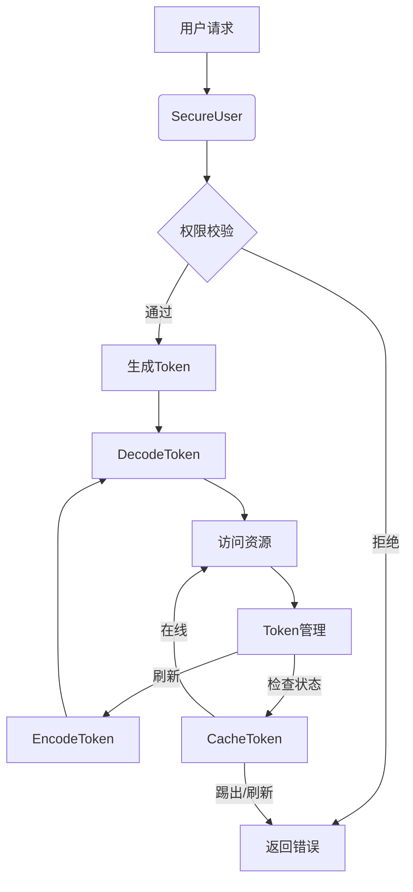
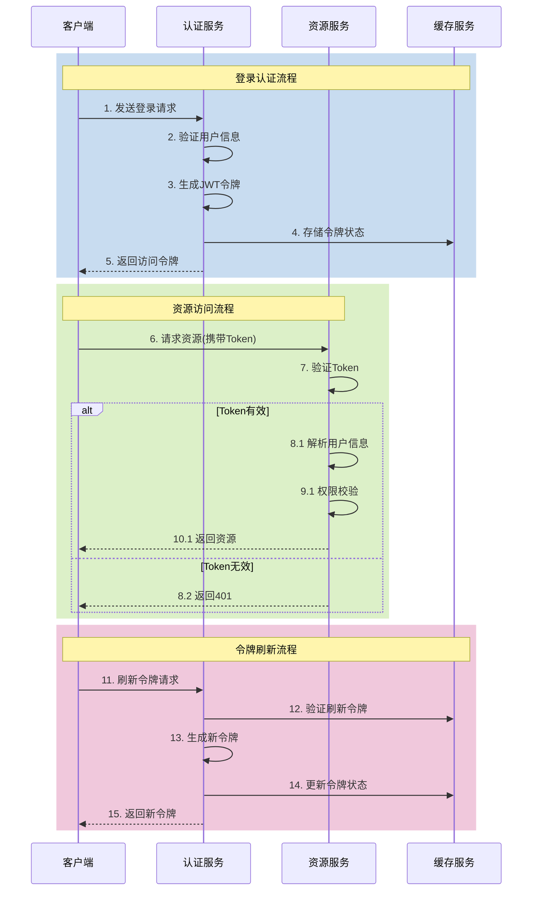
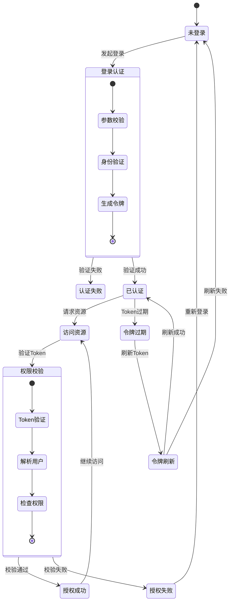
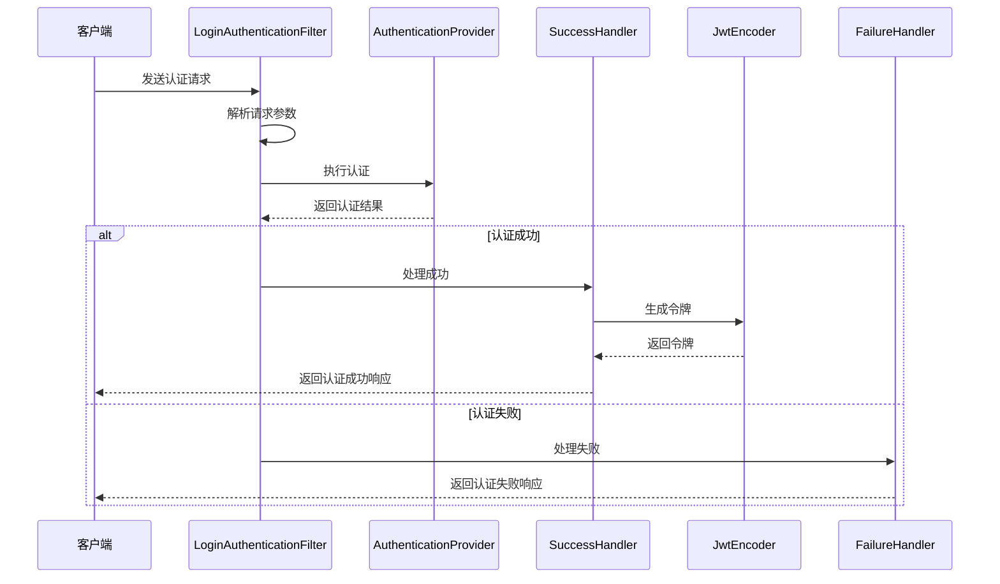

<!-- p -->
gruul-common-security-model

安全认证模块，提供用户认证、权限管理和令牌处理等安全相关功能。

<!-- p -->
SecurityModelI18NLoader 国际化资源配置加载器

**完整类名**：com.medusa.gruul.common.security.model.SecurityModelI18NLoader  
**作者**：张治保 | 
**创建日期**：2023/6/16  
**核心价值**：负责加载安全模块的国际化资源文件，支持多语言错误消息和提示信息的显示

<!-- c -->
设计目标与使用场景

1. 负责加载安全模块的国际化资源文件
2. 支持多语言错误消息和提示信息的显示
3. 通过实现I18NPropertiesLoader接口，指定i18n/security路径下的资源文件

**方法清单**：
- paths()：获取国际化资源文件路径，指定i18n/security路径下的资源文件


<!-- p -->
SecurityModelI18NLoader.paths方法

<!-- c -->
**定位**：SecurityModelI18NLoader.paths
**功能**：获取国际化资源文件路径
**重载说明**：无重载方法
**参数说明**：无
**返回值**：
- 国际化资源文件路径集合

```java
@Override
@NonNull
public Set<String> paths() {
    return Set.of("i18n/security");
}
```

<!-- p -->
CacheToken 令牌缓存模型

<!-- c -->
- **完整类名**: com.medusa.gruul.common.security.model.bean.CacheToken
- **作者**: 张治保
- **日期**: 2023/11/23

**主要功能**: 
- 管理令牌的缓存状态
- 跟踪令牌的在线状态、是否被踢出或需要刷新等状态变化
- 存储令牌的有效性状态和异常信息

**主要属性**:
- `state`: 令牌状态
- `message`: 异常状态提示消息

**完整代码**:
```java
package com.medusa.gruul.common.security.model.bean;

import com.medusa.gruul.common.security.model.enums.TokenState;
import lombok.*；
import java.io.Serializable;

/**
 * 令牌缓存模型
 * 用于管理令牌的缓存状态和相关信息
 *
 * @author 张治保
 * @since 2023/11/23
 */
@Getter
@Setter
@ToString
@Accessors(chain = true)
public class CacheToken implements Serializable {

	/**
	 * 令牌ID字段名
	 */
	public static final String TOKEN_ID_FILED = "tokenId";
	
	/**
	 * 令牌状态字段名
	 */
	public static final String STATE_FILED = "state";
	
	/**
	 * 异常消息字段名
	 */
	public static final String MESSAGE_FILED = "message";

	/**
	 * 令牌状态
	 * 包括在线、被踢出、需要刷新等状态
	 */
	private TokenState state;

	/**
	 * 异常状态提示消息
	 * 当令牌状态异常时的说明信息
	 */
	private String message;
}
```

<!-- p -->
DecodeToken 解码后的令牌信息

<!-- c -->
- **完整类名**: com.medusa.gruul.common.security.model.bean.DecodeToken
- **作者**: 张治保
- **日期**: 2023/11/3

**主要功能**: 
- 存储JWT令牌解码后的详细信息
- 包含令牌ID、类型、过期状态、用户信息等
- 用于验证令牌的有效性并提取用户认证信息

**主要属性**:
- `tokenId`: 令牌唯一标识
- `tokenType`: 令牌类型
- `expired`: 是否过期
- `secureUser`: 用户信息
- `issuedAt`: 签发时间
- `expireAt`: 过期时间

**完整代码**:
```java
package com.medusa.gruul.common.security.model.bean;

import com.medusa.gruul.common.security.model.enums.TokenType;
import lombok.Getter;
import lombok.Setter;
import lombok.ToString;
import lombok.experimental.Accessors;

import java.io.Serializable;
import java.time.LocalDateTime;

/**
 * 解码后的令牌信息
 * 存储JWT令牌解码后的详细信息
 *
 * @author 张治保
 * @since 2023/11/3
 */
@Getter
@Setter
@ToString
@Accessors(chain = true)
public class DecodeToken implements Serializable {

	/**
	 * 令牌唯一标识
	 * JWT的jti声明
	 */
	private String tokenId;

	/**
	 * 令牌类型
	 * 区分访问令牌和刷新令牌
	 */
	private TokenType tokenType;

	/**
	 * 是否过期
	 * 标识令牌是否已经过期
	 */
	private boolean expired;

	/**
	 * 用户信息
	 * 令牌关联的用户详细信息
	 */
	private SecureUser<?> secureUser;

	/**
	 * 签名时间
	 * 令牌的签发时间
	 */
	private LocalDateTime issuedAt;

	/**
	 * 过期时间
	 * 令牌的过期时间
	 */
	private LocalDateTime expireAt;
}
```

<!-- p -->
EncodeToken 令牌编码信息

<!-- c -->
- **完整类名**: com.medusa.gruul.common.security.model.bean.EncodeToken
- **作者**: 张治保
- **日期**: 2023/11/2

**主要功能**: 
- 封装生成的令牌信息
- 包含令牌值、过期时间等信息
- 用于向客户端返回新生成的访问令牌和刷新令牌信息

**主要属性**:
- `value`: 令牌值
- `expireAt`: 过期时间
- `expiresIn`: 过期时长（秒）

**完整代码**:
```java
package com.medusa.gruul.common.security.model.bean;

import lombok.Getter;
import lombok.Setter;
import lombok.ToString;
import lombok.experimental.Accessors;

import java.io.Serializable;
import java.time.LocalDateTime;

/**
 * @author 张治保
 * @since 2023/11/2
 */
@Getter
@Setter
@Accessors(chain = true)
@ToString
public class EncodeToken implements Serializable {

    /**
     * token
     */
    private String value;

    /**
     * 过期时间
     */
    private LocalDateTime expireAt;

    /**
     * 过期时长 单位：秒
     */
    private Long expiresIn;

}
```

<!-- p -->
SecureUser 安全用户模型

<!-- c -->
- **完整类名**: com.medusa.gruul.common.security.model.bean.SecureUser
- **作者**: 张治保
- **日期**: 2022/2/26

**主要功能**: 
- 作为核心用户安全信息载体
- 存储用户的身份认证和授权信息
- 支持匿名用户和黑名单检查
- 提供安全的数据开放机制
- 管理用户ID、角色、权限等核心安全属性

**主要属性**:
- `clientType`: 客户端类型
- `shopId`: 店铺ID
- `id`: 用户ID
- `roles`: 用户角色集合
- `perms`: 用户权限集合

**主要方法**:
- `isAnonymous()`: 判断是否匿名用户
- `isBlack()`: 判断是否黑名单用户
- `open()`: 获取开放数据并清空

**完整代码**:
```java

/**
 * 安全用户 匿名用户 id为空
 *
 * @author 张治保
 * date 2022/2/26
 */
@Getter
@Setter
@Accessors(chain = true)
public final class SecureUser<T> implements Serializable {

    /**
     * 客户端类型
     */
    private ClientType clientType;

    /**
     * shopId
     */
    private Long shopId;

    /**
     * 用户id 匿名用户id为空
     */
    private Long id;

    /**
     * 昵称
     */
    private String nickname;

    /**
     * 用户名
     */
    private String username;

    /**
     * 密码
     */
    private String mobile;

    /**
     * 邮件
     */
    private String email;

    /**
     * 微信 open id
     */
    private String openid;

    /**
     * 用户角色集合
     */
    private Set<Roles> roles = Set.of();

    /**
     * 副角色
     */
    private Set<Roles> subRoles = Set.of();

    /**
     * 用户权限集合
     */
    private Set<String> perms = Set.of();

    /**
     * 额外信息
     */
    private T extra;

    /**
     * 开放的信息 可用于展示给前端
     */
    private Map<String, Object> open = Map.of();

    /**
     * 是否是匿名用户
     *
     * @return true 是 false 不是
     */
    public boolean isAnonymous() {
        return getId() == null;
    }

    /**
     * 是否是黑名单用户
     */
    public boolean isBlack() {
        return getSubRoles().contains(Roles.BLACK_LIST);
    }

    /**
     * 获取开放数据 并清空
     *
     * @return 开放数据
     */
    public Map<String, Object> open() {
        try {
            return open;
        } finally {
            this.setOpen(null);
        }
    }
}
```

<!-- p -->
TokenKey 令牌键

<!-- c -->
- **完整类名**: com.medusa.gruul.common.security.model.bean.TokenKey
- **作者**: 张治保
- **日期**: 2024/5/22

**主要功能**: 
- 提供令牌的唯一标识和索引机制
- 结合客户端类型、店铺ID、用户ID和令牌ID构建复合键
- 确保令牌的唯一性和可追踪性

**主要属性**:
- `clientType`: 客户端类型
- `shopId`: 店铺ID
- `userId`: 用户ID
- `tokenId`: 令牌ID

**完整代码**:
```java
package com.medusa.gruul.common.security.model.bean;

import com.medusa.gruul.common.system.model.model.ClientType;
import lombok.*;

/**
 * @author 张治保
 * @since 2024/5/22
 */
@Getter
@Setter
@ToString
@AllArgsConstructor
@NoArgsConstructor
@EqualsAndHashCode
public class TokenKey implements java.io.Serializable {
    /**
     * 客户端类型
     */
    private ClientType clientType;

    /**
     * 店铺id
     */
    private Long shopId;

    /**
     * 用户id
     */
    private Long userId;

    /**
     * token id
     */
    private String tokenId;

}
```

<!-- p -->
UserMatch 用户匹配结果

<!-- c -->
- **完整类名**: com.medusa.gruul.common.security.model.bean.UserMatch
- **作者**: 张治保
- **日期**: 2023/4/11

**主要功能**: 
- 封装用户权限匹配的结果
- 存储匹配是否成功的标志
- 保存相关的用户信息
- 用于权限验证过程中的结果传递

**主要属性**:
- `success`: 是否权限匹配成功
- `secureUser`: 当前用户信息

**完整代码**:
```java
package com.medusa.gruul.common.security.model.bean;

import lombok.Builder;
import lombok.Getter;
import lombok.Setter;

/**
 * user match
 *
 * @author 张治保
 * date 2023/4/11
 */
@Getter
@Setter
@Builder
public class UserMatch implements java.io.Serializable {

	/**
	 * 是否权限匹配成功
	 */
	private boolean success;

	/**
	 * 当前用户信息
	 */
	private SecureUser secureUser;
}
```

<!-- p -->
SecureCode 安全异常代码常量

<!-- c -->
- **完整类名**: com.medusa.gruul.common.security.model.constant.SecureCode
- **作者**: 张治保
- **日期**: 2022/2/28

**主要功能**: 
- 定义安全模块所有异常状态的错误码常量
- 包括登录状态、令牌状态、权限验证等错误码
- 提供统一的错误处理机制
- 支持多种安全相关的错误场景

**主要常量**:
- `NEED_LOGIN`: 需要登录
- `TOKEN_INVALID`: token不可用
- `TOKEN_EXPIRED`: token已过期
- `PERMISSION_DENIED`: 权限不足

**完整代码**:
```java
package com.medusa.gruul.common.security.model.constant;

import com.medusa.gruul.global.model.constant.GlobalCode;

/**
 * 异常代码
 *
 * @author 张治保
 * date 2022/2/28
 */
public interface SecureCode {

    /**
     * 需要登录
     */
    int NEED_LOGIN = 2;
    /**
     * token不可用
     */
    int TOKEN_INVALID = 3;
    /**
     * token已过期
     */
    int TOKEN_EXPIRED = 4;
    /**
     * refresh token不可用
     */
    int REFRESH_TOKEN_INVALID = 5;
    /**
     * refresh token 已过期
     */
    int REFRESH_TOKEN_EXPIRED = 6;
    /**
     * 权限不足
     */
    int PERMISSION_DENIED = 7;

    /**
     * 账号已过期
     */
    int ACCOUNT_EXPIRED = 8;
    /**
     * 密码有误
     */
    int USERNAME_PASSWORD_INVALID = 9;

    /**
     * clientId invalid;
     */
    int TOKEN_CHANGED = 10;
    /**
     * scope invalid
     */
    int SCOPE_INVALID = 11;
    /**
     * REQUEST_INVALID
     */
    int REQUEST_INVALID = GlobalCode.REQUEST_INVALID;
    /**
     * UNSUPPORTED_RESPONSE_TYPE
     */
    int RESPONSE_TYPE_INVALID = 13;
    /**
     * 拒绝访问
     */
    int ACCESS_DENIED = 14;
    /**
     * 重定向地址不可用
     */
    int REDIRECT_URI_INVALID = 15;
    /**
     * 授权不可用
     */
    int GRANT_INVALID = 16;
    /**
     * 账号不可用
     */
    int ACCOUNT_INVALID = 17;
    /**
     * 服务不可用
     */
    int AUTH_SERVER_ERROR = 18;
    /**
     * 票据已过期
     */
    int CREDENTIALS_EXPIRED = 19;

    /**
     * 无效的验证码
     */
    int SMS_CAPTCHA_INVALID = 20;

    /**
     * 用户拒绝授权
     */
    int USER_DENIED_AUTHORIZATION = 21;

    /**
     * 登录数据校验失败
     */
    int DATA_VALID_ERROR = 22;

    /**
     * 未分配权限
     */
    int UNALLOCATED_PERMISSION = 23;


}
```

<!-- p -->
SecureConst 安全常量定义

<!-- c -->
- **完整类名**: com.medusa.gruul.common.security.model.constant.SecureConst
- **作者**: 张治保
- **日期**: 2022/4/19

**主要功能**: 
- 定义安全模块的常量配置
- 管理用户昵称前缀、登录状态检查键
- 提供消息模板和目标地址渲染功能
- 支持多客户端消息推送

**主要常量**:
- `DEFAULT_USER_NICKNAME_PREFIX`: 默认用户昵称前缀
- `USER_LOGIN_STATE_CHECK`: 用户登录检查
- `DESTINATION_ALL_USER`: 全部用户消息模板
- `DESTINATION_SHOP_USER`: 指定店铺用户消息模板

**主要方法**:
- `destination()`: 消息destination渲染

**完整代码**:
```java
package com.medusa.gruul.common.security.model.constant;

import cn.hutool.core.util.StrUtil;
import com.medusa.gruul.common.system.model.model.ClientType;

import java.util.Set;

/**
 * 常量
 *
 * @author 张治保
 * date 2022/4/19
 */
public interface SecureConst {

    String TOKEN_CACHE_KEY = "gruul:mall:uaa:token:";

    /**
     * 默认的用具昵称前缀
     */
    String DEFAULT_USER_NICKNAME_PREFIX = "U";

    /**
     * 用户登录检查 最后一个参数为shopId 店铺id
     */
    String USER_LOGIN_STATE_CHECK = "gruul:mall:uaa:login:user";

    /**
     * 用户消息模板 最后一个参数为客户端占位符
     */
    String DESTINATION_ALL_USER = "/topic/pigeon-to-{}";

    /**
     * 指定店铺的用户的消息模板
     * 第一个参数为客户端占位符 第二个参数为店铺id占位符
     */
    String DESTINATION_SHOP_USER = DESTINATION_ALL_USER + "-{}";

    /**
     * 指定用户的消息模板
     * 第一个参数为客户端占位符 第二个参数为店铺id占位符 第三个参数为用户id占位符
     */
    String DESTINATION_SHOP_MARKED_USER = DESTINATION_SHOP_USER + "-{}";


    /**
     * 所有的消息模板
     */
    Set<String> ALL_DESTINATION_TEMPLATE = Set.of(
            SecureConst.DESTINATION_ALL_USER,
            SecureConst.DESTINATION_SHOP_USER,
            SecureConst.DESTINATION_SHOP_MARKED_USER
    );

    /**
     * 消息 destination 渲染
     *
     * @param template   destination模板
     * @param clientType 客户端类型
     * @param shopId     店铺id
     * @param userId     用户id
     * @return destination
     */
    static String destination(String template, ClientType clientType, Long shopId, Long userId) {
        return StrUtil.format(template, clientType.name(), shopId, userId);
    }

}
```

<!-- p -->
MenuType 菜单类型枚举

<!-- c -->
- **完整类名**: com.medusa.gruul.common.security.model.enums.MenuType
- **作者**: 张治保
- **日期**: 2022/2/23

**主要功能**: 
- 定义系统菜单的类型层次
- 包括目录、菜单、接口和按钮四种类型
- 标识各类型是否可以包含子节点
- 用于构建系统的权限菜单树

**枚举值**:
- `CATALOG`: 目录
- `MENU`: 菜单
- `API`: 接口
- `BUTTON`: 按钮

**完整代码**:
```java
package com.medusa.gruul.common.security.model.enums;

import com.baomidou.mybatisplus.annotation.EnumValue;
import lombok.Getter;
import lombok.RequiredArgsConstructor;

/**
 * @author 张治保
 * date 2022/2/23
 */
@Getter
@RequiredArgsConstructor
public enum MenuType {
    /**
     * 目录
     */
    CATALOG(0, true),

    /**
     * 菜单
     */
    MENU(1, true),

    /**
     * 接口
     */
    API(2, false),

    /**
     * 按钮
     */
    BUTTON(3, false);

    /**
     * mysql 值映射
     */
    @EnumValue
    private final Integer value;

    /**
     * 是否有子节点
     */
    private final boolean hasChildren;
}
```

<!-- p -->
Roles 角色枚举

<!-- c -->
**类元数据**
完整类名: com.medusa.gruul.common.security.model.enums.Roles  
作者: 张治保 | 创建日期: 2022/2/23  
核心功能: 管理系统角色权限体系，控制接口访问和消息路由规则

<!-- c -->
**完整枚举清单**
• DEVELOPER - 开发者（开发者控制台权限）
• SUPER_ADMIN - 超级管理员（平台级最大权限）
• USER - 普通用户（消费者端基础权限）
• FORBIDDEN_COMMENT - 禁止评论（受限用户）
• FORBIDDEN_ORDER - 禁止下单（受限用户） 
• BLACK_LIST - 黑名单（完全禁用账户）
• SUPER_CUSTOM_ADMIN - 子超级管理员（平台自定义权限）
• ADMIN - 管理员（店铺级最大权限）
• CUSTOM_ADMIN - 子管理员（店铺自定义权限）
• SHOP_STORE - 店铺门店（门店操作权限）
• ANCHOR - 主播（直播端特殊权限）
• SUPPLIER_ADMIN - 供应商管理员（供应商管理权限）
• SUPPLIER_CUSTOM_ADMIN - 供应商子管理员

<!-- p -->
SecureCodes 安全错误码枚举
<!-- c -->
- **完整类名**: com.medusa.gruul.common.security.model.enums.SecureCodes
- **作者**: 张治保
- **日期**: 2022/4/20

**主要功能**: 
- 提供安全相关错误的枚举定义
- 包含详细的错误代码和国际化消息键
- 支持多语言错误信息展示
- 用于统一的安全异常处理

**主要枚举值**:
- `NEED_LOGIN`: 需要登录
- `TOKEN_INVALID`: token不可用
- `TOKEN_EXPIRED`: token已过期
- `PERMISSION_DENIED`: 权限不足

**完整代码**:
```java
package com.medusa.gruul.common.security.model.enums;

import com.medusa.gruul.common.security.model.constant.SecureCode;
import com.medusa.gruul.global.i18n.I18N;
import com.medusa.gruul.global.model.exception.Error;
import lombok.RequiredArgsConstructor;

/**
 * @author 张治保
 * date 2022/4/20
 */
@RequiredArgsConstructor
public enum SecureCodes implements Error {
    /**
     * 需要登录
     */
    NEED_LOGIN(SecureCode.NEED_LOGIN, "auth.need.login"),
    /**
     * token不可用
     */
    TOKEN_INVALID(SecureCode.TOKEN_INVALID, "auth.token.invalid"),
    /**
     * token已过期
     */
    TOKEN_EXPIRED(SecureCode.TOKEN_EXPIRED, "auth.token.expired"),
    /**
     * refresh token不可用
     */
    REFRESH_TOKEN_INVALID(SecureCode.REFRESH_TOKEN_INVALID, "auth.refresh.token.invalid"),
    /**
     * refresh token 已过期
     */
    REFRESH_TOKEN_EXPIRED(SecureCode.REFRESH_TOKEN_EXPIRED, "auth.refresh.token.expired"),
    /**
     * 权限不足
     */
    PERMISSION_DENIED(SecureCode.PERMISSION_DENIED, "auth.access.denied"),

    /**
     * 账号已过期（账号数据变更） 尝试重新登录
     */
    ACCOUNT_EXPIRED(SecureCode.ACCOUNT_EXPIRED, "auth.account.expired"),
    /**
     * 密码有误
     */
    USERNAME_PASSWORD_INVALID(SecureCode.USERNAME_PASSWORD_INVALID, "auth.username.password.invalid"),
    /**
     * TOKEN 发生变化 已在其它地方登录
     */
    TOKEN_CHANGED(SecureCode.TOKEN_CHANGED, "auth.token.changed"),
    /**
     * scope invalid
     */
    SCOPE_INVALID(SecureCode.SCOPE_INVALID, "auth.scope.invalid"),
    /**
     * REQUEST_INVALID
     */
    REQUEST_INVALID(SecureCode.REQUEST_INVALID, "auth.request.invalid"),
    /**
     * UNSUPPORTED_RESPONSE_TYPE
     */
    RESPONSE_TYPE_INVALID(SecureCode.RESPONSE_TYPE_INVALID, "auth.response.type.invalid"),
    /**
     * 无访问权限
     */
    ACCESS_DENIED(SecureCode.ACCESS_DENIED, "auth.access.denied"),
    /**
     * 重定向地址不可用
     */
    REDIRECT_URI_INVALID(SecureCode.REDIRECT_URI_INVALID, "auth.redirect.uri.invalid"),
    /**
     * 授权不可用
     */
    GRANT_INVALID(SecureCode.GRANT_INVALID, "auth.grant.invalid"),
    /**
     * 账号不可用
     */
    ACCOUNT_INVALID(SecureCode.ACCOUNT_INVALID, "auth.account.invalid"),
    /**
     * 服务不可用
     */
    AUTH_SERVER_ERROR(SecureCode.AUTH_SERVER_ERROR, "auth.server.error"),
    /**
     * 票据已过期
     */
    CREDENTIALS_EXPIRED(SecureCode.CREDENTIALS_EXPIRED, "auth.credentials.expired"),
    /**
     * 数据校验失败
     */
    DATA_VALID_ERROR(SecureCode.DATA_VALID_ERROR, "auth.data.valid.error"),
    /**
     * 未分配权限
     */
    UNALLOCATED_PERMISSION(SecureCode.UNALLOCATED_PERMISSION, "auth.unallocated.permission"),
    ;

    private final int code;
    private final String msg;

    @Override
    public int code() {
        return code;
    }

    @Override
    public String msg() {
        return I18N.msg(msg);
    }
}
```

<!-- p -->
TokenState 令牌状态枚举

<!-- c -->
- **完整类名**: com.medusa.gruul.common.security.model.enums.TokenState
- **作者**: 张治保
- **日期**: 2023/11/23

**主要功能**: 
- 定义令牌的各种状态
- 管理在线、被踢出和需要刷新等状态
- 用于令牌的生命周期管理
- 支持令牌状态的跟踪和变更

**枚举值**:
- `ONLINE`: 有效
- `KICK`: 被主动下线
- `REFRESH`: 重置用户资料

**完整代码**:
```java
package com.medusa.gruul.common.security.model.enums;

import lombok.Getter;
import lombok.RequiredArgsConstructor;

/**
 * @author 张治保
 * @since 2023/11/23
 */
@RequiredArgsConstructor
@Getter
public enum TokenState {

    /**
     * 有效
     */
    ONLINE,

    /**
     * 被主动下线
     */
    KICK,

    /**
     * 重置用户资料
     */
    REFRESH

}
```

<!-- p -->
TokenType 令牌类型枚举

<!-- c -->
- **完整类名**: com.medusa.gruul.common.security.model.enums.TokenType
- **作者**: 张治保
- **日期**: 2023/11/3

**主要功能**: 
- 定义系统支持的令牌类型
- 包括访问令牌和刷新令牌
- 关联相应的过期和无效状态错误码
- 用于令牌的类型管理和状态判断

**枚举值**:
- `T`: 访问令牌
- `RT`: 刷新令牌

**常量**:
- `TYPE`: claim type key
- `KEY`: claim payload key

**完整代码**:
```java
package com.medusa.gruul.common.security.model.enums;

import lombok.Getter;
import lombok.RequiredArgsConstructor;

/**
 * @author 张治保
 * @since 2023/11/3
 */

@Getter
@RequiredArgsConstructor
public enum TokenType {
    /**
     * token
     */
    T(SecureCodes.TOKEN_EXPIRED, SecureCodes.TOKEN_INVALID),

    /**
     * 刷新token
     */
    RT(SecureCodes.REFRESH_TOKEN_EXPIRED, SecureCodes.REFRESH_TOKEN_INVALID);
    /**
     * claim type key
     */
    public static final String TYPE = "T";
    /**
     * claim payload key
     */
    public static final String KEY = "K";

    /**
     * 过期code异常
     */
    private final SecureCodes expired;

    /**
     * token 失效 code 异常
     */
    private final SecureCodes invalid;


}
```

<!-- p -->
UserStatus 用户状态枚举

<!-- c -->
- **完整类名**: com.medusa.gruul.common.security.model.enums.UserStatus
- **作者**: 张治保
- **日期**: 2022/2/24

**主要功能**: 
- 定义用户账号的各种状态
- 包括正常、过期、锁定等状态
- 管理用户账号的状态变更
- 支持用户状态的判断和处理

**枚举值**:
- `NORMAL`: 正常
- `EXPIRED`: 已过期
- `LOCKED`: 已锁定
- `CREDENTIALS_EXPIRED`: 凭证已过期
- `UNAVAILABLE`: 不可用

**完整代码**:
```java
package com.medusa.gruul.common.security.model.enums;

import com.baomidou.mybatisplus.annotation.EnumValue;
import lombok.Getter;
import lombok.RequiredArgsConstructor;

/**
 * @author 张治保
 * date 2022/2/24
 */
@Getter
@RequiredArgsConstructor
public enum UserStatus {
    /**
     * 正常
     */
    NORMAL(0),
    /**
     * 已过期
     */
    EXPIRED(1),
    /**
     * 已锁定
     */
    LOCKED(2),
    /**
     * 凭证已过期
     */
    CREDENTIALS_EXPIRED(3),
    /**
     * 不可用
     */
    UNAVAILABLE(4);

    @EnumValue
    private final Integer value;
}
```
<!-- p -->
安全模块关系图

<!-- c -->

<!-- p -->
gruul-common-security-client

安全认证客户端模块，提供JWT解析、鉴权等核心功能。

<!-- p -->
ISecurity 安全服务工具接口
<!-- c -->
- **完整类名**: com.medusa.gruul.common.security.resource.helper.ISecurity
- **作者**: 张治保

**主要功能**: 
- 提供核心安全服务工具方法
- 管理用户认证状态和上下文
- 处理令牌的生命周期
- 支持用户在线状态管理
- 提供角色权限匹配功能

**主要常量**:
- `ANONYMOUS_CLASS`: 匿名访问类型
- `HEADER`: token头
- `TOKEN_CACHE_KEY`: 令牌缓存键前缀

**主要方法**:
- `withAuthentication()`: 在指定认证信息下执行操作
- `getAuthentication()`: 获取认证信息
- `userOpt()`: 获取可能为空的用户信息
- `userMust()`: 获取必须存在的用户信息
- `secureUser()`: 获取当前用户信息
- `isAnonymous()`: 判断是否匿名访问
- `isAuthenticated()`: 判断是否已认证
- `match()`: 角色权限匹配
- `matcher()`: 获取匹配器
- `refreshUsers()`: 刷新用户信息
- `kickUsers()`: 踢出用户
- `offlineUsers()`: 用户下线
- `onlineUser()`: 用户上线

**内部类**:
- `ExtraRef`: 用于存储和获取额外数据类型

<!-- p -->
userOpt 获取可能为空的用户信息
<!-- c -->
**定位**：ISecurity.userOpt  
**核心功能**：获取可能为空的用户信息

**方法代码实现**：
```java
static <T> Option<SecureUser<T>> userOpt() {
    SecureUser<T> user = ISecurity.secureUser();
    if (user.isAnonymous()) {
        return Option.none();
    }
    return Option.of(user);
}
```

<!-- p -->
userMust 必须要有登陆认证的用户信息
<!-- c -->
**定位**：ISecurity.userMust  
**核心功能**：获取必须存在的用户信息

**方法代码实现**：
```java
static <T> SecureUser<T> userMust() {
    Authentication authentication = getAuthentication(false);
    if (authentication == null) {
        throw SecureCodes.NEED_LOGIN.exception();
    }
    return userMust(authentication);
}

static <T> SecureUser<T> userMust(@NonNull Authentication authentication) {
    SecureUser<T> user = ISecurity.matcher(authentication)
            .getUser();
    if (user.isAnonymous()) {
        throw SecureCodes.NEED_LOGIN.exception();
    }
    return user;
}
```

<!-- p -->
secureUser 获取当前用户信息
<!-- c -->
**定位**：ISecurity.secureUser  
**核心功能**：获取当前用户信息

**方法代码实现**：
```java
static <T> SecureUser<T> secureUser() {
    return ISecurity.secureUser(ISecurity.getAuthentication(true));
}

static <T> SecureUser<T> secureUser(@NonNull Authentication authentication) {
    return ISecurity.matcher(authentication)
            .getUser();
}
```

<!-- p -->
isAnonymous 判断是否是匿名访问
<!-- c -->
**定位**：ISecurity.isAnonymous  
**核心功能**：判断是否是匿名访问

**方法代码实现**：
```java
static boolean isAnonymous(Authentication authentication) {
    return authentication == null || ANONYMOUS_CLASS.isAssignableFrom(authentication.getClass());
}

static boolean isAnonymous() {
    return ISecurity.matcher().getUser().isAnonymous();
}
```

<!-- p -->
isAuthenticated 判断是否已认证
<!-- c -->
**定位**：ISecurity.isAuthenticated  
**核心功能**：判断用户是否已认证

**方法代码实现**：
```java
static boolean isAuthenticated() {
    return !ISecurity.isAnonymous();
}
```

<!-- p -->
match 角色权限匹配
<!-- c -->
**定位**：ISecurity.match  
**核心功能**：每个角色对应不同的处理任务

**方法代码实现**：
```java
static RoleTask match() {
    return new RoleTask();
}
```

<!-- p -->
matcher 获取用户与权限匹配器
<!-- c -->
**定位**：ISecurity.matcher  
**核心功能**：获取用户与权限匹配器

**方法代码实现**：
```java
static IUserRolePermMatcher matcher() {
    return ISecurity.matcher(ISecurity.getAuthentication(true));
}

static IUserRolePermMatcher matcher(Authentication authentication) {
    return new RolePermMatcher(authentication);
}
```

<!-- p -->
refreshUsers 用户重置
<!-- c -->
**定位**：ISecurity.refreshUsers  
**核心功能**：用户资料更新，触发用户重新加载个人最新信息

**方法代码实现**：
```java
static void refreshUsers(ClientType type, Long shopId, Set<Long> userIds) {
    updateUsersState(
            type,
            shopId,
            userIds,
            TokenState.REFRESH,
            StrUtil.EMPTY
    );
}

static void refreshUsers(Set<Long> userIds) {
    Set<String> keys = RedisUtil.scan(
            userIds.stream()
                    .map(
                            userId -> RedisUtil.key(
                                    SecureConst.USER_LOGIN_STATE_CHECK,
                                    '*',
                                    '*',
                                    userId.toString(),
                                    '*'
                            )
                    ).collect(Collectors.toSet())
    );
    if (CollUtil.isEmpty(keys)) {
        return;
    }
    updateUsersState(keys, TokenState.REFRESH, StrUtil.EMPTY);
}
```

<!-- p -->
kickUsers 把登录状态的用户踢出
<!-- c -->
**定位**：ISecurity.kickUsers  
**核心功能**：踢出指定用户

**方法代码实现**：
```java
static void kickUsers(ClientType type, Long shopId, Set<Long> userIds, String message) {
    updateUsersState(
            type,
            shopId,
            userIds,
            TokenState.KICK,
            message
    );
}
```

<!-- p -->
offlineUsers 禁用店铺id下的部分指定用户
<!-- c -->
**定位**：ISecurity.offlineUsers  
**核心功能**：禁用指定用户

**方法代码实现**：
```java
static void offlineUsers(ClientType type, Long shopId, Long... userIds) {
    ISecurity.offlineUsers(type, shopId, Set.of(userIds));
}

static void offlineUsers(ClientType type, Long shopId, Collection<Long> userIds) {
    if (CollUtil.isEmpty(userIds)) {
        return;
    }
    RedisUtil.matchThenDelete(
            allUserPatternKeys(type, shopId, userIds)
    );
}
```

<!-- p -->
onlineUser 新增店铺id下的用户上线
<!-- c -->
**定位**：ISecurity.onlineUser  
**核心功能**：用户上线

**方法代码实现**：
```java
static void onlineUser(OnlineUserParam onlineUser) {
    String tokenKey = ISecurity.tokenKey(
            new TokenKey(
                    onlineUser.getClientType(),
                    onlineUser.getShopId(),
                    onlineUser.getUserId(),
                    onlineUser.getTokenId()
            )
    );
    RedisUtil.executePipelined(
            operations -> {
                HashOperations<String, String, Object> hashOperations = operations.opsForHash();
                hashOperations.put(tokenKey, CacheToken.STATE_FILED, TokenState.ONLINE.name());
                operations.expireAt(tokenKey, onlineUser.refreshTokenExpire());
            }
    );
}
```

<!-- p -->
getCacheToken 获取缓存的 tokenId
<!-- c -->
**定位**：ISecurity.getCacheToken  
**核心功能**：获取缓存的 tokenId

**方法代码实现**：
```java
static Option<CacheToken> getCacheToken(TokenKey tokenKey) {
    return Option.of(
            RedisUtil.getCacheMap(
                    ISecurity.tokenKey(tokenKey),
                    CacheToken.class
            )
    );
}
```

<!-- p -->
tokenKey 生成 token key 前缀
<!-- c -->
**定位**：ISecurity.tokenKey  
**核心功能**：生成 token key 前缀

**方法代码实现**：
```java
static String tokenKey(TokenKey tokenKey) {
    return RedisUtil.key(
            SecureConst.USER_LOGIN_STATE_CHECK,
            tokenKey.getClientType().name(),
            tokenKey.getShopId().toString(),
            tokenKey.getUserId().toString(),
            tokenKey.getTokenId()
    );
}
```

<!-- p -->
tokenPattern 生成 token key 匹配前缀
<!-- c -->
**定位**：ISecurity.tokenPattern  
**核心功能**：生成 token key 匹配前缀

**方法代码实现**：
```java
static String tokenPattern(ClientType clientType, Long shopId) {
    return RedisUtil.key(
            SecureConst.USER_LOGIN_STATE_CHECK,
            clientType.name(),
            shopId.toString(),
            "*"
    );
}
```

<!-- p -->
generateNickName 当前用户名与用户id后六位生成用户昵称
<!-- c -->
**定位**：ISecurity.generateNickName  
**核心功能**：生成用户昵称

**方法代码实现**：
```java
static Option<String> generateNickName(String current, Long userId) {
    return Option.when(StrUtil.isNotBlank(current), current)
            .orElse(
                    ISecurity.generateNickName(userId)
            );
}

static Option<String> generateNickName(Long userId) {
    return Option.of(userId)
            .map(id -> {
                String idStr = String.valueOf(id);
                return SecureConst.DEFAULT_USER_NICKNAME_PREFIX + StrUtil.subSufByLength(idStr, 6);
            });
}
```

<!-- p -->
toPrincipal user信息转 principal 加密后的用户数据
<!-- c -->
**定位**：ISecurity.toPrincipal  
**核心功能**：user信息转 principal 加密后的用户数据

**方法代码实现**：
```java
static byte[] toPrincipal(SecureUser<?> secureUser) {
    return JSONB.toBytes(
            secureUser,
            JSONWriter.Feature.FieldBased,
            JSONWriter.Feature.BeanToArray,
            JSONWriter.Feature.ReferenceDetection,
            JSONWriter.Feature.NotWriteDefaultValue,
            JSONWriter.Feature.NotWriteEmptyArray
    );
}
```

<!-- p -->
toUser principal 加密后的用户数据 用户主要信息
<!-- c -->
**定位**：ISecurity.toUser  
**核心功能**：principal 加密后的用户数据 用户主要信息

**方法代码实现**：
```java
static SecureUser<?> toUser(byte[] principal) {
    return JSONB.parseObject(
            principal,
            ExtraRef.get(),
            JSONReader.Feature.FieldBased,
            JSONReader.Feature.SupportArrayToBean,
            JSONReader.Feature.UseDefaultConstructorAsPossible,
            JSONReader.Feature.UseNativeObject
    );
}
```

<!-- p -->
ExtraRef 用于存储、获取额外数据的类型
<!-- c -->
**定位**：ISecurity.ExtraRef  
**核心功能**：用于存储、获取额外数据的类型

**方法代码实现**：
```java
class ExtraRef {

    private static TypeReference<SecureUser<?>> typeReference = new TypeReference<>() {
    };

    @SuppressWarnings({"unchecked", "rawtypes"})
    public static <T> void set(Class<T> clazz) {
        typeReference = (TypeReference) new TypeReference<SecureUser<T>>(clazz) {
        };
    }

    public static TypeReference<SecureUser<?>> get() {
        return typeReference;
    }
}
```

<!-- p -->
Security 安全服务工具类
<!-- c -->
- **完整类名**: com.medusa.gruul.common.security.resource.helper.Security
- **作者**: 张治保
- **日期**: 2022/2/25

**主要功能**: 
- 提供角色权限管理功能
- 支持平台和商家权限校验
- 管理角色过渡和匹配
- 提供权限验证工具方法

**主要常量**:
- `R`: 角色过渡器
- `DEVELOPER`: 开发者角色
- `PLATFORM_ADMIN`: 平台管理员
- `SHOP_ADMIN`: 商家管理员
- `USER`: 消费者角色

**主要方法**:
- `matcher()`: 获取用户角色权限匹配器
- `consumer()`: 获取角色权限消费器
- `isAuthenticated()`: 判断是否已认证
- `platformPerm()`: 检查平台权限
- `shopPerm()`: 检查商家权限
- `anyPerm()`: 检查任意权限
- `hasPerm()`: 检查权限
<!-- c -->
**完整代码**:
```java
package com.medusa.gruul.common.security.resource.helper;

import com.medusa.gruul.common.security.model.bean.SecureUser;
import com.medusa.gruul.common.security.model.enums.Roles;
import com.medusa.gruul.common.security.resource.extension.IUserRolePermMatcher;
import com.medusa.gruul.common.security.resource.extension.RolePermConsumer;
import org.springframework.stereotype.Component;

import java.util.Set;
import java.util.function.Function;

/**
 * @author 张治保
 * date 2022/2/25
 */
@Component("S")
public final class Security {

    /**
     * 角色过度器
     */
    public static final Roles R = Roles.USER;

    /**
     * 开发者 角色
     */
    public static final Roles DEVELOPER = Roles.DEVELOPER;

    /**
     * 平台管理员
     */
    public static final Roles PLATFORM_ADMIN = Roles.SUPER_ADMIN;

    /**
     * 平台自定义管理员
     */
    public static final Roles PLATFORM_CUSTOM_ADMIN = Roles.SUPER_CUSTOM_ADMIN;

    /**
     * 商家管理员
     */
    public static final Roles SHOP_ADMIN = Roles.ADMIN;

    /**
     * 商家自定义管理员
     */
    public static final Roles SHOP_CUSTOM_ADMIN = Roles.CUSTOM_ADMIN;

    /**
     * 消费者
     */
    public static final Roles USER = Roles.USER;


    /**
     * 获取用户角色集合 func
     */
    public static final Function<SecureUser<?>, Set<Roles>> ROLES = SecureUser::getRoles;

    /**
     * 获取用户副角色集合 func
     */
    public static final Function<SecureUser<?>, Set<Roles>> SUB_ROLES = SecureUser::getSubRoles;

    /**
     * 获取用户权限集合 func
     */
    public static final Function<SecureUser<?>, Set<String>> PERMS = SecureUser::getPerms;


    /**
     * 用户角色权限匹配器
     *
     * @return IRolePermMatcher 角色权限匹配器
     */
    public IUserRolePermMatcher matcher() {
        return ISecurity.matcher();
    }

    /**
     * IRolePermMatcher 消费器 用于给 springEl表达式使用
     *
     * @return RolePermConsumer 消费器
     */
    public RolePermConsumer consumer() {
        return new RolePermConsumer();
    }

    /**
     * 是否已认证
     */
    public boolean isAuthenticated() {
        return ISecurity.isAuthenticated();
    }


    /**
     * 是否有平台权限 管理员直接放行  自定义管理员有权限放行
     *
     * @param perms 权限列表
     * @return 是否有权限
     */
    public boolean platformPerm(String... perms) {
        return this.hasPerm(true, perms);
    }

    /**
     * 是否有商家端 权限
     * 管理员直接放行
     * 自定义管理员 有权限放行
     */
    public boolean shopPerm(String... perms) {
        return this.hasPerm(false, perms);
    }

    /**
     * 任意权限
     *
     * @param platformPerms 平台权限
     * @param shopPerms     商家权限
     */
    public boolean anyPerm(String[] platformPerms, String[] shopPerms) {
        return this.matcher()
                .anyRole(Roles.SUPER_ADMIN, Roles.ADMIN)
                .or(matcher -> matcher.role(Roles.SUPER_CUSTOM_ADMIN).anyPerm(platformPerms))
                        .or(matcher -> matcher.role(Roles.CUSTOM_ADMIN).anyPerm(shopPerms)))
                .match();
    }

    /**
     * 管理员直接放行  自定义管理员有权限放行
     *
     * @param platform 是否是平台 true 平台管理员  false 商家管理员
     * @param perms    权限列表
     * @return 是否有权限
     */
    private boolean hasPerm(boolean platform, String... perms) {
        return ISecurity.matcher()
                .role(platform ? Roles.SUPER_ADMIN : Roles.ADMIN)
                .or(matcher -> matcher.role(platform ? Roles.SUPER_CUSTOM_ADMIN : Roles.CUSTOM_ADMIN).anyPerm(perms))
                .match();
    }


}
```

<!-- p -->
CustomJwtParser JWT解析器
<!-- c -->
- **完整类名**: io.jsonwebtoken.impl.CustomJwtParser
- **作者**: 张治保
- **日期**: 2023/11/29

**主要功能**: 
- 自定义JWT令牌解析实现
- 支持公钥验证签名
- 提供JSON反序列化功能
- 继承DefaultJwtParser扩展功能

**主要属性**:
- `signPublicKey`: JWT签名验证公钥

**主要方法**:
- `deserialize()`: 反序列化JWT载荷
- `CustomJwtParser()`: 构造函数,初始化解析器配置
<!-- c -->
**完整代码**:
```java
package io.jsonwebtoken.impl;

import com.alibaba.fastjson2.JSONB;
import com.alibaba.fastjson2.JSONReader;
import com.medusa.gruul.common.security.resource.tool.jwt.JwtDeserializer;
import io.jsonwebtoken.Jwts;
import io.jsonwebtoken.impl.io.DelegateStringDecoder;
import io.jsonwebtoken.impl.security.ConstantKeyLocator;
import io.jsonwebtoken.io.Decoders;
import io.jsonwebtoken.lang.Objects;
import lombok.SneakyThrows;

import java.io.InputStream;
import java.security.PublicKey;
import java.util.Map;
import java.util.Set;

/**
 * @author 张治保
 * @since 2023/11/29
 */
public final class CustomJwtParser extends DefaultJwtParser {

    @SuppressWarnings("deprecation")
    public CustomJwtParser(PublicKey signPublicKey) {
        super(
                null,
                null, false,
                false,
                new ConstantKeyLocator(signPublicKey, null),
                DefaultClock.INSTANCE,
                Set.of(),
                0,
                (DefaultClaims) Jwts.claims().build(),
                new DelegateStringDecoder(Decoders.BASE64URL),
                new JwtDeserializer<>(),
                null,
                Jwts.ZIP.get(),
                Jwts.SIG.get(),
                Jwts.KEY.get(),
                Jwts.ENC.get()
        );
    }

    @SneakyThrows
    @Override
    protected Map<String, ?> deserialize(InputStream in, String name) {
        try {
            return JSONB.parseObject(in, Map.class, JSONReader.Feature.SupportArrayToBean, JSONReader.Feature.Base64StringAsByteArray);
        } finally {
            Objects.nullSafeClose(in);
        }
    }
}
```

<!-- p -->
SecurityClientAutoconfigure 安全客户端自动配置
<!-- c -->
- **完整类名**: com.medusa.gruul.common.security.resource.SecurityClientAutoconfigure
- **作者**: 张治保
- **日期**: 2022/2/25

**主要功能**: 
- 提供安全模块的自动配置
- 配置密码编码器
- 设置JWT密钥
- 初始化用户详情服务

**主要配置**:
- 启用Web安全配置
- 启用方法安全配置
- 导入相关组件配置

**主要方法**:
- `passwordEncoder()`: 配置默认密码编码器
- `clientJwtSecretKey()`: 配置JWT密钥
- `userDetailsService()`: 配置用户详情服务
<!-- c -->
**完整代码**:
```java
package com.medusa.gruul.common.security.resource;

import com.medusa.gruul.common.security.resource.config.ClientAndTokenStateConfig;
import com.medusa.gruul.common.security.resource.config.SecurityClientConfig;
import com.medusa.gruul.common.security.resource.exception.SecureExceptionAdvice;
import com.medusa.gruul.common.security.resource.helper.Security;
import com.medusa.gruul.common.security.resource.properties.SecurityClientProperties;
import com.medusa.gruul.common.security.resource.tool.ResponseUtil;
import com.medusa.gruul.common.security.resource.tool.jwt.ClientJwtSecretKey;
import com.medusa.gruul.common.security.resource.tool.jwt.JwtDecoder;
import com.medusa.gruul.common.security.resource.tool.jwt.JwtSecurityContextRepository;
import org.springframework.boot.autoconfigure.condition.ConditionalOnMissingBean;
import org.springframework.boot.context.properties.EnableConfigurationProperties;
import org.springframework.context.annotation.Bean;
import org.springframework.context.annotation.Import;
import org.springframework.security.config.annotation.method.configuration.EnableMethodSecurity;
import org.springframework.security.config.annotation.web.configuration.EnableWebSecurity;
import org.springframework.security.core.userdetails.UserDetailsService;
import org.springframework.security.crypto.bcrypt.BCryptPasswordEncoder;
import org.springframework.security.crypto.password.PasswordEncoder;

/**
 * 安全客户端自动配置
 *
 * @author 张治保
 * date 2022/2/25
 */
@Import({
        SecureExceptionAdvice.class,
        Security.class,
        ClientAndTokenStateConfig.class,
        SecurityClientConfig.class,
        JwtDecoder.class,
        JwtSecurityContextRepository.class,
        ResponseUtil.class
})
@EnableWebSecurity
@EnableMethodSecurity(jsr250Enabled = true)
@EnableConfigurationProperties(SecurityClientProperties.class)
public class SecurityClientAutoconfigure {

    /**
     * 默认的密码转换器
     * algorithm
     *
     * @return BCryptPasswordEncoder
     */
    @Bean
    @ConditionalOnMissingBean(PasswordEncoder.class)
    public PasswordEncoder passwordEncoder() {
        return new BCryptPasswordEncoder();
    }

    /**
     * jwt秘钥 用于加解密
     *
     * @param clientProperties 客户端配置
     * @return IJwtSecretKey
     */
    @Bean
    public ClientJwtSecretKey clientJwtSecretKey(SecurityClientProperties clientProperties) {
        return new ClientJwtSecretKey(clientProperties.getPublicKey(), clientProperties.getPayloadKey());
    }

    @Bean
    public UserDetailsService userDetailsService() {
        return username -> {
            throw new UnsupportedOperationException();
        };
    }
}
```

<!-- p -->
AccessAuthorizationManager URI权限校验管理器
<!-- c -->
- **完整类名**: com.medusa.gruul.common.security.resource.AccessAuthorizationManager
- **作者**: 张治保
- **日期**: 2023/11/4

**主要功能**: 
- 使用URI作为权限校验方式
- 优先级比@PreAuthorize注解低
- 支持URI匹配的权限验证
- 提供请求授权上下文管理

**主要属性**:
- `HANDLER_METHOD_CACHE`: 处理方法缓存
- `AUTH_ANNOTATION_CLASSES`: 权限注解类集合
- `handlerMapping`: 请求处理器映射

**主要方法**:
- `check()`: 执行权限校验
- `annotatedByPreAuthorize()`: 判断是否包含PreAuthorize注解
- `findPreAuthorizeAnnotation()`: 查找PreAuthorize注解
- `removeParam()`: 移除URI中的参数部分
<!-- c -->
**完整代码**:
```java
package com.medusa.gruul.common.security.resource;

import cn.hutool.core.map.WeakConcurrentMap;
import com.medusa.gruul.common.security.model.bean.SecureUser;
import com.medusa.gruul.common.security.model.enums.Roles;
import com.medusa.gruul.common.security.resource.helper.ISecurity;
import io.vavr.control.Option;
import jakarta.annotation.security.DenyAll;
import jakarta.annotation.security.PermitAll;
import jakarta.servlet.http.HttpServletRequest;
import lombok.RequiredArgsConstructor;
import lombok.extern.slf4j.Slf4j;
import org.springframework.core.annotation.AnnotatedElementUtils;
import org.springframework.security.access.prepost.PreAuthorize;
import org.springframework.security.authorization.AuthorizationDecision;
import org.springframework.security.authorization.AuthorizationManager;
import org.springframework.security.core.Authentication;
import org.springframework.security.web.access.intercept.RequestAuthorizationContext;
import org.springframework.security.web.util.matcher.AntPathRequestMatcher;
import org.springframework.web.method.HandlerMethod;
import org.springframework.web.servlet.HandlerExecutionChain;
import org.springframework.web.servlet.HandlerMapping;

import java.lang.annotation.Annotation;
import java.util.Map;
import java.util.Set;
import java.util.function.Supplier;

/**
 * 使用 uri 作为权限校验方式 优先级比 {@link PreAuthorize} 低
 *
 * @author 张治保
 * @since 2023/11/4
 */
@Slf4j
@RequiredArgsConstructor
public final class AccessAuthorizationManager implements AuthorizationManager<RequestAuthorizationContext> {

    private static final Map<HandlerMethod, Boolean> HANDLER_METHOD_CACHE = new WeakConcurrentMap<>();
    private static final Set<Class<? extends Annotation>> AUTH_ANNOTATION_CLASSES = Set.of(
            PreAuthorize.class,
            PermitAll.class,
            DenyAll.class
    );
    private final HandlerMapping handlerMapping;

    /**
     * 获取 去除?及后面的参数的 perm
     *
     * @param perm 权限
     * @return 去除
     */
    private String removeParam(String perm) {
        int index = perm.indexOf('?');
        if (index > 0) {
            perm = perm.substring(0, index);
        }
        return perm;
    }

    @Override
    public AuthorizationDecision check(Supplier<Authentication> authentication, RequestAuthorizationContext requestContext) {
        HttpServletRequest request = requestContext.getRequest();
        //如果 handler 包含 PreAuthorize 注解则直接放行
        if (annotatedByPreAuthorize(request)) {
            return new AuthorizationDecision(true);
        }
        Option<SecureUser<Object>> userOpt = ISecurity.userOpt();
        if (userOpt.isEmpty()) {
            return new AuthorizationDecision(false);
        }
        SecureUser<Object> secureUser = userOpt.get();
        boolean granted = secureUser.getRoles().contains(Roles.SUPER_ADMIN);
        if (!granted) {
            granted = secureUser.getPerms().stream()
                    .map(perm -> new AntPathRequestMatcher(removeParam(perm)))
                    .anyMatch(matcher -> matcher.matches(request));
        }
        if (!granted) {
            log.debug("用户id：{} 没有权限访问:{}", secureUser.getId(), request.getRequestURI());
        }
        return new AuthorizationDecision(granted);
    }

    /**
     * 判断 handler 是否包含 PreAuthorize 注解
     *
     * @param request 请求
     * @return true 包含
     */
    private boolean annotatedByPreAuthorize(HttpServletRequest request) {
        HandlerExecutionChain handler;
        try {
            handler = handlerMapping.getHandler(request);
        } catch (Exception e) {
            log.debug("获取 HandlerExecutionChain 失败", e);
            return false;
        }
        if (handler == null) {
            return false;
        }
        Object targetHandler = handler.getHandler();
        if (!(targetHandler instanceof HandlerMethod handlerMethod)) {
            return false;
        }
        return findPreAuthorizeAnnotation(handlerMethod);
    }

    /**
     * 查找 PreAuthorize 注解
     *
     * @param handlerMethod 方法
     * @return PreAuthorize
     */
    private boolean findPreAuthorizeAnnotation(HandlerMethod handlerMethod) {
        return HANDLER_METHOD_CACHE
                .computeIfAbsent(
                        handlerMethod,
                        (method) -> {
                            for (Class<? extends Annotation> authAnnotationClass : AUTH_ANNOTATION_CLASSES) {
                                if (handlerMethod.hasMethodAnnotation(authAnnotationClass) || AnnotatedElementUtils.isAnnotated(handlerMethod.getBeanType(), authAnnotationClass)) {
                                    return true;
                                }
                            }
                            return false;
                        }
                );

    }
}
```

<!-- p -->
ClientAndTokenStateConfig 令牌状态配置
<!-- c -->
- **完整类名**: com.medusa.gruul.common.security.resource.config.ClientAndTokenStateConfig
- **作者**: 张治保
- **日期**: 2023/11/4

**主要功能**: 
- 提供令牌状态管理配置
- 实现令牌状态拦截器
- 处理用户登录状态检查
- 验证客户端和店铺数据

**主要配置**:
- 添加令牌状态拦截器
- 配置拦截器路径匹配规则
- 排除错误页面路径

**内部类**:
- `TokenStateHandlerInterceptor`: 令牌状态处理拦截器
  - 检查用户登录状态
  - 验证系统参数
  - 校验客户端数据
<!-- c -->
**完整代码**:
```java
package com.medusa.gruul.common.security.resource.config;

import com.medusa.gruul.common.security.model.bean.SecureUser;
import com.medusa.gruul.common.security.model.enums.SecureCodes;
import com.medusa.gruul.common.security.resource.helper.ISecurity;
import com.medusa.gruul.common.system.model.context.SystemContextHolder;
import com.medusa.gruul.common.system.model.model.ClientType;
import com.medusa.gruul.common.system.model.model.Systems;
import jakarta.servlet.http.HttpServletRequest;
import jakarta.servlet.http.HttpServletResponse;
import lombok.RequiredArgsConstructor;
import org.springframework.lang.NonNull;
import org.springframework.web.servlet.HandlerInterceptor;
import org.springframework.web.servlet.config.annotation.InterceptorRegistry;
import org.springframework.web.servlet.config.annotation.WebMvcConfigurer;


/**
 * 有状态token
 *
 * @author 张治保
 */
@RequiredArgsConstructor
public final class ClientAndTokenStateConfig implements WebMvcConfigurer {


    @Override
    public void addInterceptors(InterceptorRegistry registry) {
        registry.addInterceptor(new TokenStateHandlerInterceptor())
                .addPathPatterns("/**")
                .excludePathPatterns("/error");
    }

    public final static class TokenStateHandlerInterceptor implements HandlerInterceptor {

        @Override
        public boolean preHandle(@NonNull HttpServletRequest request, @NonNull HttpServletResponse response, @NonNull Object handler) {
            //用户的登录信息
            SecureUser<?> user = ISecurity.secureUser();
            if (user.isAnonymous()) {
                return true;
            }
            //请求头店铺id
            Systems systems = SystemContextHolder.get();
            this.checkSystems(systems);
            //用户登录信息的店铺id
            Long shopId = user.getShopId();
            //检查客户端状态
            ClientType clientType = systems.getClientType();
            checkClientData(clientType, systems.getShopId(), shopId);
            //检查用户登录状态
            return true;
        }

        private void checkSystems(Systems systems) {
            if (systems == null || systems.getShopId() == null || systems.getClientType() == null) {
                throw SecureCodes.REQUEST_INVALID.exception();
            }
        }

        /**
         * 检查客户端数据
         */
        private void checkClientData(ClientType clientType, Long headerShopId, Long userShopId) {
            if (clientType.getShopIdCheck().apply(headerShopId, userShopId)) {
                return;
            }
            throw SecureCodes.REQUEST_INVALID.exception();
        }
    }
}
```

<!-- p -->
SecurityClientConfig 安全客户端配置

- **完整类名**: com.medusa.gruul.common.security.resource.config.SecurityClientConfig
- **作者**: 张治保
- **日期**: 2022/2/28

**主要功能**: 
- 提供Spring Security的核心配置
- 配置请求授权规则
- 管理安全过滤器链
- 处理认证和授权异常

**主要配置**:
- 配置白名单URI权限
- 启用或禁用Frame Options
- 配置认证上下文仓库
- 设置异常处理器

**主要方法**:
- `securityFilterChain()`: 配置安全过滤器链
  - 配置请求授权规则
  - 配置跨域和CSRF设置
  - 配置会话管理策略
  - 配置异常处理机制
<!-- c -->
**完整代码**:
```java
package com.medusa.gruul.common.security.resource.config;

import cn.hutool.core.collection.CollUtil;
import com.medusa.gruul.common.security.resource.AccessAuthorizationManager;
import com.medusa.gruul.common.security.resource.exception.ExceptionEntryPoint;
import com.medusa.gruul.common.security.resource.properties.SecurityClientProperties;
import com.medusa.gruul.common.security.resource.tool.SecurityChainConfig;
import com.medusa.gruul.common.security.resource.tool.jwt.JwtSecurityContextRepository;
import lombok.RequiredArgsConstructor;
import org.springframework.context.annotation.Bean;
import org.springframework.context.annotation.Configuration;
import org.springframework.lang.Nullable;
import org.springframework.security.config.annotation.web.builders.HttpSecurity;
import org.springframework.security.config.annotation.web.configurers.AbstractHttpConfigurer;
import org.springframework.security.config.annotation.web.configurers.HeadersConfigurer;
import org.springframework.security.config.http.SessionCreationPolicy;
import org.springframework.security.web.SecurityFilterChain;
import org.springframework.security.web.access.ExceptionTranslationFilter;
import org.springframework.security.web.context.SecurityContextHolderFilter;
import org.springframework.security.web.savedrequest.NullRequestCache;
import org.springframework.web.servlet.HandlerMapping;

import java.util.List;

/**
 * @author 张治保
 * date 2022/2/28
 */
@Configuration
@RequiredArgsConstructor
public class SecurityClientConfig {

    private final SecurityClientProperties resourceProperties;
    private final JwtSecurityContextRepository securityContextRepository;
    private final HandlerMapping requestMappingHandlerMapping;

    @Bean
    public SecurityFilterChain securityFilterChain(HttpSecurity http, @Nullable List<SecurityChainConfig> securityChainConfigs) throws Exception {
        //白名单
        SecurityClientProperties.UriPermission uriPermission = resourceProperties.getUriPermission();
        //定义请求授权规则
        http.authorizeHttpRequests(
                request -> {
                    if (uriPermission.isEnable()) {
                        request.requestMatchers(uriPermission.getPermits()).permitAll()
                                .anyRequest().access(new AccessAuthorizationManager(requestMappingHandlerMapping));
                        return;
                    }
                    request.anyRequest().permitAll();
                }
        );
        //enable Frame Options
        if (!resourceProperties.isEnableFrameOptions()) {
            http.headers(headers -> headers.frameOptions(HeadersConfigurer.FrameOptionsConfig::disable));
        }
        //定义登录登出信息
        //禁用表单登录
        ExceptionEntryPoint authenticationEntryPoint = new ExceptionEntryPoint();
        http.formLogin(AbstractHttpConfigurer::disable)
                //禁用跨域配置
                .cors(AbstractHttpConfigurer::disable)
                //禁用csrf
                .csrf(AbstractHttpConfigurer::disable)
                //
                //无状态 session
                .sessionManagement(manager -> manager.sessionCreationPolicy(SessionCreationPolicy.STATELESS))
                //定义上认证信息下文处理逻辑
                .securityContext(context -> context.securityContextRepository(securityContextRepository))
                //定义异常处理
                .exceptionHandling(
                        ex -> ex.authenticationEntryPoint(authenticationEntryPoint)
                                .accessDeniedHandler(authenticationEntryPoint)
                )
                //ExceptionTranslationFilter 提升到SecurityContextHolderFilter前面
                .addFilterBefore(new ExceptionTranslationFilter(authenticationEntryPoint, new NullRequestCache()), SecurityContextHolderFilter.class);
        //自定义部分
        CollUtil.emptyIfNull(securityChainConfigs).forEach(config -> config.config(http));
        return http.build();
    }
}
```

<!-- p -->
ExceptionEntryPoint 认证异常处理器
<!-- c -->
- **完整类名**: com.medusa.gruul.common.security.resource.exception.ExceptionEntryPoint
- **作者**: 张治保
- **日期**: 2023/11/4

**主要功能**: 
- 处理Spring Security的认证和授权异常
- 实现统一的异常响应格式
- 支持认证失败和访问拒绝处理
- 提供异常信息的国际化支持

**主要实现接口**:
- `AccessDeniedHandler`: 处理访问拒绝异常
- `AuthenticationEntryPoint`: 处理认证入口点异常

**主要方法**:
- `commence()`: 处理认证异常
- `handle()`: 处理访问拒绝异常
- `handleError()`: 统一的异常处理逻辑
<!-- c -->
**完整代码**:
```java
package com.medusa.gruul.common.security.resource.exception;

import com.medusa.gruul.common.security.resource.tool.ResponseUtil;
import jakarta.servlet.ServletException;
import jakarta.servlet.http.HttpServletRequest;
import jakarta.servlet.http.HttpServletResponse;
import lombok.SneakyThrows;
import lombok.extern.slf4j.Slf4j;
import org.springframework.security.access.AccessDeniedException;
import org.springframework.security.core.AuthenticationException;
import org.springframework.security.web.AuthenticationEntryPoint;
import org.springframework.security.web.access.AccessDeniedHandler;

import java.io.IOException;

/**
 * 认证异常处理
 *
 * @author 张治保
 */
@Slf4j
public final class ExceptionEntryPoint implements AccessDeniedHandler, AuthenticationEntryPoint {

    @Override
    public void commence(HttpServletRequest request, HttpServletResponse response, AuthenticationException ex) throws IOException {
        this.handleError(response, ex);
    }

    @Override
    public void handle(HttpServletRequest request, HttpServletResponse response, AccessDeniedException accessDeniedException) throws IOException, ServletException {
        this.handleError(response, accessDeniedException);
    }

    @SneakyThrows
    private void handleError(HttpServletResponse response, Throwable throwable) {
        ResponseUtil.response(response, SecureExceptionAdvice.authExceptionMapping(throwable));
    }
}
```

<!-- p -->
SecureExceptionAdvice 安全异常处理器
<!-- c -->
- **完整类名**: com.medusa.gruul.common.security.resource.exception.SecureExceptionAdvice
- **作者**: 张治保
- **日期**: 2022/3/1

**主要功能**: 
- 提供统一的安全异常处理机制
- 处理认证和授权相关的异常
- 支持多种认证异常的映射和转换
- 提供异常信息的国际化支持

**主要方法**:
- `authExMapping()`: 认证异常映射处理
- `authExceptionMapping()`: 统一的认证异常处理
- `isMachInstance()`: 异常类型匹配判断
- `accessDeniedException()`: 访问拒绝异常处理
- `authException()`: 认证服务异常处理

**异常处理类型**:
- 认证凭证异常
- 认证服务异常
- 账户状态异常
- 记住我认证异常
- 访问拒绝异常
<!-- c -->
**完整代码**:
```java
package com.medusa.gruul.common.security.resource.exception;

import com.medusa.gruul.common.model.resp.Result;
import com.medusa.gruul.common.security.model.enums.SecureCodes;
import com.medusa.gruul.common.security.resource.helper.ISecurity;
import com.medusa.gruul.global.model.exception.Error;
import lombok.extern.slf4j.Slf4j;
import org.springframework.core.Ordered;
import org.springframework.core.annotation.Order;
import org.springframework.security.access.AccessDeniedException;
import org.springframework.security.authentication.*;
import org.springframework.security.core.AuthenticationException;
import org.springframework.security.core.userdetails.UsernameNotFoundException;
import org.springframework.security.web.authentication.preauth.PreAuthenticatedCredentialsNotFoundException;
import org.springframework.security.web.authentication.rememberme.CookieTheftException;
import org.springframework.security.web.authentication.rememberme.InvalidCookieException;
import org.springframework.security.web.authentication.rememberme.RememberMeAuthenticationException;
import org.springframework.security.web.authentication.session.SessionAuthenticationException;
import org.springframework.security.web.authentication.www.NonceExpiredException;
import org.springframework.web.bind.annotation.ExceptionHandler;
import org.springframework.web.bind.annotation.RestControllerAdvice;

/**
 * 异常处理器
 *
 * @author 张治保
 * date 2022/3/1
 */
@Slf4j
@Order(Ordered.HIGHEST_PRECEDENCE)
@RestControllerAdvice
public class SecureExceptionAdvice {

    /**
     * 认证异常映射
     *
     * @param ex 异常
     * @return Result
     */
    private static Result<Void> authExMapping(AuthenticationException ex) {
        if (ex.getCause() instanceof Error error) {
            return Result.failed(error);
        }
        if (isMachInstance(ex, InsufficientAuthenticationException.class)) {
            return Result.failed(SecureCodes.NEED_LOGIN);
        }
        if (isMachInstance(
                ex,
                UsernameNotFoundException.class,
                AuthenticationCredentialsNotFoundException.class,
                BadCredentialsException.class,
                CredentialsExpiredException.class,
                PreAuthenticatedCredentialsNotFoundException.class
        )
        ) {
            return Result.failed(SecureCodes.USERNAME_PASSWORD_INVALID);
        }

        if (isMachInstance(
                ex,
                AuthenticationServiceException.class,
                InternalAuthenticationServiceException.class,
                ProviderNotFoundException.class
        )) {
            return Result.failed(SecureCodes.AUTH_SERVER_ERROR);
        }
        if (isMachInstance(
                ex,
                AccountExpiredException.class,
                DisabledException.class,
                LockedException.class,
                NonceExpiredException.class)) {
            return Result.failed(SecureCodes.ACCOUNT_INVALID);
        }

        if (isMachInstance(
                ex,
                RememberMeAuthenticationException.class,
                CookieTheftException.class,
                InvalidCookieException.class,
                SessionAuthenticationException.class

        )) {
            return Result.failed(SecureCodes.ACCESS_DENIED);
        }
        return Result.failed(ex.getMessage());
    }

    /**
     * 认证异常处理
     *
     * @param ex 异常
     * @return Result
     */
    public static Result<Void> authExceptionMapping(Throwable ex) {
        log.debug("authExceptionMapping", ex);
        if (ex instanceof AuthenticationException authenticationException) {
            return authExMapping(authenticationException);
        }
        if (ex.getCause() instanceof AuthenticationException authenticationException) {
            return authExMapping(authenticationException);
        }
        if (ex instanceof AccessDeniedException && ISecurity.isAnonymous()) {
            return Result.failed(SecureCodes.NEED_LOGIN);
        }
        return Result.failed(SecureCodes.PERMISSION_DENIED);
    }

    /**
     * 判断ex 是否在classes实现类型中
     */
    public static boolean isMachInstance(Object ex, Class<?>... classes) {
        for (Class<?> clazz : classes) {
            if (clazz.isAssignableFrom(ex.getClass())) {
                return true;
            }
        }
        return false;
    }

    @ExceptionHandler(AccessDeniedException.class)
    public Result<Void> accessDeniedException(AccessDeniedException ex) {
        return SecureExceptionAdvice.authExceptionMapping(ex);
    }

    /**
     * AuthenticationException 认证服务异常
     */
    @ExceptionHandler(AuthenticationException.class)
    public Result<Void> authException(AuthenticationException ex) {
        return SecureExceptionAdvice.authExceptionMapping(ex);
    }
}
```

<!-- p -->
SecurityException 安全异常类

- **完整类名**: com.medusa.gruul.common.security.resource.exception.SecurityException
- **作者**: 张治保
- **日期**: 2023/11/3

**主要功能**: 
- 提供自定义的安全异常封装
- 继承Spring Security的AuthenticationException
- 支持错误码和国际化消息的转换
- 提供统一的异常创建方法

**主要方法**:
- `of(Error)`: 从错误对象创建安全异常
- `of(GlobalException)`: 从全局异常创建安全异常
<!-- c -->
**完整代码**:
```java
package com.medusa.gruul.common.security.resource.exception;

import com.medusa.gruul.global.model.exception.Error;
import com.medusa.gruul.global.model.exception.GlobalException;
import org.springframework.security.core.AuthenticationException;

/**
 * 自行封装的安全异常
 *
 * @author 张治保
 * @since 2023/11/3
 */
public class SecurityException extends AuthenticationException {

    private SecurityException(Throwable cause) {
        super(cause.getMessage(), cause);
    }

    public static AuthenticationException of(Error error) {
        if (error instanceof GlobalException globalException) {
            return of(globalException);
        }
        return new SecurityException(error.exception());
    }

    public static AuthenticationException of(GlobalException exception) {
        return new SecurityException(exception);
    }
}
```

<!-- p -->
IRolePermMatcher 角色权限匹配器接口
<!-- c -->
- **完整类名**: com.medusa.gruul.common.security.resource.extension.IRolePermMatcher
- **作者**: 张治保
- **日期**: 2023/4/13

**主要功能**: 
- 提供角色和权限匹配的核心接口
- 支持多种匹配条件的组合
- 实现链式调用的匹配规则构建
- 提供灵活的权限校验机制

**主要方法**:
- 匿名访问相关:
  - `anonymous()`: 开启允许匿名访问
- 角色匹配相关:
  - `role()`: 匹配指定角色
  - `anyRole()`: 匹配任意角色
  - `roles()`: 匹配所有角色
  - `neqRole()`: 不包含指定角色
- 权限匹配相关:
  - `perm()`: 匹配指定权限
  - `anyPerm()`: 匹配任意权限
  - `perms()`: 匹配所有权限
  - `neqPerm()`: 不包含指定权限
- 子角色匹配相关:
  - `subRole()`: 匹配指定子角色
  - `anySubRole()`: 匹配任意子角色
  - `subRoles()`: 匹配所有子角色
  - `neqSubRole()`: 不包含指定子角色
- 条件组合相关:
  - `and()`: 添加AND条件
  - `or()`: 添加OR条件
  - `custom()`: 添加自定义条件
<!-- c -->
**完整代码**:
```java
package com.medusa.gruul.common.security.resource.extension;

import com.medusa.gruul.common.security.model.bean.SecureUser;
import com.medusa.gruul.common.security.model.enums.Roles;

import java.util.Set;
import java.util.function.Consumer;
import java.util.function.Function;

/**
 * @author 张治保
 * date 2023/4/13
 */
public interface IRolePermMatcher<S extends IRolePermMatcher<S>> {

    /**
     * 开启允许匿名访问
     *
     * @return IRolePermMatcher 条件组装器
     */
    S anonymous();

    /**
     * 不包含角色匹配
     *
     * @param role 角色
     * @return IRolePermMatcher 条件组装器
     */
    default S neqRole(Roles role) {
        return neq(SecureUser::getRoles, role);
    }

    /**
     * 不包含权限匹配
     *
     * @param perm 权限
     * @return IRolePermMatcher 条件组装器
     */
    default S neqPerm(String perm) {
        return neq(SecureUser::getPerms, perm);
    }

    /**
     * 不包含子角色匹配
     *
     * @param role 子角色
     * @return IRolePermMatcher 条件组装器
     */
    default S neqSubRole(Roles role) {
        return neq(SecureUser::getSubRoles, role);
    }

    /**
     * 不包含资源（权限/角色）匹配
     *
     * @param condition 权限条件
     * @param property  权限/角色列
     * @return IRolePermMatcher 条件组装器
     */
    <T> S neq(Function<SecureUser<?>, Set<T>> property, T condition);


    /**
     * 匹配该角色
     *
     * @param condition 角色
     * @return IRolePermMatcher 条件组装器
     */
    default S role(Roles condition) {
        return eq(SecureUser::getRoles, condition);
    }

    /**
     * 匹配该权限
     *
     * @param perm 权限
     * @return IRolePermMatcher 条件组装器
     */
    default S perm(String perm) {
        return eq(SecureUser::getPerms, perm);
    }

    /**
     * 匹配该子角色
     *
     * @param condition 子角色
     * @return IRolePermMatcher 条件组装器
     */
    default S subRole(Roles condition) {
        return eq(SecureUser::getSubRoles, condition);
    }

    /**
     * 资源匹配（权限/角色）
     *
     * @param condition 权限条件
     * @param property  权限/角色列
     * @return IRolePermMatcher 条件组装器
     */
    <T> S eq(Function<SecureUser<?>, Set<T>> property, T condition);

    /**
     * 任意角色匹配
     *
     * @param roles 角色
     * @return IRolePermMatcher 条件组装器
     */
    default S anyRole(Roles... roles) {
        return any(SecureUser::getRoles, roles);
    }

    /**
     * 任意权限匹配
     *
     * @param perms 权限
     * @return IRolePermMatcher 条件组装器
     */
    default S anyPerm(String... perms) {
        return any(SecureUser::getPerms, perms);
    }

    /**
     * 任意子角色匹配
     *
     * @param roles 子角色
     * @return IRolePermMatcher 条件组装器
     */
    default S anySubRole(Roles... roles) {
        return any(SecureUser::getSubRoles, roles);
    }

    /**
     * 是否包含任意权限/角色
     *
     * @param conditions 权限条件
     * @param property   权限/角色列
     * @return IRolePermMatcher 条件组装器
     */
    @SuppressWarnings("unchecked")
    <T> S any(Function<SecureUser<?>, Set<T>> property, T... conditions);


    /**
     * 匹配所有角色
     *
     * @param roles 角色
     * @return IRolePermMatcher 条件组装器
     */
    default S roles(Roles... roles) {
        return all(SecureUser::getRoles, roles);
    }

    /**
     * 匹配所有权限
     *
     * @param perms 权限
     * @return IRolePermMatcher 条件组装器
     */
    default S perms(String... perms) {
        return all(SecureUser::getPerms, perms);
    }

    /**
     * 匹配所有子角色
     *
     * @param condition 子角色
     * @return IRolePermMatcher 条件组装器
     */
    default S subRoles(Roles... condition) {
        return all(SecureUser::getSubRoles, condition);
    }

    /**
     * 匹配所有权限/角色
     *
     * @param conditions 条件权限
     * @param property   权限/角色列
     * @return IRolePermMatcher 条件组装器
     */
    @SuppressWarnings("unchecked")
    <T> S all(Function<SecureUser<?>, Set<T>> property, T... conditions);


    /**
     * and 条件
     *
     * @param and 条件组装器
     * @return IRolePermMatcher 条件组装器
     */
    S and(Consumer<IRolePermMatcher<?>> and);

    /**
     * or 条件
     *
     * @param or 条件组装器
     * @return IRolePermMatcher 条件组装器
     */
    S or(Consumer<IRolePermMatcher<?>> or);

    /**
     * 自定义条件匹配
     *
     * @param custom 自定义条件
     *               true 匹配成功
     *               false 匹配失败
     *               null  不参与匹配
     * @return IRolePermMatcher 条件组装器
     */
    S custom(Function<IRolePermMatcher<?>, Boolean> custom);
}
```

<!-- p -->
IUserRolePermMatcher 用户角色权限匹配器接口
<!-- c -->
- **完整类名**: com.medusa.gruul.common.security.resource.extension.IUserRolePermMatcher
- **作者**: 张治保
- **日期**: 2023/4/11

**主要功能**: 
- 扩展IRolePermMatcher接口，提供用户相关的角色权限匹配功能
- 支持获取当前用户信息
- 提供权限匹配结果的计算
- 返回用户匹配结果信息

**主要方法**:
- `getUser()`: 获取当前用户信息
- `match()`: 计算权限匹配结果
- `userMatch()`: 获取用户匹配结果信息
<!-- c -->
**完整代码**:
```java
package com.medusa.gruul.common.security.resource.extension;

import com.medusa.gruul.common.security.model.bean.SecureUser;
import com.medusa.gruul.common.security.model.bean.UserMatch;

/**
 * 用户角色匹配器
 *
 * @author 张治保
 * date 2023/4/11
 */
public interface IUserRolePermMatcher extends IRolePermMatcher<IUserRolePermMatcher> {
    /**
     * 获取用户 信息
     *
     * @return SecureUser 用户信息
     */
    <T> SecureUser<T> getUser();

    /**
     * 计算结果 执行匹配
     *
     * @return 是否匹配成功
     */
    boolean match();


    /**
     * 获取用户与执行结果
     *
     * @return UserMatch 用户与执行结果信息
     */
    UserMatch userMatch();

}
```

<!-- c -->
RolePermConsumer 角色权限消费器
<!-- c -->
- **完整类名**: com.medusa.gruul.common.security.resource.extension.RolePermConsumer
- **作者**: 张治保
- **日期**: 2023/4/12

**主要功能**: 
- 实现角色权限匹配器的消费者模式
- 提供任务队列管理机制
- 支持链式调用的权限匹配规则构建
- 用于SpringEL表达式中的权限校验

**主要属性**:
- `taskQueue`: 任务队列，存储待执行的匹配任务

**主要方法**:
- `accept()`: 执行任务队列中的匹配任务
- 匿名访问相关:
  - `anonymous()`: 添加匿名访问任务
- 角色匹配相关:
  - `neq()`: 添加不包含资源匹配任务
  - `eq()`: 添加资源匹配任务
  - `any()`: 添加任意资源匹配任务
  - `all()`: 添加所有资源匹配任务
- 条件组合相关:
  - `and()`: 添加AND条件任务
  - `or()`: 添加OR条件任务
  - `custom()`: 添加自定义条件任务
<!-- c -->
**完整代码**:
```java
package com.medusa.gruul.common.security.resource.extension;

import com.medusa.gruul.common.security.model.bean.SecureUser;

import java.util.LinkedList;
import java.util.Queue;
import java.util.Set;
import java.util.function.Consumer;
import java.util.function.Function;

/**
 * 角色权限消费器 用于 and、 or、 customer
 * 实现角色权限匹配器的消费者模式，提供任务队列管理机制
 *
 * @author 张治保
 * date 2023/4/12
 */
public final class RolePermConsumer implements IRolePermMatcher<RolePermConsumer>, Consumer<IRolePermMatcher<?>> {

    /**
     * 任务队列
     * 存储待执行的匹配任务
     */
    private final Queue<Consumer<IRolePermMatcher<?>>> taskQueue = new LinkedList<>();

    /**
     * 执行任务队列中的所有匹配任务
     * 按照队列顺序依次执行每个匹配任务
     *
     * @param matcher 角色权限匹配器
     */
    @Override
    public void accept(IRolePermMatcher matcher) {
        while (!taskQueue.isEmpty()) {
            taskQueue.poll().accept(matcher);
        }
    }

    /**
     * 添加匿名访问任务到队列
     * 允许匿名用户访问的权限校验
     *
     * @return 当前消费器实例，支持链式调用
     */
    @Override
    public RolePermConsumer anonymous() {
        taskQueue.add(IRolePermMatcher::anonymous);
        return this;
    }

    /**
     * 添加不包含资源匹配任务到队列
     * 验证用户是否不包含指定的角色或权限
     *
     * @param property  属性获取函数，用于获取用户的角色或权限集合
     * @param condition 需要验证的角色或权限条件
     * @return 当前消费器实例，支持链式调用
     */
    @Override
    public <T> RolePermConsumer neq(Function<SecureUser<?>, Set<T>> property, T condition) {
        taskQueue.add(matcher -> matcher.neq(property, condition));
        return this;
    }

    /**
     * 添加资源匹配任务到队列
     * 验证用户是否包含指定的角色或权限
     *
     * @param property  属性获取函数，用于获取用户的角色或权限集合
     * @param condition 需要验证的角色或权限条件
     * @return 当前消费器实例，支持链式调用
     */
    @Override
    public <T> RolePermConsumer eq(Function<SecureUser<?>, Set<T>> property, T condition) {
        taskQueue.add(matcher -> matcher.eq(property, condition));
        return this;
    }

    /**
     * 添加任意资源匹配任务到队列
     * 验证用户是否包含任意一个指定的角色或权限
     *
     * @param property   属性获取函数，用于获取用户的角色或权限集合
     * @param conditions 需要验证的角色或权限条件数组
     * @return 当前消费器实例，支持链式调用
     */
    @Override
    @SafeVarargs
    public final <T> RolePermConsumer any(Function<SecureUser<?>, Set<T>> property, T... conditions) {
        taskQueue.add(matcher -> matcher.any(property, conditions));
        return this;
    }

    /**
     * 添加所有资源匹配任务到队列
     * 验证用户是否包含所有指定的角色或权限
     *
     * @param property   属性获取函数，用于获取用户的角色或权限集合
     * @param conditions 需要验证的角色或权限条件数组
     * @return 当前消费器实例，支持链式调用
     */
    @Override
    @SafeVarargs
    public final <T> RolePermConsumer all(Function<SecureUser<?>, Set<T>> property, T... conditions) {
        taskQueue.add(matcher -> matcher.all(property, conditions));
        return this;
    }

    /**
     * 添加AND条件任务到队列
     * 与其他条件进行逻辑与运算
     *
     * @param and 需要进行与运算的条件消费者
     * @return 当前消费器实例，支持链式调用
     */
    @Override
    public RolePermConsumer and(Consumer<IRolePermMatcher<?>> and) {
        taskQueue.add(matcher -> matcher.and(and));
        return this;
    }

    /**
     * 添加OR条件任务到队列
     * 与其他条件进行逻辑或运算
     *
     * @param or 需要进行或运算的条件消费者
     * @return 当前消费器实例，支持链式调用
     */
    @Override
    public RolePermConsumer or(Consumer<IRolePermMatcher<?>> or) {
        taskQueue.add(matcher -> matcher.or(or));
        return this;
    }

    /**
     * 添加自定义条件任务到队列
     * 支持自定义的权限匹配逻辑
     *
     * @param custom 自定义条件函数，返回true表示匹配成功，false表示匹配失败，null表示不参与匹配
     * @return 当前消费器实例，支持链式调用
     */
    @Override
    public RolePermConsumer custom(Function<IRolePermMatcher<?>, Boolean> custom) {
        taskQueue.add(matcher -> matcher.custom(custom));
        return this;
    }
}
```

<!-- p -->
RolePermMatcher 用户角色权限匹配器
<!-- c -->
- **完整类名**: com.medusa.gruul.common.security.resource.extension.RolePermMatcher
- **作者**: 张治保
- **日期**: 2023/4/10

**主要功能**: 
- 实现用户角色权限匹配的核心逻辑
- 提供链式调用的匹配规则构建
- 支持复杂的权限匹配条件组合
- 管理匹配结果和用户信息

**主要属性**:
- `user`: 当前用户信息
- `success`: 匹配结果标志
- `orFirst`: OR条件初始化兼容标志

<!-- c -->
**完整代码**:
```java
import com.medusa.gruul.common.security.model.bean.SecureUser;
import com.medusa.gruul.common.security.model.bean.UserMatch;
import com.medusa.gruul.common.security.model.enums.Roles;
import com.medusa.gruul.common.security.resource.helper.ISecurity;
import com.medusa.gruul.common.security.resource.model.SecureUserAuthentication;
import org.springframework.security.core.Authentication;

public final class RolePermMatcher implements IUserRolePermMatcher {

    private final SecureUser<?> user;

    private boolean success = true;

    private boolean orFirst = true;

    public RolePermMatcher(Authentication authentication) {
        this(userFromAuthentication(authentication));
    }

    public <T> RolePermMatcher(SecureUser<T> user) {
        this.user = user;
    }

   
    private static SecureUser<?> userFromAuthentication(Authentication authentication) {
        if (!(authentication instanceof SecureUserAuthentication secureUserAuthentication) || ISecurity.isAnonymous(authentication)) {
            return new SecureUser<>();
        }
        return secureUserAuthentication.user();
    }


    @Override
    public IUserRolePermMatcher anonymous() {
        if (success) {
            this.update(user.isAnonymous());
        }
        return this;
    }


    @Override
    public <T> IUserRolePermMatcher neq(Function<SecureUser<?>, Set<T>> property, T condition) {
        if (success) {
            this.update(!property.apply(user).contains(condition));
        }
        return this;
    }


    @Override
    public <T> IUserRolePermMatcher eq(Function<SecureUser<?>, Set<T>> property, T condition) {
        if (success) {
            this.update(property.apply(user).contains(condition));
        }
        return this;
    }


    @SafeVarargs
    @Override
    public final <T> IUserRolePermMatcher any(Function<SecureUser<?>, Set<T>> property, T... conditions) {
        if (success) {
            Set<T> roleOrPerms = property.apply(user);
            boolean anyMatch = false;
            for (T condition : conditions) {
                if (roleOrPerms.contains(condition)) {
                    anyMatch = true;
                    break;
                }
            }
            this.update(anyMatch);
        }
        return this;
    }


    @Override
    @SafeVarargs
    public final <T> IUserRolePermMatcher all(Function<SecureUser<?>, Set<T>> property, T... conditions) {
        if (success) {
            Set<T> roleOrPerms = property.apply(user);
            this.update(roleOrPerms.containsAll(List.of(conditions)));
        }
        return this;
    }

    @Override
    public IUserRolePermMatcher and(Consumer<IRolePermMatcher<?>> and) {
        if (success) {
            RolePermMatcher rolePermMatcher = new RolePermMatcher(user);
            and.accept(rolePermMatcher);
            this.update(rolePermMatcher.match());
        }
        return this;
    }


    @Override
    public IUserRolePermMatcher or(Consumer<IRolePermMatcher<?>> or) {
        if (orFirst || !success) {
            RolePermMatcher rolePermMatcher = new RolePermMatcher(user);
            or.accept(rolePermMatcher);
            this.update(rolePermMatcher.match());
        }
        return this;
    }


    @Override
    public IUserRolePermMatcher custom(Function<IRolePermMatcher<?>, Boolean> custom) {
        Boolean isSuccess = custom.apply(this);
        if (isSuccess != null) {
            this.update(isSuccess);
        }
        return this;
    }


    @Override
    @SuppressWarnings("unchecked")
    public <T> SecureUser<T> getUser() {
        return (SecureUser<T>) user;
    }

    
    @Override
    public boolean match() {
        return !user.getSubRoles().contains(Roles.BLACK_LIST) && success;
    }

   
    @Override
    public UserMatch userMatch() {
        return UserMatch.builder()
                .secureUser(user)
                .success(match())
                .build();
    }

    private void update(boolean success) {
        this.success = success;
        this.orFirst = false;
    }
}
```

<!-- p -->
RoleTask 角色匹配任务类

<!-- c -->
- **完整类名**: com.medusa.gruul.common.security.resource.extension.RoleTask
- **作者**: 张治保
- **日期**: 2022/8/11

**主要功能**: 
- 用于根据不同角色执行不同的任务处理逻辑
- 支持链式调用和灵活的条件组合
- 提供多种角色匹配和任务执行方式

**主要方法**:
- `when()`: 根据角色列表执行任务
- `anonymous()`: 处理匿名用户任务
- `ifSuperAdmin()`: 处理超级管理员任务
- `ifCustomSuperAdmin()`: 处理自定义超级管理员任务
- `ifAnySuperAdmin()`: 处理超级管理员或自定义超级管理员任务
- `ifAdmin()`: 处理管理员任务
- `ifCustomAdmin()`: 处理自定义管理员任务
- `ifAnyShopAdmin()`: 处理管理员或自定义管理员任务
- `ifAnySupplierAdmin()`: 处理供应商管理员或供应商自定义管理员任务
- `ifUser()`: 处理普通用户任务
- `other()`: 处理默认任务
- `run()`: 执行任务并返回用户信息
- `getUser()`: 获取当前用户信息

<!-- c -->
**完整代码**:
```java
package com.medusa.gruul.common.security.resource.extension;

import com.medusa.gruul.common.security.model.bean.SecureUser;
import com.medusa.gruul.common.security.model.enums.Roles;
import com.medusa.gruul.common.security.resource.helper.ISecurity;

@Getter
@RequiredArgsConstructor
public final class RoleTask {

    /**
     * 用户角色权限匹配器
     * 用于进行角色和权限的匹配判断
     */
    private final IUserRolePermMatcher matcher;

    /**
     * 构造函数
     * 初始化角色权限匹配器
     */
    public RoleTask() {
        matcher = ISecurity.matcher();
    }

    /**
     * 当用户拥有指定角色中的任意一个时执行相应的任务
     *
     * @param consumer 要执行的任务消费者
     * @param roles 角色列表
     * @return 当前RoleTask实例,支持链式调用
     */
    public <T> RoleTask when(Consumer<SecureUser<T>> consumer, Roles... roles) {
        matcher.or(
                rp -> rp.any(SecureUser::getRoles, roles)
                        .and(rp1 -> consumer.accept(matcher.getUser()))
        );
        return this;
    }

    /**
     * 当是匿名用户访问时执行指定任务
     *
     * @param anonymousTask 匿名用户任务
     * @return 当前RoleTask实例,支持链式调用
     */
    public RoleTask anonymous(Runnable anonymousTask) {
        matcher.or(
                rp -> rp.anonymous()
                        .and(rp1 -> anonymousTask.run())
        );
        return this;
    }

    /**
     * 当用户是超级管理员时执行指定任务
     *
     * @param task 要执行的任务
     * @return 当前RoleTask实例,支持链式调用
     */
    public <T> RoleTask ifSuperAdmin(Consumer<SecureUser<T>> task) {
        return when(task, Roles.SUPER_ADMIN);
    }

    /**
     * 当用户是自定义超级管理员时执行指定任务
     *
     * @param task 要执行的任务
     * @return 当前RoleTask实例,支持链式调用
     */
    public <T> RoleTask ifCustomSuperAdmin(Consumer<SecureUser<T>> task) {
        return when(task, Roles.SUPER_CUSTOM_ADMIN);
    }

    /**
     * 当用户是超级管理员或自定义超级管理员时执行指定任务
     *
     * @param task 要执行的任务
     * @return 当前RoleTask实例,支持链式调用
     */
    public <T> RoleTask ifAnySuperAdmin(Consumer<SecureUser<T>> task) {
        return when(task, Roles.SUPER_ADMIN, Roles.SUPER_CUSTOM_ADMIN);
    }

    /**
     * 当用户是管理员时执行指定任务
     *
     * @param task 要执行的任务
     * @return 当前RoleTask实例,支持链式调用
     */
    public <T> RoleTask ifAdmin(Consumer<SecureUser<T>> task) {
        return when(task, Roles.ADMIN);
    }

    /**
     * 当用户是自定义管理员时执行指定任务
     *
     * @param task 要执行的任务
     * @return 当前RoleTask实例,支持链式调用
     */
    public <T> RoleTask ifCustomAdmin(Consumer<SecureUser<T>> task) {
        return when(task, Roles.CUSTOM_ADMIN);
    }

    /**
     * 当用户是管理员或自定义管理员时执行指定任务
     *
     * @param task 要执行的任务
     * @return 当前RoleTask实例,支持链式调用
     */
    public <T> RoleTask ifAnyShopAdmin(Consumer<SecureUser<T>> task) {
        return when(task, Roles.ADMIN, Roles.CUSTOM_ADMIN);
    }

    /**
     * 当用户是供应商管理员或供应商自定义管理员时执行指定任务
     *
     * @param task 要执行的任务
     * @return 当前RoleTask实例,支持链式调用
     */
    public <T> RoleTask ifAnySupplierAdmin(Consumer<SecureUser<T>> task) {
        return when(task, Roles.SUPPLIER_ADMIN, Roles.SUPPLIER_CUSTOM_ADMIN);
    }

    /**
     * 当用户是普通用户时执行指定任务
     *
     * @param task 要执行的任务
     * @return 当前RoleTask实例,支持链式调用
     */
    public <T> RoleTask ifUser(Consumer<SecureUser<T>> task) {
        return when(task, Roles.USER);
    }

    /**
     * 当用户没有匹配到任何其他任务时执行指定的默认任务
     *
     * @param task 要执行的默认任务
     * @return 当前RoleTask实例,支持链式调用
     */
    public <T> RoleTask other(Consumer<SecureUser<T>> task) {
        matcher.or(rp -> task.accept(matcher.getUser()));
        return this;
    }

    /**
     * 执行任务并返回可能为空的用户信息
     * 当用户是匿名访问时返回空
     * 
     * @return 用户信息的Option包装
     * @deprecated 匿名用户也不会为空,请使用 {@link #getUser()}
     * 使用{@link SecureUser#isAnonymous()}判断是否是匿名用户
     */
    @Deprecated
    public <T> Option<SecureUser<T>> run() {
        SecureUser<T> user = getUser();
        if (user.isAnonymous()) {
            return Option.none();
        }
        return Option.of(user);
    }

    /**
     * 获取当前用户信息
     * 
     * @return 用户信息,请使用 {@link SecureUser#isAnonymous()}判断是否是匿名用户
     */
    public <T> SecureUser<T> getUser() {
        return matcher.getUser();
    }

}
```

<!-- p -->
OnlineUserParam 用户上线参数类
<!-- c -->
- **完整类名**: com.medusa.gruul.common.security.resource.model.OnlineUserParam
- **作者**: 张治保
- **日期**: 2023/11/3

**主要功能**: 
- 用于封装用户上线时需要的相关参数信息
- 包括客户端类型、店铺ID、用户ID和令牌ID等
- 提供刷新令牌过期时间的计算方法

**主要属性**:
- `clientType`: 客户端类型
- `shopId`: 店铺ID
- `userId`: 用户ID
- `tokenId`: 令牌ID
- `refreshTokenExpireAt`: 刷新令牌过期时间

**主要方法**:
- `refreshTokenExpire()`: 获取刷新令牌过期时间
<!-- c -->
**完整代码**:
```java
package com.medusa.gruul.common.security.resource.model;

import com.medusa.gruul.common.system.model.model.ClientType;
import lombok.Getter;
import lombok.Setter;
import lombok.ToString;
import lombok.experimental.Accessors;

import java.io.Serializable;
import java.time.LocalDateTime;
import java.time.ZoneId;
import java.time.temporal.ChronoUnit;

/**
 * 用户上线参数类
 * 用于封装用户上线时需要的相关参数信息
 * 
 * @author 张治保
 * @since 2023/11/3
 */
@Getter
@Setter
@ToString
@Accessors(chain = true)
public final class OnlineUserParam implements Serializable {

    /**
     * 客户端类型
     * 标识用户登录的客户端,如移动端、PC端等
     */
    private ClientType clientType;

    /**
     * 店铺ID
     * 用户所属的店铺标识
     */
    private Long shopId;

    /**
     * 用户ID
     * 登录用户的唯一标识
     */
    private Long userId;

    /**
     * 令牌ID
     * 本次登录的令牌唯一标识
     */
    private String tokenId;

    /**
     * 刷新令牌过期时间
     * 用于设置刷新令牌的有效期限
     */
    private LocalDateTime refreshTokenExpireAt;

    /**
     * 获取刷新令牌过期时间
     * 将LocalDateTime转换为Instant类型
     *
     * @return 刷新令牌的过期时间点
     */
    public Instant refreshTokenExpire() {
        return refreshTokenExpireAt.atZone(ZoneId.systemDefault()).toInstant();
    }

}
```

<!-- p -->
安全用户认证信息类
<!-- c -->
- **完整类名**: com.medusa.gruul.common.security.model.bean.SecureUserAuthentication
- **作者**: 张治保
- **日期**: 2023/11/2

**主要功能**: 
- 用于封装用户的认证信息和令牌信息
- 包括令牌ID、用户信息等
- 提供获取令牌ID和用户信息的方法

**主要属性**:
- `tokenId`: 令牌ID
- `user`: 用户信息

**主要方法**:
- `of(String, SecureUser<?>)`: 创建安全用户认证信息对象
- `tokenId()`: 获取令牌ID
- `user()`: 获取用户信息
- `getAuthorities()`: 获取用户权限
- `getCredentials()`: 获取认证凭证
- `getDetails()`: 获取用户详情
- `getPrincipal()`: 获取用户主要信息
- `isAuthenticated()`: 判断是否已认证
- `setAuthenticated(boolean)`: 设置认证状态
- `getName()`: 获取用户名
<!-- c -->
**完整代码**:
```java
package com.medusa.gruul.common.security.model.bean;

import com.medusa.gruul.common.security.model.bean.SecureUser;
import lombok.Getter;
import lombok.Setter;
import lombok.NoArgsConstructor;
import lombok.AllArgsConstructor;
import lombok.experimental.Accessors;
import com.alibaba.fastjson2.annotation.JSONField;
import com.fasterxml.jackson.annotation.JsonIgnore;
import cn.hutool.core.util.StrUtil;
import org.springframework.security.core.Authentication;
import org.springframework.security.core.GrantedAuthority;

import java.util.Collection;

/**
 * 安全用户认证信息类
 * 用于封装用户的认证信息和令牌信息
 * 
 * @author 张治保
 * @since 2023/11/2
 */
@Getter
@Setter
@NoArgsConstructor
@AllArgsConstructor
@Accessors(chain = true)
public final class SecureUserAuthentication implements Authentication {

    /**
     * 令牌ID
     * 用于标识当前认证会话的唯一令牌
     */
    private String tokenId;

    /**
     * 用户信息
     * 存储认证用户的详细信息
     */
    private SecureUser<?> user;

    /**
     * 创建一个已认证对象
     * 工厂方法,用于快速创建认证对象
     *
     * @param tokenId 令牌ID
     * @param user 用户信息
     * @return 已认证的对象
     */
    public static SecureUserAuthentication of(String tokenId, SecureUser<?> user) {
        return new SecureUserAuthentication(tokenId, user);
    }

    /**
     * 获取令牌ID
     */
    public String tokenId() {
        return tokenId;
    }

    /**
     * 获取用户信息
     */
    public SecureUser<?> user() {
        return user;
    }

    @Override
    @JSONField(serialize = false, deserialize = false)
    @JsonIgnore
    public Collection<? extends GrantedAuthority> getAuthorities() {
        return Collections.emptyList();
    }

    @Override
    @JSONField(serialize = false, deserialize = false)
    @JsonIgnore
    public Object getCredentials() {
        return StrUtil.EMPTY;
    }

    @Override
    @JSONField(serialize = false, deserialize = false)
    @JsonIgnore
    public Object getDetails() {
        return StrUtil.EMPTY;
    }

    @Override
    @JSONField(serialize = false, deserialize = false)
    @JsonIgnore
    public Object getPrincipal() {
        return StrUtil.EMPTY;
    }

    @Override
    @JSONField(serialize = false, deserialize = false)
    @JsonIgnore
    public boolean isAuthenticated() {
        return true;
    }

    @Override
    @JSONField(serialize = false, deserialize = false)
    @JsonIgnore
    public void setAuthenticated(boolean isAuthenticated) throws IllegalArgumentException {
        // 已认证状态不可更改
    }

    @Override
    @JSONField(serialize = false, deserialize = false)
    @JsonIgnore
    public String getName() {
        return StrUtil.EMPTY;
    }
}
```

<!-- p -->
SecurityClientProperties 安全客户端配置属性类
<!-- c -->
- **完整类名**: com.medusa.gruul.common.security.resource.properties.SecurityClientProperties
- **作者**: 张治保
- **日期**: 2023/11/3

**主要功能**: 
- 用于配置安全模块的各项参数

**主要属性**:
- `enableFrameOptions`: 是否启用frame选项
- `publicKey`: JWT公钥
- `payloadKey`: JWT载荷加密密钥
- `uriPermission`: URI权限配置

**主要方法**:
- `getEnableFrameOptions()`: 获取是否启用frame选项
- `getPublicKey()`: 获取JWT公钥
- `getPayloadKey()`: 获取JWT载荷加密密钥
- `getUriPermission()`: 获取URI权限配置
<!-- c -->
**完整代码**:
```java
package com.medusa.gruul.common.security.resource.properties;

import com.medusa.gruul.common.security.resource.helper.ISecurity;
import com.medusa.gruul.global.model.helper.SecureHelper;
import lombok.Getter;
import lombok.Setter;
import org.springframework.boot.context.properties.ConfigurationProperties;

import javax.crypto.SecretKey;
import java.io.Serializable;

/**
 * @author 张治保
 * date 2022/2/25
 */
@Getter
@Setter
@ConfigurationProperties(prefix = "spring.security.client")
public class SecurityClientProperties {


    /**
     * 是否允许iframe访问  会添加响应头 x-frame-options deny
     */
    private boolean enableFrameOptions = true;

    /**
     * jwt payload 中的key 用于加密用户信息
     */
    private String payloadKey = "MbXubWPr4DQLFFU3T1RdjA==";

    /**
     * 公钥 用于 jwt验签
     */
    private String publicKey;

    /**
     * 把uri作为权限校验
     */
    private UriPermission uriPermission = new UriPermission();


    /**
     * 设置额外数据类型
     *
     * @param extraType 额外数据类型
     */
    public void setExtraType(Class<?> extraType) {
        ISecurity.ExtraRef.set(extraType);
    }

    /**
     * 获取 payloadKey
     *
     * @return payloadKey
     */
    public SecretKey payloadKey() {
        return SecureHelper.aesFromKey(getPayloadKey()).getSecretKey();
    }


    @Getter
    @Setter
    public static class UriPermission implements Serializable {

        /**
         * 是否启用
         */
        private boolean enable = false;

        /**
         * uri白名单 配置了就会使用 uri的权限校验方式
         */
        private String[] permits = new String[0];

    }
}
```

<!-- p -->
ResponseUtil 响应工具类
<!-- c -->
- **完整类名**: com.medusa.gruul.common.security.resource.tool.ResponseUtil
- **作者**: 张治保
- **日期**: 2022/2/28

**主要功能**: 
- 提供统一的HTTP响应处理机制
- 支持多种消息转换器的响应处理
- 提供默认的JSON响应格式
- 实现Spring InitializingBean接口进行初始化

**主要属性**:
- `messageConverters`: 消息转换器列表,用于处理不同类型的响应数据
- `requestMappingHandlerAdapter`: 请求映射处理适配器,用于获取系统配置的消息转换器

**主要方法**:
- `response()`: 使用消息转换器处理响应数据
- `responseSkipConverters()`: 跳过消息转换器直接响应数据
- `afterPropertiesSet()`: 初始化消息转换器列表
<!-- c -->
**完整代码**:
```java
package com.medusa.gruul.common.security.resource.tool;

import com.alibaba.fastjson2.JSON;
import jakarta.servlet.http.HttpServletResponse;
import lombok.RequiredArgsConstructor;
import org.springframework.beans.factory.InitializingBean;
import org.springframework.http.MediaType;
import org.springframework.http.converter.HttpMessageConverter;
import org.springframework.http.server.ServletServerHttpResponse;
import org.springframework.stereotype.Component;
import org.springframework.web.servlet.mvc.method.annotation.RequestMappingHandlerAdapter;

import java.io.IOException;
import java.io.PrintWriter;
import java.util.List;

/**
 * 响应处理工具类
 * 提供统一的HTTP响应处理机制
 *
 * @author 张治保
 * date 2022/2/28
 */
@Component
@RequiredArgsConstructor
public class ResponseUtil implements InitializingBean {

    /**
     * 消息转换器列表
     * 用于处理不同类型的响应数据
     */
    private static List<HttpMessageConverter<?>> messageConverters;

    /**
     * 请求映射处理适配器
     * 用于获取系统配置的消息转换器
     */
    private final RequestMappingHandlerAdapter requestMappingHandlerAdapter;

    /**
     * 响应数据
     * 优先使用配置的HttpMessageConverter进行响应处理
     * 如果没有合适的转换器则使用JSON格式响应
     *
     * @param response 响应对象
     * @param value 响应数据
     * @throws IOException IO异常
     */
    @SuppressWarnings({"unchecked", "rawtypes"})
    public static void response(HttpServletResponse response, Object value) throws IOException {
        MediaType selectedMediaType = MediaType.APPLICATION_JSON;
        Class<?> valueType = value.getClass();
        //优先尝试使用 HttpMessageConverter
        for (HttpMessageConverter<?> converter : messageConverters) {
            if (converter.canWrite(valueType, selectedMediaType)) {
                ((HttpMessageConverter) converter).write(value, selectedMediaType, new ServletServerHttpResponse(response));
                return;
            }
        }
        //尝试失败 使用默认方式
        response.setContentType(MediaType.APPLICATION_JSON_VALUE);
        response.getWriter().println(JSON.toJSONString(value));
        response.setStatus(HttpServletResponse.SC_OK);
        response.flushBuffer();
    }

    /**
     * 直接响应数据
     * 跳过消息转换器,直接使用JSON格式响应
     *
     * @param response 响应对象
     * @param value 响应数据
     */
    public static void responseSkipConverters(HttpServletResponse response, Object value) {
        response.setContentType(MediaType.APPLICATION_JSON_VALUE);
        PrintWriter writer;
        try {
            writer = response.getWriter();
        } catch (IOException e) {
            throw new RuntimeException(e);
        }
        writer.println(value instanceof String str ? str : JSON.toJSONString(value));
        response.setStatus(HttpServletResponse.SC_OK);
        try {
            response.flushBuffer();
        } catch (IOException e) {
            throw new RuntimeException(e);
        }
    }

    /**
     * 初始化消息转换器列表
     * 从RequestMappingHandlerAdapter中获取系统配置的转换器
     */
    @Override
    public void afterPropertiesSet() {
        ResponseUtil.messageConverters = requestMappingHandlerAdapter.getMessageConverters();
    }
}
```

<!-- p -->
SecurityChainConfig 安全过滤器链配置接口
<!-- c -->
- **完整类名**: com.medusa.gruul.common.security.resource.tool.SecurityChainConfig
- **作者**: 张治保
- **日期**: 2023/11/2

**主要功能**: 
- 提供Spring Security安全过滤器链的自定义配置接口
- 支持扩展和定制化安全过滤器链的配置
- 允许添加自定义的安全过滤器和处理规则
- 用于构建灵活的安全访问控制机制

**主要方法**:
- `config(HttpSecurity)`: 配置安全过滤器链
  - 参数: HttpSecurity对象,用于构建安全过滤器链
  - 功能: 实现自定义的安全配置逻辑
  - 使用: 可以添加自定义过滤器、配置认证规则等

**使用场景**:
1. 添加自定义的安全过滤器
2. 配置特定URL的访问控制规则
3. 定制化认证和授权策略
4. 扩展默认的安全配置
<!-- c -->
**完整代码**:
```java
package com.medusa.gruul.common.security.resource.tool;

import org.springframework.security.config.annotation.web.builders.HttpSecurity;

/**
 * 安全过滤器链配置接口
 * 用于提供Spring Security安全过滤器链的自定义配置能力
 *
 * @author 张治保
 * @since 2023/11/2
 */
public interface SecurityChainConfig {

    /**
     * 配置安全过滤器链
     * 实现该方法以提供自定义的安全配置逻辑
     *
     * @param http HttpSecurity对象,用于构建安全过滤器链
     */
    void config(HttpSecurity http);

}
```

**配置示例**:
```java
// 示例1: 配置基本认证
public class BasicAuthSecurityChainConfig implements SecurityChainConfig {
    @Override
    public void config(HttpSecurity http) {
        http.httpBasic();
    }
}

// 示例2: 配置自定义过滤器
public class CustomFilterSecurityChainConfig implements SecurityChainConfig {
    @Override
    public void config(HttpSecurity http) {
        http.addFilterBefore(new CustomSecurityFilter(), UsernamePasswordAuthenticationFilter.class);
    }
}

// 示例3: 配置特定URL的访问规则
public class UrlSecurityChainConfig implements SecurityChainConfig {
    @Override
    public void config(HttpSecurity http) {
        http.authorizeRequests()
            .antMatchers("/public/**").permitAll()
            .antMatchers("/admin/**").hasRole("ADMIN");
    }
}
```

<!-- p -->
ClientJwtSecretKey JWT客户端密钥管理类
<!-- c -->
- **完整类名**: com.medusa.gruul.common.security.resource.tool.jwt.ClientJwtSecretKey
- **作者**: 张治保
- **日期**: 2023/11/30

**主要功能**: 
- 管理JWT令牌的密钥系统
- 提供JWT签名验证的公钥
- 提供JWT载荷加密的密钥
- 实现IClientSecretKey接口的密钥访问方法

**主要属性**:
- `publicKey`: JWT签名验证公钥,用于验证JWT令牌的签名是否有效
- `payloadSecret`: JWT载荷加密密钥,用于加密和解密JWT令牌中的payload部分

**主要方法**:
- `verifyKey()`: 获取JWT验证公钥,用于验证JWT令牌的签名
- `payload()`: 获取JWT载荷加密密钥,用于加密和解密JWT令牌的payload部分
- 构造函数: 初始化JWT密钥对象,接收公钥和载荷密钥字符串

<!-- c -->
**完整代码**:
```java
package com.medusa.gruul.common.security.resource.tool.jwt;

import cn.hutool.crypto.symmetric.AES;
import com.medusa.gruul.global.model.helper.SecureHelper;

import java.security.PublicKey;

/**
 * JWT客户端密钥管理类
 * 用于管理JWT令牌的加密和验证所需的密钥
 *
 * @author 张治保
 * @since 2023/11/30
 */
public final class ClientJwtSecretKey implements IClientSecretKey {

    /**
     * JWT签名验证公钥
     * 用于验证JWT令牌的签名是否有效
     */
    private final PublicKey publicKey;

    /**
     * JWT载荷加密密钥
     * 用于加密和解密JWT令牌中的payload部分
     */
    private final AES payloadSecret;

    /**
     * 构造函数
     * 初始化JWT密钥对象
     *
     * @param publicKey 用于验证JWT签名的公钥字符串
     * @param payloadKey 用于加密JWT载荷的密钥字符串
     */
    public ClientJwtSecretKey(String publicKey, String payloadKey) {
        this.publicKey = SecureHelper.esPublicKey(publicKey);
        this.payloadSecret = SecureHelper.aesFromKey(payloadKey);
    }

    /**
     * 获取JWT验证公钥
     * 用于验证JWT令牌的签名
     *
     * @return 返回JWT验证用的公钥
     */
    @Override
    public PublicKey verifyKey() {
        return publicKey;
    }

    /**
     * 获取JWT载荷加密密钥
     * 用于加密和解密JWT令牌的payload部分
     *
     * @return 返回AES加密对象
     */
    @Override
    public AES payload() {
        return payloadSecret;
    }
}
```

<!-- p -->
IClientSecretKey JWT客户端密钥接口
<!-- c -->
- **完整类名**: com.medusa.gruul.common.security.resource.tool.jwt.IClientSecretKey
- **作者**: 张治保
- **日期**: 2023/11/29

**主要功能**: 
- 提供JWT令牌加解密和验证所需的密钥
- 定义获取验证公钥和载荷加密密钥的方法
- 支持JWT令牌的签名验证和载荷加解密
- 作为JWT密钥管理的统一接口规范

**主要方法**:
- `verifyKey()`: 获取JWT验证公钥,用于验证令牌签名
- `payload()`: 获取JWT载荷加密密钥,用于加解密payload数据
<!-- c -->
**完整代码**:
```java
package com.medusa.gruul.common.security.resource.tool.jwt;

import cn.hutool.crypto.symmetric.AES;
import java.security.PublicKey;

/**
 * JWT客户端密钥接口
 * 用于提供JWT令牌加解密和验证所需的密钥
 *
 * @author 张治保
 * @since 2023/11/29
 */
public interface IClientSecretKey {

    /**
     * 获取JWT验证公钥
     * 用于验证JWT令牌的签名是否有效
     *
     * @return 返回用于验证JWT签名的公钥
     */
    PublicKey verifyKey();

    /**
     * 获取JWT载荷加密密钥
     * 用于加密和解密JWT令牌中的payload部分
     *
     * @return 返回AES加密对象,用于payload的加解密
     */
    AES payload();
}
```

<!-- p -->
JwtDecoder JWT令牌解码器
<!-- c -->
- **完整类名**: com.medusa.gruul.common.security.resource.tool.jwt.JwtDecoder
- **作者**: 张治保
- **日期**: 2023/11/2

**主要功能**: 
- 负责解码和验证JWT令牌
- 支持令牌过期检查
- 提供令牌到认证信息的转换
- 处理令牌解析过程中的异常

**主要属性**:
- `parser`: JWT解析器,用于解析令牌
- `clientSecretKey`: 客户端密钥,用于验证和解密

**主要方法**:
- `parse()`: 解析JWT令牌,返回是否过期和Claims信息
- `decode()`: 解码JWT令牌,返回完整的令牌信息
- `authentication()`: 将令牌转换为认证信息
- `authentication(String token, boolean logout)`: 支持登出请求的令牌转换
<!-- c -->
**完整代码**:
```java
package com.medusa.gruul.common.security.resource.tool.jwt;

import cn.hutool.core.date.DateTime;
import com.medusa.gruul.common.security.model.bean.DecodeToken;
import com.medusa.gruul.common.security.model.bean.SecureUser;
import com.medusa.gruul.common.security.model.enums.SecureCodes;
import com.medusa.gruul.common.security.model.enums.TokenType;
import com.medusa.gruul.common.security.resource.exception.SecurityException;
import com.medusa.gruul.common.security.resource.helper.ISecurity;
import com.medusa.gruul.common.security.resource.model.SecureUserAuthentication;
import io.jsonwebtoken.Claims;
import io.jsonwebtoken.ExpiredJwtException;
import io.jsonwebtoken.JwtParser;
import io.jsonwebtoken.impl.CustomJwtParser;
import io.vavr.Tuple;
import io.vavr.Tuple2;
import lombok.extern.slf4j.Slf4j;

/**
 * jwt token 解码器
 *
 * @author 张治保
 * @since 2023/11/2
 */
@Slf4j
public final class JwtDecoder {

    private final JwtParser parser;
    private final ClientJwtSecretKey clientSecretKey;

    public JwtDecoder(ClientJwtSecretKey clientSecretKey) {
        this.clientSecretKey = clientSecretKey;
        this.parser = new CustomJwtParser(clientSecretKey.verifyKey());
    }

    /**
     * 解码 token
     *
     * @param tokenType token类型
     * @param token     token
     * @return Tuple2<Boolean, Claims> 1.是否已过期 2.解码后的token 信息
     */
    private Tuple2<Boolean, Claims> parse(TokenType tokenType, String token) {
        try {
            return Tuple.of(Boolean.FALSE, (Claims) (parser.parse(token).getPayload()));
        } catch (ExpiredJwtException exception) {
            Claims claims = exception.getClaims();
            return Tuple.of(Boolean.TRUE, claims);
        } catch (Exception exception) {
            log.debug("jwt parse error", exception);
            throw SecurityException.of(tokenType.getInvalid());
        }
    }

    /**
     * 解码 token
     *
     * @param tokenType token类型
     * @param token     token
     * @return DecodeToken 解码后的token 信息
     */
    public DecodeToken decode(TokenType tokenType, String token) {
        Tuple2<Boolean, Claims> claimsTuple = parse(tokenType, token);
        Claims claims = claimsTuple._2();
        TokenType currentType = TokenType.valueOf(claims.get(TokenType.TYPE, String.class));
        if (currentType != tokenType) {
            throw SecurityException.of(SecureCodes.REQUEST_INVALID);
        }
        SecureUser<?> user;
        try {
            user = ISecurity.toUser(
                    clientSecretKey.payload()
                            .decrypt(
                                    claims.get(TokenType.KEY, byte[].class)
                            )
            );
        } catch (Exception exception) {
            log.error("payload decode error", exception);
            throw SecurityException.of(tokenType.getInvalid());
        }
        return new DecodeToken()
                .setExpired(claimsTuple._1())
                .setTokenId(claims.getId())
                .setTokenType(currentType)
                .setSecureUser(user)
                .setIssuedAt(DateTime.of(claims.getIssuedAt()).toLocalDateTime())
                .setExpireAt(DateTime.of(claims.getExpiration()).toLocalDateTime());
    }

    /**
     * token 转换为认证信息
     *
     * @param token token
     * @return SecureUserAuthentication 认证信息
     */
    public SecureUserAuthentication authentication(String token) {
        return authentication(token, false);
    }

    /**
     * token 转换为认证信息
     *
     * @param token  token
     * @param logout 是否是登出请求 如果是登出请求 则不校验 token 是否过期
     * @return SecureUserAuthentication 认证信息
     */
    public SecureUserAuthentication authentication(String token, boolean logout) {
        DecodeToken decode = this.decode(TokenType.T, token);
        if (decode.isExpired() && !logout) {
            throw SecurityException.of(SecureCodes.TOKEN_EXPIRED);
        }
        SecureUser<?> secureUser = decode.getSecureUser();
        String tokenId = decode.getTokenId();
        return new SecureUserAuthentication(tokenId, secureUser);
    }


}

```

<!-- p -->
JwtDeserializer JWT反序列化器
<!-- c -->
- **完整类名**: com.medusa.gruul.common.security.resource.tool.jwt.JwtDeserializer
- **作者**: 张治保
- **日期**: 2023/11/28

**主要功能**: 
- 提供JWT载荷的反序列化功能
- 继承AbstractDeserializer实现自定义反序列化
- 目前仅提供基础框架,具体实现待完善
- 用于JWT解析过程中的数据转换

**主要方法**:
- `doDeserialize()`: 执行反序列化操作,当前抛出不支持操作异常
<!-- c -->
**完整代码**:
```java
package com.medusa.gruul.common.security.resource.tool.jwt;

import io.jsonwebtoken.io.AbstractDeserializer;
import lombok.extern.slf4j.Slf4j;

import java.io.IOException;
import java.io.Reader;

/**
 * JWT反序列化器
 * 提供JWT载荷的反序列化功能
 *
 * @author 张治保
 * @since 2023/11/28
 */
@Slf4j
public final class JwtDeserializer<T> extends AbstractDeserializer<T> {

    /**
     * 执行反序列化操作
     * 当前实现抛出不支持操作异常
     *
     * @param reader 读取器
     * @return 反序列化后的对象
     * @throws IOException IO异常
     */
    @Override
    protected T doDeserialize(Reader reader) throws IOException {
        throw new UnsupportedOperationException("Not implemented");
    }
}
```

<!-- p -->
JwtSecurityContextRepository JWT安全上下文仓库
<!-- c -->
- **完整类名**: com.medusa.gruul.common.security.resource.tool.jwt.JwtSecurityContextRepository
- **作者**: 张治保
- **日期**: 2023/11/3

**主要功能**: 
- 管理JWT令牌的安全上下文
- 实现SecurityContextRepository接口
- 提供上下文的加载和保存功能
- 支持延迟加载的上下文处理

**主要属性**:
- `ANONYMOUS`: 匿名认证对象
- `LOGOUT_REQUEST_MATCHER`: 登出请求匹配器
- `CONTEXT_KEY`: 上下文键名
- `jwtDecoder`: JWT解码器

**主要方法**:
- `loadContext()`: 加载安全上下文
- `loadDeferredContext()`: 加载延迟的安全上下文
- `saveContext()`: 保存安全上下文
- `containsContext()`: 检查是否包含上下文

**内部类**:
- `JwtDeferredSecurityContext`: JWT延迟安全上下文实现
  - 提供延迟加载的上下文处理
  - 管理上下文的生成和缓存
  - 处理认证信息的获取和验证
<!-- c -->
**完整代码**:
```java
package com.medusa.gruul.common.security.resource.tool.jwt;

import cn.hutool.core.util.StrUtil;
import com.medusa.gruul.common.security.model.bean.CacheToken;
import com.medusa.gruul.common.security.model.bean.SecureUser;
import com.medusa.gruul.common.security.model.bean.TokenKey;
import com.medusa.gruul.common.security.model.enums.SecureCodes;
import com.medusa.gruul.common.security.resource.exception.SecurityException;
import com.medusa.gruul.common.security.resource.helper.ISecurity;
import com.medusa.gruul.common.security.resource.model.SecureUserAuthentication;
/**
 * JWT安全上下文仓库
 * 用于管理JWT令牌的安全上下文
 *
 * @author 张治保
 * @since 2023/11/3
 */
@Component
@RequiredArgsConstructor
public final class JwtSecurityContextRepository implements SecurityContextRepository {

    /**
     * 匿名认证对象
     */
    private static final Authentication ANONYMOUS = new AnonymousAuthenticationToken(
            "key", "anonymous", 
            AuthorityUtils.createAuthorityList("ROLE_ANONYMOUS")
    );

    /**
     * 登出请求匹配器
     */
    private static final RequestMatcher LOGOUT_REQUEST_MATCHER = 
            new AntPathRequestMatcher("/logout", "POST");

    /**
     * 上下文键名
     */
    private static final String CONTEXT_KEY = 
            JwtSecurityContextRepository.class.getName() + "_C-T-X";

    /**
     * JWT解码器
     */
    private final JwtDecoder jwtDecoder;

    @Override
    @SuppressWarnings("deprecation")
    public SecurityContext loadContext(HttpRequestResponseHolder requestResponseHolder) {
        return loadDeferredContext(requestResponseHolder.getRequest()).get();
    }

    @Override
    public DeferredSecurityContext loadDeferredContext(HttpServletRequest request) {
        return new JwtDeferredSecurityContext(
                jwtDecoder, 
                request,
                LOGOUT_REQUEST_MATCHER.matches(request)
        );
    }

    @Override
    public void saveContext(SecurityContext context, HttpServletRequest request, 
            HttpServletResponse response) {
        if (context.getAuthentication() instanceof SecureUserAuthentication) {
            SecurityContextHolder.setContext(context);
        }
    }

    @Override
    public boolean containsContext(HttpServletRequest request) {
        return request.getAttribute(CONTEXT_KEY) != null;
    }

    /**
     * JWT延迟安全上下文实现
     * 提供延迟加载的上下文处理
     */
    @RequiredArgsConstructor
    public final static class JwtDeferredSecurityContext implements DeferredSecurityContext {

        private final JwtDecoder jwtDecoder;
        private final HttpServletRequest request;
        private final boolean logout;
        private boolean generated;

        @Override
        public SecurityContext get() {
            Object attribute;
            if (generated && (attribute = request.getAttribute(CONTEXT_KEY)) != null) {
                return (SecurityContext) attribute;
            }
            SecurityContext context = SecurityContextHolder.createEmptyContext();
            Authentication authentication = this.getAuthentication(
                    request.getHeader(ISecurity.HEADER)
            );
            context.setAuthentication(authentication);
            generated = true;
            request.setAttribute(CONTEXT_KEY, context);
            return context;
        }

        /**
         * 获取认证信息
         * 处理令牌验证和状态检查
         *
         * @param token 令牌字符串
         * @return 认证信息对象
         */
        private Authentication getAuthentication(String token) {
            if (StrUtil.isEmpty(token)) {
                return ANONYMOUS;
            }
            SecureUserAuthentication authentication = 
                    jwtDecoder.authentication(token, logout);
            if (logout) {
                return authentication;
            }
            SecureUser<?> secureUser = authentication.getUser();

            String tokenId = authentication.getTokenId();
            ClientType clientType = secureUser.getClientType();
            Long shopId = secureUser.getShopId();
            Long userId = secureUser.getId();
            
            //获取令牌缓存信息
            Option<CacheToken> cacheTokenOpt = ISecurity.getCacheToken(
                    new TokenKey(clientType, shopId, userId, tokenId)
            );
            
            //缓存不存在,说明令牌已过期
            if (cacheTokenOpt.isEmpty()) {
                throw SecurityException.of(SecureCodes.REFRESH_TOKEN_EXPIRED);
            }
            
            CacheToken cacheToken = cacheTokenOpt.get();
            return switch (cacheToken.getState()) {
                //正常在线,令牌有效
                case ONLINE -> authentication;
                //需要刷新用户资料
                case REFRESH -> throw SecurityException.of(SecureCodes.TOKEN_EXPIRED);
                //被踢出登录
                case KICK -> {
                    //清理令牌信息
                    ISecurity.offlineUser(clientType, shopId, userId, tokenId);
                    //抛出账户过期异常
                    throw SecurityException.of(
                            SecureCodes.ACCOUNT_EXPIRED.msgEx(cacheToken.getMessage())
                    );
                }
            };
        }

        @Override
        public boolean isGenerated() {
            return generated;
        }
    }
}
```

<!-- p -->
SecureUserAuthenticationCodec 安全用户认证编解码器
<!-- c -->
- **完整类名**: com.medusa.gruul.common.security.resource.extension.dubbo.SecureUserAuthenticationCodec
- **作者**: 张治保
- **日期**: 2023/11/7

**主要功能**: 
- 提供安全用户认证信息的序列化和反序列化功能
- 支持Dubbo RPC调用中的认证信息传递
- 实现ObjectMapperCodecCustomer接口进行编解码器定制
- 处理不同类型认证对象的编解码

**主要组件**:
- `SecureUserAuthenticationMixIn`: 认证信息混入类,用于Jackson序列化配置
- `SecureUserAuthenticationSerializer`: 认证信息序列化器
- `SecureUserAuthenticationDeserializer`: 认证信息反序列化器

**主要方法**:
- `customize()`: 定制ObjectMapper的序列化配置
- `serialize()`: 序列化认证信息为二进制数据
- `deserialize()`: 反序列化二进制数据为认证信息对象

**支持的认证类型**:
- SecureUserAuthentication: 安全用户认证
- AnonymousAuthenticationToken: 匿名认证
- JaasAuthenticationToken: JAAS认证
- PreAuthenticatedAuthenticationToken: 预认证
- RememberMeAuthenticationToken: 记住我认证
- UsernamePasswordAuthenticationToken: 用户名密码认证
- TestingAuthenticationToken: 测试认证
<!-- c -->
**完整代码**:
```java
package com.medusa.gruul.common.security.resource.extension.dubbo;

import com.alibaba.fastjson2.JSONB;
import com.alibaba.fastjson2.JSONReader;
import com.alibaba.fastjson2.JSONWriter;
import com.fasterxml.jackson.core.JsonGenerator;
import com.fasterxml.jackson.core.JsonParser;
import com.fasterxml.jackson.databind.DeserializationContext;
import com.fasterxml.jackson.databind.JsonDeserializer;
import com.fasterxml.jackson.databind.JsonSerializer;
import com.fasterxml.jackson.databind.SerializerProvider;
import com.fasterxml.jackson.databind.annotation.JsonDeserialize;
import com.fasterxml.jackson.databind.annotation.JsonSerialize;
import com.fasterxml.jackson.databind.jsontype.TypeDeserializer;
import com.fasterxml.jackson.databind.jsontype.TypeSerializer;
import com.medusa.gruul.common.security.resource.model.SecureUserAuthentication;
import org.apache.dubbo.spring.security.jackson.ObjectMapperCodec;
import org.apache.dubbo.spring.security.jackson.ObjectMapperCodecCustomer;
import org.springframework.security.authentication.AnonymousAuthenticationToken;
import org.springframework.security.authentication.RememberMeAuthenticationToken;
import org.springframework.security.authentication.TestingAuthenticationToken;
import org.springframework.security.authentication.UsernamePasswordAuthenticationToken;
import org.springframework.security.authentication.jaas.JaasAuthenticationToken;
import org.springframework.security.core.Authentication;
import org.springframework.security.web.authentication.preauth.PreAuthenticatedAuthenticationToken;

import java.io.IOException;

/**
 * 安全用户认证编解码器
 * 用于处理认证信息在Dubbo RPC调用中的序列化和反序列化
 *
 * @author 张治保
 * @since 2023/11/7
 */
public final class SecureUserAuthenticationCodec implements ObjectMapperCodecCustomer {

    /**
     * 定制ObjectMapper的序列化配置
     * 添加认证信息的混入类配置
     *
     * @param objectMapperCodec ObjectMapper编解码器
     */
    @Override
    public void customize(ObjectMapperCodec objectMapperCodec) {
        objectMapperCodec.configureMapper(
                objectMapper -> objectMapper.addMixIn(Authentication.class, SecureUserAuthenticationMixIn.class)
        );
    }

    /**
     * 认证信息混入类
     * 用于配置Jackson序列化注解
     */
    @JsonSerialize(using = SecureUserAuthenticationSerializer.class)
    @JsonDeserialize(using = SecureUserAuthenticationDeserializer.class)
    public abstract static class SecureUserAuthenticationMixIn {
    }

    /**
     * 认证信息序列化器
     * 将认证信息序列化为二进制数据
     */
    public final static class SecureUserAuthenticationSerializer extends JsonSerializer<Authentication> {

        @Override
        public void serialize(Authentication value, JsonGenerator gen, SerializerProvider serializers) throws IOException {
            gen.writeBinary(
                    JSONB.toBytes(value, JSONWriter.Feature.WriteClassName,
                            JSONWriter.Feature.FieldBased,
                            JSONWriter.Feature.ErrorOnNoneSerializable,
                            JSONWriter.Feature.ReferenceDetection,
                            JSONWriter.Feature.WriteNulls,
                            JSONWriter.Feature.NotWriteDefaultValue,
                            JSONWriter.Feature.NotWriteHashMapArrayListClassName,
                            JSONWriter.Feature.WriteNameAsSymbol)
            );
        }

        @Override
        public void serializeWithType(Authentication value, JsonGenerator gen, SerializerProvider serializers, TypeSerializer typeSer) throws IOException {
            this.serialize(value, gen, serializers);
        }
    }

    /**
     * 认证信息反序列化器
     * 将二进制数据反序列化为认证信息对象
     */
    public final static class SecureUserAuthenticationDeserializer extends JsonDeserializer<Authentication> {
        @Override
        public Authentication deserialize(JsonParser parser, DeserializationContext ctxt) throws IOException {
            return JSONB.parseObject(
                    parser.getBinaryValue(), Authentication.class,
                    JSONReader.autoTypeFilter(
                            SecureUserAuthentication.class,
                            AnonymousAuthenticationToken.class,
                            JaasAuthenticationToken.class,
                            PreAuthenticatedAuthenticationToken.class,
                            RememberMeAuthenticationToken.class,
                            UsernamePasswordAuthenticationToken.class,
                            TestingAuthenticationToken.class
                    ),
                    JSONReader.Feature.UseDefaultConstructorAsPossible,
                    JSONReader.Feature.ErrorOnNoneSerializable,
                    JSONReader.Feature.IgnoreAutoTypeNotMatch,
                    JSONReader.Feature.UseNativeObject,
                    JSONReader.Feature.FieldBased);
        }

        @Override
        public Object deserializeWithType(JsonParser p, DeserializationContext ctxt, TypeDeserializer typeDeserializer) throws IOException {
            return this.deserialize(p, ctxt);
        }

        @Override
        public Object deserializeWithType(JsonParser p, DeserializationContext ctxt, TypeDeserializer typeDeserializer, Authentication intoValue) throws IOException {
            return this.deserialize(p, ctxt);
        }
    }
}
```

<!-- p -->
鉴权流程关系图




<!-- p -->
gruul-common-security-server

安全认证服务器模块，提供用户认证、令牌生成和管理等核心功能。

<!-- p -->
LoginAuthenticationFilter 登录认证过滤器
<!-- c -->
- **完整类名**: com.medusa.gruul.common.security.server.LoginAuthenticationFilter
- **作者**: 张治保
- **日期**: 2023/11/2

**主要功能**: 
- 处理用户登录认证请求
- 支持多种认证方式
- 验证请求参数
- 调用认证提供器进行认证

**主要属性**:
- `requestMapping`: 认证请求类型映射,存储不同认证方式对应的请求类型
- `messageConverters`: 消息转换器列表,用于处理请求参数的转换
- `DEFAULT_ANT_PATH_REQUEST_MATCHER`: 默认的登录路径匹配器,匹配"/login"的POST请求

**主要方法**:
- `LoginAuthenticationFilter()`: 构造函数,初始化认证过滤器配置
  - 设置认证管理器
  - 配置成功/失败处理器
  - 初始化请求类型映射
- `attemptAuthentication()`: 处理登录认证请求的核心方法
  - 获取认证类型
  - 转换请求参数
  - 验证参数
  - 调用认证管理器处理
- `requestType()`: 根据认证类型获取对应的请求类型Class
- `renderRequestMapping()`: 初始化不同认证方式对应的请求类型映射
<!-- c -->
**完整代码**:
```java
package com.medusa.gruul.common.security.server;

import cn.hutool.core.collection.CollUtil;
import cn.hutool.core.util.StrUtil;
import com.medusa.gruul.common.security.model.enums.SecureCodes;
import com.medusa.gruul.common.security.resource.exception.SecurityException;
import com.medusa.gruul.common.security.server.annotation.GrantType;
import com.medusa.gruul.common.security.server.handler.FailureHandler;
import com.medusa.gruul.common.security.server.handler.SuccessHandler;
import com.medusa.gruul.common.security.server.model.AuthenticationRequest;
import com.medusa.gruul.common.security.server.provider.IAuthenticationProvider;
import com.medusa.gruul.common.security.server.tool.JwtEncoder;
import com.medusa.gruul.global.model.exception.Error;
import com.medusa.gruul.global.model.validate.ValidFieldError;
import com.medusa.gruul.global.model.validate.ValidateHelper;

public final class LoginAuthenticationFilter extends AbstractAuthenticationProcessingFilter {

    private static final AntPathRequestMatcher DEFAULT_ANT_PATH_REQUEST_MATCHER = new AntPathRequestMatcher("/login", "POST");
    private final Map<String, Class<? extends AuthenticationRequest>> requestMapping = new ConcurrentHashMap<>();
    private final List<HttpMessageConverter<?>> messageConverters;

    public LoginAuthenticationFilter(boolean repeatLogin, List<IAuthenticationProvider<? extends AuthenticationRequest>> providers, JwtEncoder jwtEncoder, List<HttpMessageConverter<?>> messageConverters) {
        super(DEFAULT_ANT_PATH_REQUEST_MATCHER);
        this.messageConverters = messageConverters;
        super.setAuthenticationManager(new ProviderManager(providers.stream().map(provider -> (AuthenticationProvider) provider).toList()));
        super.setAuthenticationSuccessHandler(new SuccessHandler(repeatLogin, jwtEncoder));
        super.setAuthenticationFailureHandler(new FailureHandler());
        this.renderRequestMapping(providers);
    }

    private void renderRequestMapping(List<IAuthenticationProvider<? extends AuthenticationRequest>> providers) {
        providers.forEach(
                provider -> {
                    GrantType annotation = AnnotationUtils.findAnnotation(provider.getClass(), GrantType.class);
                    if (annotation == null) {
                        throw new RuntimeException("authentication provider must be annotated by @GrantType");
                    }
                    requestMapping.put(annotation.value(), provider.requestType());
                }
        );
    }

    @Override
    public Authentication attemptAuthentication(HttpServletRequest request, HttpServletResponse response) throws AuthenticationException {
        //获取 grantType
        String grantTypeStr = request.getParameter(GrantType.PARAMETER_NAME);
        //参数转换
        AuthenticationRequest autRequest;
        try {
            autRequest = ServerRequest.create(request, this.messageConverters).body(this.requestType(grantTypeStr));
        } catch (ServletException | IOException ex) {
            logger.error("request body read error", ex);
            autRequest = null;
        }
        if (autRequest == null) {
            throw SecurityException.of(SecureCodes.REQUEST_INVALID);
        }
        //参数校验
        Set<ConstraintViolation<AuthenticationRequest>> violations = ValidateHelper.validate(autRequest);
        if (CollUtil.isNotEmpty(violations)) {
            throw SecurityException.of(SecureCodes.DATA_VALID_ERROR.dataEx(ValidFieldError.of(violations)));
        }
        //交由 AuthenticationManager 处理
        try {
            return this.getAuthenticationManager().authenticate(autRequest);
        } catch (Exception ex) {
            if (ex instanceof Error error) {
                throw SecurityException.of(error);
            }
            throw ex;
        }
    }

    /**
     * 根据 grantType 获取对应的 AuthenticationRequest类型
     *
     * @param grantType grantType
     * @return AuthenticationRequest 类型
     */
    private Class<? extends AuthenticationRequest> requestType(String grantType) {
        grantType = StrUtil.trimToNull(grantType);
        if (StrUtil.isEmpty(grantType)) {
            throw SecurityException.of(SecureCodes.REQUEST_INVALID.exception());
        }
        Class<? extends AuthenticationRequest> requestType = requestMapping.get(grantType);
        if (requestType == null) {
            throw SecurityException.of(SecureCodes.GRANT_INVALID.dataEx(grantType));
        }
        return requestType;
    }
}
```

<!-- p -->
SecurityServerAutoconfigure 安全服务器自动配置

<!-- c -->
- **完整类名**: com.medusa.gruul.common.security.server.SecurityServerAutoconfigure
- **作者**: 张治保
- **日期**: 2023/11/2

**主要功能**: 
- 提供安全服务器模块的自动配置
- 配置JWT密钥和编码器
- 设置认证过滤器链
- 管理认证提供器和处理器

**主要配置**:
- 导入JWT编码器和认证提供器组件
- 启用配置属性绑定
- 配置安全过滤器链

**主要方法**:
- `serverJwtSecretKey()`: 配置服务器JWT密钥
  - 初始化私钥、公钥和载荷密钥
  - 用于JWT令牌的签名和验证
- `securityChainConfig()`: 配置安全过滤器链
  - 添加登录认证过滤器
  - 配置登出处理器
  - 设置重复登录策略

<!-- c -->
**完整代码**:
```java
package com.medusa.gruul.common.security.server;

import com.medusa.gruul.common.security.resource.properties.SecurityClientProperties;
import com.medusa.gruul.common.security.resource.tool.SecurityChainConfig;
import com.medusa.gruul.common.security.server.handler.LogoutHandler;
import com.medusa.gruul.common.security.server.model.AuthenticationRequest;
import com.medusa.gruul.common.security.server.provider.IAuthenticationProvider;
import com.medusa.gruul.common.security.server.provider.IReloadUserProvider;
import com.medusa.gruul.common.security.server.provider.RefreshTokenAuthenticationProvider;
import com.medusa.gruul.common.security.server.tool.JwtEncoder;
import com.medusa.gruul.common.security.server.tool.ServerJwtSecretKey;
import lombok.SneakyThrows;
import org.springframework.boot.context.properties.EnableConfigurationProperties;
import org.springframework.context.annotation.Bean;
import org.springframework.context.annotation.Import;
import org.springframework.security.web.authentication.UsernamePasswordAuthenticationFilter;
import org.springframework.web.servlet.mvc.method.annotation.RequestMappingHandlerAdapter;

import java.util.List;

/**
 * security server 自动装配
 *
 * @author 张治保
 * @since 2023/11/2
 */
@Import({JwtEncoder.class, RefreshTokenAuthenticationProvider.class, IReloadUserProvider.DefaultReloadUserProvider.class})
@EnableConfigurationProperties(SecurityServerProperties.class)
public class SecurityServerAutoconfigure {

    @Bean
    public ServerJwtSecretKey serverJwtSecretKey(SecurityServerProperties serverProperties, SecurityClientProperties clientProperties) {
        return new ServerJwtSecretKey(serverProperties.getPrivateKey(), clientProperties.getPublicKey(), clientProperties.getPayloadKey());
    }

    @Bean
    @SneakyThrows
    public SecurityChainConfig securityChainConfig(
            List<IAuthenticationProvider<? extends AuthenticationRequest>> providers,
            RequestMappingHandlerAdapter adapter,
            JwtEncoder encoder,
            SecurityServerProperties securityServerProperties
    ) {
        return http -> {
            //登录逻辑
            http.addFilterBefore(
                    new LoginAuthenticationFilter(
                            //是否允许重复登录
                            securityServerProperties.isRepeatLogin(),
                            //认证提供器
                            providers,
                            //jwt编码器
                            encoder,
                            //消息转换器
                            adapter.getMessageConverters()
                    ),
                    UsernamePasswordAuthenticationFilter.class
            );
            //登出逻辑
            try {
                http.logout(logout -> logout.addLogoutHandler(new LogoutHandler()).permitAll());
            } catch (Exception e) {
                throw new RuntimeException(e);
            }
        };
    }
}
```

<!-- p -->
SecurityServerProperties 安全服务器配置属性类
<!-- c -->
- **完整类名**: com.medusa.gruul.common.security.server.SecurityServerProperties
- **作者**: 张治保
- **日期**: 2023/11/2

**主要功能**: 
- 提供安全服务器模块的配置属性
- 管理JWT令牌相关的配置
- 控制登录行为和令牌过期时间
- 支持配置文件属性绑定

**主要属性**:
- `repeatLogin`: 是否允许重复登录,默认不允许同一客户端重复登录
- `privateKey`: JWT私钥,用于签名令牌
- `tokenExpired`: 访问令牌过期时间,默认2小时
- `refreshTokenExpired`: 刷新令牌过期时间,默认7天
<!-- c -->
**完整代码**:
```java
package com.medusa.gruul.common.security.server;

import lombok.Getter;
import lombok.Setter;
import org.springframework.boot.context.properties.ConfigurationProperties;

import java.time.Duration;

/**
 * security server 配置
 *
 * @author 张治保
 * @since 2023/11/2
 */
@Getter
@Setter
@ConfigurationProperties(prefix = "spring.security.server")
public final class SecurityServerProperties {

    /**
     * 是否允许重复登录 默认不允许 同一种客户端
     */
    private boolean repeatLogin = false;

    /**
     * jwt 私钥
     */
    private String privateKey;

    /**
     * token 过期时间
     */
    private Duration tokenExpired = Duration.ofHours(2);

    /**
     * refresh token 过期时间
     */
    private Duration refreshTokenExpired = Duration.ofDays(7);
}
```

<!-- p -->
GrantType 登录认证类型注解
<!-- c -->
- **完整类名**: com.medusa.gruul.common.security.server.annotation.GrantType
- **作者**: 张治保
- **日期**: 2023/11/2

**主要功能**: 
- 标记不同的登录认证类型
- 用于区分不同的认证提供器
- 支持自定义认证方式的扩展
- 与认证请求参数绑定

**主要属性**:
- `PARAMETER_NAME`: 认证类型参数名,固定为"grant_type"
- `value()`: 获取认证类型值

**注解特性**:
- `@Target(ElementType.TYPE)`: 只能用于类型声明
- `@Retention(RetentionPolicy.RUNTIME)`: 运行时保留
- `@Component`: 自动注册为Spring组件
- `@Inherited`: 支持继承
<!-- c -->
**完整代码**:
```java
package com.medusa.gruul.common.security.server.annotation;

import org.springframework.stereotype.Component;

import java.lang.annotation.*;

/**
 * 登录认证类型
 *
 * @author 张治保
 * @since 2023/11/2
 */
@Target({ElementType.TYPE})
@Retention(RetentionPolicy.RUNTIME)
@Documented
@Component
@Inherited
public @interface GrantType {

    String PARAMETER_NAME = "grant_type";

    String value();
}
```

<!-- p -->
FailureHandler 认证失败处理器
<!-- c -->
- **完整类名**: com.medusa.gruul.common.security.server.handler.FailureHandler
- **作者**: 张治保
- **日期**: 2023/11/2

**主要功能**: 
- 处理认证失败的情况
- 将认证异常转换为标准响应格式
- 返回失败信息给客户端

**主要方法**:
- `onAuthenticationFailure()`: 处理认证失败事件，将异常信息转换为响应
<!-- c -->
**完整代码**:
```java
package com.medusa.gruul.common.security.server.handler;

import com.medusa.gruul.common.security.resource.exception.SecureExceptionAdvice;
import com.medusa.gruul.common.security.resource.tool.ResponseUtil;
import jakarta.servlet.ServletException;
import jakarta.servlet.http.HttpServletRequest;
import jakarta.servlet.http.HttpServletResponse;
import org.springframework.security.core.AuthenticationException;
import org.springframework.security.web.authentication.AuthenticationFailureHandler;

import java.io.IOException;

/**
 * @author 张治保
 * @since 2023/11/2
 */
public final class FailureHandler implements AuthenticationFailureHandler {
    @Override
    public void onAuthenticationFailure(HttpServletRequest request, HttpServletResponse response, AuthenticationException exception) throws IOException, ServletException {
        ResponseUtil.response(
                response,
                SecureExceptionAdvice.authExceptionMapping(exception)
        );
    }
}
```

<!-- p -->
LogoutHandler 登出处理器
<!-- c -->
- **完整类名**: com.medusa.gruul.common.security.server.handler.LogoutHandler
- **作者**: 张治保
- **日期**: 2023/11/4

**主要功能**: 
- 处理用户登出逻辑
- 清除用户缓存数据
- 移除用户在线状态

**主要方法**:
- `logout()`: 处理用户登出请求，清除用户状态
<!-- c -->
**完整代码**:
```java
package com.medusa.gruul.common.security.server.handler;

import com.medusa.gruul.common.model.resp.Result;
import com.medusa.gruul.common.security.model.bean.SecureUser;
import com.medusa.gruul.common.security.resource.helper.ISecurity;
import com.medusa.gruul.common.security.resource.model.SecureUserAuthentication;
import com.medusa.gruul.common.security.resource.tool.ResponseUtil;
import jakarta.servlet.http.HttpServletRequest;
import jakarta.servlet.http.HttpServletResponse;
import lombok.SneakyThrows;
import org.springframework.security.core.Authentication;

/**
 * 登出逻辑 清除缓存数据
 *
 * @author 张治保
 * @since 2023/11/4
 */
public final class LogoutHandler implements org.springframework.security.web.authentication.logout.LogoutHandler {

    @Override
    @SneakyThrows
    public void logout(HttpServletRequest request, HttpServletResponse response, Authentication authentication) {
        Result<Object> resp = Result.ok();
        if (!(authentication instanceof SecureUserAuthentication secureUserAuthentication)) {
            ResponseUtil.response(response, resp);
            return;
        }
        SecureUser<?> user = secureUserAuthentication.user();
        //用户下线
        ISecurity.offlineUser(user.getClientType(), user.getShopId(), user.getId(), secureUserAuthentication.getTokenId());
        //
        ResponseUtil.response(response, resp);
    }
}
```

<!-- p -->
SuccessHandler 认证成功处理器
<!-- c -->
- **完整类名**: com.medusa.gruul.common.security.server.handler.SuccessHandler
- **作者**: 张治保
- **日期**: 2023/11/2

**主要功能**: 
- 处理认证成功的情况
- 生成JWT令牌
- 管理用户登录状态
- 返回认证成功响应

**主要属性**:
- `repeatLogin`: 是否允许重复登录
- `jwtEncoder`: JWT令牌编码器

**主要方法**:
- `onAuthenticationSuccess()`: 处理认证成功事件，生成令牌并返回
<!-- c -->
**完整代码**:
```java
package com.medusa.gruul.common.security.server.handler;

import com.medusa.gruul.common.model.resp.Result;
import com.medusa.gruul.common.security.model.bean.SecureUser;
import com.medusa.gruul.common.security.model.enums.SecureCodes;
import com.medusa.gruul.common.security.resource.helper.ISecurity;
import com.medusa.gruul.common.security.resource.model.OnlineUserParam;
import com.medusa.gruul.common.security.resource.model.SecureUserAuthentication;
import com.medusa.gruul.common.security.resource.tool.ResponseUtil;
import com.medusa.gruul.common.security.server.model.AuthenticationResp;
import com.medusa.gruul.common.security.server.tool.JwtEncoder;
import com.medusa.gruul.common.system.model.model.ClientType;
import jakarta.servlet.http.HttpServletRequest;
import jakarta.servlet.http.HttpServletResponse;
import lombok.RequiredArgsConstructor;
import org.springframework.security.core.Authentication;
import org.springframework.security.web.authentication.AuthenticationSuccessHandler;

import java.io.IOException;
import java.util.Set;

/**
 * @author 张治保
 * @since 2023/11/2
 */
@RequiredArgsConstructor
public final class SuccessHandler implements AuthenticationSuccessHandler {

    private final boolean repeatLogin;
    private final JwtEncoder jwtEncoder;

    @Override
    public void onAuthenticationSuccess(HttpServletRequest request, HttpServletResponse response, Authentication authentication) throws IOException {
        SecureUserAuthentication secureUserAuthentication = (SecureUserAuthentication) authentication;
        SecureUser<?> user = secureUserAuthentication.user();
        ClientType clientType = user.getClientType();
        Long shopId = user.getShopId();
        Long userId = user.getId();
        if (clientType == null || shopId == null || userId == null) {
            ResponseUtil.response(response, Result.failed(SecureCodes.ACCOUNT_INVALID));
            return;
        }
        AuthenticationResp token = jwtEncoder.encode(secureUserAuthentication);
        if (!repeatLogin) {
            //用户下线
            ISecurity.kickUsers(clientType, shopId, Set.of(userId), SecureCodes.TOKEN_CHANGED.msg());
        }
        //用户上线
        ISecurity.onlineUser(
                new OnlineUserParam(
                        clientType,
                        shopId,
                        userId,
                        secureUserAuthentication.tokenId(),
                        token.getRefreshToken().getExpireAt()
                )
        );
        //返回token
        ResponseUtil.response(response, Result.ok(token));
    }
}
```

<!-- p -->
AuthenticationRequest 登录认证请求基类
<!-- c -->
- **完整类名**: com.medusa.gruul.common.security.server.model.AuthenticationRequest
- **作者**: 张治保
- **日期**: 2023/11/2

**主要功能**: 
- 提供认证请求的基础实现
- 生成唯一的令牌ID
- 实现Spring Security的Authentication接口

**主要属性**:
- `tokenId`: 令牌唯一标识，使用UUID生成

**主要方法**:
- `getAuthorities()`: 获取权限列表
- `getCredentials()`: 获取凭证信息
- `getPrincipal()`: 获取主体信息
- `isAuthenticated()`: 获取认证状态
<!-- c -->
**完整代码**:
```java
package com.medusa.gruul.common.security.server.model;

import cn.hutool.core.util.IdUtil;
import cn.hutool.core.util.StrUtil;
import lombok.Getter;
import org.springframework.security.core.Authentication;
import org.springframework.security.core.GrantedAuthority;

import java.util.Collection;
import java.util.Set;

/**
 * 登录认证请求参数
 *
 * @author 张治保
 * @since 2023/11/2
 */
@Getter
public class AuthenticationRequest implements Authentication {

    private final String tokenId = IdUtil.fastSimpleUUID();

    @Override
    public Collection<? extends GrantedAuthority> getAuthorities() {
        return Set.of();
    }

    @Override
    public Object getCredentials() {
        return StrUtil.EMPTY;
    }

    @Override
    public Object getDetails() {
        return StrUtil.EMPTY;
    }

    @Override
    public Object getPrincipal() {
        return StrUtil.EMPTY;
    }

    @Override
    public boolean isAuthenticated() {
        return false;
    }

    @Override
    public void setAuthenticated(boolean isAuthenticated) throws IllegalArgumentException {
    }

    @Override
    public String getName() {
        return StrUtil.EMPTY;
    }
}
```

<!-- p -->
AuthenticationResp 认证响应数据
<!-- c -->
- **完整类名**: com.medusa.gruul.common.security.server.model.AuthenticationResp
- **作者**: 张治保
- **日期**: 2023/11/2

**主要功能**: 
- 封装认证成功的响应数据
- 包含访问令牌和刷新令牌
- 支持附加开放数据

**主要属性**:
- `refreshToken`: 刷新令牌信息
- `open`: 额外的开放数据
<!-- c -->
**完整代码**:
```java
package com.medusa.gruul.common.security.server.model;

import com.medusa.gruul.common.security.model.bean.EncodeToken;
import lombok.Getter;
import lombok.Setter;
import lombok.experimental.Accessors;

import java.util.Map;

/**
 * 响应数据
 *
 * @author 张治保
 * @since 2023/11/2
 */
@Getter
@Setter
@Accessors(chain = true)
public final class AuthenticationResp extends EncodeToken {

    /**
     * 刷新token
     */
    private EncodeToken refreshToken;

    /**
     * 额外信息
     */
    private Object open = Map.of();
}
```

<!-- p -->
RefreshTokenRequest 刷新令牌请求
<!-- c -->
- **完整类名**: com.medusa.gruul.common.security.server.model.RefreshTokenRequest
- **作者**: 张治保
- **日期**: 2023/11/2

**主要功能**: 
- 处理令牌刷新请求
- 继承自AuthenticationRequest
- 携带刷新令牌值

**主要属性**:
- `value`: 刷新令牌值
<!-- c -->
**完整代码**:
```java
package com.medusa.gruul.common.security.server.model;

import lombok.Getter;
import lombok.Setter;
import lombok.experimental.Accessors;

/**
 * 刷新 token登录认证请求参数
 *
 * @author 张治保
 * @since 2023/11/2
 */
@Getter
@Setter
@Accessors(chain = true)
public final class RefreshTokenRequest extends AuthenticationRequest {
    /**
     * 刷新token
     */
    private String value;
}
```

<!-- p -->
IAuthenticationProvider 认证提供器接口
<!-- c -->
- **完整类名**: com.medusa.gruul.common.security.server.provider.IAuthenticationProvider
- **作者**: 张治保
- **日期**: 2023/11/2

**主要功能**: 
- 定义认证处理器接口
- 处理具体认证类型的认证逻辑
- 支持自定义认证方式扩展
- 管理认证请求类型映射

**主要属性**:
- `REQUEST_TYPE_MAP`: 存储认证提供器与请求类型的映射关系

**主要方法**:
- `authenticate()`: 处理认证请求并返回认证结果
- `supports()`: 判断是否支持该类型的认证请求
- `requestType()`: 获取认证请求类型
<!-- c -->
**完整代码**:
```java
package com.medusa.gruul.common.security.server.provider;

import cn.hutool.core.util.TypeUtil;
import com.medusa.gruul.common.security.model.bean.SecureUser;
import com.medusa.gruul.common.security.resource.model.SecureUserAuthentication;
import com.medusa.gruul.common.security.server.model.AuthenticationRequest;
import org.springframework.security.authentication.AuthenticationProvider;
import org.springframework.security.core.Authentication;
import org.springframework.security.core.AuthenticationException;

import java.util.HashMap;
import java.util.Map;
import java.util.ServiceLoader;

/**
 * 认证处理器接口 用于处理具体的认证类型的认证逻辑
 *
 * @author 张治保
 * @since 2023/11/2
 */
public interface IAuthenticationProvider<T extends AuthenticationRequest> extends AuthenticationProvider {


    Map<Class<? extends IAuthenticationProvider<?>>, Class<? extends AuthenticationRequest>> REQUEST_TYPE_MAP = new HashMap<>();

    /**
     * 设置开放数据
     *
     * @param secureUser 安全用户
     */
    @SuppressWarnings({"unchecked", "rawtypes"})
    private static void setOpenData(SecureUser<?> secureUser) {
        OpenDataResolver resolver = OpenDataHandler.OPEN_DATA_RESOLVER;
        if (resolver == null) {
            return;
        }
        secureUser.setOpen(resolver.resolve(secureUser));
    }

    /**
     * 处理认证请求并返回认证结果
     *
     * @param request 认证请求参数
     * @return 认证后的数据
     * @throws AuthenticationException if authentication fails.
     */
    @Override
    @SuppressWarnings("unchecked")
    default Authentication authenticate(Authentication request) throws AuthenticationException {
        SecureUser<?> secureUser = authenticate((T) request);
        setOpenData(secureUser);
        return SecureUserAuthentication.of(((AuthenticationRequest) request).getTokenId(), secureUser);
    }

    /**
     * 处理认证逻辑
     *
     * @param authentication 认证请求参数
     * @return 认证后的用户数据
     * @throws AuthenticationException 认证失败的异常
     */
    SecureUser<?> authenticate(T authentication) throws AuthenticationException;

    /**
     * 判断是否支持该类型的认证请求
     *
     * @param authentication 认证参数请求类型
     * @return 是否支持改类型请求
     */
    @Override
    default boolean supports(Class<?> authentication) {
        return authentication.isAssignableFrom(requestType());
    }

    /**
     * 获取认证请求类型
     *
     * @return 认证请求类型
     */
    @SuppressWarnings("unchecked")
    default Class<T> requestType() {
        Class<? extends AuthenticationRequest> clazz = REQUEST_TYPE_MAP.computeIfAbsent(
                (Class<? extends IAuthenticationProvider<?>>) this.getClass(),
                k -> (Class<T>) TypeUtil.getTypeArgument(this.getClass(), 0)
        );
        return (Class<T>) clazz;
    }


    @SuppressWarnings("rawtypes")
    class OpenDataHandler {
        private static final OpenDataResolver OPEN_DATA_RESOLVER;

        static {
            ServiceLoader<OpenDataResolver> load = ServiceLoader.load(OpenDataResolver.class);
            OPEN_DATA_RESOLVER = load.findFirst().orElse(null);
        }
    }
}
```

<!-- p -->
IReloadUserProvider 用户重载提供器
<!-- c -->
- **完整类名**: com.medusa.gruul.common.security.server.provider.IReloadUserProvider
- **作者**: 张治保
- **日期**: 2023/11/16

**主要功能**: 
- 提供用户信息重新加载的能力
- 支持刷新令牌时重新获取用户信息
- 提供默认实现类

**主要方法**:
- `loadUser()`: 根据之前的用户信息重新加载用户数据
<!-- c -->
**完整代码**:
```java
package com.medusa.gruul.common.security.server.provider;

import com.medusa.gruul.common.security.model.bean.SecureUser;
import com.medusa.gruul.common.security.model.enums.SecureCodes;
import com.medusa.gruul.common.security.resource.exception.SecurityException;
import org.springframework.boot.autoconfigure.condition.ConditionalOnMissingBean;

/**
 * 重置用户 TOKEN 提供器
 *
 * @author 张治保
 * @since 2023/11/16
 */
public interface IReloadUserProvider {

    /**
     * 根据用户id加载用户信息
     *
     * @param preUser 加载之前的用户认证资料
     * @return 用户信息
     */
    SecureUser<?> loadUser(SecureUser<?> preUser);

    @ConditionalOnMissingBean(IReloadUserProvider.class)
    class DefaultReloadUserProvider implements IReloadUserProvider {

        @Override
        public SecureUser<?> loadUser(SecureUser<?> preUser) {
            throw SecurityException.of(SecureCodes.REFRESH_TOKEN_EXPIRED);
        }
    }
}
```

<!-- p -->
OpenDataResolver 开放数据解析器
<!-- c -->
- **完整类名**: com.medusa.gruul.common.security.server.provider.OpenDataResolver
- **作者**: 张治保
- **日期**: 2024/6/14

**主要功能**: 
- 解析认证成功后的开放数据
- 支持自定义开放数据格式
- 提供SPI扩展机制

**主要方法**:
- `resolve()`: 根据安全用户信息解析开放数据
<!-- c -->
**完整代码**:
```java
package com.medusa.gruul.common.security.server.provider;

import com.medusa.gruul.common.security.model.bean.SecureUser;

import java.util.Map;

/**
 * 认证成功后响应的的开放数据解析器
 *
 * @author 张治保
 * @since 2024/6/14
 */
public interface OpenDataResolver<T> {

    /**
     * 渲染开放数据
     *
     * @param secureUser 安全用户
     * @return 开放数据
     */
    Map<String, Object> resolve(SecureUser<T> secureUser);
}
```

<!-- p -->
RefreshTokenAuthenticationProvider 刷新令牌认证提供器
<!-- c -->
- **完整类名**: com.medusa.gruul.common.security.server.provider.RefreshTokenAuthenticationProvider
- **作者**: 张治保
- **日期**: 2023/11/3

**主要功能**: 
- 处理令牌刷新认证逻辑
- 验证刷新令牌的有效性
- 支持用户信息重新加载
- 管理令牌状态

**主要属性**:
- `jwtDecoder`: JWT解码器
- `refreshTokenUserProvider`: 用户重载提供器

**主要方法**:
- `authenticate()`: 处理刷新令牌认证请求
- `requestType()`: 获取支持的请求类型
<!-- c -->
**完整代码**:
```java
package com.medusa.gruul.common.security.server.provider;

import cn.hutool.core.util.StrUtil;
import com.medusa.gruul.common.security.model.bean.CacheToken;
import com.medusa.gruul.common.security.model.bean.DecodeToken;
import com.medusa.gruul.common.security.model.bean.SecureUser;
import com.medusa.gruul.common.security.model.bean.TokenKey;
import com.medusa.gruul.common.security.model.enums.SecureCodes;
import com.medusa.gruul.common.security.model.enums.TokenState;
import com.medusa.gruul.common.security.model.enums.TokenType;
import com.medusa.gruul.common.security.resource.exception.SecurityException;
import com.medusa.gruul.common.security.resource.helper.ISecurity;
import com.medusa.gruul.common.security.resource.tool.jwt.JwtDecoder;
import com.medusa.gruul.common.security.server.annotation.GrantType;
import com.medusa.gruul.common.security.server.model.RefreshTokenRequest;
import io.vavr.control.Option;
import lombok.RequiredArgsConstructor;
import org.springframework.security.core.AuthenticationException;
import org.springframework.stereotype.Component;

/**
 * @author 张治保
 * @since 2023/11/3
 */
@Component
@GrantType("refresh_token")
@RequiredArgsConstructor
public final class RefreshTokenAuthenticationProvider implements IAuthenticationProvider<RefreshTokenRequest> {

    private final JwtDecoder jwtDecoder;
    private final IReloadUserProvider refreshTokenUserProvider;

    @Override
    public SecureUser<?> authenticate(RefreshTokenRequest authentication) throws AuthenticationException {
        String token = authentication.getValue();
        if (StrUtil.isEmpty(token)) {
            throw SecurityException.of(SecureCodes.REQUEST_INVALID);
        }
        DecodeToken decode = jwtDecoder.decode(TokenType.RT, token);
        if (decode.isExpired()) {
            throw SecurityException.of(SecureCodes.REFRESH_TOKEN_EXPIRED);
        }
        SecureUser<?> secureUser = decode.getSecureUser();
        //比较 token Id 判断当前 refreshToken是否仍然可用
        String tokenId = decode.getTokenId();
        TokenKey tokenKey = new TokenKey(secureUser.getClientType(), secureUser.getShopId(), secureUser.getId(), tokenId);
        Option<CacheToken> cacheTokenOpt = ISecurity.getCacheToken(tokenKey);
        //如果缓存的数据 说明 1. token 已失效 2. token 已被踢出
        //根据用户 id 重新 load 客户数据
        if (cacheTokenOpt.isEmpty()) {
            throw SecurityException.of(SecureCodes.REFRESH_TOKEN_EXPIRED);
        }
        CacheToken cacheToken = cacheTokenOpt.get();
        TokenState state = cacheToken.getState();
        try {
            return switch (state) {
                //抛出异常 提示
                case KICK -> throw SecurityException.of(SecureCodes.ACCOUNT_EXPIRED.msgEx(cacheToken.getMessage()));
                //刷新用户资料 重新生成 新的 Token
                case REFRESH -> refreshTokenUserProvider.loadUser(secureUser);
                //使用原有用户资料 重新生成 新的 Token
                default -> secureUser;
            };
        } finally {
            //使原有token失效
            ISecurity.offlineUser(tokenKey);
        }
    }

    @Override
    public Class<RefreshTokenRequest> requestType() {
        return RefreshTokenRequest.class;
    }
}
```

<!-- p -->
JwtEncoder JWT令牌编码器
<!-- c -->
- **完整类名**: com.medusa.gruul.common.security.server.tool.JwtEncoder
- **作者**: 张治保
- **日期**: 2023/11/2

**主要功能**: 
- 生成JWT访问令牌和刷新令牌
- 管理令牌过期时间
- 支持令牌签名和加密
- 处理令牌负载数据

**主要属性**:
- `tokenExpired`: 访问令牌过期时间
- `refreshTokenExpired`: 刷新令牌过期时间
- `serverJwtSecretKey`: JWT密钥数据
- `jwtDeserializer`: JWT序列化器

**主要方法**:
- `encode(SecureUserAuthentication)`: 生成包含访问令牌和刷新令牌的认证响应
- `encodeToken()`: 生成单个令牌，支持指定类型和过期时间

<!-- c -->
**完整代码**:
```java
package com.medusa.gruul.common.security.server.tool;

import cn.hutool.core.date.DateUtil;
import com.medusa.gruul.common.security.model.bean.EncodeToken;
import com.medusa.gruul.common.security.model.bean.SecureUser;
import com.medusa.gruul.common.security.model.enums.TokenType;
import com.medusa.gruul.common.security.resource.helper.ISecurity;
import com.medusa.gruul.common.security.resource.model.SecureUserAuthentication;
import com.medusa.gruul.common.security.server.SecurityServerProperties;
import com.medusa.gruul.common.security.server.model.AuthenticationResp;
import io.jsonwebtoken.Jwts;
import io.jsonwebtoken.io.Serializer;

import java.time.Duration;
import java.time.LocalDateTime;
import java.util.Map;

/**
 * token 编码器
 *
 * @author 张治保
 * @since 2023/11/2
 */
public class JwtEncoder {

    /**
     * token 过期时间
     */
    private final Duration tokenExpired;
    /**
     * refresh token 过期时间
     */
    private final Duration refreshTokenExpired;
    /**
     * jwt 密钥数据
     */
    private final ServerJwtSecretKey serverJwtSecretKey;
    /**
     * jwt 反序列化器
     */
    private final Serializer<Map<String, ?>> jwtDeserializer = new JwtSerializer<>();


    public JwtEncoder(SecurityServerProperties securityServerProperties, ServerJwtSecretKey serverJwtSecretKey) {
        this.tokenExpired = securityServerProperties.getTokenExpired();
        this.refreshTokenExpired = securityServerProperties.getRefreshTokenExpired();
        this.serverJwtSecretKey = serverJwtSecretKey;
    }

    /**
     * 编码 token
     *
     * @param authentication 认证信息
     * @return AuthenticationResp 编码后的token 信息
     */
    public AuthenticationResp encode(SecureUserAuthentication authentication) {
        String tokenId = authentication.tokenId();
        SecureUser<?> user = authentication.user();
        LocalDateTime now = LocalDateTime.now();
        Map<String, Object> open = user.open();
        EncodeToken token = encodeToken(now, TokenType.T, tokenId, user, tokenExpired);
        EncodeToken refreshToken = encodeToken(now, TokenType.RT, tokenId, user, refreshTokenExpired);
        AuthenticationResp authenticationToken = new AuthenticationResp();
        authenticationToken
                .setValue(token.getValue())
                .setExpireAt(token.getExpireAt())
                .setExpiresIn(token.getExpiresIn());
        return authenticationToken.setRefreshToken(refreshToken)
                .setOpen(open);
    }

    /**
     * 编码 token
     *
     * @param baseTime   基准时间
     * @param type       token 类型
     * @param tokenId    token id
     * @param user       用户信息
     * @param expireTime 过期时间
     * @return EncodeToken 编码后的token 信息
     */
    private EncodeToken encodeToken(LocalDateTime baseTime, TokenType type, String tokenId, SecureUser<?> user, Duration expireTime) {
        LocalDateTime expireAt = baseTime.plus(expireTime);
        String compact = Jwts.builder()
                .compressWith(Jwts.ZIP.GZIP)
                .json(jwtDeserializer)
                .signWith(serverJwtSecretKey.signKey())
                .id(tokenId)
                .claim(TokenType.TYPE, type.name())
                .claim(TokenType.KEY, serverJwtSecretKey.payload().encrypt(ISecurity.toPrincipal(user)))
                .issuedAt(DateUtil.date(baseTime))
                .expiration(DateUtil.date(expireAt))
                .compact();
        return new EncodeToken()
                .setValue(compact)
                .setExpireAt(expireAt)
                .setExpiresIn(expireTime.getSeconds());
    }
}
```

<!-- p -->
JwtSerializer JWT序列化器
<!-- c -->
- **完整类名**: com.medusa.gruul.common.security.server.tool.JwtSerializer
- **作者**: 张治保
- **日期**: 2023/11/28

**主要功能**: 
- 提供JWT数据的序列化功能
- 基于FastJson2实现序列化
- 支持字节数组Base64编码
- 支持对象数组格式化

**主要方法**:
- `doSerialize()`: 执行序列化操作，将数据序列化为字节流
<!-- c -->
**完整代码**:
```java
package com.medusa.gruul.common.security.server.tool;

import com.alibaba.fastjson2.JSONB;
import com.alibaba.fastjson2.JSONWriter;
import io.jsonwebtoken.io.AbstractSerializer;

import java.io.OutputStream;

/**
 * jwt 序列化器
 *
 * @author 张治保
 * @since 2023/11/28
 */
public class JwtSerializer<T> extends AbstractSerializer<T> {
    @Override
    protected void doSerialize(T data, OutputStream out) throws Exception {
        try (out) {
            JSONB.writeTo(out, data, JSONWriter.Feature.BeanToArray, JSONWriter.Feature.WriteByteArrayAsBase64);
        }
    }
}
```

<!-- p -->
ServerJwtSecretKey JWT密钥管理器
<!-- c -->
- **完整类名**: com.medusa.gruul.common.security.server.tool.ServerJwtSecretKey
- **作者**: 张治保
- **日期**: 2023/11/30

**主要功能**: 
- 管理JWT的密钥对
- 提供令牌签名功能
- 提供负载加密功能
- 实现IClientSecretKey接口

**主要属性**:
- `ecies`: 非对称加密工具
- `payloadSecret`: 负载数据加密工具

**主要方法**:
- `signKey()`: 获取签名私钥
- `verifyKey()`: 获取验证公钥
- `payload()`: 获取负载加密工具
<!-- c -->
**完整代码**:
```java
package com.medusa.gruul.common.security.server.tool;

import cn.hutool.crypto.asymmetric.ECIES;
import cn.hutool.crypto.symmetric.AES;
import com.medusa.gruul.common.security.resource.tool.jwt.IClientSecretKey;
import com.medusa.gruul.global.model.helper.SecureHelper;

import java.security.PrivateKey;
import java.security.PublicKey;

/**
 * @author 张治保
 * @since 2023/11/30
 */
public class ServerJwtSecretKey implements IClientSecretKey {
    private final ECIES ecies;
    private final AES payloadSecret;

    public ServerJwtSecretKey(String privateKey, String publicKey, String payloadKey) {
        this.ecies = new ECIES(privateKey, publicKey);
        this.payloadSecret = new AES(SecureHelper.aesKey(payloadKey));
    }

    public PrivateKey signKey() {
        return ecies.getPrivateKey();
    }

    @Override
    public PublicKey verifyKey() {
        return ecies.getPublicKey();
    }

    @Override
    public AES payload() {
        return payloadSecret;
    }
}
```

<!-- p -->
模块关系图



<!-- p -->
模块主要组件说明：

1. **核心配置**
   - SecurityServerAutoconfigure: 提供模块的自动配置
   - SecurityServerProperties: 管理配置属性

2. **认证处理**
   - LoginAuthenticationFilter: 处理登录认证请求
   - IAuthenticationProvider: 认证提供器接口
   - RefreshTokenAuthenticationProvider: 处理令牌刷新

3. **令牌管理**
   - JwtEncoder: JWT令牌生成
   - ServerJwtSecretKey: 密钥管理
   - JwtSerializer: 数据序列化

4. **结果处理**
   - SuccessHandler: 认证成功处理
   - FailureHandler: 认证失败处理
   - LogoutHandler: 登出处理

5. **数据模型**
   - AuthenticationRequest: 认证请求基类
   - RefreshTokenRequest: 刷新令牌请求
   - AuthenticationResp: 认证响应数据```


