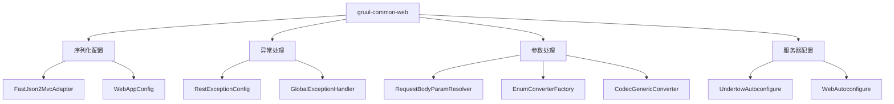

<!-- p -->
gruul-common-web

Web模块定义

- 提供Web应用相关的配置和功能
- 支持FastJson2序列化配置
- 提供统一的异常处理机制
- 支持自定义参数解析和转换
- 提供Undertow服务器配置

<!-- c -->
FastJson2MvcAdapter FastJson2序列化适配器

- **完整类名**: com.medusa.gruul.common.web.FastJson2MvcAdapter
- **文件路径**: common\web\FastJson2MvcAdapter.java
- **作者**: 张治保
- **日期**: 2023/4/6

**主要功能**:
- 配置FastJson2作为HTTP消息转换器
- 支持UTF-8编码的字符串转换
- 移除Jackson默认转换器
- 提供统一的JSON序列化配置

**完整代码**:
```java
package com.medusa.gruul.common.web;

import cn.hutool.core.util.ArrayUtil;
import com.alibaba.fastjson2.JSONReader;
import com.alibaba.fastjson2.JSONWriter;
import com.alibaba.fastjson2.support.config.FastJsonConfig;
import com.alibaba.fastjson2.support.spring6.http.converter.FastJsonHttpMessageConverter;
import com.alibaba.fastjson2.support.spring6.webservlet.view.FastJsonJsonView;
import com.medusa.gruul.common.fastjson2.FastJson2;
import com.medusa.gruul.common.fastjson2.filter.DesensitizeValueFilter;
import com.medusa.gruul.common.web.converter.CodecGenericConverter;
import com.medusa.gruul.common.web.converter.EnumConverterFactory;
import com.medusa.gruul.common.web.parameter.RequestBodyParamResolver;
import lombok.RequiredArgsConstructor;
import org.springframework.format.FormatterRegistry;
import org.springframework.http.MediaType;
import org.springframework.http.converter.HttpMessageConverter;
import org.springframework.http.converter.StringHttpMessageConverter;
import org.springframework.lang.NonNull;
import org.springframework.web.method.support.HandlerMethodArgumentResolver;
import org.springframework.web.servlet.config.annotation.EnableWebMvc;
import org.springframework.web.servlet.config.annotation.ViewResolverRegistry;
import org.springframework.web.servlet.config.annotation.WebMvcConfigurer;

import java.nio.charset.StandardCharsets;
import java.util.Iterator;
import java.util.List;

/**
 * @author 张治保
 * date 2023/4/6
 */
@EnableWebMvc
@RequiredArgsConstructor
public class FastJson2MvcAdapter implements WebMvcConfigurer {

    private final FastJsonConfig config = new FastJsonConfig();

    {
        config.setDateFormat(FastJson2.DATETIME_PATTEN);
        config.setReaderFeatures(ArrayUtil.append(FastJson2.readFeature(), JSONReader.Feature.TrimString));
        config.setWriterFeatures(ArrayUtil.append(FastJson2.writeFeature(), JSONWriter.Feature.BrowserCompatible));
        config.setWriterFilters(DesensitizeValueFilter.INSTANCE);
    }

    @Override
    public void configureMessageConverters(@NonNull List<HttpMessageConverter<?>> converters) {
        //是否已存在 默认编码为 utf-8 字符串消息转换器
        boolean hashUtf8StringConverter = hashUtf8StringConverter(converters);

        FastJsonHttpMessageConverter converter = new FastJsonHttpMessageConverter();
        converter.setFastJsonConfig(config);
        converter.setDefaultCharset(StandardCharsets.UTF_8);
        converter.setSupportedMediaTypes(
                List.of(MediaType.APPLICATION_JSON, new MediaType("application", "*+json"))
        );
        converters.add(0, converter);
        if (hashUtf8StringConverter) {
            return;
        }
        //如果没有 默认编码为 utf-8 字符串消息转换器 手动添加一个
        StringHttpMessageConverter plainTextStringConverter = new StringHttpMessageConverter(StandardCharsets.UTF_8);
        plainTextStringConverter.setSupportedMediaTypes(List.of(MediaType.TEXT_PLAIN));
        converters.add(1, plainTextStringConverter);
    }

    /**
     * 是否包含 utf8 格式的 converter 并移除 MappingJackson2HttpMessageConverter
     *
     * @param converters 所有的 converter
     * @return 是否包含 utf8 格式的 converter
     */
    private boolean hashUtf8StringConverter(List<HttpMessageConverter<?>> converters) {
        Iterator<HttpMessageConverter<?>> iterator = converters.iterator();
        //是否已存在 默认编码为 utf-8 字符串消息转换器
        boolean hashUTF8StringConverter = false;
        while (iterator.hasNext()) {
            HttpMessageConverter<?> converter = iterator.next();
            if (
                    converter instanceof StringHttpMessageConverter strConvert
                            && StandardCharsets.UTF_8 == strConvert.getDefaultCharset()
                            && strConvert.getSupportedMediaTypes().contains(MediaType.TEXT_PLAIN)
            ) {
                hashUTF8StringConverter = true;
            }
            //如果是 jackson 的 convert 则直接移除掉 
            if ("org.springframework.http.converter.json.MappingJackson2HttpMessageConverter".equals(converter.getClass().getName())) {
                iterator.remove();
            }
        }
        return hashUTF8StringConverter;
    }

    @Override
    public void configureViewResolvers(ViewResolverRegistry registry) {
        FastJsonJsonView fastJsonJsonView = new FastJsonJsonView();
        fastJsonJsonView.setFastJsonConfig(config);
        registry.enableContentNegotiation(fastJsonJsonView);
    }

    @Override
    public void addFormatters(FormatterRegistry registry) {
        registry.addConverterFactory(EnumConverterFactory.INSTANCE);
        registry.addConverter(new CodecGenericConverter());
    }

    @Override
    public void addArgumentResolvers(List<HandlerMethodArgumentResolver> resolvers) {
        resolvers.add(new RequestBodyParamResolver());
    }
}
```

<!-- c -->
UndertowAutoconfigure Undertow服务器自动配置类

- **完整类名**: com.medusa.gruul.common.web.UndertowAutoconfigure
- **文件路径**: common\web\UndertowAutoconfigure.java
- **作者**: 张治保
- **日期**: 2022/2/19

**主要功能**:
- 配置Undertow服务器
- 支持WebSocket功能
- 提供默认的缓冲池配置
- 自定义服务器部署信息

**完整代码**:
```java
package com.medusa.gruul.common.web;

import io.undertow.server.DefaultByteBufferPool;
import io.undertow.websockets.jsr.WebSocketDeploymentInfo;
import lombok.RequiredArgsConstructor;
import org.springframework.boot.autoconfigure.condition.ConditionalOnClass;
import org.springframework.boot.web.embedded.undertow.UndertowServletWebServerFactory;
import org.springframework.boot.web.server.WebServerFactoryCustomizer;

/**
 * undertow
 *
 * @author 张治保
 * date 2022/2/19
 */
@RequiredArgsConstructor
@ConditionalOnClass(name = "io.undertow.servlet.api.DeploymentInfo")
public class UndertowAutoconfigure implements WebServerFactoryCustomizer<UndertowServletWebServerFactory> {


    @Override
    public void customize(UndertowServletWebServerFactory factory) {
        factory.addDeploymentInfoCustomizers(deploymentInfo -> {
            WebSocketDeploymentInfo webSocketDeploymentInfo = new WebSocketDeploymentInfo();
            webSocketDeploymentInfo.setBuffers(new DefaultByteBufferPool(false, 1024));
            deploymentInfo.addServletContextAttribute("io.undertow.websockets.jsr.WebSocketDeploymentInfo", webSocketDeploymentInfo);
        });
    }
}
```

<!-- c -->
WebAutoconfigure Web自动配置类

- **完整类名**: com.medusa.gruul.common.web.WebAutoconfigure
- **文件路径**: common\web\WebAutoconfigure.java
- **作者**: 张治保
- **日期**: 2022/2/10

**主要功能**:
- 提供Web应用的自动配置
- 导入异常处理和应用配置
- 集成Spring工具类
- 统一管理Web相关配置

**完整代码**:
```java
package com.medusa.gruul.common.web;

import cn.hutool.extra.spring.SpringUtil;
import com.medusa.gruul.common.web.config.RestExceptionConfig;
import com.medusa.gruul.common.web.config.WebAppConfig;
import org.springframework.context.annotation.Import;

/**
 * web插件自动装配
 *
 * @author 张治保
 * date 2022/2/10
 */

@Import({
        WebAppConfig.class,
        RestExceptionConfig.class,
        SpringUtil.class
})
public class WebAutoconfigure {


}
```

<!-- c -->
WebI18NLoader Web国际化加载器

- **完整类名**: com.medusa.gruul.common.web.WebI18NLoader
- **文件路径**: common\web\WebI18NLoader.java
- **作者**: 张治保
- **日期**: 2023/6/16

**主要功能**:
- 加载Web模块的国际化资源
- 实现I18NPropertiesLoader接口
- 提供国际化配置路径
- 支持Web相关的多语言支持

**完整代码**:
```java
package com.medusa.gruul.common.web;

import com.medusa.gruul.global.i18n.I18NPropertiesLoader;
import org.springframework.lang.NonNull;

import java.util.Set;

/**
 * @author 张治保
 * date 2023/6/16
 */
public class WebI18NLoader implements I18NPropertiesLoader {
	@Override
	@NonNull
	public Set<String> paths() {
		return Set.of("i18n/web");
	}
}
```

<!-- c -->
RestExceptionConfig 全局异常处理配置

- **完整类名**: com.medusa.gruul.common.web.config.RestExceptionConfig
- **文件路径**: web\config\RestExceptionConfig.java
- **作者**: L.cm

**主要功能**:
- 提供全局异常处理机制
- 处理参数校验异常
- 支持自定义异常处理
- 统一异常响应格式

**完整代码**:
```java
package com.medusa.gruul.common.web.config;

import com.medusa.gruul.common.model.resp.Result;
import com.medusa.gruul.common.model.resp.SystemCode;
import com.medusa.gruul.global.model.exception.GlobalException;
import com.medusa.gruul.global.model.o.RangeTemporal;
import jakarta.validation.ConstraintViolation;
import jakarta.validation.ConstraintViolationException;
import lombok.extern.slf4j.Slf4j;
import org.hibernate.validator.internal.engine.path.PathImpl;
import org.springframework.boot.autoconfigure.condition.ConditionalOnWebApplication;
import org.springframework.core.Ordered;
import org.springframework.core.annotation.Order;
import org.springframework.http.converter.HttpMessageNotReadableException;
import org.springframework.validation.BindException;
import org.springframework.validation.BindingResult;
import org.springframework.validation.FieldError;
import org.springframework.web.bind.MethodArgumentNotValidException;
import org.springframework.web.bind.MissingServletRequestParameterException;
import org.springframework.web.bind.annotation.ExceptionHandler;
import org.springframework.web.bind.annotation.RestControllerAdvice;
import org.springframework.web.method.annotation.MethodArgumentTypeMismatchException;

import java.util.Set;

/**
 * 全局异常处理，处理可预见的异常，Order 排序优先级高
 * <p>
 * <p>
 * Bean-Violation 异常处理
 *
 * @author L.cm
 */
@Slf4j
@Order(Ordered.HIGHEST_PRECEDENCE + 1000)
@RestControllerAdvice
@ConditionalOnWebApplication(type = ConditionalOnWebApplication.Type.SERVLET)
public class RestExceptionConfig {


    /**
     * 全局异常
     */
    @ExceptionHandler(GlobalException.class)
    public Result<Object> handlerGlobalException(GlobalException exception) {
        log.debug("global exception", exception);
        Result<Object> failed = Result.failed(exception.code(), exception.msg());
        failed.setData(exception.getData());
        return failed;

    }

    @ExceptionHandler(MissingServletRequestParameterException.class)
    public Result<Object> handleError(MissingServletRequestParameterException exception) {
        log.debug("param valid error", exception);
        String message = String.format("缺少必要的请求参数: %s", exception.getParameterName());
        return Result.failed(SystemCode.PARAM_MISS, message);
    }

    @ExceptionHandler(MethodArgumentTypeMismatchException.class)
    public Result<Object> handleError(MethodArgumentTypeMismatchException e) {
        log.debug("wrong param type", e);
        String message = String.format("请求参数格式错误: %s", e.getName());
        return Result.failed(SystemCode.PARAM_TYPE_ERROR, message);
    }

    /**
     * 参数未通过的异常处理
     *
     * @param e
     * @return
     */
    @ExceptionHandler(MethodArgumentNotValidException.class)
    public Result<Object> handleError(MethodArgumentNotValidException e) {
        log.debug("param valid error", e);
        return Result.failed(SystemCode.PARAM_BIND_ERROR);
    }

    @ExceptionHandler(BindException.class)
    public Result<Object> handleError(BindException e) {
        log.debug("param bind error", e);
        return handleError(e.getBindingResult());
    }

    @ExceptionHandler(ConstraintViolationException.class)
    public Result<Object> handleError(ConstraintViolationException e) {
        log.debug("param valid error", e);
        return handleError(e.getConstraintViolations());
    }

    @ExceptionHandler(HttpMessageNotReadableException.class)
    public Result<Object> handleError(HttpMessageNotReadableException e) {
        log.debug("param read error", e);
        return Result.failed(SystemCode.MSG_NOT_READABLE);
    }

    @ExceptionHandler(RangeTemporal.TimeRangeException.class)
    public Result<Object> handError(RangeTemporal.TimeRangeException e) {
        log.debug("time range  error", e);
        return Result.failed(SystemCode.TIME_RANGE_ERROR);
    }


//####################################抽取共性 通用部分代码################################################

    /**
     * 处理 BindingResult
     *
     * @param result BindingResult
     * @return Result
     */
    protected Result<Object> handleError(BindingResult result) {
        FieldError error = result.getFieldError();
        if (error == null) {
            return Result.failed(SystemCode.PARAM_BIND_ERROR);
        }
        String message = String.format("%s:%s", error.getField(), SystemCode.PARAM_BIND_ERROR.getMsg());
        return Result.failed(SystemCode.PARAM_BIND_ERROR, message);
    }

    /**
     * 处理 ConstraintViolation
     *
     * @param violations 校验结果
     * @return Result
     */
    protected Result<Object> handleError(Set<ConstraintViolation<?>> violations) {
        ConstraintViolation<?> violation = violations.iterator().next();
        String path = ((PathImpl) violation.getPropertyPath()).getLeafNode().getName();
        String message = String.format("%s:%s", path, violation.getMessage());
        return Result.failed(SystemCode.PARAM_VALID_ERROR, message);
    }

}
```

<!-- c -->
WebAppConfig Web应用配置类

- **完整类名**: com.medusa.gruul.common.web.config.WebAppConfig
- **文件路径**: web\config\WebAppConfig.java
- **作者**: 张治保

**主要功能**:
- 配置Web应用的基础设置
- 设置字符编码过滤器
- 配置消息转换器
- 支持UTF-8编码

**完整代码**:
```java
package com.medusa.gruul.common.web.config;

import org.springframework.boot.web.servlet.filter.OrderedCharacterEncodingFilter;
import org.springframework.context.annotation.Bean;
import org.springframework.http.converter.HttpMessageConverter;
import org.springframework.http.converter.StringHttpMessageConverter;
import org.springframework.lang.NonNull;
import org.springframework.web.filter.CharacterEncodingFilter;
import org.springframework.web.servlet.config.annotation.WebMvcConfigurationSupport;

import java.nio.charset.Charset;
import java.nio.charset.StandardCharsets;
import java.util.List;

/**
 * 序列化设置
 *
 * @author 张治保
 */
public class WebAppConfig extends WebMvcConfigurationSupport {

	private static final Charset CHARSET = StandardCharsets.UTF_8;

	@Bean
	public CharacterEncodingFilter characterEncodingFilter() {
		CharacterEncodingFilter filter = new OrderedCharacterEncodingFilter();
		filter.setEncoding(CHARSET.name());
		filter.setForceRequestEncoding(true);
		filter.setForceResponseEncoding(true);
		return filter;
	}

	@Override
	public void configureMessageConverters(@NonNull List<HttpMessageConverter<?>> converters) {
		super.configureMessageConverters(converters);
		converters.add(new StringHttpMessageConverter(CHARSET));
		//converters.add(new MappingJackson2HttpMessageConverter(Jackson.outerMapper()));
	}
}
```

<!-- c -->
CodecGenericConverter 通用编解码转换器

- **完整类名**: com.medusa.gruul.common.web.converter.CodecGenericConverter
- **文件路径**: web\converter\CodecGenericConverter.java
- **作者**: 张治保
- **日期**: 2023/12/19

**主要功能**:
- 提供通用的类型转换功能
- 支持自定义编解码器
- 实现GenericConverter接口
- 管理可转换类型对

**完整代码**:
```java
package com.medusa.gruul.common.web.converter;

import cn.hutool.core.collection.CollUtil;
import com.medusa.gruul.common.fastjson2.codec.DefaultCodec;
import com.medusa.gruul.common.fastjson2.codec.def.Codec;
import org.jetbrains.annotations.NotNull;
import org.springframework.core.convert.TypeDescriptor;
import org.springframework.core.convert.converter.GenericConverter;

import java.util.Set;

/**
 * @author 张治保
 * @since 2023/12/19
 */
public class CodecGenericConverter implements GenericConverter {
    private final Set<GenericConverter.ConvertiblePair> convertiblePairs = CollUtil.newHashSet();

    {
        DefaultCodec.CODEC_MAP.forEach(
                (clazz, codec) -> convertiblePairs.add(new GenericConverter.ConvertiblePair(clazz.getDecode(), clazz.getEncode()))
        );
    }

    @Override
    public Set<ConvertiblePair> getConvertibleTypes() {
        return convertiblePairs;
    }

    @Override
    public Object convert(Object source, @NotNull TypeDescriptor sourceType, @NotNull TypeDescriptor targetType) {
        Codec<Object, Object> codec = DefaultCodec.getCodec(targetType.getType(), sourceType.getType());
        return codec == null ? source : codec.decode(source);
    }
}
```

<!-- c -->
EnumConverterFactory 枚举转换器工厂

- **完整类名**: com.medusa.gruul.common.web.converter.EnumConverterFactory
- **文件路径**: web\converter\EnumConverterFactory.java
- **作者**: 张治保
- **日期**: 2023/12/5

**主要功能**:
- 提供枚举类型的转换功能
- 支持字符串到枚举的转换
- 实现ConverterFactory接口
- 提供单例工厂实例

**完整代码**:
```java
package com.medusa.gruul.common.web.converter;

import cn.hutool.core.util.StrUtil;
import com.medusa.gruul.common.fastjson2.FastJson2;
import lombok.RequiredArgsConstructor;
import org.jetbrains.annotations.NotNull;
import org.springframework.core.convert.converter.Converter;
import org.springframework.core.convert.converter.ConverterFactory;
import org.springframework.lang.Nullable;

/**
 * 枚举转换器
 *
 * @author 张治保
 * @since 2023/12/5
 */
public class EnumConverterFactory implements ConverterFactory<String, Enum<?>> {

    public static final EnumConverterFactory INSTANCE = new EnumConverterFactory();

    @NotNull
    @Override
    public <T extends Enum<?>> Converter<String, T> getConverter(@NotNull Class<T> targetType) {
        return new StringToEnum<>(targetType);
    }

    /**
     * 枚举转换器
     *
     * @param <T> 枚举类型
     * @author 张治保
     */
    @RequiredArgsConstructor
    private static class StringToEnum<T extends Enum<?>> implements Converter<String, T> {

        private final Class<T> enumType;

        @Override
        @Nullable
        public T convert(@NotNull String source) {
            if (StrUtil.isEmpty(source)) {
                return null;
            }
            return FastJson2.convert(source, enumType);
        }
    }
}
```

<!-- c -->
Handler 处理器接口

- **完整类名**: com.medusa.gruul.common.web.handler.Handler
- **文件路径**: web\handler\Handler.java
- **作者**: 张治保
- **日期**: 2021/11/29

**主要功能**:
- 定义处理器的标准接口
- 提供参数校验功能
- 支持类型转换
- 处理业务逻辑

**完整代码**:
```java
package com.medusa.gruul.common.web.handler;

import com.medusa.gruul.global.model.strategy.AbstractStrategyFactory;

/**
 * 处理器超类
 *
 * @author 张治保
 * date 2021/11/29
 * @deprecated 请使用 {@link AbstractStrategyFactory} 替代 全部调整完毕移除这个类
 */
@Deprecated(since = "2025/05/27")
public interface Handler<T> {
    /**
     * 处理参数
     *
     * @param params 参数
     * @return 返回内容 <T>返回数据类型
     */
    T handle(Object... params);

    /**
     * 校验参数
     *
     * @param params  处理参数
     * @param classes 处理参数类型
     * @return 是否穿了错误参数  true是 false 否
     */
    default boolean hasErrorParam(Object[] params, Class<?>... classes) {
        if (classes == null || classes.length == 0) {
            return false;
        }
        if (params == null || params.length == 0 || params.length != classes.length) {
            return true;
        }
        for (int i = 0; i < classes.length; i++) {
            Class<?> aClass = classes[i];
            if (aClass == null || aClass.isAssignableFrom(params[i].getClass())) {
                continue;
            }
            return true;
        }
        return false;
    }

    /**
     * 强转参数
     *
     * @param value 被强转的对象,
     * @param type  强转后的类型
     * @return 强转后的值
     */
    default <E> E cast(Object value, Class<E> type) {
        return type.cast(value);
    }

}
```

<!-- c -->
RequestBodyParamResolver 请求体参数解析器

- **完整类名**: com.medusa.gruul.common.web.parameter.RequestBodyParamResolver
- **文件路径**: web\parameter\RequestBodyParamResolver.java
- **作者**: 张治保
- **日期**: 2024/5/30

**主要功能**:
- 解析请求体中的参数
- 支持参数类型转换
- 处理默认值和必需参数
- 提供参数验证功能

**完整代码**:
```java
package com.medusa.gruul.common.web.parameter;

import cn.hutool.core.util.StrUtil;
import cn.hutool.extra.spring.SpringUtil;
import com.alibaba.fastjson2.JSON;
import com.alibaba.fastjson2.JSONObject;
import com.medusa.gruul.common.model.resp.SystemCode;
import com.medusa.gruul.common.web.parameter.enums.BodyParam;
import jakarta.servlet.http.HttpServletRequest;
import lombok.RequiredArgsConstructor;
import org.jetbrains.annotations.NotNull;
import org.springframework.core.MethodParameter;
import org.springframework.core.convert.ConversionService;
import org.springframework.core.convert.TypeDescriptor;
import org.springframework.web.bind.annotation.ValueConstants;
import org.springframework.web.bind.support.WebDataBinderFactory;
import org.springframework.web.context.request.NativeWebRequest;
import org.springframework.web.method.support.HandlerMethodArgumentResolver;
import org.springframework.web.method.support.ModelAndViewContainer;

/**
 * @author 张治保
 * @since 2024/5/30
 */
@RequiredArgsConstructor
public class RequestBodyParamResolver implements HandlerMethodArgumentResolver {

    private static final String REQUEST_BODY_KEY = RequestBodyParamResolver.class.getName() + "_body";
    private volatile ConversionService conversionService;

    @Override
    public boolean supportsParameter(MethodParameter parameter) {
        return parameter.hasParameterAnnotation(BodyParam.class);
    }

    @Override
    public Object resolveArgument(@NotNull MethodParameter parameter, ModelAndViewContainer mavContainer, @NotNull NativeWebRequest webRequest, WebDataBinderFactory binderFactory) throws Exception {
        //尝试取出上次设置的值
        JSONObject body = (JSONObject) webRequest.getAttribute(REQUEST_BODY_KEY, NativeWebRequest.SCOPE_REQUEST);
        //如果没取到 说明是第一次取值，则从输入流中取值，并设置到request中
        if (body == null) {
            //取出输入流
            HttpServletRequest nativeRequest = (HttpServletRequest) (webRequest.getNativeRequest());
            body = JSON.parseObject(nativeRequest.getInputStream());
            if (body == null) {
                throw new IllegalArgumentException("request body is null");
            }
            webRequest.setAttribute(REQUEST_BODY_KEY, body, NativeWebRequest.SCOPE_REQUEST);
        }

        BodyParam requestBodyParam = parameter.getParameterAnnotation(BodyParam.class);
        if (requestBodyParam == null) {
            throw new IllegalArgumentException("parameter annotation @RequestBodyParam is null");
        }
        //取出参数名
        String name = requestBodyParam.name();
        String value = requestBodyParam.value();
        String paramName = name;
        if (StrUtil.isBlank(name)) {
            paramName = StrUtil.isBlank(value) ? parameter.getParameterName() : value;
        }
        if (StrUtil.isBlank(paramName)) {
            throw new IllegalArgumentException("request body param name is null");
        }
        paramName = paramName.trim();
        //取出参数类型
        //尝试取出参数值
        TypeDescriptor targetType = new TypeDescriptor(parameter);

        Object object = body.get(paramName);
        if (object != null) {
            object = convert(object, targetType);
        }
        String defaultValue;
        //如果为空并且有默认值
        if (object == null && !ValueConstants.DEFAULT_NONE.equals(defaultValue = requestBodyParam.defaultValue())) {
            object = convert(defaultValue.trim(), targetType);
        }
        //如果为空并且必须 
        if (object == null && requestBodyParam.required()) {
            throw SystemCode.PARAM_VALID_ERROR.dataEx("request body param '" + paramName + "' is required");
        }
        return object;
    }

    /**
     * 参数数据类型转换 （反序列化）
     *
     * @param value      参数值
     * @param targetType 目标参数类型
     * @return 转换后的参数值
     */
    private Object convert(Object value, TypeDescriptor targetType) {
        return conversionService().convert(
                value,
                TypeDescriptor.forObject(value),
                targetType
        );
    }


    /**
     * 获取 ConversionService
     *
     * @return ConversionService
     */
    private ConversionService conversionService() {
        if (conversionService != null) {
            return conversionService;
        }
        synchronized (this) {
            if (conversionService != null) {
                return conversionService;
            }
            return conversionService = SpringUtil.getBean(ConversionService.class);
        }
    }
}
```

<!-- c -->
SpringUtils Spring工具类

- **完整类名**: com.medusa.gruul.common.web.util.SpringUtils
- **文件路径**: web\util\SpringUtils.java
- **作者**: 张治保
- **日期**: 2021/11/29

**主要功能**:
- 提供Spring相关的工具方法
- 支持注解相关的Bean获取
- 处理Bean查找和转换
- 提供静态工具方法

**完整代码**:
```java
package com.medusa.gruul.common.web.util;

import cn.hutool.core.util.ArrayUtil;
import cn.hutool.extra.spring.SpringUtil;
import com.medusa.gruul.common.model.resp.SystemCode;
import com.medusa.gruul.global.model.strategy.AbstractStrategyFactory;
import lombok.extern.slf4j.Slf4j;

import java.lang.annotation.Annotation;
import java.lang.reflect.InvocationTargetException;
import java.lang.reflect.Method;
import java.util.Map;
import java.util.Objects;
import java.util.Optional;

/**
 * @author 张治保
 * date 2021/11/29
 * @deprecated 请使用 {@link SpringUtil} 替代 全部调整完毕移除这个类
 */
@Slf4j
@Deprecated(since = "2025/05/27")
public class SpringUtils {
    private SpringUtils() {
    }

    public static <A extends Annotation> Map<String, Object> getBeansWithAnnotation(Class<A> annoClass) {
        return SpringUtil.getApplicationContext().getBeansWithAnnotation(annoClass);
    }

    /**
     * 根据注解及注解的值获取 对应的Bean
     * 要求 注解必须包含方法value 且为空参
     *
     * @deprecated 请使用 {@link AbstractStrategyFactory} 替代
     */
    @Deprecated(since = "2024/05/27")
    @SuppressWarnings("unchecked")
    public static <B, A extends Annotation, E> B getBean(Class<A> annoClass, E value) {
        Objects.requireNonNull(annoClass, "annotation class cannot be null");
        Objects.requireNonNull(value, "value cannot be null");
        Map<String, Object> beans = getBeansWithAnnotation(annoClass);
        Method valueMethod;
        try {
            valueMethod = annoClass.getDeclaredMethod("value");
        } catch (NoSuchMethodException e) {
            log.error(annoClass.getSimpleName() + "annotation dont have value method");
            throw SystemCode.FAILURE.exception();
        }
        valueMethod.setAccessible(true);
        Optional<B> any = beans.values().stream().filter(
                bean -> {
                    A anno = Optional.ofNullable(
                            bean.getClass().getAnnotation(annoClass)
                    ).orElse(
                            bean.getClass().getSuperclass().getAnnotation(annoClass)
                    );
                    if (anno == null) {
                        log.error("bean {} dont have annotation {}", bean.getClass().getSimpleName(), annoClass.getSimpleName());
                        return false;
                    }
                    Object invoke;
                    try {
                        invoke = valueMethod.invoke(anno);
                    } catch (IllegalAccessException | InvocationTargetException ex) {
                        return false;
                    }
                    try {
                        if (invoke.getClass().isArray()) {
                            E[] es = (E[]) invoke;
                            return ArrayUtil.contains(es, value);
                        } else {
                            E e = (E) invoke;
                            return value == e || value.equals(e);
                        }
                    } catch (Exception ignore) {
                        log.error("annotation value type error");
                        return false;
                    }
                }
        ).map(bean -> (B) bean).findAny();
        return any.orElseGet(
                () -> {
                    log.error("cannot find correct bean from context:{}", value.getClass());
                    throw SystemCode.FAILURE.exception();
                }
        );
    }
}
```

<!-- c -->
BodyParam 请求体参数注解

- **完整类名**: com.medusa.gruul.common.web.parameter.enums.BodyParam
- **文件路径**: parameter\enums\BodyParam.java
- **作者**: 张治保
- **日期**: 2024/5/30

**主要功能**:
- 标注请求体参数
- 支持参数名称别名
- 配置参数是否必需
- 提供默认值设置

**完整代码**:
```java
package com.medusa.gruul.common.web.parameter.enums;

import org.springframework.core.annotation.AliasFor;
import org.springframework.web.bind.annotation.ValueConstants;

import java.lang.annotation.*;

/**
 * 从 requestBody 种取出单个参数
 * 参考 {@link org.springframework.web.bind.annotation.RequestParam}
 *
 * @author 张治保
 * @since 2024/5/30
 */
@Target(ElementType.PARAMETER)
@Retention(RetentionPolicy.RUNTIME)
@Documented
public @interface BodyParam {

    /**
     * Alias for {@link #name}.
     */
    @AliasFor("name")
    String value() default "";

    /**
     * The name of the request parameter to bind to.
     *
     * @since 4.2
     */
    @AliasFor("value")
    String name() default "";

    /**
     * Whether the parameter is required.
     * <p>Default is {@code true}, leading to an exception thrown in case
     * of the parameter missing in the request. Switch this to {@code false}
     * if you prefer a {@code null} in case of the parameter missing.
     * <p>Alternatively, provide a {@link #defaultValue() defaultValue},
     * which implicitly sets this flag to {@code false}.
     */
    boolean required() default true;

    /**
     * The default value to use as a fallback when the request parameter value
     * is not provided or empty. Supplying a default value implicitly sets
     * {@link #required()} to false.
     */
    String defaultValue() default ValueConstants.DEFAULT_NONE;
}
```

<!-- c -->
模块关系图


